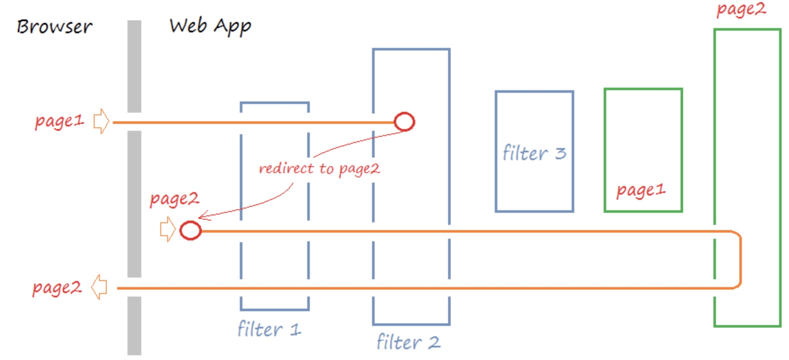

<!DOCTYPE html>

<html xmlns="http://www.w3.org/1999/xhtml">
<head>
<head>
<meta content="text/html; charset=utf-8" http-equiv="Content-Type"/>
<meta content="width=device-width, initial-scale=1, maximum-scale=1.0, user-scalable=no" name="viewport"/>
<meta content="zh-cn" http-equiv="content-language"/>
<meta content="12 聚合：聚合查询之Pipline聚合详解" name="description"/>
<link href="/static/favicon.png" rel="icon"/>
<title>12 聚合：聚合查询之Pipline聚合详解 </title>
<link href="/static/index.css" rel="stylesheet"/>
<link href="/static/highlight.min.css" rel="stylesheet"/>

<meta content="Hexo 4.2.0" name="generator"/>

</head>
<body>

<a href="/">

技术文章摘抄
</a>

<ul class="uncollapsible">
<li><a class="current-tab" href="/">首页</a></li>
<li><a href="../">上一级</a></li>
</ul>
<ul class="uncollapsible">
<li>
<a class="menu-item" href="/%e4%b8%93%e6%a0%8f/ElasticSearch%e7%9f%a5%e8%af%86%e4%bd%93%e7%b3%bb%e8%af%a6%e8%a7%a3/01%20%e8%ae%a4%e7%9f%a5%ef%bc%9aElasticSearch%e5%9f%ba%e7%a1%80%e6%a6%82%e5%bf%b5.md" id="01 认知：ElasticSearch基础概念.md">01 认知：ElasticSearch基础概念.md</a>
</li>
<li>
<a class="menu-item" href="/%e4%b8%93%e6%a0%8f/ElasticSearch%e7%9f%a5%e8%af%86%e4%bd%93%e7%b3%bb%e8%af%a6%e8%a7%a3/02%20%e8%ae%a4%e7%9f%a5%ef%bc%9aElastic%20Stack%e7%94%9f%e6%80%81%e5%92%8c%e5%9c%ba%e6%99%af%e6%96%b9%e6%a1%88.md" id="02 认知：Elastic Stack生态和场景方案.md">02 认知：Elastic Stack生态和场景方案.md</a>
</li>
<li>
<a class="menu-item" href="/%e4%b8%93%e6%a0%8f/ElasticSearch%e7%9f%a5%e8%af%86%e4%bd%93%e7%b3%bb%e8%af%a6%e8%a7%a3/03%20%e5%ae%89%e8%a3%85%ef%bc%9aElasticSearch%e5%92%8cKibana%e5%ae%89%e8%a3%85.md" id="03 安装：ElasticSearch和Kibana安装.md">03 安装：ElasticSearch和Kibana安装.md</a>
</li>
<li>
<a class="menu-item" href="/%e4%b8%93%e6%a0%8f/ElasticSearch%e7%9f%a5%e8%af%86%e4%bd%93%e7%b3%bb%e8%af%a6%e8%a7%a3/04%20%e5%85%a5%e9%97%a8%ef%bc%9a%e6%9f%a5%e8%af%a2%e5%92%8c%e8%81%9a%e5%90%88%e7%9a%84%e5%9f%ba%e7%a1%80%e4%bd%bf%e7%94%a8.md" id="04 入门：查询和聚合的基础使用.md">04 入门：查询和聚合的基础使用.md</a>
</li>
<li>
<a class="menu-item" href="/%e4%b8%93%e6%a0%8f/ElasticSearch%e7%9f%a5%e8%af%86%e4%bd%93%e7%b3%bb%e8%af%a6%e8%a7%a3/05%20%e7%b4%a2%e5%bc%95%ef%bc%9a%e7%b4%a2%e5%bc%95%e7%ae%a1%e7%90%86%e8%af%a6%e8%a7%a3.md" id="05 索引：索引管理详解.md">05 索引：索引管理详解.md</a>
</li>
<li>
<a class="menu-item" href="/%e4%b8%93%e6%a0%8f/ElasticSearch%e7%9f%a5%e8%af%86%e4%bd%93%e7%b3%bb%e8%af%a6%e8%a7%a3/06%20%e7%b4%a2%e5%bc%95%ef%bc%9a%e7%b4%a2%e5%bc%95%e6%a8%a1%e6%9d%bf%28Index%20Template%29%e8%af%a6%e8%a7%a3.md" id="06 索引：索引模板(Index Template)详解.md">06 索引：索引模板(Index Template)详解.md</a>
</li>
<li>
<a class="menu-item" href="/%e4%b8%93%e6%a0%8f/ElasticSearch%e7%9f%a5%e8%af%86%e4%bd%93%e7%b3%bb%e8%af%a6%e8%a7%a3/07%20%e6%9f%a5%e8%af%a2%ef%bc%9aDSL%e6%9f%a5%e8%af%a2%e4%b9%8b%e5%a4%8d%e5%90%88%e6%9f%a5%e8%af%a2%e8%af%a6%e8%a7%a3.md" id="07 查询：DSL查询之复合查询详解.md">07 查询：DSL查询之复合查询详解.md</a>
</li>
<li>
<a class="menu-item" href="/%e4%b8%93%e6%a0%8f/ElasticSearch%e7%9f%a5%e8%af%86%e4%bd%93%e7%b3%bb%e8%af%a6%e8%a7%a3/08%20%e6%9f%a5%e8%af%a2%ef%bc%9aDSL%e6%9f%a5%e8%af%a2%e4%b9%8b%e5%85%a8%e6%96%87%e6%90%9c%e7%b4%a2%e8%af%a6%e8%a7%a3.md" id="08 查询：DSL查询之全文搜索详解.md">08 查询：DSL查询之全文搜索详解.md</a>
</li>
<li>
<a class="menu-item" href="/%e4%b8%93%e6%a0%8f/ElasticSearch%e7%9f%a5%e8%af%86%e4%bd%93%e7%b3%bb%e8%af%a6%e8%a7%a3/09%20%e6%9f%a5%e8%af%a2%ef%bc%9aDSL%e6%9f%a5%e8%af%a2%e4%b9%8bTerm%e8%af%a6%e8%a7%a3.md" id="09 查询：DSL查询之Term详解.md">09 查询：DSL查询之Term详解.md</a>
</li>
<li>
<a class="menu-item" href="/%e4%b8%93%e6%a0%8f/ElasticSearch%e7%9f%a5%e8%af%86%e4%bd%93%e7%b3%bb%e8%af%a6%e8%a7%a3/10%20%e8%81%9a%e5%90%88%ef%bc%9a%e8%81%9a%e5%90%88%e6%9f%a5%e8%af%a2%e4%b9%8bBucket%e8%81%9a%e5%90%88%e8%af%a6%e8%a7%a3.md" id="10 聚合：聚合查询之Bucket聚合详解.md">10 聚合：聚合查询之Bucket聚合详解.md</a>
</li>
<li>
<a class="menu-item" href="/%e4%b8%93%e6%a0%8f/ElasticSearch%e7%9f%a5%e8%af%86%e4%bd%93%e7%b3%bb%e8%af%a6%e8%a7%a3/11%20%e8%81%9a%e5%90%88%ef%bc%9a%e8%81%9a%e5%90%88%e6%9f%a5%e8%af%a2%e4%b9%8bMetric%e8%81%9a%e5%90%88%e8%af%a6%e8%a7%a3.md" id="11 聚合：聚合查询之Metric聚合详解.md">11 聚合：聚合查询之Metric聚合详解.md</a>
</li>
<li>
<a class="menu-item" href="/%e4%b8%93%e6%a0%8f/ElasticSearch%e7%9f%a5%e8%af%86%e4%bd%93%e7%b3%bb%e8%af%a6%e8%a7%a3/12%20%e8%81%9a%e5%90%88%ef%bc%9a%e8%81%9a%e5%90%88%e6%9f%a5%e8%af%a2%e4%b9%8bPipline%e8%81%9a%e5%90%88%e8%af%a6%e8%a7%a3.md" id="12 聚合：聚合查询之Pipline聚合详解.md">12 聚合：聚合查询之Pipline聚合详解.md</a>
</li>
<li>
<a class="menu-item" href="/%e4%b8%93%e6%a0%8f/ElasticSearch%e7%9f%a5%e8%af%86%e4%bd%93%e7%b3%bb%e8%af%a6%e8%a7%a3/13%20%e5%8e%9f%e7%90%86%ef%bc%9a%e4%bb%8e%e5%9b%be%e8%a7%a3%e6%9e%84%e7%ad%91%e5%af%b9ES%e5%8e%9f%e7%90%86%e7%9a%84%e5%88%9d%e6%ad%a5%e8%ae%a4%e7%9f%a5.md" id="13 原理：从图解构筑对ES原理的初步认知.md">13 原理：从图解构筑对ES原理的初步认知.md</a>
</li>
<li>
<a class="menu-item" href="/%e4%b8%93%e6%a0%8f/ElasticSearch%e7%9f%a5%e8%af%86%e4%bd%93%e7%b3%bb%e8%af%a6%e8%a7%a3/14%20%e5%8e%9f%e7%90%86%ef%bc%9aES%e5%8e%9f%e7%90%86%e7%9f%a5%e8%af%86%e7%82%b9%e8%a1%a5%e5%85%85%e5%92%8c%e6%95%b4%e4%bd%93%e7%bb%93%e6%9e%84.md" id="14 原理：ES原理知识点补充和整体结构.md">14 原理：ES原理知识点补充和整体结构.md</a>
</li>
<li>
<a class="menu-item" href="/%e4%b8%93%e6%a0%8f/ElasticSearch%e7%9f%a5%e8%af%86%e4%bd%93%e7%b3%bb%e8%af%a6%e8%a7%a3/15%20%e5%8e%9f%e7%90%86%ef%bc%9aES%e5%8e%9f%e7%90%86%e4%b9%8b%e7%b4%a2%e5%bc%95%e6%96%87%e6%a1%a3%e6%b5%81%e7%a8%8b%e8%af%a6%e8%a7%a3.md" id="15 原理：ES原理之索引文档流程详解.md">15 原理：ES原理之索引文档流程详解.md</a>
</li>
<li>
<a class="menu-item" href="/%e4%b8%93%e6%a0%8f/ElasticSearch%e7%9f%a5%e8%af%86%e4%bd%93%e7%b3%bb%e8%af%a6%e8%a7%a3/16%20%e5%8e%9f%e7%90%86%ef%bc%9aES%e5%8e%9f%e7%90%86%e4%b9%8b%e8%af%bb%e5%8f%96%e6%96%87%e6%a1%a3%e6%b5%81%e7%a8%8b%e8%af%a6%e8%a7%a3.md" id="16 原理：ES原理之读取文档流程详解.md">16 原理：ES原理之读取文档流程详解.md</a>
</li>
<li>
<a class="menu-item" href="/%e4%b8%93%e6%a0%8f/ElasticSearch%e7%9f%a5%e8%af%86%e4%bd%93%e7%b3%bb%e8%af%a6%e8%a7%a3/17%20%e4%bc%98%e5%8c%96%ef%bc%9aElasticSearch%e6%80%a7%e8%83%bd%e4%bc%98%e5%8c%96%e8%af%a6%e8%a7%a3.md" id="17 优化：ElasticSearch性能优化详解.md">17 优化：ElasticSearch性能优化详解.md</a>
</li>
<li>
<a class="menu-item" href="/%e4%b8%93%e6%a0%8f/ElasticSearch%e7%9f%a5%e8%af%86%e4%bd%93%e7%b3%bb%e8%af%a6%e8%a7%a3/18%20%e5%a4%a7%e5%8e%82%e5%ae%9e%e8%b7%b5%ef%bc%9a%e8%85%be%e8%ae%af%e4%b8%87%e4%ba%bf%e7%ba%a7%20Elasticsearch%20%e6%8a%80%e6%9c%af%e5%ae%9e%e8%b7%b5.md" id="18 大厂实践：腾讯万亿级 Elasticsearch 技术实践.md">18 大厂实践：腾讯万亿级 Elasticsearch 技术实践.md</a>
</li>
<li>
<a class="menu-item" href="/%e4%b8%93%e6%a0%8f/ElasticSearch%e7%9f%a5%e8%af%86%e4%bd%93%e7%b3%bb%e8%af%a6%e8%a7%a3/19%20%e8%b5%84%e6%96%99%ef%bc%9aAwesome%20Elasticsearch.md" id="19 资料：Awesome Elasticsearch.md">19 资料：Awesome Elasticsearch.md</a>
</li>
<li>
<a class="menu-item" href="/%e4%b8%93%e6%a0%8f/ElasticSearch%e7%9f%a5%e8%af%86%e4%bd%93%e7%b3%bb%e8%af%a6%e8%a7%a3/20%20WrapperQuery.md" id="20 WrapperQuery.md">20 WrapperQuery.md</a>
</li>
<li>
<a class="menu-item" href="/%e4%b8%93%e6%a0%8f/ElasticSearch%e7%9f%a5%e8%af%86%e4%bd%93%e7%b3%bb%e8%af%a6%e8%a7%a3/21%20%e5%a4%87%e4%bb%bd%e5%92%8c%e8%bf%81%e7%a7%bb.md" id="21 备份和迁移.md">21 备份和迁移.md</a>
</li>
<li><a href="/assets/捐赠.md">捐赠</a></li>
</ul>

<header class="navbar">
<section class="navbar-section">
<a onclick="open_sidebar()">
<i class="icon icon-menu"></i>
</a>
</section>
</header>

<h1 class="title" data-id="12 聚合：聚合查询之Pipline聚合详解" id="title">12 聚合：聚合查询之Pipline聚合详解</h1>

<h2 id="如何理解pipeline聚合">如何理解pipeline聚合</h2>
<blockquote>

如何理解管道聚合呢？最重要的是要站在设计者角度看这个功能的要实现的目的：让上一步的聚合结果成为下一个聚合的输入，这就是管道。

</blockquote>
<h3 id="管道机制的常见场景">管道机制的常见场景</h3>
<blockquote>

首先回顾下，Tomcat管道机制中向你介绍的常见的管道机制设计中的应用场景。

</blockquote>
<h4 id="责任链模式">责任链模式</h4>

管道机制在设计模式上属于责任链模式，如果你不理解，请参看如下文章：

责任链模式: 通过责任链模式, 你可以为某个请求创建一个对象链. 每个对象依序检查此请求并对其进行处理或者将它传给链中的下一个对象。

<h4 id="filterchain">FilterChain</h4>

在软件开发的常接触的责任链模式是FilterChain，它体现在很多软件设计中：

<ul>
<li><strong>比如Spring Security框架中</strong></li>
</ul>

<ul>
<li><strong>比如HttpServletRequest处理的过滤器中</strong></li>
</ul>

当一个request过来的时候，需要对这个request做一系列的加工，使用责任链模式可以使每个加工组件化，减少耦合。也可以使用在当一个request过来的时候，需要找到合适的加工方式。当一个加工方式不适合这个request的时候，传递到下一个加工方法，该加工方式再尝试对request加工。

网上找了图，这里我们后文将通过Tomcat请求处理向你阐述。

<h3 id="elasticsearch设计管道机制">ElasticSearch设计管道机制</h3>

简单而言：让上一步的聚合结果成为下一个聚合的输入，这就是管道。

接下来，无非就是对不同类型的聚合有接口的支撑，比如：

<blockquote>

第一个维度：管道聚合有很多不同<strong>类型</strong>，每种类型都与其他聚合计算不同的信息，但是可以将这些类型分为两类：

</blockquote>
<ul>
<li><strong>父级</strong> 父级聚合的输出提供了一组管道聚合，它可以计算新的存储桶或新的聚合以添加到现有存储桶中。</li>
<li><strong>兄弟</strong> 同级聚合的输出提供的管道聚合，并且能够计算与该同级聚合处于同一级别的新聚合。</li>
</ul>
<blockquote>

第二个维度：根据<strong>功能设计</strong>的意图

</blockquote>

比如前置聚合可能是Bucket聚合，后置的可能是基于Metric聚合，那么它就可以成为一类管道

进而引出了：<code>xxx bucket</code>(是不是很容易理解了 @pdai)

<ul>
<li>Bucket聚合 -&gt; Metric聚合</li>
</ul>

： bucket聚合的结果，成为下一步metric聚合的输入

<ul>
<li>Average bucket</li>
<li>Min bucket</li>
<li>Max bucket</li>
<li>Sum bucket</li>
<li>Stats bucket</li>
<li>Extended stats bucket</li>
</ul>

对构建体系而言，理解上面的已经够了，其它的类型不过是锦上添花而言。

<h2 id="一些例子">一些例子</h2>
<blockquote>

这里我们通过几个简单的例子看看即可，具体如果需要使用看看文档即可。@pdai

</blockquote>
<h3 id="average-bucket-聚合">Average bucket 聚合</h3>
<pre><code class="language-bash">POST _search
{
  "size": 0,
  "aggs": {
    "sales_per_month": {
      "date_histogram": {
        "field": "date",
        "calendar_interval": "month"
      },
      "aggs": {
        "sales": {
          "sum": {
            "field": "price"
          }
        }
      }
    },
    "avg_monthly_sales": {
// tag::avg-bucket-agg-syntax[]               
      "avg_bucket": {
        "buckets_path": "sales_per_month&gt;sales",
        "gap_policy": "skip",
        "format": "#,##0.00;(#,##0.00)"
      }
// end::avg-bucket-agg-syntax[]               
    }
  }
}
</code></pre>
<ul>
<li>嵌套的bucket聚合：聚合出按月价格的直方图</li>
<li>Metic聚合：对上面的聚合再求平均值。</li>
</ul>

<strong>字段类型</strong>：

<ul>
<li>buckets_path：指定聚合的名称，支持多级嵌套聚合。</li>
<li>gap_policy 当管道聚合遇到不存在的值，有点类似于term等聚合的(missing)时所采取的策略，可选择值为：skip、insert_zeros。</li>
<li>skip：此选项将丢失的数据视为bucket不存在。它将跳过桶并使用下一个可用值继续计算。</li>
<li>format 用于格式化聚合桶的输出(key)。</li>
</ul>

输出结果如下

<pre><code class="language-json">{
  "took": 11,
  "timed_out": false,
  "_shards": ...,
  "hits": ...,
  "aggregations": {
    "sales_per_month": {
      "buckets": [
        {
          "key_as_string": "2015/01/01 00:00:00",
          "key": 1420070400000,
          "doc_count": 3,
          "sales": {
            "value": 550.0
          }
        },
        {
          "key_as_string": "2015/02/01 00:00:00",
          "key": 1422748800000,
          "doc_count": 2,
          "sales": {
            "value": 60.0
          }
        },
        {
          "key_as_string": "2015/03/01 00:00:00",
          "key": 1425168000000,
          "doc_count": 2,
          "sales": {
            "value": 375.0
          }
        }
      ]
    },
    "avg_monthly_sales": {
      "value": 328.33333333333333,
      "value_as_string": "328.33"
    }
  }
}
</code></pre>
<h3 id="stats-bucket-聚合">Stats bucket 聚合</h3>

进一步的stat bucket也很容易理解了

<pre><code class="language-bash">POST /sales/_search
{
  "size": 0,
  "aggs": {
    "sales_per_month": {
      "date_histogram": {
        "field": "date",
        "calendar_interval": "month"
      },
      "aggs": {
        "sales": {
          "sum": {
            "field": "price"
          }
        }
      }
    },
    "stats_monthly_sales": {
      "stats_bucket": {
        "buckets_path": "sales_per_month&gt;sales" 
      }
    }
  }
}
</code></pre>

返回

<pre><code class="language-bash">{
   "took": 11,
   "timed_out": false,
   "_shards": ...,
   "hits": ...,
   "aggregations": {
      "sales_per_month": {
         "buckets": [
            {
               "key_as_string": "2015/01/01 00:00:00",
               "key": 1420070400000,
               "doc_count": 3,
               "sales": {
                  "value": 550.0
               }
            },
            {
               "key_as_string": "2015/02/01 00:00:00",
               "key": 1422748800000,
               "doc_count": 2,
               "sales": {
                  "value": 60.0
               }
            },
            {
               "key_as_string": "2015/03/01 00:00:00",
               "key": 1425168000000,
               "doc_count": 2,
               "sales": {
                  "value": 375.0
               }
            }
         ]
      },
      "stats_monthly_sales": {
         "count": 3,
         "min": 60.0,
         "max": 550.0,
         "avg": 328.3333333333333,
         "sum": 985.0
      }
   }
}
</code></pre>
<h2 id="参考文章">参考文章</h2>

<a href="https://www.elastic.co/guide/en/elasticsearch/reference/current/search-aggregations-pipeline.html" target="_blank">https://www.elastic.co/guide/en/elasticsearch/reference/current/search-aggregations-pipeline.html</a>

© 2019 - 2023 <a href="/cdn-cgi/l/email-protection#c5a9a9a9fcf1f4f4f5f285a2a8a4aca9eba6aaa8" target="_blank">Liangliang Lee</a>.
                    Powered by <a href="https://github.com/gin-gonic/gin" target="_blank">gin</a> and <a href="https://github.com/kaiiiz/hexo-theme-book" target="_blank">hexo-theme-book</a>.

</body>

</head></html>