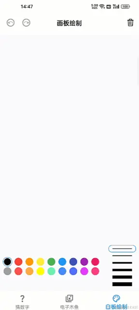
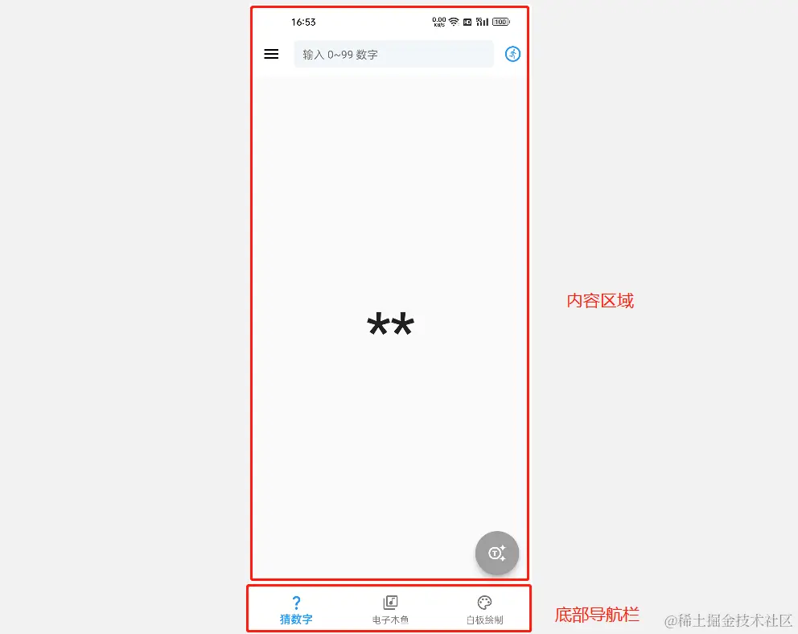
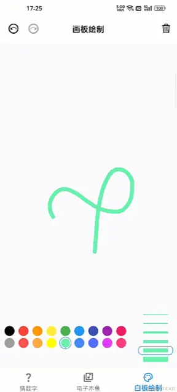
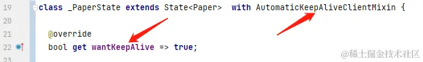
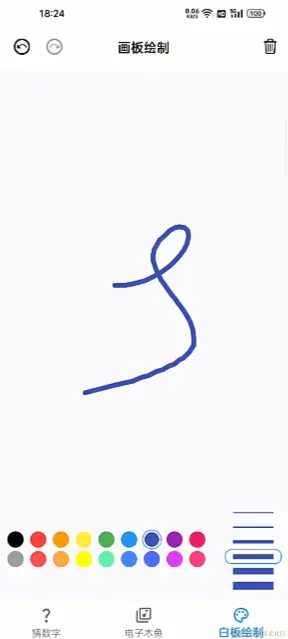
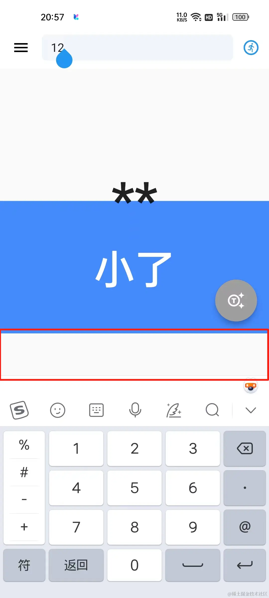
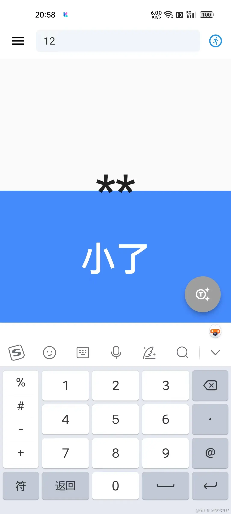
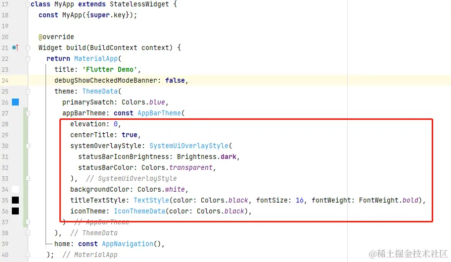
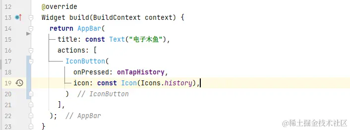

<!DOCTYPE html>

<html xmlns="http://www.w3.org/1999/xhtml">
<head>
<head>
<meta content="text/html; charset=utf-8" http-equiv="Content-Type"/>
<meta content="width=device-width, initial-scale=1, maximum-scale=1.0, user-scalable=no" name="viewport"/>
<meta content="zh-cn" http-equiv="content-language"/>
<meta content="23 应用界面整合" name="description"/>
<link href="/static/favicon.png" rel="icon"/>
<title>23 应用界面整合 </title>
<link href="/static/index.css" rel="stylesheet"/>
<link href="/static/highlight.min.css" rel="stylesheet"/>

<meta content="Hexo 4.2.0" name="generator"/>

</head>
<body>

<a href="/">

技术文章摘抄
</a>

<ul class="uncollapsible">
<li><a class="current-tab" href="/">首页</a></li>
<li><a href="../">上一级</a></li>
</ul>
<ul class="uncollapsible">
<li>
<a class="menu-item" href="/%e4%b8%93%e6%a0%8f/Flutter%e5%85%a5%e9%97%a8%e6%95%99%e7%a8%8b/01%20%e5%89%8d%e8%a8%80-%e6%95%99%e7%a8%8b%e5%86%85%e5%ae%b9%e5%af%bc%e8%af%bb.md" id="01 前言-教程内容导读.md">01 前言-教程内容导读.md</a>
</li>
<li>
<a class="menu-item" href="/%e4%b8%93%e6%a0%8f/Flutter%e5%85%a5%e9%97%a8%e6%95%99%e7%a8%8b/02%20Flutter%20%e5%bc%80%e5%8f%91%e7%8e%af%e5%a2%83%e7%9a%84%e6%90%ad%e5%bb%ba.md" id="02 Flutter 开发环境的搭建.md">02 Flutter 开发环境的搭建.md</a>
</li>
<li>
<a class="menu-item" href="/%e4%b8%93%e6%a0%8f/Flutter%e5%85%a5%e9%97%a8%e6%95%99%e7%a8%8b/03%20%e6%96%b0%e6%89%8b%e6%9d%91%e5%9f%ba%e7%a1%80%20Dart%20%e8%af%ad%e6%b3%95%20%28%e4%b8%8a%29.md" id="03 新手村基础 Dart 语法 (上).md">03 新手村基础 Dart 语法 (上).md</a>
</li>
<li>
<a class="menu-item" href="/%e4%b8%93%e6%a0%8f/Flutter%e5%85%a5%e9%97%a8%e6%95%99%e7%a8%8b/04%20%e6%96%b0%e6%89%8b%e6%9d%91%e5%9f%ba%e7%a1%80%20Dart%20%e8%af%ad%e6%b3%95%20%28%e4%b8%8b%29.md" id="04 新手村基础 Dart 语法 (下).md">04 新手村基础 Dart 语法 (下).md</a>
</li>
<li>
<a class="menu-item" href="/%e4%b8%93%e6%a0%8f/Flutter%e5%85%a5%e9%97%a8%e6%95%99%e7%a8%8b/05%20Flutter%20%e8%ae%a1%e6%95%b0%e5%99%a8%e9%a1%b9%e7%9b%ae%e8%a7%a3%e8%af%bb.md" id="05 Flutter 计数器项目解读.md">05 Flutter 计数器项目解读.md</a>
</li>
<li>
<a class="menu-item" href="/%e4%b8%93%e6%a0%8f/Flutter%e5%85%a5%e9%97%a8%e6%95%99%e7%a8%8b/06%20%e7%8c%9c%e6%95%b0%e5%ad%97%e7%95%8c%e9%9d%a2%e4%ba%a4%e4%ba%92%e4%b8%8e%e9%9c%80%e6%b1%82%e5%88%86%e6%9e%90.md" id="06 猜数字界面交互与需求分析.md">06 猜数字界面交互与需求分析.md</a>
</li>
<li>
<a class="menu-item" href="/%e4%b8%93%e6%a0%8f/Flutter%e5%85%a5%e9%97%a8%e6%95%99%e7%a8%8b/07%20%e4%bd%bf%e7%94%a8%e7%bb%84%e4%bb%b6%e6%9e%84%e5%bb%ba%e9%9d%99%e6%80%81%e7%95%8c%e9%9d%a2.md" id="07 使用组件构建静态界面.md">07 使用组件构建静态界面.md</a>
</li>
<li>
<a class="menu-item" href="/%e4%b8%93%e6%a0%8f/Flutter%e5%85%a5%e9%97%a8%e6%95%99%e7%a8%8b/08%20%e7%8a%b6%e6%80%81%e6%95%b0%e6%8d%ae%e4%b8%8e%e7%95%8c%e9%9d%a2%e6%9b%b4%e6%96%b0.md" id="08 状态数据与界面更新.md">08 状态数据与界面更新.md</a>
</li>
<li>
<a class="menu-item" href="/%e4%b8%93%e6%a0%8f/Flutter%e5%85%a5%e9%97%a8%e6%95%99%e7%a8%8b/09%20%e6%a0%a1%e9%aa%8c%e7%bb%93%e6%9e%9c%e4%b8%8e%e6%8f%90%e7%a4%ba%e4%bf%a1%e6%81%af.md" id="09 校验结果与提示信息.md">09 校验结果与提示信息.md</a>
</li>
<li>
<a class="menu-item" href="/%e4%b8%93%e6%a0%8f/Flutter%e5%85%a5%e9%97%a8%e6%95%99%e7%a8%8b/10%20%e5%8a%a8%e7%94%bb%e4%bd%bf%e7%94%a8%e4%b8%8e%e7%8a%b6%e6%80%81%e5%91%a8%e6%9c%9f.md" id="10 动画使用与状态周期.md">10 动画使用与状态周期.md</a>
</li>
<li>
<a class="menu-item" href="/%e4%b8%93%e6%a0%8f/Flutter%e5%85%a5%e9%97%a8%e6%95%99%e7%a8%8b/11%20%e7%8c%9c%e6%95%b0%e5%ad%97%e6%95%b4%e7%90%86%e4%b8%8e%e6%80%bb%e7%bb%93.md" id="11 猜数字整理与总结.md">11 猜数字整理与总结.md</a>
</li>
<li>
<a class="menu-item" href="/%e4%b8%93%e6%a0%8f/Flutter%e5%85%a5%e9%97%a8%e6%95%99%e7%a8%8b/12%20%e7%94%b5%e5%ad%90%e6%9c%a8%e9%b1%bc%e7%95%8c%e9%9d%a2%e4%ba%a4%e4%ba%92%e4%b8%8e%e9%9c%80%e6%b1%82%e5%88%86%e6%9e%90.md" id="12 电子木鱼界面交互与需求分析.md">12 电子木鱼界面交互与需求分析.md</a>
</li>
<li>
<a class="menu-item" href="/%e4%b8%93%e6%a0%8f/Flutter%e5%85%a5%e9%97%a8%e6%95%99%e7%a8%8b/13%20%e7%94%b5%e5%ad%90%e6%9c%a8%e9%b1%bc%e9%9d%99%e6%80%81%e7%95%8c%e9%9d%a2%e6%9e%84%e5%bb%ba.md" id="13 电子木鱼静态界面构建.md">13 电子木鱼静态界面构建.md</a>
</li>
<li>
<a class="menu-item" href="/%e4%b8%93%e6%a0%8f/Flutter%e5%85%a5%e9%97%a8%e6%95%99%e7%a8%8b/14%20%e8%ae%a1%e6%95%b0%e5%8f%98%e5%8c%96%e4%b8%8e%e9%9f%b3%e6%95%88%e6%92%ad%e6%94%be.md" id="14 计数变化与音效播放.md">14 计数变化与音效播放.md</a>
</li>
<li>
<a class="menu-item" href="/%e4%b8%93%e6%a0%8f/Flutter%e5%85%a5%e9%97%a8%e6%95%99%e7%a8%8b/15%20%e5%bc%b9%e5%87%ba%e9%80%89%e9%a1%b9%e4%b8%8e%e5%88%87%e6%8d%a2%e7%8a%b6%e6%80%81.md" id="15 弹出选项与切换状态.md">15 弹出选项与切换状态.md</a>
</li>
<li>
<a class="menu-item" href="/%e4%b8%93%e6%a0%8f/Flutter%e5%85%a5%e9%97%a8%e6%95%99%e7%a8%8b/16%20%e7%94%a8%e6%bb%91%e5%8a%a8%e5%88%97%e8%a1%a8%e5%b1%95%e7%a4%ba%e8%ae%b0%e5%bd%95.md" id="16 用滑动列表展示记录.md">16 用滑动列表展示记录.md</a>
</li>
<li>
<a class="menu-item" href="/%e4%b8%93%e6%a0%8f/Flutter%e5%85%a5%e9%97%a8%e6%95%99%e7%a8%8b/17%20%e7%94%b5%e5%ad%90%e6%9c%a8%e9%b1%bc%e6%95%b4%e7%90%86%e4%b8%8e%e6%80%bb%e7%bb%93.md" id="17 电子木鱼整理与总结.md">17 电子木鱼整理与总结.md</a>
</li>
<li>
<a class="menu-item" href="/%e4%b8%93%e6%a0%8f/Flutter%e5%85%a5%e9%97%a8%e6%95%99%e7%a8%8b/18%20%e7%99%bd%e6%9d%bf%e7%bb%98%e5%88%b6%e7%95%8c%e9%9d%a2%e4%ba%a4%e4%ba%92%e4%b8%8e%e9%9c%80%e6%b1%82%e5%88%86%e6%9e%90.md" id="18 白板绘制界面交互与需求分析.md">18 白板绘制界面交互与需求分析.md</a>
</li>
<li>
<a class="menu-item" href="/%e4%b8%93%e6%a0%8f/Flutter%e5%85%a5%e9%97%a8%e6%95%99%e7%a8%8b/19%20%e8%ae%a4%e8%af%86%e8%87%aa%e5%ae%9a%e4%b9%89%e7%bb%98%e5%88%b6%e7%bb%84%e4%bb%b6.md" id="19 认识自定义绘制组件.md">19 认识自定义绘制组件.md</a>
</li>
<li>
<a class="menu-item" href="/%e4%b8%93%e6%a0%8f/Flutter%e5%85%a5%e9%97%a8%e6%95%99%e7%a8%8b/20%20%e9%80%9a%e8%bf%87%e6%89%8b%e5%8a%bf%e5%9c%a8%e7%99%bd%e6%9d%bf%e4%b8%8a%e7%bb%98%e5%88%b6.md" id="20 通过手势在白板上绘制.md">20 通过手势在白板上绘制.md</a>
</li>
<li>
<a class="menu-item" href="/%e4%b8%93%e6%a0%8f/Flutter%e5%85%a5%e9%97%a8%e6%95%99%e7%a8%8b/21%20%e7%99%bd%e6%9d%bf%e7%94%bb%e7%ac%94%e7%9a%84%e5%8f%82%e6%95%b0%e8%ae%be%e7%bd%ae.md" id="21 白板画笔的参数设置.md">21 白板画笔的参数设置.md</a>
</li>
<li>
<a class="menu-item" href="/%e4%b8%93%e6%a0%8f/Flutter%e5%85%a5%e9%97%a8%e6%95%99%e7%a8%8b/22%20%e6%92%a4%e9%94%80%e5%8a%9f%e8%83%bd%e4%b8%8e%e7%94%bb%e6%9d%bf%e4%bc%98%e5%8c%96.md" id="22 撤销功能与画板优化.md">22 撤销功能与画板优化.md</a>
</li>
<li>
<a class="menu-item" href="/%e4%b8%93%e6%a0%8f/Flutter%e5%85%a5%e9%97%a8%e6%95%99%e7%a8%8b/23%20%e5%ba%94%e7%94%a8%e7%95%8c%e9%9d%a2%e6%95%b4%e5%90%88.md" id="23 应用界面整合.md">23 应用界面整合.md</a>
</li>
<li>
<a class="menu-item" href="/%e4%b8%93%e6%a0%8f/Flutter%e5%85%a5%e9%97%a8%e6%95%99%e7%a8%8b/24%20%e6%95%b0%e6%8d%ae%e7%9a%84%e6%8c%81%e4%b9%85%e5%8c%96%e5%ad%98%e5%82%a8.md" id="24 数据的持久化存储.md">24 数据的持久化存储.md</a>
</li>
<li>
<a class="menu-item" href="/%e4%b8%93%e6%a0%8f/Flutter%e5%85%a5%e9%97%a8%e6%95%99%e7%a8%8b/25%20%e7%bd%91%e7%bb%9c%e6%95%b0%e6%8d%ae%e7%9a%84%e8%ae%bf%e9%97%ae.md" id="25 网络数据的访问.md">25 网络数据的访问.md</a>
</li>
<li>
<a class="menu-item" href="/%e4%b8%93%e6%a0%8f/Flutter%e5%85%a5%e9%97%a8%e6%95%99%e7%a8%8b/26%20%e6%95%99%e7%a8%8b%e6%80%bb%e7%bb%93%e4%b8%8e%e5%b1%95%e6%9c%9b.md" id="26 教程总结与展望.md">26 教程总结与展望.md</a>
</li>
<li><a href="/assets/捐赠.md">捐赠</a></li>
</ul>

<header class="navbar">
<section class="navbar-section">
<a onclick="open_sidebar()">
<i class="icon icon-menu"></i>
</a>
</section>
</header>

<h1 class="title" data-id="23 应用界面整合" id="title">23 应用界面整合</h1>

<h4 id="1-界面整合的需求分析">1. 界面整合的需求分析</h4>

如下所示，在应用的底部添加导航栏，进行界面间的切换操作。下面从数据和界面的角度对该进行分析：

<table>
<tbody>
<tr>
<td>————————————————————</td>
<td>————————————————————</td>
</tr>
<tr>
<td></td>
<td></td>
</tr>
</tbody>
</table>

当前界面中需要添加的数据有:

<ul>
<li>底部栏的文字、图标资源列表</li>
<li>底部栏的激活索引</li>
</ul>

在点击底部栏的按钮时，需要更新激活索引，并进行界面的重新构建。这里定义一个 <code>MenuData</code> 类，用于维护标签和图标数据：

<pre><code class="language-dart">class MenuData {
  // 标签
  final String label;

  // 图标数据
  final IconData icon;

  const MenuData({
    required this.label,
    required this.icon,
  });
}
</code></pre>

对于界面构建逻辑来说，这是一个上下结构，上面是内容区域，下面是底部导航栏。所以，可以通过 <code>Column</code> 组件上下排列，其中内容区域通过 <code>Expanded</code> 组件进行延展，内容组件根据激活的索引值构建不同的界面。

<h4 id="2-代码实现-第一版">2. 代码实现：第一版</h4>

Flutter 中提供了 <code>BottomNavigationBar</code> 组件可以展示底部栏，这里单独封装一个 <code>AppBottomBar</code> 组件用于维护底部栏的界面构建逻辑。其中需要传入激活索引、点击回调、菜单数据列表：

<pre><code class="language-php">class AppBottomBar extends StatelessWidget {
  final int currentIndex;
  final List&lt;MenuData&gt; menus;
  final ValueChanged&lt;int&gt;? onItemTap;

  const AppBottomBar({
    Key? key,
    this.onItemTap,
    this.currentIndex = 0,
    required this.menus,
  }) : super(key: key);

  @override
  Widget build(BuildContext context) {
    return BottomNavigationBar(
      backgroundColor: Colors.white,
      onTap: onItemTap,
      currentIndex: currentIndex,
      elevation: 3,
      type: BottomNavigationBarType.fixed,
      iconSize: 22,
      selectedItemColor: Theme.of(context).primaryColor,
      selectedLabelStyle: const TextStyle(fontWeight: FontWeight.bold),
      showUnselectedLabels: true,
      showSelectedLabels: true,
      items: menus.map(_buildItemByMenuMeta).toList(),
    );
  }

  BottomNavigationBarItem _buildItemByMenuMeta(MenuData menu) {
    return BottomNavigationBarItem(
      label: menu.label,
      icon: Icon(menu.icon),
    );
  }
}
</code></pre>

然后就是构建整体结构，这里创建一个 <code>AppNavigation</code> 组件来处理。由于激活索引数据需要在交互时改变，并重新构建界面，所以 <code>AppNavigation</code> 继承自 <code>StatefulWidget</code>，在状态类中处理界面构建和状态数据维护的逻辑。

<pre><code class="language-scala">class AppNavigation extends StatefulWidget {
  const AppNavigation({Key? key}) : super(key: key);

  @override
  State&lt;AppNavigation&gt; createState() =&gt; _AppNavigationState();
}

class _AppNavigationState extends State&lt;AppNavigation&gt; {
  int _index = 0;

  final List&lt;MenuData&gt; menus = const [
    MenuData(label: '猜数字', icon: Icons.question_mark),
    MenuData(label: '电子木鱼', icon: Icons.my_library_music_outlined),
    MenuData(label: '白板绘制', icon: Icons.palette_outlined),
  ];

  @override
  Widget build(BuildContext context) {
    return Column(
      children: [
        Expanded( child: _buildContent(_index)),
        AppBottomBar(
          currentIndex: _index,
          onItemTap: _onChangePage,
          menus: menus,
        )
      ],
    );
  }

  void _onChangePage(int index) {
    setState(() {
      _index = index;
    });
  }
</code></pre>

内容区域的构建使用 <code>_buildContent</code> 方法，根据不同的激活索引，返回创建不同的界面：

<ul>
<li>index = 0 时，构建猜数字界面；</li>
<li>index = 1 时，构建电子木鱼界面；</li>
<li>index = 2 时，构建白板绘制界面；</li>
</ul>
<pre><code class="language-csharp">  Widget _buildContent(int index) {
    switch(index){
      case 0:
       return const GuessPage();
      case 1:
        return const MuyuPage();
      case 2:
        return const Paper();
      default:
        return const SizedBox.shrink();
    }
  }
}
</code></pre>

到这里就完成了点击底部导航，切换界面的功能，当前代码位置: <a href="https://github.com/toly1994328/flutter_first_station/tree/master/lib/navigation" target="_blank">navigation</a> 。 但这种方式处理会有一些问题：伴随着界面的消失，状态类会被销毁；下次再到该界面时会重新初始化状态类，如下所示：

<table>
<thead>
<tr>
<th>在绘制面板绘制</th>
<th>切换后，状态重置</th>
</tr>
</thead>
<tbody>
<tr>
<td></td>
<td></td>
</tr>
</tbody>
</table>

<h4 id="3-状态类数据的保持">3. 状态类数据的保持</h4>

想要避免每次切换都会重置状态数据，大体上有三种解决方案：

<ul>
<li>1.使用 <code>AutomaticKeepAliveClientMixin</code> 对状态类进行保活，这种方案只能用于可滑动组件中。这里可以使用 PageView 组件来实现切页并保活的效果。</li>
<li>2.将状态数据提升到上层，比如将三个界面的状态数据都交由 <code>_AppNavigationState</code> 状态类维护。如果直接用这种方式，很容易造成一个超级大的类，来维护很多数据。其实状态管理工具，就是基于这种思路，将数据交由上层维护，同时提供了分模块处理数据的能力。</li>
<li>3.保持数据的持久性，比如将数据保存到本地文件或数据库，每次初始化时进行加载复现。这种方式处理起来比较麻烦，初始化加载数据也需要一点时间。但这种方式在界面不可见时，可以释放内存中的数据。</li>
</ul>

这里使用 <code>方式 1</code> 来处理是最简单的。在 <code>_buildContent</code> 方法中返回 <code>PageView</code> 组件，并将三个内容界面作为 <code>children</code> 入参，通过 <code>PageController</code> 来控制界面的切换。注意一点：将 <code>physics</code> 设置设置为 <code>NeverScrollableScrollPhysics</code> 可以禁止 PageView 的滑动，如果想要运行滑动切页，可以去除。

<pre><code class="language-scss">----&gt;[_AppNavigationState]----
final PageController _ctrl = PageController();

Widget _buildContent() {
  return PageView(
    physics: const NeverScrollableScrollPhysics(),
    controller: _ctrl,
    children: const [
       GuessPage(),
       MuyuPage(),
       Paper(),
    ],
  );
}

void _onChangePage(int index) {
  _ctrl.jumpToPage(index);
  setState(() {
    _index = index;
  });
}
</code></pre>

另外如果期望某个状态类保活，需要让其混入 <code>AutomaticKeepAliveClientMixin</code>, 并覆写 <code>wantKeepAlive</code> 返回 true 。如下是对画板状态类的处理，其他两个同理：

<table>
<thead>
<tr>
<th>在绘制面板绘制</th>
<th>切换后，状态保活</th>
</tr>
</thead>
<tbody>
<tr>
<td></td>
<td></td>
</tr>
</tbody>
</table>

到这里，就将之前的三个小案例，集成到了一个应用中，并且在切换界面的过程中，可以保持状态数据不被重置。当前代码位置 <a href="https://github.com/toly1994328/flutter_first_station/tree/709bdcc9e50c49cc13419f2ce1fcbf9927cd46d9/lib/navigation" target="_blank">navigation</a>。

上面可以保证程序运行期间，各界面状态类的保活，但是当应用关闭之后，内存中的数据会被清空。再次进入应用时还是无法恢复到之前的状态，想要记住用户的信息，就必须对数据进行持久化的存储。比如存储为本地文件、数据库、网络数据等，下一篇将介绍数据的持久化存储。

<h4 id="4-优化一些缺陷">4. 优化一些缺陷</h4>

如下所示，左侧是 <code>Column</code> 组件上下排列，当键盘顶起之后，底部会留出一块空白，高为底部导航高度。想解决这个问题，使用 <code>Scaffold</code> 组件即可，它有一个 <code>bottomNavigationBar</code> 的插槽，不会被键盘顶起。

<table>
<thead>
<tr>
<th>Column 结构</th>
<th>Scaffold 结构</th>
</tr>
</thead>
<tbody>
<tr>
<td></td>
<td></td>
</tr>
</tbody>
</table>

这时，将 <code>_AppNavigationState</code> 的构建方法改为如下代码：

<pre><code class="language-less"> @override
 Widget build(BuildContext context) {
   return Scaffold(
     body: _buildContent(),
     bottomNavigationBar: AppBottomBar(
       currentIndex: _index,
       onItemTap: _onChangePage,
       menus: menus,
     ),
   );
 }
</code></pre>

下面以 AppBar 的主题介绍一下 Flutter 默认配置的能力。项目中希望所有的 AppBar 都是白色背景、状态类透明、标题居中、图标颜色、文字颜色为黑色。

如果每次使用 AppBar 组件就配置一次，那代码书写将会非常复杂。Flutter 在主题数据的功能，只要指定主题，其下节点中的对应组件，就会默认使用的配置数据。如下所示，在 MaterialApp 的 theme 入参中可以配置主题数据：

这样，以前使用 AppBar 的地方就不用再配置那么多信息了。比如电子木鱼界面的 AppBar 就可以清爽多了：

这里只是拿 AppBarTheme 举个例子，还有其他很多的主题可以配置，大家可以在以后慢慢了解。

<h4 id="5-本章小结">5. 本章小结</h4>

本章我们主要将之前的三个小案例整合到了一个项目中，通过底部导航栏 + PageView 实现界面间的切换。另外也就 State 的状态保活进行了简单地认识，这里只是程序运行期间，保证各界面状态类的活性，但是当应用关闭之后，内存中的数据会被清空。再次进入应用时还是无法恢复到之前的状态。

想要永久记住用户的信息，就必须对数据进行持久化的存储。比如存储为本地文件、数据库、网络数据等，在程序启动时进行加载，恢复状态数据。这是应用程序非常重要的一个部分，下一篇将介绍数据的持久化存储。

© 2019 - 2023 <a href="/cdn-cgi/l/email-protection#dbb7b7b7e2efeaeaebec9bbcb6bab2b7f5b8b4b6" target="_blank">Liangliang Lee</a>.
                    Powered by <a href="https://github.com/gin-gonic/gin" target="_blank">gin</a> and <a href="https://github.com/kaiiiz/hexo-theme-book" target="_blank">hexo-theme-book</a>.

</body>

</head></html>