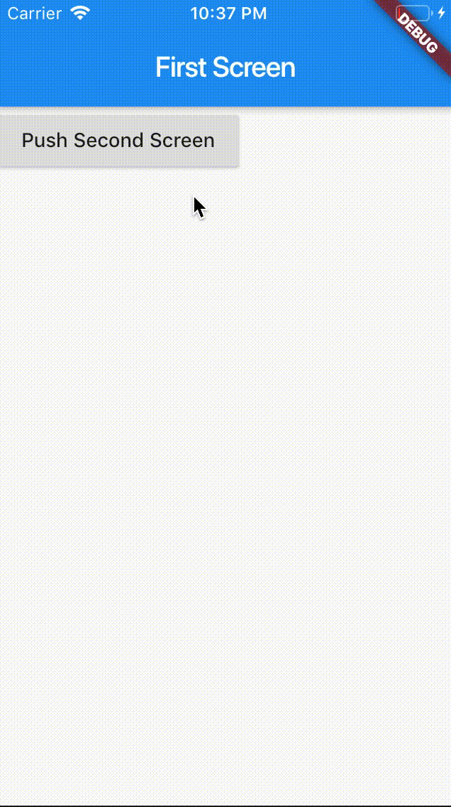
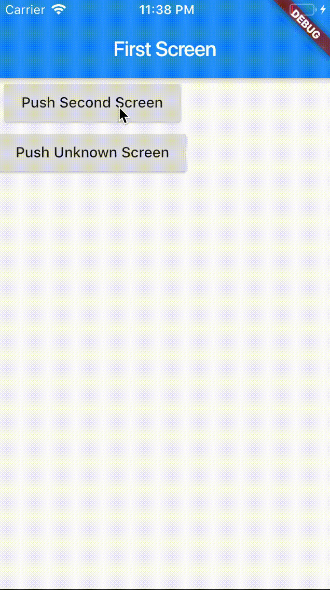

<!DOCTYPE html>

<html xmlns="http://www.w3.org/1999/xhtml">
<head>
<head>
<meta content="text/html; charset=utf-8" http-equiv="Content-Type"/>
<meta content="width=device-width, initial-scale=1, maximum-scale=1.0, user-scalable=no" name="viewport"/>
<meta content="zh-cn" http-equiv="content-language"/>
<meta content="21 路由与导航，Flutter是这样实现页面切换的" name="description"/>
<link href="/static/favicon.png" rel="icon"/>
<title>21 路由与导航，Flutter是这样实现页面切换的 </title>
<link href="/static/index.css" rel="stylesheet"/>
<link href="/static/highlight.min.css" rel="stylesheet"/>

<meta content="Hexo 4.2.0" name="generator"/>

</head>
<body>

<a href="/">

技术文章摘抄
</a>

<ul class="uncollapsible">
<li><a class="current-tab" href="/">首页</a></li>
<li><a href="../">上一级</a></li>
</ul>
<ul class="uncollapsible">
<li>
<a class="menu-item" href="/%e4%b8%93%e6%a0%8f/Flutter%e6%a0%b8%e5%bf%83%e6%8a%80%e6%9c%af%e4%b8%8e%e5%ae%9e%e6%88%98/00%20%e5%bc%80%e7%af%87%e8%af%8d%20%e4%b8%ba%e4%bb%80%e4%b9%88%e6%af%8f%e4%b8%80%e4%bd%8d%e5%a4%a7%e5%89%8d%e7%ab%af%e4%bb%8e%e4%b8%9a%e8%80%85%e9%83%bd%e5%ba%94%e8%af%a5%e5%ad%a6%e4%b9%a0Flutter%ef%bc%9f.md" id="00 开篇词 为什么每一位大前端从业者都应该学习Flutter？.md">00 开篇词 为什么每一位大前端从业者都应该学习Flutter？.md</a>
</li>
<li>
<a class="menu-item" href="/%e4%b8%93%e6%a0%8f/Flutter%e6%a0%b8%e5%bf%83%e6%8a%80%e6%9c%af%e4%b8%8e%e5%ae%9e%e6%88%98/01%20%e9%a2%84%e4%b9%a0%e7%af%87%20%c2%b7%20%e4%bb%8e0%e5%bc%80%e5%a7%8b%e6%90%ad%e5%bb%baFlutter%e5%b7%a5%e7%a8%8b%e7%8e%af%e5%a2%83.md" id="01 预习篇 · 从0开始搭建Flutter工程环境.md">01 预习篇 · 从0开始搭建Flutter工程环境.md</a>
</li>
<li>
<a class="menu-item" href="/%e4%b8%93%e6%a0%8f/Flutter%e6%a0%b8%e5%bf%83%e6%8a%80%e6%9c%af%e4%b8%8e%e5%ae%9e%e6%88%98/02%20%e9%a2%84%e4%b9%a0%e7%af%87%20%c2%b7%20Dart%e8%af%ad%e8%a8%80%e6%a6%82%e8%a7%88.md" id="02 预习篇 · Dart语言概览.md">02 预习篇 · Dart语言概览.md</a>
</li>
<li>
<a class="menu-item" href="/%e4%b8%93%e6%a0%8f/Flutter%e6%a0%b8%e5%bf%83%e6%8a%80%e6%9c%af%e4%b8%8e%e5%ae%9e%e6%88%98/03%20%e6%b7%b1%e5%85%a5%e7%90%86%e8%a7%a3%e8%b7%a8%e5%b9%b3%e5%8f%b0%e6%96%b9%e6%a1%88%e7%9a%84%e5%8e%86%e5%8f%b2%e5%8f%91%e5%b1%95%e9%80%bb%e8%be%91.md" id="03 深入理解跨平台方案的历史发展逻辑.md">03 深入理解跨平台方案的历史发展逻辑.md</a>
</li>
<li>
<a class="menu-item" href="/%e4%b8%93%e6%a0%8f/Flutter%e6%a0%b8%e5%bf%83%e6%8a%80%e6%9c%af%e4%b8%8e%e5%ae%9e%e6%88%98/04%20Flutter%e5%8c%ba%e5%88%ab%e4%ba%8e%e5%85%b6%e4%bb%96%e6%96%b9%e6%a1%88%e7%9a%84%e5%85%b3%e9%94%ae%e6%8a%80%e6%9c%af%e6%98%af%e4%bb%80%e4%b9%88%ef%bc%9f.md" id="04 Flutter区别于其他方案的关键技术是什么？.md">04 Flutter区别于其他方案的关键技术是什么？.md</a>
</li>
<li>
<a class="menu-item" href="/%e4%b8%93%e6%a0%8f/Flutter%e6%a0%b8%e5%bf%83%e6%8a%80%e6%9c%af%e4%b8%8e%e5%ae%9e%e6%88%98/05%20%e4%bb%8e%e6%a0%87%e5%87%86%e6%a8%a1%e6%9d%bf%e5%85%a5%e6%89%8b%ef%bc%8c%e4%bd%93%e4%bc%9aFlutter%e4%bb%a3%e7%a0%81%e6%98%af%e5%a6%82%e4%bd%95%e8%bf%90%e8%a1%8c%e5%9c%a8%e5%8e%9f%e7%94%9f%e7%b3%bb%e7%bb%9f%e4%b8%8a%e7%9a%84.md" id="05 从标准模板入手，体会Flutter代码是如何运行在原生系统上的.md">05 从标准模板入手，体会Flutter代码是如何运行在原生系统上的.md</a>
</li>
<li>
<a class="menu-item" href="/%e4%b8%93%e6%a0%8f/Flutter%e6%a0%b8%e5%bf%83%e6%8a%80%e6%9c%af%e4%b8%8e%e5%ae%9e%e6%88%98/06%20%e5%9f%ba%e7%a1%80%e8%af%ad%e6%b3%95%e4%b8%8e%e7%b1%bb%e5%9e%8b%e5%8f%98%e9%87%8f%ef%bc%9aDart%e6%98%af%e5%a6%82%e4%bd%95%e8%a1%a8%e7%a4%ba%e4%bf%a1%e6%81%af%e7%9a%84%ef%bc%9f.md" id="06 基础语法与类型变量：Dart是如何表示信息的？.md">06 基础语法与类型变量：Dart是如何表示信息的？.md</a>
</li>
<li>
<a class="menu-item" href="/%e4%b8%93%e6%a0%8f/Flutter%e6%a0%b8%e5%bf%83%e6%8a%80%e6%9c%af%e4%b8%8e%e5%ae%9e%e6%88%98/07%20%e5%87%bd%e6%95%b0%e3%80%81%e7%b1%bb%e4%b8%8e%e8%bf%90%e7%ae%97%e7%ac%a6%ef%bc%9aDart%e6%98%af%e5%a6%82%e4%bd%95%e5%a4%84%e7%90%86%e4%bf%a1%e6%81%af%e7%9a%84%ef%bc%9f.md" id="07 函数、类与运算符：Dart是如何处理信息的？.md">07 函数、类与运算符：Dart是如何处理信息的？.md</a>
</li>
<li>
<a class="menu-item" href="/%e4%b8%93%e6%a0%8f/Flutter%e6%a0%b8%e5%bf%83%e6%8a%80%e6%9c%af%e4%b8%8e%e5%ae%9e%e6%88%98/08%20%e7%bb%bc%e5%90%88%e6%a1%88%e4%be%8b%ef%bc%9a%e6%8e%8c%e6%8f%a1Dart%e6%a0%b8%e5%bf%83%e7%89%b9%e6%80%a7.md" id="08 综合案例：掌握Dart核心特性.md">08 综合案例：掌握Dart核心特性.md</a>
</li>
<li>
<a class="menu-item" href="/%e4%b8%93%e6%a0%8f/Flutter%e6%a0%b8%e5%bf%83%e6%8a%80%e6%9c%af%e4%b8%8e%e5%ae%9e%e6%88%98/09%20Widget%ef%bc%8c%e6%9e%84%e5%bb%baFlutter%e7%95%8c%e9%9d%a2%e7%9a%84%e5%9f%ba%e7%9f%b3.md" id="09 Widget，构建Flutter界面的基石.md">09 Widget，构建Flutter界面的基石.md</a>
</li>
<li>
<a class="menu-item" href="/%e4%b8%93%e6%a0%8f/Flutter%e6%a0%b8%e5%bf%83%e6%8a%80%e6%9c%af%e4%b8%8e%e5%ae%9e%e6%88%98/10%20Widget%e4%b8%ad%e7%9a%84State%e5%88%b0%e5%ba%95%e6%98%af%e4%bb%80%e4%b9%88%ef%bc%9f.md" id="10 Widget中的State到底是什么？.md">10 Widget中的State到底是什么？.md</a>
</li>
<li>
<a class="menu-item" href="/%e4%b8%93%e6%a0%8f/Flutter%e6%a0%b8%e5%bf%83%e6%8a%80%e6%9c%af%e4%b8%8e%e5%ae%9e%e6%88%98/11%20%e6%8f%90%e5%88%b0%e7%94%9f%e5%91%bd%e5%91%a8%e6%9c%9f%ef%bc%8c%e6%88%91%e4%bb%ac%e6%98%af%e5%9c%a8%e8%af%b4%e4%bb%80%e4%b9%88%ef%bc%9f.md" id="11 提到生命周期，我们是在说什么？.md">11 提到生命周期，我们是在说什么？.md</a>
</li>
<li>
<a class="menu-item" href="/%e4%b8%93%e6%a0%8f/Flutter%e6%a0%b8%e5%bf%83%e6%8a%80%e6%9c%af%e4%b8%8e%e5%ae%9e%e6%88%98/12%20%e7%bb%8f%e5%85%b8%e6%8e%a7%e4%bb%b6%ef%bc%88%e4%b8%80%ef%bc%89%ef%bc%9a%e6%96%87%e6%9c%ac%e3%80%81%e5%9b%be%e7%89%87%e5%92%8c%e6%8c%89%e9%92%ae%e5%9c%a8Flutter%e4%b8%ad%e6%80%8e%e4%b9%88%e7%94%a8%ef%bc%9f.md" id="12 经典控件（一）：文本、图片和按钮在Flutter中怎么用？.md">12 经典控件（一）：文本、图片和按钮在Flutter中怎么用？.md</a>
</li>
<li>
<a class="menu-item" href="/%e4%b8%93%e6%a0%8f/Flutter%e6%a0%b8%e5%bf%83%e6%8a%80%e6%9c%af%e4%b8%8e%e5%ae%9e%e6%88%98/13%20%e7%bb%8f%e5%85%b8%e6%8e%a7%e4%bb%b6%ef%bc%88%e4%ba%8c%ef%bc%89%ef%bc%9aUITableView_ListView%e5%9c%a8Flutter%e4%b8%ad%e6%98%af%e4%bb%80%e4%b9%88%ef%bc%9f.md" id="13 经典控件（二）：UITableView_ListView在Flutter中是什么？.md">13 经典控件（二）：UITableView_ListView在Flutter中是什么？.md</a>
</li>
<li>
<a class="menu-item" href="/%e4%b8%93%e6%a0%8f/Flutter%e6%a0%b8%e5%bf%83%e6%8a%80%e6%9c%af%e4%b8%8e%e5%ae%9e%e6%88%98/14%20%e7%bb%8f%e5%85%b8%e5%b8%83%e5%b1%80%ef%bc%9a%e5%a6%82%e4%bd%95%e5%ae%9a%e4%b9%89%e5%ad%90%e6%8e%a7%e4%bb%b6%e5%9c%a8%e7%88%b6%e5%ae%b9%e5%99%a8%e4%b8%ad%e6%8e%92%e7%89%88%e7%9a%84%e4%bd%8d%e7%bd%ae%ef%bc%9f.md" id="14 经典布局：如何定义子控件在父容器中排版的位置？.md">14 经典布局：如何定义子控件在父容器中排版的位置？.md</a>
</li>
<li>
<a class="menu-item" href="/%e4%b8%93%e6%a0%8f/Flutter%e6%a0%b8%e5%bf%83%e6%8a%80%e6%9c%af%e4%b8%8e%e5%ae%9e%e6%88%98/15%20%e7%bb%84%e5%90%88%e4%b8%8e%e8%87%aa%e7%bb%98%ef%bc%8c%e6%88%91%e8%af%a5%e9%80%89%e7%94%a8%e4%bd%95%e7%a7%8d%e6%96%b9%e5%bc%8f%e8%87%aa%e5%ae%9a%e4%b9%89Widget%ef%bc%9f.md" id="15 组合与自绘，我该选用何种方式自定义Widget？.md">15 组合与自绘，我该选用何种方式自定义Widget？.md</a>
</li>
<li>
<a class="menu-item" href="/%e4%b8%93%e6%a0%8f/Flutter%e6%a0%b8%e5%bf%83%e6%8a%80%e6%9c%af%e4%b8%8e%e5%ae%9e%e6%88%98/16%20%e4%bb%8e%e5%a4%9c%e9%97%b4%e6%a8%a1%e5%bc%8f%e8%af%b4%e8%b5%b7%ef%bc%8c%e5%a6%82%e4%bd%95%e5%ae%9a%e5%88%b6%e4%b8%8d%e5%90%8c%e9%a3%8e%e6%a0%bc%e7%9a%84App%e4%b8%bb%e9%a2%98%ef%bc%9f.md" id="16 从夜间模式说起，如何定制不同风格的App主题？.md">16 从夜间模式说起，如何定制不同风格的App主题？.md</a>
</li>
<li>
<a class="menu-item" href="/%e4%b8%93%e6%a0%8f/Flutter%e6%a0%b8%e5%bf%83%e6%8a%80%e6%9c%af%e4%b8%8e%e5%ae%9e%e6%88%98/17%20%e4%be%9d%e8%b5%96%e7%ae%a1%e7%90%86%ef%bc%88%e4%b8%80%ef%bc%89%ef%bc%9a%e5%9b%be%e7%89%87%e3%80%81%e9%85%8d%e7%bd%ae%e5%92%8c%e5%ad%97%e4%bd%93%e5%9c%a8Flutter%e4%b8%ad%e6%80%8e%e4%b9%88%e7%94%a8%ef%bc%9f.md" id="17 依赖管理（一）：图片、配置和字体在Flutter中怎么用？.md">17 依赖管理（一）：图片、配置和字体在Flutter中怎么用？.md</a>
</li>
<li>
<a class="menu-item" href="/%e4%b8%93%e6%a0%8f/Flutter%e6%a0%b8%e5%bf%83%e6%8a%80%e6%9c%af%e4%b8%8e%e5%ae%9e%e6%88%98/18%20%e4%be%9d%e8%b5%96%e7%ae%a1%e7%90%86%ef%bc%88%e4%ba%8c%ef%bc%89%ef%bc%9a%e7%ac%ac%e4%b8%89%e6%96%b9%e7%bb%84%e4%bb%b6%e5%ba%93%e5%9c%a8Flutter%e4%b8%ad%e8%a6%81%e5%a6%82%e4%bd%95%e7%ae%a1%e7%90%86%ef%bc%9f.md" id="18 依赖管理（二）：第三方组件库在Flutter中要如何管理？.md">18 依赖管理（二）：第三方组件库在Flutter中要如何管理？.md</a>
</li>
<li>
<a class="menu-item" href="/%e4%b8%93%e6%a0%8f/Flutter%e6%a0%b8%e5%bf%83%e6%8a%80%e6%9c%af%e4%b8%8e%e5%ae%9e%e6%88%98/19%20%e7%94%a8%e6%88%b7%e4%ba%a4%e4%ba%92%e4%ba%8b%e4%bb%b6%e8%af%a5%e5%a6%82%e4%bd%95%e5%93%8d%e5%ba%94%ef%bc%9f.md" id="19 用户交互事件该如何响应？.md">19 用户交互事件该如何响应？.md</a>
</li>
<li>
<a class="menu-item" href="/%e4%b8%93%e6%a0%8f/Flutter%e6%a0%b8%e5%bf%83%e6%8a%80%e6%9c%af%e4%b8%8e%e5%ae%9e%e6%88%98/20%20%e5%85%b3%e4%ba%8e%e8%b7%a8%e7%bb%84%e4%bb%b6%e4%bc%a0%e9%80%92%e6%95%b0%e6%8d%ae%ef%bc%8c%e4%bd%a0%e5%8f%aa%e9%9c%80%e8%a6%81%e8%ae%b0%e4%bd%8f%e8%bf%99%e4%b8%89%e6%8b%9b.md" id="20 关于跨组件传递数据，你只需要记住这三招.md">20 关于跨组件传递数据，你只需要记住这三招.md</a>
</li>
<li>
<a class="menu-item" href="/%e4%b8%93%e6%a0%8f/Flutter%e6%a0%b8%e5%bf%83%e6%8a%80%e6%9c%af%e4%b8%8e%e5%ae%9e%e6%88%98/21%20%e8%b7%af%e7%94%b1%e4%b8%8e%e5%af%bc%e8%88%aa%ef%bc%8cFlutter%e6%98%af%e8%bf%99%e6%a0%b7%e5%ae%9e%e7%8e%b0%e9%a1%b5%e9%9d%a2%e5%88%87%e6%8d%a2%e7%9a%84.md" id="21 路由与导航，Flutter是这样实现页面切换的.md">21 路由与导航，Flutter是这样实现页面切换的.md</a>
</li>
<li>
<a class="menu-item" href="/%e4%b8%93%e6%a0%8f/Flutter%e6%a0%b8%e5%bf%83%e6%8a%80%e6%9c%af%e4%b8%8e%e5%ae%9e%e6%88%98/22%20%e5%a6%82%e4%bd%95%e6%9e%84%e9%80%a0%e7%82%ab%e9%85%b7%e7%9a%84%e5%8a%a8%e7%94%bb%e6%95%88%e6%9e%9c%ef%bc%9f.md" id="22 如何构造炫酷的动画效果？.md">22 如何构造炫酷的动画效果？.md</a>
</li>
<li>
<a class="menu-item" href="/%e4%b8%93%e6%a0%8f/Flutter%e6%a0%b8%e5%bf%83%e6%8a%80%e6%9c%af%e4%b8%8e%e5%ae%9e%e6%88%98/23%20%e5%8d%95%e7%ba%bf%e7%a8%8b%e6%a8%a1%e5%9e%8b%e6%80%8e%e4%b9%88%e4%bf%9d%e8%af%81UI%e8%bf%90%e8%a1%8c%e6%b5%81%e7%95%85%ef%bc%9f.md" id="23 单线程模型怎么保证UI运行流畅？.md">23 单线程模型怎么保证UI运行流畅？.md</a>
</li>
<li>
<a class="menu-item" href="/%e4%b8%93%e6%a0%8f/Flutter%e6%a0%b8%e5%bf%83%e6%8a%80%e6%9c%af%e4%b8%8e%e5%ae%9e%e6%88%98/24%20HTTP%e7%bd%91%e7%bb%9c%e7%bc%96%e7%a8%8b%e4%b8%8eJSON%e8%a7%a3%e6%9e%90.md" id="24 HTTP网络编程与JSON解析.md">24 HTTP网络编程与JSON解析.md</a>
</li>
<li>
<a class="menu-item" href="/%e4%b8%93%e6%a0%8f/Flutter%e6%a0%b8%e5%bf%83%e6%8a%80%e6%9c%af%e4%b8%8e%e5%ae%9e%e6%88%98/25%20%e6%9c%ac%e5%9c%b0%e5%ad%98%e5%82%a8%e4%b8%8e%e6%95%b0%e6%8d%ae%e5%ba%93%e7%9a%84%e4%bd%bf%e7%94%a8%e5%92%8c%e4%bc%98%e5%8c%96.md" id="25 本地存储与数据库的使用和优化.md">25 本地存储与数据库的使用和优化.md</a>
</li>
<li>
<a class="menu-item" href="/%e4%b8%93%e6%a0%8f/Flutter%e6%a0%b8%e5%bf%83%e6%8a%80%e6%9c%af%e4%b8%8e%e5%ae%9e%e6%88%98/26%20%e5%a6%82%e4%bd%95%e5%9c%a8Dart%e5%b1%82%e5%85%bc%e5%ae%b9Android_iOS%e5%b9%b3%e5%8f%b0%e7%89%b9%e5%ae%9a%e5%ae%9e%e7%8e%b0%ef%bc%9f%ef%bc%88%e4%b8%80%ef%bc%89.md" id="26 如何在Dart层兼容Android_iOS平台特定实现？（一）.md">26 如何在Dart层兼容Android_iOS平台特定实现？（一）.md</a>
</li>
<li>
<a class="menu-item" href="/%e4%b8%93%e6%a0%8f/Flutter%e6%a0%b8%e5%bf%83%e6%8a%80%e6%9c%af%e4%b8%8e%e5%ae%9e%e6%88%98/27%20%e5%a6%82%e4%bd%95%e5%9c%a8Dart%e5%b1%82%e5%85%bc%e5%ae%b9Android_iOS%e5%b9%b3%e5%8f%b0%e7%89%b9%e5%ae%9a%e5%ae%9e%e7%8e%b0%ef%bc%9f%ef%bc%88%e4%ba%8c%ef%bc%89.md" id="27 如何在Dart层兼容Android_iOS平台特定实现？（二）.md">27 如何在Dart层兼容Android_iOS平台特定实现？（二）.md</a>
</li>
<li>
<a class="menu-item" href="/%e4%b8%93%e6%a0%8f/Flutter%e6%a0%b8%e5%bf%83%e6%8a%80%e6%9c%af%e4%b8%8e%e5%ae%9e%e6%88%98/28%20%e5%a6%82%e4%bd%95%e5%9c%a8%e5%8e%9f%e7%94%9f%e5%ba%94%e7%94%a8%e4%b8%ad%e6%b7%b7%e7%bc%96Flutter%e5%b7%a5%e7%a8%8b%ef%bc%9f.md" id="28 如何在原生应用中混编Flutter工程？.md">28 如何在原生应用中混编Flutter工程？.md</a>
</li>
<li>
<a class="menu-item" href="/%e4%b8%93%e6%a0%8f/Flutter%e6%a0%b8%e5%bf%83%e6%8a%80%e6%9c%af%e4%b8%8e%e5%ae%9e%e6%88%98/29%20%e6%b7%b7%e5%90%88%e5%bc%80%e5%8f%91%ef%bc%8c%e8%af%a5%e7%94%a8%e4%bd%95%e7%a7%8d%e6%96%b9%e6%a1%88%e7%ae%a1%e7%90%86%e5%af%bc%e8%88%aa%e6%a0%88%ef%bc%9f.md" id="29 混合开发，该用何种方案管理导航栈？.md">29 混合开发，该用何种方案管理导航栈？.md</a>
</li>
<li>
<a class="menu-item" href="/%e4%b8%93%e6%a0%8f/Flutter%e6%a0%b8%e5%bf%83%e6%8a%80%e6%9c%af%e4%b8%8e%e5%ae%9e%e6%88%98/30%20%e4%b8%ba%e4%bb%80%e4%b9%88%e9%9c%80%e8%a6%81%e5%81%9a%e7%8a%b6%e6%80%81%e7%ae%a1%e7%90%86%ef%bc%8c%e6%80%8e%e4%b9%88%e5%81%9a%ef%bc%9f.md" id="30 为什么需要做状态管理，怎么做？.md">30 为什么需要做状态管理，怎么做？.md</a>
</li>
<li>
<a class="menu-item" href="/%e4%b8%93%e6%a0%8f/Flutter%e6%a0%b8%e5%bf%83%e6%8a%80%e6%9c%af%e4%b8%8e%e5%ae%9e%e6%88%98/31%20%e5%a6%82%e4%bd%95%e5%ae%9e%e7%8e%b0%e5%8e%9f%e7%94%9f%e6%8e%a8%e9%80%81%e8%83%bd%e5%8a%9b%ef%bc%9f.md" id="31 如何实现原生推送能力？.md">31 如何实现原生推送能力？.md</a>
</li>
<li>
<a class="menu-item" href="/%e4%b8%93%e6%a0%8f/Flutter%e6%a0%b8%e5%bf%83%e6%8a%80%e6%9c%af%e4%b8%8e%e5%ae%9e%e6%88%98/32%20%e9%80%82%e9%85%8d%e5%9b%bd%e9%99%85%e5%8c%96%ef%bc%8c%e9%99%a4%e4%ba%86%e5%a4%9a%e8%af%ad%e8%a8%80%e6%88%91%e4%bb%ac%e8%bf%98%e9%9c%80%e8%a6%81%e6%b3%a8%e6%84%8f%e4%bb%80%e4%b9%88_.md" id="32 适配国际化，除了多语言我们还需要注意什么_.md">32 适配国际化，除了多语言我们还需要注意什么_.md</a>
</li>
<li>
<a class="menu-item" href="/%e4%b8%93%e6%a0%8f/Flutter%e6%a0%b8%e5%bf%83%e6%8a%80%e6%9c%af%e4%b8%8e%e5%ae%9e%e6%88%98/33%20%e5%a6%82%e4%bd%95%e9%80%82%e9%85%8d%e4%b8%8d%e5%90%8c%e5%88%86%e8%be%a8%e7%8e%87%e7%9a%84%e6%89%8b%e6%9c%ba%e5%b1%8f%e5%b9%95%ef%bc%9f.md" id="33 如何适配不同分辨率的手机屏幕？.md">33 如何适配不同分辨率的手机屏幕？.md</a>
</li>
<li>
<a class="menu-item" href="/%e4%b8%93%e6%a0%8f/Flutter%e6%a0%b8%e5%bf%83%e6%8a%80%e6%9c%af%e4%b8%8e%e5%ae%9e%e6%88%98/34%20%e5%a6%82%e4%bd%95%e7%90%86%e8%a7%a3Flutter%e7%9a%84%e7%bc%96%e8%af%91%e6%a8%a1%e5%bc%8f%ef%bc%9f.md" id="34 如何理解Flutter的编译模式？.md">34 如何理解Flutter的编译模式？.md</a>
</li>
<li>
<a class="menu-item" href="/%e4%b8%93%e6%a0%8f/Flutter%e6%a0%b8%e5%bf%83%e6%8a%80%e6%9c%af%e4%b8%8e%e5%ae%9e%e6%88%98/35%20Hot%20Reload%e6%98%af%e6%80%8e%e4%b9%88%e5%81%9a%e5%88%b0%e7%9a%84%ef%bc%9f.md" id="35 Hot Reload是怎么做到的？.md">35 Hot Reload是怎么做到的？.md</a>
</li>
<li>
<a class="menu-item" href="/%e4%b8%93%e6%a0%8f/Flutter%e6%a0%b8%e5%bf%83%e6%8a%80%e6%9c%af%e4%b8%8e%e5%ae%9e%e6%88%98/36%20%e5%a6%82%e4%bd%95%e9%80%9a%e8%bf%87%e5%b7%a5%e5%85%b7%e9%93%be%e4%bc%98%e5%8c%96%e5%bc%80%e5%8f%91%e8%b0%83%e8%af%95%e6%95%88%e7%8e%87%ef%bc%9f.md" id="36 如何通过工具链优化开发调试效率？.md">36 如何通过工具链优化开发调试效率？.md</a>
</li>
<li>
<a class="menu-item" href="/%e4%b8%93%e6%a0%8f/Flutter%e6%a0%b8%e5%bf%83%e6%8a%80%e6%9c%af%e4%b8%8e%e5%ae%9e%e6%88%98/37%20%e5%a6%82%e4%bd%95%e6%a3%80%e6%b5%8b%e5%b9%b6%e4%bc%98%e5%8c%96Flutter%20App%e7%9a%84%e6%95%b4%e4%bd%93%e6%80%a7%e8%83%bd%e8%a1%a8%e7%8e%b0%ef%bc%9f.md" id="37 如何检测并优化Flutter App的整体性能表现？.md">37 如何检测并优化Flutter App的整体性能表现？.md</a>
</li>
<li>
<a class="menu-item" href="/%e4%b8%93%e6%a0%8f/Flutter%e6%a0%b8%e5%bf%83%e6%8a%80%e6%9c%af%e4%b8%8e%e5%ae%9e%e6%88%98/38%20%e5%a6%82%e4%bd%95%e9%80%9a%e8%bf%87%e8%87%aa%e5%8a%a8%e5%8c%96%e6%b5%8b%e8%af%95%e6%8f%90%e9%ab%98%e4%ba%a4%e4%bb%98%e8%b4%a8%e9%87%8f%ef%bc%9f.md" id="38 如何通过自动化测试提高交付质量？.md">38 如何通过自动化测试提高交付质量？.md</a>
</li>
<li>
<a class="menu-item" href="/%e4%b8%93%e6%a0%8f/Flutter%e6%a0%b8%e5%bf%83%e6%8a%80%e6%9c%af%e4%b8%8e%e5%ae%9e%e6%88%98/39%20%e7%ba%bf%e4%b8%8a%e5%87%ba%e7%8e%b0%e9%97%ae%e9%a2%98%ef%bc%8c%e8%af%a5%e5%a6%82%e4%bd%95%e5%81%9a%e5%a5%bd%e5%bc%82%e5%b8%b8%e6%8d%95%e8%8e%b7%e4%b8%8e%e4%bf%a1%e6%81%af%e9%87%87%e9%9b%86%ef%bc%9f.md" id="39 线上出现问题，该如何做好异常捕获与信息采集？.md">39 线上出现问题，该如何做好异常捕获与信息采集？.md</a>
</li>
<li>
<a class="menu-item" href="/%e4%b8%93%e6%a0%8f/Flutter%e6%a0%b8%e5%bf%83%e6%8a%80%e6%9c%af%e4%b8%8e%e5%ae%9e%e6%88%98/40%20%e8%a1%a1%e9%87%8fFlutter%20App%e7%ba%bf%e4%b8%8a%e8%b4%a8%e9%87%8f%ef%bc%8c%e6%88%91%e4%bb%ac%e9%9c%80%e8%a6%81%e5%85%b3%e6%b3%a8%e8%bf%99%e4%b8%89%e4%b8%aa%e6%8c%87%e6%a0%87.md" id="40 衡量Flutter App线上质量，我们需要关注这三个指标.md">40 衡量Flutter App线上质量，我们需要关注这三个指标.md</a>
</li>
<li>
<a class="menu-item" href="/%e4%b8%93%e6%a0%8f/Flutter%e6%a0%b8%e5%bf%83%e6%8a%80%e6%9c%af%e4%b8%8e%e5%ae%9e%e6%88%98/41%20%e7%bb%84%e4%bb%b6%e5%8c%96%e5%92%8c%e5%b9%b3%e5%8f%b0%e5%8c%96%ef%bc%8c%e8%af%a5%e5%a6%82%e4%bd%95%e7%bb%84%e7%bb%87%e5%90%88%e7%90%86%e7%a8%b3%e5%ae%9a%e7%9a%84Flutter%e5%b7%a5%e7%a8%8b%e7%bb%93%e6%9e%84%ef%bc%9f.md" id="41 组件化和平台化，该如何组织合理稳定的Flutter工程结构？.md">41 组件化和平台化，该如何组织合理稳定的Flutter工程结构？.md</a>
</li>
<li>
<a class="menu-item" href="/%e4%b8%93%e6%a0%8f/Flutter%e6%a0%b8%e5%bf%83%e6%8a%80%e6%9c%af%e4%b8%8e%e5%ae%9e%e6%88%98/42%20%e5%a6%82%e4%bd%95%e6%9e%84%e5%bb%ba%e9%ab%98%e6%95%88%e7%9a%84Flutter%20App%e6%89%93%e5%8c%85%e5%8f%91%e5%b8%83%e7%8e%af%e5%a2%83%ef%bc%9f.md" id="42 如何构建高效的Flutter App打包发布环境？.md">42 如何构建高效的Flutter App打包发布环境？.md</a>
</li>
<li>
<a class="menu-item" href="/%e4%b8%93%e6%a0%8f/Flutter%e6%a0%b8%e5%bf%83%e6%8a%80%e6%9c%af%e4%b8%8e%e5%ae%9e%e6%88%98/43%20%e5%a6%82%e4%bd%95%e6%9e%84%e5%bb%ba%e8%87%aa%e5%b7%b1%e7%9a%84Flutter%e6%b7%b7%e5%90%88%e5%bc%80%e5%8f%91%e6%a1%86%e6%9e%b6%ef%bc%88%e4%b8%80%ef%bc%89%ef%bc%9f.md" id="43 如何构建自己的Flutter混合开发框架（一）？.md">43 如何构建自己的Flutter混合开发框架（一）？.md</a>
</li>
<li>
<a class="menu-item" href="/%e4%b8%93%e6%a0%8f/Flutter%e6%a0%b8%e5%bf%83%e6%8a%80%e6%9c%af%e4%b8%8e%e5%ae%9e%e6%88%98/44%20%e5%a6%82%e4%bd%95%e6%9e%84%e5%bb%ba%e8%87%aa%e5%b7%b1%e7%9a%84Flutter%e6%b7%b7%e5%90%88%e5%bc%80%e5%8f%91%e6%a1%86%e6%9e%b6%ef%bc%88%e4%ba%8c%ef%bc%89%ef%bc%9f.md" id="44 如何构建自己的Flutter混合开发框架（二）？.md">44 如何构建自己的Flutter混合开发框架（二）？.md</a>
</li>
<li>
<a class="menu-item" href="/%e4%b8%93%e6%a0%8f/Flutter%e6%a0%b8%e5%bf%83%e6%8a%80%e6%9c%af%e4%b8%8e%e5%ae%9e%e6%88%98/%e7%89%b9%e5%88%ab%e6%94%be%e9%80%81%20%20%20%e6%b8%a9%e6%95%85%e8%80%8c%e7%9f%a5%e6%96%b0%ef%bc%8c%e4%b8%8e%e4%bd%a0%e8%af%b4%e8%af%b4%e4%b8%93%e6%a0%8f%e7%9a%84%e9%82%a3%e4%ba%9b%e6%80%9d%e8%80%83%e9%a2%98.md" id="特别放送   温故而知新，与你说说专栏的那些思考题.md">特别放送   温故而知新，与你说说专栏的那些思考题.md</a>
</li>
<li>
<a class="menu-item" href="/%e4%b8%93%e6%a0%8f/Flutter%e6%a0%b8%e5%bf%83%e6%8a%80%e6%9c%af%e4%b8%8e%e5%ae%9e%e6%88%98/%e7%bb%93%e6%9d%9f%e8%af%ad%20%e5%8b%bf%e7%95%8f%e9%9a%be%ef%bc%8c%e5%8b%bf%e8%bd%bb%e7%95%a5.md" id="结束语 勿畏难，勿轻略.md">结束语 勿畏难，勿轻略.md</a>
</li>
<li><a href="/assets/捐赠.md">捐赠</a></li>
</ul>

<header class="navbar">
<section class="navbar-section">
<a onclick="open_sidebar()">
<i class="icon icon-menu"></i>
</a>
</section>
</header>

<h1 class="title" data-id="21 路由与导航，Flutter是这样实现页面切换的" id="title">21 路由与导航，Flutter是这样实现页面切换的</h1>

你好，我是陈航。

在上一篇文章中，我带你一起学习了如何在Flutter中实现跨组件数据传递。其中，InheritedWidget适用于子Widget跨层共享父Widget数据的场景，如果子Widget还需要修改父Widget数据，则需要和State一起配套使用。而Notification，则适用于父Widget监听子Widget事件的场景。对于没有父子关系的通信双方，我们还可以使用EventBus实现基于订阅/发布模式的机制实现数据交互。

如果说UI框架的视图元素的基本单位是组件，那应用程序的基本单位就是页面了。对于拥有多个页面的应用程序而言，如何从一个页面平滑地过渡到另一个页面，我们需要有一个统一的机制来管理页面之间的跳转，通常被称为<strong>路由管理或导航管理</strong>。

我们首先需要知道目标页面对象，在完成目标页面初始化后，用框架提供的方式打开它。比如，在Android/iOS中我们通常会初始化一个Intent或ViewController，通过startActivity或pushViewController来打开一个新的页面；而在React中，我们使用navigation来管理所有页面，只要知道页面的名称，就可以立即导航到这个页面。

其实，Flutter的路由管理也借鉴了这两种设计思路。那么，今天我们就来看看，如何在一个Flutter应用中管理不同页面的命名和过渡。

<h2 id="路由管理">路由管理</h2>

在Flutter中，页面之间的跳转是通过Route和Navigator来管理的：

<ul>
<li>Route是页面的抽象，主要负责创建对应的界面，接收参数，响应Navigator打开和关闭；</li>
<li>而Navigator则会维护一个路由栈管理Route，Route打开即入栈，Route关闭即出栈，还可以直接替换栈内的某一个Route。</li>
</ul>

而根据是否需要提前注册页面标识符，Flutter中的路由管理可以分为两种方式：

<ul>
<li>基本路由。无需提前注册，在页面切换时需要自己构造页面实例。</li>
<li>命名路由。需要提前注册页面标识符，在页面切换时通过标识符直接打开新的路由。</li>
</ul>

接下来，我们先一起看看基本路由这种管理方式吧。

<h3 id="基本路由">基本路由</h3>

在Flutter中，<strong>基本路由的使用方法和Android/iOS打开新页面的方式非常相似</strong>。要导航到一个新的页面，我们需要创建一个MaterialPageRoute的实例，调用Navigator.push方法将新页面压到堆栈的顶部。

其中，MaterialPageRoute是一种路由模板，定义了路由创建及切换过渡动画的相关配置，可以针对不同平台，实现与平台页面切换动画风格一致的路由切换动画。

而如果我们想返回上一个页面，则需要调用Navigator.pop方法从堆栈中删除这个页面。

下面的代码演示了基本路由的使用方法：在第一个页面的按钮事件中打开第二个页面，并在第二个页面的按钮事件中回退到第一个页面：

<pre><code>class FirstScreen extends StatelessWidget {
  @override
  Widget build(BuildContext context) {
    return RaisedButton(
      //打开页面
      onPressed: ()=&gt; Navigator.push(context, MaterialPageRoute(builder: (context) =&gt; SecondScreen()));
    );
  }
}

class SecondPage extends StatelessWidget {
  @override
  Widget build(BuildContext context) {
    return RaisedButton(
      // 回退页面
      onPressed: ()=&gt; Navigator.pop(context)
    );
  }
}
</code></pre>

运行一下代码，效果如下：

图1 基本路由示例

可以看到，基本路由的使用还是比较简单的。接下来，我们再看看命名路由的使用方法。

<h3 id="命名路由">命名路由</h3>

基本路由使用方式相对简单灵活，适用于应用中页面不多的场景。而在应用中页面比较多的情况下，再使用基本路由方式，那么每次跳转到一个新的页面，我们都要手动创建MaterialPageRoute实例，初始化页面，然后调用push方法打开它，还是比较麻烦的。

所以，Flutter提供了另外一种方式来简化路由管理，即命名路由。我们给页面起一个名字，然后就可以直接通过页面名字打开它了。这种方式简单直观，<strong>与React中的navigation使用方式类似</strong>。

要想通过名字来指定页面切换，我们必须先给应用程序MaterialApp提供一个页面名称映射规则，即路由表routes，这样Flutter才知道名字与页面Widget的对应关系。

路由表实际上是一个Map<string,widgetbuilder>，其中key值对应页面名字，而value值则是一个WidgetBuilder回调函数，我们需要在这个函数中创建对应的页面。而一旦在路由表中定义好了页面名字，我们就可以使用Navigator.pushNamed来打开页面了。</string,widgetbuilder>

下面的代码演示了命名路由的使用方法：在MaterialApp完成了页面的名字second_page及页面的初始化方法注册绑定，后续我们就可以在代码中以second_page这个名字打开页面了：

<pre><code>MaterialApp(
    ...
    //注册路由
    routes:{
      "second_page":(context)=&gt;SecondPage(),
    },
);
//使用名字打开页面
Navigator.pushNamed(context,"second_page");
</code></pre>

可以看到，命名路由的使用也很简单。

不过<strong>由于路由的注册和使用都采用字符串来标识，这就会带来一个隐患</strong>：如果我们打开了一个不存在的路由会怎么办？

也许你会想到，我们可以约定使用字符串常量去定义、使用路由，但我们无法避免通过接口数据下发的错误路由标识符场景。面对这种情况，无论是直接报错或是不响应错误路由，都不是一个用户体验良好的解决办法。

<strong>更好的办法是</strong>，对用户进行友好的错误提示，比如跳转到一个统一的NotFoundScreen页面，也方便我们对这类错误进行统一收集、上报。

在注册路由表时，Flutter提供了UnknownRoute属性，我们可以对未知的路由标识符进行统一的页面跳转处理。

下面的代码演示了如何注册错误路由处理。和基本路由的使用方法类似，我们只需要返回一个固定的页面即可。

<pre><code>MaterialApp(
    ...
    //注册路由
    routes:{
      "second_page":(context)=&gt;SecondPage(),
    },
    //错误路由处理，统一返回UnknownPage
    onUnknownRoute: (RouteSettings setting) =&gt; MaterialPageRoute(builder: (context) =&gt; UnknownPage()),
);

//使用错误名字打开页面
Navigator.pushNamed(context,"unknown_page");
</code></pre>

运行一下代码，可以看到，我们的应用不仅可以处理正确的页面路由标识，对错误的页面路由标识符也可以统一跳转到固定的错误处理页面了。

图2 命名路由示例

<h3 id="页面参数">页面参数</h3>

与基本路由能够精确地控制目标页面初始化方式不同，命名路由只能通过字符串名字来初始化固定目标页面。为了解决不同场景下目标页面的初始化需求，Flutter提供了路由参数的机制，可以在打开路由时传递相关参数，在目标页面通过RouteSettings来获取页面参数。

下面的代码演示了如何传递并获取参数：使用页面名称second_page打开页面时，传递了一个字符串参数，随后在SecondPage中，我们取出了这个参数，并将它展示在了文本中。

<pre><code>//打开页面时传递字符串参数
Navigator.of(context).pushNamed("second_page", arguments: "Hey");

class SecondPage extends StatelessWidget {
  @override
  Widget build(BuildContext context) {
    //取出路由参数
    String msg = ModalRoute.of(context).settings.arguments as String;
    return Text(msg);
  }
}
</code></pre>

除了页面打开时需要传递参数，对于特定的页面，在其关闭时，也需要传递参数告知页面处理结果。

比如在电商场景下，我们会在用户把商品加入购物车时，打开登录页面让用户登录，而在登录操作完成之后，关闭登录页面返回到当前页面时，登录页面会告诉当前页面新的用户身份，当前页面则会用新的用户身份刷新页面。

与Android提供的startActivityForResult方法可以监听目标页面的处理结果类似，Flutter也提供了<strong>返回参数</strong>的机制。在push目标页面时，可以设置目标页面关闭时监听函数，以获取返回参数；而目标页面可以在关闭路由时传递相关参数。

下面的代码演示了如何获取参数：在SecondPage页面关闭时，传递了一个字符串参数，随后在上一页监听函数中，我们取出了这个参数，并将它展示了出来。

<pre><code>class SecondPage extends StatelessWidget {
  @override
  Widget build(BuildContext context) {
    return Scaffold(
      body: Column(
        children: &lt;Widget&gt;[
          Text('Message from first screen: $msg'),
          RaisedButton(
            child: Text('back'),
            //页面关闭时传递参数
            onPressed: ()=&gt; Navigator.pop(context,"Hi")
          )
        ]
      ));
  }
}

class _FirstPageState extends State&lt;FirstPage&gt; {
  String _msg='';
  @override
  Widget build(BuildContext context) {
    return new Scaffold(
      body: Column(children: &lt;Widget&gt;[
        RaisedButton(
            child: Text('命名路由（参数&amp;回调）'),
            //打开页面，并监听页面关闭时传递的参数
            onPressed: ()=&gt; Navigator.pushNamed(context, "third_page",arguments: "Hey").then((msg)=&gt;setState(()=&gt;_msg=msg)),
        ),
        Text('Message from Second screen: $_msg'),

      ],),
    );
  }
}
</code></pre>

运行一下，可以看到在关闭SecondPage，重新回到FirstPage页面时，FirstPage把接收到的msg参数展示了出来：

图3 页面路由参数

<h2 id="总结">总结</h2>

好了，今天的分享就到这里。我们简单回顾一下今天的主要内容吧。

Flutter提供了基本路由和命名路由两种方式，来管理页面间的跳转。其中，基本路由需要自己手动创建页面实例，通过Navigator.push完成页面跳转；而命名路由需要提前注册页面标识符和页面创建方法，通过Navigator.pushNamed传入标识符实现页面跳转。

对于命名路由，如果我们需要响应错误路由标识符，还需要一并注册UnknownRoute。为了精细化控制路由切换，Flutter提供了页面打开与页面关闭的参数机制，我们可以在页面创建和目标页面关闭时，取出相应的参数。

可以看到，关于路由导航，Flutter综合了Android、iOS和React的特点，简洁而不失强大。

而在中大型应用中，我们通常会使用命名路由来管理页面间的切换。命名路由的最重要作用，就是建立了字符串标识符与各个页面之间的映射关系，使得各个页面之间完全解耦，应用内页面的切换只需要通过一个字符串标识符就可以搞定，为后期模块化打好基础。

我把今天分享所涉及的的知识点打包到了<a href="https://github.com/cyndibaby905/21_router_demo" target="_blank">GitHub</a>上，你可以下载工程到本地，多运行几次，从而加深对基本路由、命名路由以及路由参数具体用法的印象。

<h2 id="思考题">思考题</h2>

最后，我给你留下两个小作业吧。

<ol>
<li>对于基本路由，如何传递页面参数？</li>
<li>请实现一个计算页面，这个页面可以对前一个页面传入的2个数值参数进行求和，并在该页面关闭时告知上一页面计算的结果。</li>
</ol>

欢迎你在评论区给我留言分享你的观点，我会在下一篇文章中等待你！感谢你的收听，也欢迎你把这篇文章分享给更多的朋友一起阅读。

© 2019 - 2023 <a href="/cdn-cgi/l/email-protection#93ffffffaaa7a2a2a3a4d3f4fef2faffbdf0fcfe" target="_blank">Liangliang Lee</a>.
                    Powered by <a href="https://github.com/gin-gonic/gin" target="_blank">gin</a> and <a href="https://github.com/kaiiiz/hexo-theme-book" target="_blank">hexo-theme-book</a>.

</body>

</head></html>