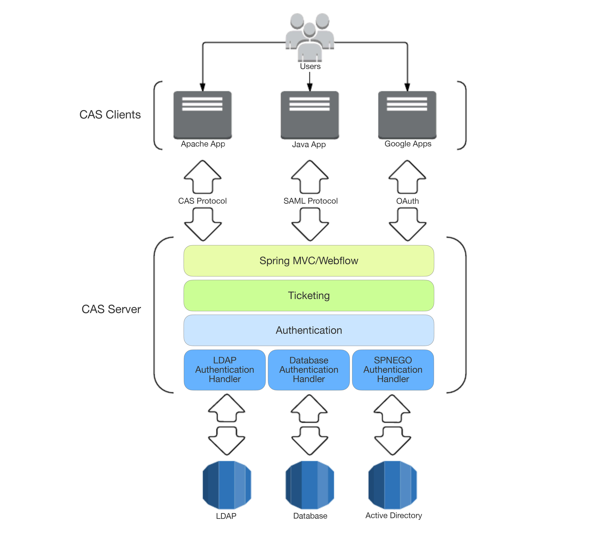
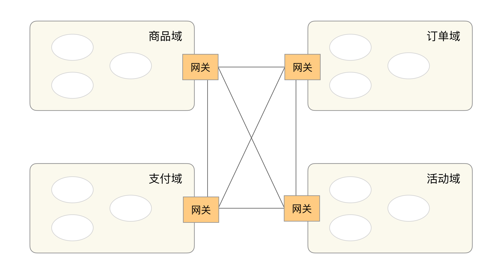

<!DOCTYPE html>

<html xmlns="http://www.w3.org/1999/xhtml">
<head>
<head>
<meta content="text/html; charset=utf-8" http-equiv="Content-Type"/>
<meta content="width=device-width, initial-scale=1, maximum-scale=1.0, user-scalable=no" name="viewport"/>
<meta content="zh-cn" http-equiv="content-language"/>
<meta content="43 互联网架构模板：用户层和业务层技术" name="description"/>
<link href="/static/favicon.png" rel="icon"/>
<title>43 互联网架构模板：用户层和业务层技术 </title>
<link href="/static/index.css" rel="stylesheet"/>
<link href="/static/highlight.min.css" rel="stylesheet"/>

<meta content="Hexo 4.2.0" name="generator"/>

</head>
<body>

<a href="/">

技术文章摘抄
</a>

<ul class="uncollapsible">
<li><a class="current-tab" href="/">首页</a></li>
<li><a href="../">上一级</a></li>
</ul>
<ul class="uncollapsible">
<li>
<a class="menu-item" href="/%e4%b8%93%e6%a0%8f/%e4%bb%8e%200%20%e5%bc%80%e5%a7%8b%e5%ad%a6%e6%9e%b6%e6%9e%84/00%20%e5%bc%80%e7%af%87%e8%af%8d%20%e7%85%a7%e7%9d%80%e5%81%9a%ef%bc%8c%e4%bd%a0%e4%b9%9f%e8%83%bd%e6%88%90%e4%b8%ba%e6%9e%b6%e6%9e%84%e5%b8%88%ef%bc%81.md" id="00 开篇词 照着做，你也能成为架构师！.md">00 开篇词 照着做，你也能成为架构师！.md</a>
</li>
<li>
<a class="menu-item" href="/%e4%b8%93%e6%a0%8f/%e4%bb%8e%200%20%e5%bc%80%e5%a7%8b%e5%ad%a6%e6%9e%b6%e6%9e%84/01%20%e6%9e%b6%e6%9e%84%e5%88%b0%e5%ba%95%e6%98%af%e6%8c%87%e4%bb%80%e4%b9%88%ef%bc%9f.md" id="01 架构到底是指什么？.md">01 架构到底是指什么？.md</a>
</li>
<li>
<a class="menu-item" href="/%e4%b8%93%e6%a0%8f/%e4%bb%8e%200%20%e5%bc%80%e5%a7%8b%e5%ad%a6%e6%9e%b6%e6%9e%84/02%20%e6%9e%b6%e6%9e%84%e8%ae%be%e8%ae%a1%e7%9a%84%e5%8e%86%e5%8f%b2%e8%83%8c%e6%99%af.md" id="02 架构设计的历史背景.md">02 架构设计的历史背景.md</a>
</li>
<li>
<a class="menu-item" href="/%e4%b8%93%e6%a0%8f/%e4%bb%8e%200%20%e5%bc%80%e5%a7%8b%e5%ad%a6%e6%9e%b6%e6%9e%84/03%20%e6%9e%b6%e6%9e%84%e8%ae%be%e8%ae%a1%e7%9a%84%e7%9b%ae%e7%9a%84.md" id="03 架构设计的目的.md">03 架构设计的目的.md</a>
</li>
<li>
<a class="menu-item" href="/%e4%b8%93%e6%a0%8f/%e4%bb%8e%200%20%e5%bc%80%e5%a7%8b%e5%ad%a6%e6%9e%b6%e6%9e%84/04%20%e5%a4%8d%e6%9d%82%e5%ba%a6%e6%9d%a5%e6%ba%90%ef%bc%9a%e9%ab%98%e6%80%a7%e8%83%bd.md" id="04 复杂度来源：高性能.md">04 复杂度来源：高性能.md</a>
</li>
<li>
<a class="menu-item" href="/%e4%b8%93%e6%a0%8f/%e4%bb%8e%200%20%e5%bc%80%e5%a7%8b%e5%ad%a6%e6%9e%b6%e6%9e%84/05%20%e5%a4%8d%e6%9d%82%e5%ba%a6%e6%9d%a5%e6%ba%90%ef%bc%9a%e9%ab%98%e5%8f%af%e7%94%a8.md" id="05 复杂度来源：高可用.md">05 复杂度来源：高可用.md</a>
</li>
<li>
<a class="menu-item" href="/%e4%b8%93%e6%a0%8f/%e4%bb%8e%200%20%e5%bc%80%e5%a7%8b%e5%ad%a6%e6%9e%b6%e6%9e%84/06%20%e5%a4%8d%e6%9d%82%e5%ba%a6%e6%9d%a5%e6%ba%90%ef%bc%9a%e5%8f%af%e6%89%a9%e5%b1%95%e6%80%a7.md" id="06 复杂度来源：可扩展性.md">06 复杂度来源：可扩展性.md</a>
</li>
<li>
<a class="menu-item" href="/%e4%b8%93%e6%a0%8f/%e4%bb%8e%200%20%e5%bc%80%e5%a7%8b%e5%ad%a6%e6%9e%b6%e6%9e%84/07%20%e5%a4%8d%e6%9d%82%e5%ba%a6%e6%9d%a5%e6%ba%90%ef%bc%9a%e4%bd%8e%e6%88%90%e6%9c%ac%e3%80%81%e5%ae%89%e5%85%a8%e3%80%81%e8%a7%84%e6%a8%a1.md" id="07 复杂度来源：低成本、安全、规模.md">07 复杂度来源：低成本、安全、规模.md</a>
</li>
<li>
<a class="menu-item" href="/%e4%b8%93%e6%a0%8f/%e4%bb%8e%200%20%e5%bc%80%e5%a7%8b%e5%ad%a6%e6%9e%b6%e6%9e%84/08%20%e6%9e%b6%e6%9e%84%e8%ae%be%e8%ae%a1%e4%b8%89%e5%8e%9f%e5%88%99.md" id="08 架构设计三原则.md">08 架构设计三原则.md</a>
</li>
<li>
<a class="menu-item" href="/%e4%b8%93%e6%a0%8f/%e4%bb%8e%200%20%e5%bc%80%e5%a7%8b%e5%ad%a6%e6%9e%b6%e6%9e%84/09%20%e6%9e%b6%e6%9e%84%e8%ae%be%e8%ae%a1%e5%8e%9f%e5%88%99%e6%a1%88%e4%be%8b.md" id="09 架构设计原则案例.md">09 架构设计原则案例.md</a>
</li>
<li>
<a class="menu-item" href="/%e4%b8%93%e6%a0%8f/%e4%bb%8e%200%20%e5%bc%80%e5%a7%8b%e5%ad%a6%e6%9e%b6%e6%9e%84/10%20%e6%9e%b6%e6%9e%84%e8%ae%be%e8%ae%a1%e6%b5%81%e7%a8%8b%ef%bc%9a%e8%af%86%e5%88%ab%e5%a4%8d%e6%9d%82%e5%ba%a6.md" id="10 架构设计流程：识别复杂度.md">10 架构设计流程：识别复杂度.md</a>
</li>
<li>
<a class="menu-item" href="/%e4%b8%93%e6%a0%8f/%e4%bb%8e%200%20%e5%bc%80%e5%a7%8b%e5%ad%a6%e6%9e%b6%e6%9e%84/11%20%e6%9e%b6%e6%9e%84%e8%ae%be%e8%ae%a1%e6%b5%81%e7%a8%8b%ef%bc%9a%e8%ae%be%e8%ae%a1%e5%a4%87%e9%80%89%e6%96%b9%e6%a1%88.md" id="11 架构设计流程：设计备选方案.md">11 架构设计流程：设计备选方案.md</a>
</li>
<li>
<a class="menu-item" href="/%e4%b8%93%e6%a0%8f/%e4%bb%8e%200%20%e5%bc%80%e5%a7%8b%e5%ad%a6%e6%9e%b6%e6%9e%84/12%20%e6%9e%b6%e6%9e%84%e8%ae%be%e8%ae%a1%e6%b5%81%e7%a8%8b%ef%bc%9a%e8%af%84%e4%bc%b0%e5%92%8c%e9%80%89%e6%8b%a9%e5%a4%87%e9%80%89%e6%96%b9%e6%a1%88.md" id="12 架构设计流程：评估和选择备选方案.md">12 架构设计流程：评估和选择备选方案.md</a>
</li>
<li>
<a class="menu-item" href="/%e4%b8%93%e6%a0%8f/%e4%bb%8e%200%20%e5%bc%80%e5%a7%8b%e5%ad%a6%e6%9e%b6%e6%9e%84/13%20%e6%9e%b6%e6%9e%84%e8%ae%be%e8%ae%a1%e6%b5%81%e7%a8%8b%ef%bc%9a%e8%af%a6%e7%bb%86%e6%96%b9%e6%a1%88%e8%ae%be%e8%ae%a1.md" id="13 架构设计流程：详细方案设计.md">13 架构设计流程：详细方案设计.md</a>
</li>
<li>
<a class="menu-item" href="/%e4%b8%93%e6%a0%8f/%e4%bb%8e%200%20%e5%bc%80%e5%a7%8b%e5%ad%a6%e6%9e%b6%e6%9e%84/14%20%e9%ab%98%e6%80%a7%e8%83%bd%e6%95%b0%e6%8d%ae%e5%ba%93%e9%9b%86%e7%be%a4%ef%bc%9a%e8%af%bb%e5%86%99%e5%88%86%e7%a6%bb.md" id="14 高性能数据库集群：读写分离.md">14 高性能数据库集群：读写分离.md</a>
</li>
<li>
<a class="menu-item" href="/%e4%b8%93%e6%a0%8f/%e4%bb%8e%200%20%e5%bc%80%e5%a7%8b%e5%ad%a6%e6%9e%b6%e6%9e%84/15%20%e9%ab%98%e6%80%a7%e8%83%bd%e6%95%b0%e6%8d%ae%e5%ba%93%e9%9b%86%e7%be%a4%ef%bc%9a%e5%88%86%e5%ba%93%e5%88%86%e8%a1%a8.md" id="15 高性能数据库集群：分库分表.md">15 高性能数据库集群：分库分表.md</a>
</li>
<li>
<a class="menu-item" href="/%e4%b8%93%e6%a0%8f/%e4%bb%8e%200%20%e5%bc%80%e5%a7%8b%e5%ad%a6%e6%9e%b6%e6%9e%84/16%20%e9%ab%98%e6%80%a7%e8%83%bdNoSQL.md" id="16 高性能NoSQL.md">16 高性能NoSQL.md</a>
</li>
<li>
<a class="menu-item" href="/%e4%b8%93%e6%a0%8f/%e4%bb%8e%200%20%e5%bc%80%e5%a7%8b%e5%ad%a6%e6%9e%b6%e6%9e%84/17%20%e9%ab%98%e6%80%a7%e8%83%bd%e7%bc%93%e5%ad%98%e6%9e%b6%e6%9e%84.md" id="17 高性能缓存架构.md">17 高性能缓存架构.md</a>
</li>
<li>
<a class="menu-item" href="/%e4%b8%93%e6%a0%8f/%e4%bb%8e%200%20%e5%bc%80%e5%a7%8b%e5%ad%a6%e6%9e%b6%e6%9e%84/18%20%e5%8d%95%e6%9c%8d%e5%8a%a1%e5%99%a8%e9%ab%98%e6%80%a7%e8%83%bd%e6%a8%a1%e5%bc%8f%ef%bc%9aPPC%e4%b8%8eTPC.md" id="18 单服务器高性能模式：PPC与TPC.md">18 单服务器高性能模式：PPC与TPC.md</a>
</li>
<li>
<a class="menu-item" href="/%e4%b8%93%e6%a0%8f/%e4%bb%8e%200%20%e5%bc%80%e5%a7%8b%e5%ad%a6%e6%9e%b6%e6%9e%84/19%20%e5%8d%95%e6%9c%8d%e5%8a%a1%e5%99%a8%e9%ab%98%e6%80%a7%e8%83%bd%e6%a8%a1%e5%bc%8f%ef%bc%9aReactor%e4%b8%8eProactor.md" id="19 单服务器高性能模式：Reactor与Proactor.md">19 单服务器高性能模式：Reactor与Proactor.md</a>
</li>
<li>
<a class="menu-item" href="/%e4%b8%93%e6%a0%8f/%e4%bb%8e%200%20%e5%bc%80%e5%a7%8b%e5%ad%a6%e6%9e%b6%e6%9e%84/20%20%e9%ab%98%e6%80%a7%e8%83%bd%e8%b4%9f%e8%bd%bd%e5%9d%87%e8%a1%a1%ef%bc%9a%e5%88%86%e7%b1%bb%e5%8f%8a%e6%9e%b6%e6%9e%84.md" id="20 高性能负载均衡：分类及架构.md">20 高性能负载均衡：分类及架构.md</a>
</li>
<li>
<a class="menu-item" href="/%e4%b8%93%e6%a0%8f/%e4%bb%8e%200%20%e5%bc%80%e5%a7%8b%e5%ad%a6%e6%9e%b6%e6%9e%84/21%20%e9%ab%98%e6%80%a7%e8%83%bd%e8%b4%9f%e8%bd%bd%e5%9d%87%e8%a1%a1%ef%bc%9a%e7%ae%97%e6%b3%95.md" id="21 高性能负载均衡：算法.md">21 高性能负载均衡：算法.md</a>
</li>
<li>
<a class="menu-item" href="/%e4%b8%93%e6%a0%8f/%e4%bb%8e%200%20%e5%bc%80%e5%a7%8b%e5%ad%a6%e6%9e%b6%e6%9e%84/22%20%e6%83%b3%e6%88%90%e4%b8%ba%e6%9e%b6%e6%9e%84%e5%b8%88%ef%bc%8c%e4%bd%a0%e5%bf%85%e9%a1%bb%e7%9f%a5%e9%81%93CAP%e7%90%86%e8%ae%ba.md" id="22 想成为架构师，你必须知道CAP理论.md">22 想成为架构师，你必须知道CAP理论.md</a>
</li>
<li>
<a class="menu-item" href="/%e4%b8%93%e6%a0%8f/%e4%bb%8e%200%20%e5%bc%80%e5%a7%8b%e5%ad%a6%e6%9e%b6%e6%9e%84/23%20%e6%83%b3%e6%88%90%e4%b8%ba%e6%9e%b6%e6%9e%84%e5%b8%88%ef%bc%8c%e4%bd%a0%e5%bf%85%e9%a1%bb%e6%8e%8c%e6%8f%a1%e7%9a%84CAP%e7%bb%86%e8%8a%82.md" id="23 想成为架构师，你必须掌握的CAP细节.md">23 想成为架构师，你必须掌握的CAP细节.md</a>
</li>
<li>
<a class="menu-item" href="/%e4%b8%93%e6%a0%8f/%e4%bb%8e%200%20%e5%bc%80%e5%a7%8b%e5%ad%a6%e6%9e%b6%e6%9e%84/24%20FMEA%e6%96%b9%e6%b3%95%ef%bc%8c%e6%8e%92%e9%99%a4%e6%9e%b6%e6%9e%84%e5%8f%af%e7%94%a8%e6%80%a7%e9%9a%90%e6%82%a3%e7%9a%84%e5%88%a9%e5%99%a8.md" id="24 FMEA方法，排除架构可用性隐患的利器.md">24 FMEA方法，排除架构可用性隐患的利器.md</a>
</li>
<li>
<a class="menu-item" href="/%e4%b8%93%e6%a0%8f/%e4%bb%8e%200%20%e5%bc%80%e5%a7%8b%e5%ad%a6%e6%9e%b6%e6%9e%84/25%20%e9%ab%98%e5%8f%af%e7%94%a8%e5%ad%98%e5%82%a8%e6%9e%b6%e6%9e%84%ef%bc%9a%e5%8f%8c%e6%9c%ba%e6%9e%b6%e6%9e%84.md" id="25 高可用存储架构：双机架构.md">25 高可用存储架构：双机架构.md</a>
</li>
<li>
<a class="menu-item" href="/%e4%b8%93%e6%a0%8f/%e4%bb%8e%200%20%e5%bc%80%e5%a7%8b%e5%ad%a6%e6%9e%b6%e6%9e%84/26%20%e9%ab%98%e5%8f%af%e7%94%a8%e5%ad%98%e5%82%a8%e6%9e%b6%e6%9e%84%ef%bc%9a%e9%9b%86%e7%be%a4%e5%92%8c%e5%88%86%e5%8c%ba.md" id="26 高可用存储架构：集群和分区.md">26 高可用存储架构：集群和分区.md</a>
</li>
<li>
<a class="menu-item" href="/%e4%b8%93%e6%a0%8f/%e4%bb%8e%200%20%e5%bc%80%e5%a7%8b%e5%ad%a6%e6%9e%b6%e6%9e%84/27%20%e5%a6%82%e4%bd%95%e8%ae%be%e8%ae%a1%e8%ae%a1%e7%ae%97%e9%ab%98%e5%8f%af%e7%94%a8%e6%9e%b6%e6%9e%84%ef%bc%9f.md" id="27 如何设计计算高可用架构？.md">27 如何设计计算高可用架构？.md</a>
</li>
<li>
<a class="menu-item" href="/%e4%b8%93%e6%a0%8f/%e4%bb%8e%200%20%e5%bc%80%e5%a7%8b%e5%ad%a6%e6%9e%b6%e6%9e%84/28%20%e4%b8%9a%e5%8a%a1%e9%ab%98%e5%8f%af%e7%94%a8%e7%9a%84%e4%bf%9d%e9%9a%9c%ef%bc%9a%e5%bc%82%e5%9c%b0%e5%a4%9a%e6%b4%bb%e6%9e%b6%e6%9e%84.md" id="28 业务高可用的保障：异地多活架构.md">28 业务高可用的保障：异地多活架构.md</a>
</li>
<li>
<a class="menu-item" href="/%e4%b8%93%e6%a0%8f/%e4%bb%8e%200%20%e5%bc%80%e5%a7%8b%e5%ad%a6%e6%9e%b6%e6%9e%84/29%20%e5%bc%82%e5%9c%b0%e5%a4%9a%e6%b4%bb%e8%ae%be%e8%ae%a14%e5%a4%a7%e6%8a%80%e5%b7%a7.md" id="29 异地多活设计4大技巧.md">29 异地多活设计4大技巧.md</a>
</li>
<li>
<a class="menu-item" href="/%e4%b8%93%e6%a0%8f/%e4%bb%8e%200%20%e5%bc%80%e5%a7%8b%e5%ad%a6%e6%9e%b6%e6%9e%84/30%20%e5%bc%82%e5%9c%b0%e5%a4%9a%e6%b4%bb%e8%ae%be%e8%ae%a14%e6%ad%a5%e8%b5%b0.md" id="30 异地多活设计4步走.md">30 异地多活设计4步走.md</a>
</li>
<li>
<a class="menu-item" href="/%e4%b8%93%e6%a0%8f/%e4%bb%8e%200%20%e5%bc%80%e5%a7%8b%e5%ad%a6%e6%9e%b6%e6%9e%84/31%20%e5%a6%82%e4%bd%95%e5%ba%94%e5%af%b9%e6%8e%a5%e5%8f%a3%e7%ba%a7%e7%9a%84%e6%95%85%e9%9a%9c%ef%bc%9f.md" id="31 如何应对接口级的故障？.md">31 如何应对接口级的故障？.md</a>
</li>
<li>
<a class="menu-item" href="/%e4%b8%93%e6%a0%8f/%e4%bb%8e%200%20%e5%bc%80%e5%a7%8b%e5%ad%a6%e6%9e%b6%e6%9e%84/32%20%e5%8f%af%e6%89%a9%e5%b1%95%e6%9e%b6%e6%9e%84%e7%9a%84%e5%9f%ba%e6%9c%ac%e6%80%9d%e6%83%b3%e5%92%8c%e6%a8%a1%e5%bc%8f.md" id="32 可扩展架构的基本思想和模式.md">32 可扩展架构的基本思想和模式.md</a>
</li>
<li>
<a class="menu-item" href="/%e4%b8%93%e6%a0%8f/%e4%bb%8e%200%20%e5%bc%80%e5%a7%8b%e5%ad%a6%e6%9e%b6%e6%9e%84/33%20%e4%bc%a0%e7%bb%9f%e7%9a%84%e5%8f%af%e6%89%a9%e5%b1%95%e6%9e%b6%e6%9e%84%e6%a8%a1%e5%bc%8f%ef%bc%9a%e5%88%86%e5%b1%82%e6%9e%b6%e6%9e%84%e5%92%8cSOA.md" id="33 传统的可扩展架构模式：分层架构和SOA.md">33 传统的可扩展架构模式：分层架构和SOA.md</a>
</li>
<li>
<a class="menu-item" href="/%e4%b8%93%e6%a0%8f/%e4%bb%8e%200%20%e5%bc%80%e5%a7%8b%e5%ad%a6%e6%9e%b6%e6%9e%84/34%20%e6%b7%b1%e5%85%a5%e7%90%86%e8%a7%a3%e5%be%ae%e6%9c%8d%e5%8a%a1%e6%9e%b6%e6%9e%84%ef%bc%9a%e9%93%b6%e5%bc%b9%20or%20%e7%84%a6%e6%b2%b9%e5%9d%91%ef%bc%9f.md" id="34 深入理解微服务架构：银弹 or 焦油坑？.md">34 深入理解微服务架构：银弹 or 焦油坑？.md</a>
</li>
<li>
<a class="menu-item" href="/%e4%b8%93%e6%a0%8f/%e4%bb%8e%200%20%e5%bc%80%e5%a7%8b%e5%ad%a6%e6%9e%b6%e6%9e%84/35%20%e5%be%ae%e6%9c%8d%e5%8a%a1%e6%9e%b6%e6%9e%84%e6%9c%80%e4%bd%b3%e5%ae%9e%e8%b7%b5%20-%20%e6%96%b9%e6%b3%95%e7%af%87.md" id="35 微服务架构最佳实践 - 方法篇.md">35 微服务架构最佳实践 - 方法篇.md</a>
</li>
<li>
<a class="menu-item" href="/%e4%b8%93%e6%a0%8f/%e4%bb%8e%200%20%e5%bc%80%e5%a7%8b%e5%ad%a6%e6%9e%b6%e6%9e%84/36%20%e5%be%ae%e6%9c%8d%e5%8a%a1%e6%9e%b6%e6%9e%84%e6%9c%80%e4%bd%b3%e5%ae%9e%e8%b7%b5%20-%20%e5%9f%ba%e7%a1%80%e8%ae%be%e6%96%bd%e7%af%87.md" id="36 微服务架构最佳实践 - 基础设施篇.md">36 微服务架构最佳实践 - 基础设施篇.md</a>
</li>
<li>
<a class="menu-item" href="/%e4%b8%93%e6%a0%8f/%e4%bb%8e%200%20%e5%bc%80%e5%a7%8b%e5%ad%a6%e6%9e%b6%e6%9e%84/37%20%e5%be%ae%e5%86%85%e6%a0%b8%e6%9e%b6%e6%9e%84%e8%af%a6%e8%a7%a3.md" id="37 微内核架构详解.md">37 微内核架构详解.md</a>
</li>
<li>
<a class="menu-item" href="/%e4%b8%93%e6%a0%8f/%e4%bb%8e%200%20%e5%bc%80%e5%a7%8b%e5%ad%a6%e6%9e%b6%e6%9e%84/38%20%e6%9e%b6%e6%9e%84%e5%b8%88%e5%ba%94%e8%af%a5%e5%a6%82%e4%bd%95%e5%88%a4%e6%96%ad%e6%8a%80%e6%9c%af%e6%bc%94%e8%bf%9b%e7%9a%84%e6%96%b9%e5%90%91%ef%bc%9f.md" id="38 架构师应该如何判断技术演进的方向？.md">38 架构师应该如何判断技术演进的方向？.md</a>
</li>
<li>
<a class="menu-item" href="/%e4%b8%93%e6%a0%8f/%e4%bb%8e%200%20%e5%bc%80%e5%a7%8b%e5%ad%a6%e6%9e%b6%e6%9e%84/39%20%e4%ba%92%e8%81%94%e7%bd%91%e6%8a%80%e6%9c%af%e6%bc%94%e8%bf%9b%e7%9a%84%e6%a8%a1%e5%bc%8f.md" id="39 互联网技术演进的模式.md">39 互联网技术演进的模式.md</a>
</li>
<li>
<a class="menu-item" href="/%e4%b8%93%e6%a0%8f/%e4%bb%8e%200%20%e5%bc%80%e5%a7%8b%e5%ad%a6%e6%9e%b6%e6%9e%84/40%20%e4%ba%92%e8%81%94%e7%bd%91%e6%9e%b6%e6%9e%84%e6%a8%a1%e6%9d%bf%ef%bc%9a%e5%ad%98%e5%82%a8%e5%b1%82%e6%8a%80%e6%9c%af.md" id="40 互联网架构模板：存储层技术.md">40 互联网架构模板：存储层技术.md</a>
</li>
<li>
<a class="menu-item" href="/%e4%b8%93%e6%a0%8f/%e4%bb%8e%200%20%e5%bc%80%e5%a7%8b%e5%ad%a6%e6%9e%b6%e6%9e%84/41%20%e4%ba%92%e8%81%94%e7%bd%91%e6%9e%b6%e6%9e%84%e6%a8%a1%e6%9d%bf%ef%bc%9a%e5%bc%80%e5%8f%91%e5%b1%82%e5%92%8c%e6%9c%8d%e5%8a%a1%e5%b1%82%e6%8a%80%e6%9c%af.md" id="41 互联网架构模板：开发层和服务层技术.md">41 互联网架构模板：开发层和服务层技术.md</a>
</li>
<li>
<a class="menu-item" href="/%e4%b8%93%e6%a0%8f/%e4%bb%8e%200%20%e5%bc%80%e5%a7%8b%e5%ad%a6%e6%9e%b6%e6%9e%84/42%20%e4%ba%92%e8%81%94%e7%bd%91%e6%9e%b6%e6%9e%84%e6%a8%a1%e6%9d%bf%ef%bc%9a%e7%bd%91%e7%bb%9c%e5%b1%82%e6%8a%80%e6%9c%af.md" id="42 互联网架构模板：网络层技术.md">42 互联网架构模板：网络层技术.md</a>
</li>
<li>
<a class="menu-item" href="/%e4%b8%93%e6%a0%8f/%e4%bb%8e%200%20%e5%bc%80%e5%a7%8b%e5%ad%a6%e6%9e%b6%e6%9e%84/43%20%e4%ba%92%e8%81%94%e7%bd%91%e6%9e%b6%e6%9e%84%e6%a8%a1%e6%9d%bf%ef%bc%9a%e7%94%a8%e6%88%b7%e5%b1%82%e5%92%8c%e4%b8%9a%e5%8a%a1%e5%b1%82%e6%8a%80%e6%9c%af.md" id="43 互联网架构模板：用户层和业务层技术.md">43 互联网架构模板：用户层和业务层技术.md</a>
</li>
<li>
<a class="menu-item" href="/%e4%b8%93%e6%a0%8f/%e4%bb%8e%200%20%e5%bc%80%e5%a7%8b%e5%ad%a6%e6%9e%b6%e6%9e%84/44%20%e4%ba%92%e8%81%94%e7%bd%91%e6%9e%b6%e6%9e%84%e6%a8%a1%e6%9d%bf%ef%bc%9a%e5%b9%b3%e5%8f%b0%e6%8a%80%e6%9c%af.md" id="44 互联网架构模板：平台技术.md">44 互联网架构模板：平台技术.md</a>
</li>
<li>
<a class="menu-item" href="/%e4%b8%93%e6%a0%8f/%e4%bb%8e%200%20%e5%bc%80%e5%a7%8b%e5%ad%a6%e6%9e%b6%e6%9e%84/45%20%e6%9e%b6%e6%9e%84%e9%87%8d%e6%9e%84%e5%86%85%e5%8a%9f%e5%bf%83%e6%b3%95%e7%ac%ac%e4%b8%80%e5%bc%8f%ef%bc%9a%e6%9c%89%e7%9a%84%e6%94%be%e7%9f%a2.md" id="45 架构重构内功心法第一式：有的放矢.md">45 架构重构内功心法第一式：有的放矢.md</a>
</li>
<li>
<a class="menu-item" href="/%e4%b8%93%e6%a0%8f/%e4%bb%8e%200%20%e5%bc%80%e5%a7%8b%e5%ad%a6%e6%9e%b6%e6%9e%84/46%20%e6%9e%b6%e6%9e%84%e9%87%8d%e6%9e%84%e5%86%85%e5%8a%9f%e5%bf%83%e6%b3%95%e7%ac%ac%e4%ba%8c%e5%bc%8f%ef%bc%9a%e5%90%88%e7%ba%b5%e8%bf%9e%e6%a8%aa.md" id="46 架构重构内功心法第二式：合纵连横.md">46 架构重构内功心法第二式：合纵连横.md</a>
</li>
<li>
<a class="menu-item" href="/%e4%b8%93%e6%a0%8f/%e4%bb%8e%200%20%e5%bc%80%e5%a7%8b%e5%ad%a6%e6%9e%b6%e6%9e%84/47%20%e6%9e%b6%e6%9e%84%e9%87%8d%e6%9e%84%e5%86%85%e5%8a%9f%e5%bf%83%e6%b3%95%e7%ac%ac%e4%b8%89%e5%bc%8f%ef%bc%9a%e8%bf%90%e7%ad%b9%e5%b8%b7%e5%b9%84.md" id="47 架构重构内功心法第三式：运筹帷幄.md">47 架构重构内功心法第三式：运筹帷幄.md</a>
</li>
<li>
<a class="menu-item" href="/%e4%b8%93%e6%a0%8f/%e4%bb%8e%200%20%e5%bc%80%e5%a7%8b%e5%ad%a6%e6%9e%b6%e6%9e%84/48%20%e5%86%8d%e8%b0%88%e5%bc%80%e6%ba%90%e9%a1%b9%e7%9b%ae%ef%bc%9a%e5%a6%82%e4%bd%95%e9%80%89%e6%8b%a9%e3%80%81%e4%bd%bf%e7%94%a8%e4%bb%a5%e5%8f%8a%e4%ba%8c%e6%ac%a1%e5%bc%80%e5%8f%91%ef%bc%9f.md" id="48 再谈开源项目：如何选择、使用以及二次开发？.md">48 再谈开源项目：如何选择、使用以及二次开发？.md</a>
</li>
<li>
<a class="menu-item" href="/%e4%b8%93%e6%a0%8f/%e4%bb%8e%200%20%e5%bc%80%e5%a7%8b%e5%ad%a6%e6%9e%b6%e6%9e%84/49%20%e8%b0%88%e8%b0%88App%e6%9e%b6%e6%9e%84%e7%9a%84%e6%bc%94%e8%bf%9b.md" id="49 谈谈App架构的演进.md">49 谈谈App架构的演进.md</a>
</li>
<li>
<a class="menu-item" href="/%e4%b8%93%e6%a0%8f/%e4%bb%8e%200%20%e5%bc%80%e5%a7%8b%e5%ad%a6%e6%9e%b6%e6%9e%84/50%20%e6%9e%b6%e6%9e%84%e5%ae%9e%e6%88%98%ef%bc%9a%e6%9e%b6%e6%9e%84%e8%ae%be%e8%ae%a1%e6%96%87%e6%a1%a3%e6%a8%a1%e6%9d%bf.md" id="50 架构实战：架构设计文档模板.md">50 架构实战：架构设计文档模板.md</a>
</li>
<li>
<a class="menu-item" href="/%e4%b8%93%e6%a0%8f/%e4%bb%8e%200%20%e5%bc%80%e5%a7%8b%e5%ad%a6%e6%9e%b6%e6%9e%84/51%20%e5%a6%82%e4%bd%95%e7%94%bb%e5%87%ba%e4%bc%98%e7%a7%80%e7%9a%84%e8%bd%af%e4%bb%b6%e7%b3%bb%e7%bb%9f%e6%9e%b6%e6%9e%84%e5%9b%be%ef%bc%9f.md" id="51 如何画出优秀的软件系统架构图？.md">51 如何画出优秀的软件系统架构图？.md</a>
</li>
<li>
<a class="menu-item" href="/%e4%b8%93%e6%a0%8f/%e4%bb%8e%200%20%e5%bc%80%e5%a7%8b%e5%ad%a6%e6%9e%b6%e6%9e%84/%e5%8a%a0%e9%a4%90%ef%bd%9c%e4%b8%9a%e5%8a%a1%e6%9e%b6%e6%9e%84%e5%ae%9e%e6%88%98%e8%90%a5%e5%bc%80%e8%90%a5%e4%ba%86.md" id="加餐｜业务架构实战营开营了.md">加餐｜业务架构实战营开营了.md</a>
</li>
<li>
<a class="menu-item" href="/%e4%b8%93%e6%a0%8f/%e4%bb%8e%200%20%e5%bc%80%e5%a7%8b%e5%ad%a6%e6%9e%b6%e6%9e%84/%e5%8a%a0%e9%a4%90%ef%bd%9c%e5%8d%95%e6%9c%8d%e5%8a%a1%e5%99%a8%e9%ab%98%e6%80%a7%e8%83%bd%e6%a8%a1%e5%bc%8f%e6%80%a7%e8%83%bd%e5%af%b9%e6%af%94.md" id="加餐｜单服务器高性能模式性能对比.md">加餐｜单服务器高性能模式性能对比.md</a>
</li>
<li>
<a class="menu-item" href="/%e4%b8%93%e6%a0%8f/%e4%bb%8e%200%20%e5%bc%80%e5%a7%8b%e5%ad%a6%e6%9e%b6%e6%9e%84/%e5%8a%a0%e9%a4%90%ef%bd%9c%e6%89%92%e4%b8%80%e6%89%92%e4%b8%ad%e5%8f%b0%e7%9a%87%e5%b8%9d%e7%9a%84%e5%a4%96%e8%a1%a3.md" id="加餐｜扒一扒中台皇帝的外衣.md">加餐｜扒一扒中台皇帝的外衣.md</a>
</li>
<li>
<a class="menu-item" href="/%e4%b8%93%e6%a0%8f/%e4%bb%8e%200%20%e5%bc%80%e5%a7%8b%e5%ad%a6%e6%9e%b6%e6%9e%84/%e5%a6%82%e4%bd%95%e9%ab%98%e6%95%88%e5%9c%b0%e5%ad%a6%e4%b9%a0%e5%bc%80%e6%ba%90%e9%a1%b9%e7%9b%ae%20%e5%8d%8e%e4%bb%94%ef%bc%8c%e6%94%be%e5%ad%a6%e5%88%ab%e8%b5%b0%ef%bc%81%20%e7%ac%ac3%e6%9c%9f.md" id="如何高效地学习开源项目 华仔，放学别走！ 第3期.md">如何高效地学习开源项目 华仔，放学别走！ 第3期.md</a>
</li>
<li>
<a class="menu-item" href="/%e4%b8%93%e6%a0%8f/%e4%bb%8e%200%20%e5%bc%80%e5%a7%8b%e5%ad%a6%e6%9e%b6%e6%9e%84/%e6%96%b0%e4%b9%a6%e9%a6%96%e5%8f%91%20%e3%80%8a%e4%bb%8e%e9%9b%b6%e5%bc%80%e5%a7%8b%e5%ad%a6%e6%9e%b6%e6%9e%84%e3%80%8b.md" id="新书首发 《从零开始学架构》.md">新书首发 《从零开始学架构》.md</a>
</li>
<li>
<a class="menu-item" href="/%e4%b8%93%e6%a0%8f/%e4%bb%8e%200%20%e5%bc%80%e5%a7%8b%e5%ad%a6%e6%9e%b6%e6%9e%84/%e6%9e%b6%e6%9e%84%e4%b8%93%e6%a0%8f%e7%89%b9%e5%88%ab%e6%94%be%e9%80%81%20%e5%8d%8e%e4%bb%94%ef%bc%8c%e6%94%be%e5%ad%a6%e5%88%ab%e8%b5%b0%ef%bc%81%20%e7%ac%ac2%e6%9c%9f.md" id="架构专栏特别放送 华仔，放学别走！ 第2期.md">架构专栏特别放送 华仔，放学别走！ 第2期.md</a>
</li>
<li>
<a class="menu-item" href="/%e4%b8%93%e6%a0%8f/%e4%bb%8e%200%20%e5%bc%80%e5%a7%8b%e5%ad%a6%e6%9e%b6%e6%9e%84/%e6%9e%b6%e6%9e%84%e4%b8%93%e6%a0%8f%e7%89%b9%e5%88%ab%e6%94%be%e9%80%81%20%e5%8d%8e%e4%bb%94%ef%bc%8c%e6%94%be%e5%ad%a6%e5%88%ab%e8%b5%b0%ef%bc%81%e7%ac%ac1%e6%9c%9f.md" id="架构专栏特别放送 华仔，放学别走！第1期.md">架构专栏特别放送 华仔，放学别走！第1期.md</a>
</li>
<li>
<a class="menu-item" href="/%e4%b8%93%e6%a0%8f/%e4%bb%8e%200%20%e5%bc%80%e5%a7%8b%e5%ad%a6%e6%9e%b6%e6%9e%84/%e6%9e%b6%e6%9e%84%e5%b8%88%e5%bf%85%e8%af%bb%e4%b9%a6%e5%8d%95%20%e5%8d%8e%e4%bb%94%ef%bc%8c%e6%94%be%e5%ad%a6%e5%88%ab%e8%b5%b0%ef%bc%81%20%e7%ac%ac5%e6%9c%9f.md" id="架构师必读书单 华仔，放学别走！ 第5期.md">架构师必读书单 华仔，放学别走！ 第5期.md</a>
</li>
<li>
<a class="menu-item" href="/%e4%b8%93%e6%a0%8f/%e4%bb%8e%200%20%e5%bc%80%e5%a7%8b%e5%ad%a6%e6%9e%b6%e6%9e%84/%e6%9e%b6%e6%9e%84%e5%b8%88%e6%88%90%e9%95%bf%e4%b9%8b%e8%b7%af%20%e5%8d%8e%e4%bb%94%ef%bc%8c%e6%94%be%e5%ad%a6%e5%88%ab%e8%b5%b0%ef%bc%81%20%e7%ac%ac4%e6%9c%9f.md" id="架构师成长之路 华仔，放学别走！ 第4期.md">架构师成长之路 华仔，放学别走！ 第4期.md</a>
</li>
<li>
<a class="menu-item" href="/%e4%b8%93%e6%a0%8f/%e4%bb%8e%200%20%e5%bc%80%e5%a7%8b%e5%ad%a6%e6%9e%b6%e6%9e%84/%e7%bb%93%e6%9d%9f%e8%af%ad%20%e5%9d%9a%e6%8c%81%ef%bc%8c%e6%88%90%e5%b0%b1%e4%bd%a0%e7%9a%84%e6%8a%80%e6%9c%af%e6%a2%a6%e6%83%b3.md" id="结束语 坚持，成就你的技术梦想.md">结束语 坚持，成就你的技术梦想.md</a>
</li>
<li><a href="/assets/捐赠.md">捐赠</a></li>
</ul>

<header class="navbar">
<section class="navbar-section">
<a onclick="open_sidebar()">
<i class="icon icon-menu"></i>
</a>
</section>
</header>

<h1 class="title" data-id="43 互联网架构模板：用户层和业务层技术" id="title">43 互联网架构模板：用户层和业务层技术</h1>

上一期，我从计算机网络层的角度谈了应对“高性能”和“高可用”的整体架构设计。今天，我将从“用户层”和“业务层”的角度谈谈常见的应用场景和关键技术。

<h2 id="用户层技术">用户层技术</h2>

1.用户管理

互联网业务的一个典型特征就是通过互联网将众多分散的用户连接起来，因此用户管理是互联网业务必不可少的一部分。

稍微大一点的互联网业务，肯定会涉及多个子系统，这些子系统不可能每个都管理这么庞大的用户，由此引申出用户管理的第一个目标：<strong>单点登录（SSO）</strong>，又叫统一登录。单点登录的技术实现手段较多，例如cookie、JSONP、token等，目前最成熟的开源单点登录方案当属CAS，其架构如下（<a href="https://apereo.github.io/cas/4.2.x/planning/Architecture.html" target="_blank">https://apereo.github.io/cas/4.2.x/planning/Architecture.html</a> ）：

除此之外，当业务做大成为了平台后，开放成为了促进业务进一步发展的手段，需要允许第三方应用接入，由此引申出用户管理的第二个目标：<strong>授权登录</strong>。现在最流行的授权登录就是OAuth 2.0协议，基本上已经成为了事实上的标准，如果要做开放平台，则最好用这个协议，私有协议漏洞多，第三方接入也麻烦。

用户管理系统面临的主要问题是用户数巨大，一般至少千万级，QQ、微信、支付宝这种巨无霸应用都是亿级用户。不过也不要被这个数据给吓倒了，用户管理虽然数据量巨大，但实现起来并不难，原因是什么呢？ 因为用户数据量虽然大，但是不同用户之间没有太强的业务关联，A用户登录和B用户登录基本没有关系。因此虽然数据量巨大，但我们用一个简单的负载均衡架构就能轻松应对。

用户管理的基本架构如下：

2.消息推送

消息推送根据不同的途径，分为短信、邮件、站内信、App推送。除了App，不同的途径基本上调用不同的API即可完成，技术上没有什么难度。例如，短信需要依赖运营商的短信接口，邮件需要依赖邮件服务商的邮件接口，站内信是系统提供的消息通知功能。

App目前主要分为iOS和Android推送，iOS系统比较规范和封闭，基本上只能使用苹果的APNS；但Android就不一样了，在国外，用GCM和APNS差别不大；但是在国内，情况就复杂多了：首先是GCM不能用；其次是各个手机厂商都有自己的定制的Android，消息推送实现也不完全一样。因此Android的消息推送就五花八门了，大部分有实力的大厂，都会自己实现一套消息推送机制，例如阿里云移动推送、腾讯信鸽推送、百度云推送；也有第三方公司提供商业推送服务，例如友盟推送、极光推送等。

通常情况下，对于中小公司，如果不涉及敏感数据，Android系统上推荐使用第三方推送服务，因为毕竟是专业做推送服务的，消息到达率是有一定保证的。

如果涉及敏感数据，需要自己实现消息推送，这时就有一定的技术挑战了。消息推送主要包含3个功能：设备管理（唯一标识、注册、注销）、连接管理和消息管理，技术上面临的主要挑战有：

<ul>
<li>海量设备和用户管理
消息推送的设备数量众多，存储和管理这些设备是比较复杂的；同时，为了针对不同用户进行不同的业务推广，还需要收集用户的一些信息，简单来说就是将用户和设备关联起来，需要提取用户特征对用户进行分类或者打标签等。</li>
<li>连接保活
要想推送消息必须有连接通道，但是应用又不可能一直在前台运行，大部分设备为了省电省流量等原因都会限制应用后台运行，限制应用后台运行后连接通道可能就被中断了，导致消息无法及时的送达。连接保活是整个消息推送设计中细节和黑科技最多的地方，例如应用互相拉起、找手机厂商开白名单等。</li>
<li>消息管理
实际业务运营过程中，并不是每个消息都需要发送给每个用户，而是可能根据用户的特征，选择一些用户进行消息推送。由于用户特征变化很大，各种排列组合都有可能，将消息推送给哪些用户这部分的逻辑要设计得非常灵活，才能支撑花样繁多的业务需求，具体的设计方案可以采取规则引擎之类的微内核架构技术。</li>
</ul>

3.存储云、图片云

互联网业务场景中，用户会上传多种类型的文件数据，例如微信用户发朋友圈时上传图片，微博用户发微博时上传图片、视频，优酷用户上传视频，淘宝卖家上传商品图片等，这些文件具备几个典型特点：

<ul>
<li>数据量大：用户基数大，用户上传行为频繁，例如2016年的时候微信朋友圈每天上传图片就达到了10亿张（<a href="http://mi.techweb.com.cn/tmt/2016-05-25/2338330.shtml" target="_blank">http://mi.techweb.com.cn/tmt/2016-05-25⁄2338330.shtml</a>）。</li>
<li>文件体积小：大部分图片是几百KB到几MB，短视频播放时间也是在几分钟内。</li>
<li>访问有时效性：大部分文件是刚上传的时候访问最多，随着时间的推移访问量越来越小。</li>
</ul>

为了满足用户的文件上传和存储需求，需要对用户提供文件存储和访问功能，这里就需要用到前面我在[专栏第40期]介绍“存储层”技术时提到的“小文件存储”技术。简单来说，存储云和图片云通常的实现都是“CDN + 小文件存储”，现在有了“云”之后，除非BAT级别，一般不建议自己再重复造轮子了，直接买云服务可能是最快也是最经济的方式。

既然存储云和图片云都是基于“CDN + 小文件存储”的技术，为何不统一一套系统，而将其拆分为两个系统呢？这是因为“图片”业务的复杂性导致的，普通的文件基本上提供存储和访问就够了，而图片涉及的业务会更多，包括裁剪、压缩、美化、审核、水印等处理，因此通常情况下图片云会拆分为独立的系统对用户提供服务。

<h2 id="业务层技术">业务层技术</h2>

互联网的业务千差万别，不同的业务分解下来有不同的系统，所以业务层没有办法提炼一些公共的系统或者组件。抛开业务上的差异，各个互联网业务发展最终面临的问题都是类似的：业务复杂度越来越高。也就是说，业务层面对的主要技术挑战是“复杂度”。

复杂度越来越高的一个主要原因就是系统越来越庞大，业务越来越多。幸运的是，面对业务层的技术挑战，我们有一把“屠龙宝刀”，不管什么业务难题，用上“屠龙宝刀”问题都能迎刃而解。这把“屠龙宝刀”就是“拆”，化整为零、分而治之，将整体复杂性分散到多个子业务或者子系统里面去。具体拆的方式你可以查看专栏前面可扩展架构模式部分的分层架构、微服务、微内核等。

我以一个简单的电商系统为例，如下图所示：

我这个模拟的电商系统经历了3个发展阶段：

<ul>
<li>第一阶段：所有功能都在1个系统里面。</li>
<li>第二阶段：将商品和订单拆分到2个子系统里面。</li>
<li>第三阶段：商品子系统和订单子系统分别拆分成了更小的6个子系统。</li>
</ul>

上面只是个样例，实际上随着业务的发展，子系统会越来越多，据说淘宝内部大大小小的已经有成百上千的子系统了。

随着子系统数量越来越多，如果达到几百上千，另外一个复杂度问题又会凸显出来：子系统数量太多，已经没有人能够说清楚业务的调用流程了，出了问题排查也会特别复杂。此时应该怎么处理呢，总不可能又将子系统合成大系统吧？最终答案还是“合”，正所谓“合久必分、分久必合”，但合的方式不一样，此时采取的“合”的方式是按照“高内聚、低耦合”的原则，将职责关联比较强的子系统合成一个<strong>虚拟业务域</strong>，然后通过网关对外统一呈现，类似于设计模式中的Facade模式。同样以电商为样例，采用虚拟业务域后，其架构如下：

<h2 id="小结">小结</h2>

今天我为你讲了互联网架构模板中的用户层技术和业务层技术，希望对你有所帮助。

这就是今天的全部内容，留一道思考题给你吧，虚拟业务域划分的粒度需要粗一些还是要细一些？你建议虚拟业务域的数量大概是多少，理由是什么？

© 2019 - 2023 <a href="/cdn-cgi/l/email-protection#355959590c0104040502755258545c591b565a58" target="_blank">Liangliang Lee</a>.
                    Powered by <a href="https://github.com/gin-gonic/gin" target="_blank">gin</a> and <a href="https://github.com/kaiiiz/hexo-theme-book" target="_blank">hexo-theme-book</a>.

</body>

</head></html>