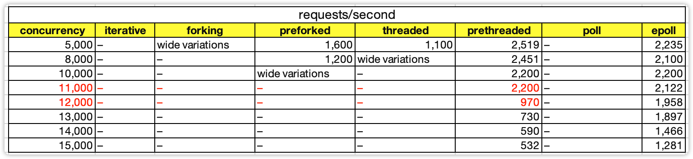
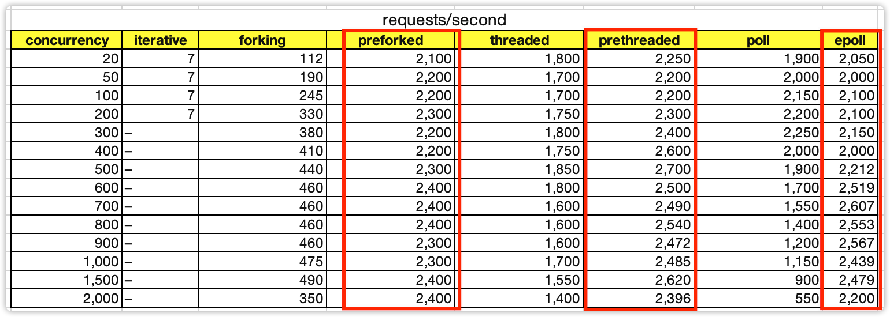
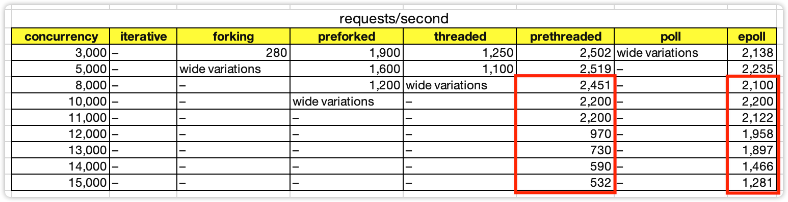
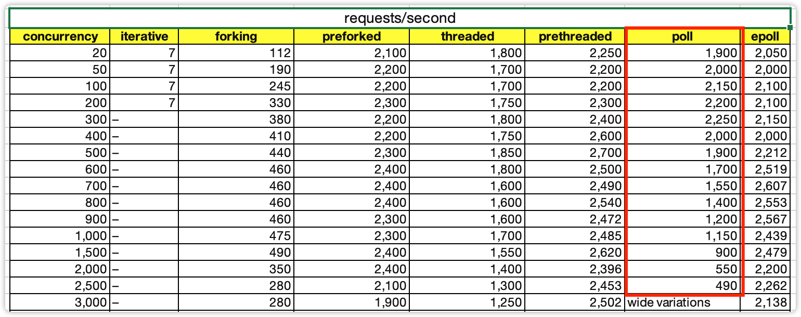

<!DOCTYPE html>

<html xmlns="http://www.w3.org/1999/xhtml">
<head>
<head>
<meta content="text/html; charset=utf-8" http-equiv="Content-Type"/>
<meta content="width=device-width, initial-scale=1, maximum-scale=1.0, user-scalable=no" name="viewport"/>
<meta content="zh-cn" http-equiv="content-language"/>
<meta content="加餐｜单服务器高性能模式性能对比" name="description"/>
<link href="/static/favicon.png" rel="icon"/>
<title>加餐｜单服务器高性能模式性能对比 </title>
<link href="/static/index.css" rel="stylesheet"/>
<link href="/static/highlight.min.css" rel="stylesheet"/>

<meta content="Hexo 4.2.0" name="generator"/>

</head>
<body>

<a href="/">

技术文章摘抄
</a>

<ul class="uncollapsible">
<li><a class="current-tab" href="/">首页</a></li>
<li><a href="../">上一级</a></li>
</ul>
<ul class="uncollapsible">
<li>
<a class="menu-item" href="/%e4%b8%93%e6%a0%8f/%e4%bb%8e%200%20%e5%bc%80%e5%a7%8b%e5%ad%a6%e6%9e%b6%e6%9e%84/00%20%e5%bc%80%e7%af%87%e8%af%8d%20%e7%85%a7%e7%9d%80%e5%81%9a%ef%bc%8c%e4%bd%a0%e4%b9%9f%e8%83%bd%e6%88%90%e4%b8%ba%e6%9e%b6%e6%9e%84%e5%b8%88%ef%bc%81.md" id="00 开篇词 照着做，你也能成为架构师！.md">00 开篇词 照着做，你也能成为架构师！.md</a>
</li>
<li>
<a class="menu-item" href="/%e4%b8%93%e6%a0%8f/%e4%bb%8e%200%20%e5%bc%80%e5%a7%8b%e5%ad%a6%e6%9e%b6%e6%9e%84/01%20%e6%9e%b6%e6%9e%84%e5%88%b0%e5%ba%95%e6%98%af%e6%8c%87%e4%bb%80%e4%b9%88%ef%bc%9f.md" id="01 架构到底是指什么？.md">01 架构到底是指什么？.md</a>
</li>
<li>
<a class="menu-item" href="/%e4%b8%93%e6%a0%8f/%e4%bb%8e%200%20%e5%bc%80%e5%a7%8b%e5%ad%a6%e6%9e%b6%e6%9e%84/02%20%e6%9e%b6%e6%9e%84%e8%ae%be%e8%ae%a1%e7%9a%84%e5%8e%86%e5%8f%b2%e8%83%8c%e6%99%af.md" id="02 架构设计的历史背景.md">02 架构设计的历史背景.md</a>
</li>
<li>
<a class="menu-item" href="/%e4%b8%93%e6%a0%8f/%e4%bb%8e%200%20%e5%bc%80%e5%a7%8b%e5%ad%a6%e6%9e%b6%e6%9e%84/03%20%e6%9e%b6%e6%9e%84%e8%ae%be%e8%ae%a1%e7%9a%84%e7%9b%ae%e7%9a%84.md" id="03 架构设计的目的.md">03 架构设计的目的.md</a>
</li>
<li>
<a class="menu-item" href="/%e4%b8%93%e6%a0%8f/%e4%bb%8e%200%20%e5%bc%80%e5%a7%8b%e5%ad%a6%e6%9e%b6%e6%9e%84/04%20%e5%a4%8d%e6%9d%82%e5%ba%a6%e6%9d%a5%e6%ba%90%ef%bc%9a%e9%ab%98%e6%80%a7%e8%83%bd.md" id="04 复杂度来源：高性能.md">04 复杂度来源：高性能.md</a>
</li>
<li>
<a class="menu-item" href="/%e4%b8%93%e6%a0%8f/%e4%bb%8e%200%20%e5%bc%80%e5%a7%8b%e5%ad%a6%e6%9e%b6%e6%9e%84/05%20%e5%a4%8d%e6%9d%82%e5%ba%a6%e6%9d%a5%e6%ba%90%ef%bc%9a%e9%ab%98%e5%8f%af%e7%94%a8.md" id="05 复杂度来源：高可用.md">05 复杂度来源：高可用.md</a>
</li>
<li>
<a class="menu-item" href="/%e4%b8%93%e6%a0%8f/%e4%bb%8e%200%20%e5%bc%80%e5%a7%8b%e5%ad%a6%e6%9e%b6%e6%9e%84/06%20%e5%a4%8d%e6%9d%82%e5%ba%a6%e6%9d%a5%e6%ba%90%ef%bc%9a%e5%8f%af%e6%89%a9%e5%b1%95%e6%80%a7.md" id="06 复杂度来源：可扩展性.md">06 复杂度来源：可扩展性.md</a>
</li>
<li>
<a class="menu-item" href="/%e4%b8%93%e6%a0%8f/%e4%bb%8e%200%20%e5%bc%80%e5%a7%8b%e5%ad%a6%e6%9e%b6%e6%9e%84/07%20%e5%a4%8d%e6%9d%82%e5%ba%a6%e6%9d%a5%e6%ba%90%ef%bc%9a%e4%bd%8e%e6%88%90%e6%9c%ac%e3%80%81%e5%ae%89%e5%85%a8%e3%80%81%e8%a7%84%e6%a8%a1.md" id="07 复杂度来源：低成本、安全、规模.md">07 复杂度来源：低成本、安全、规模.md</a>
</li>
<li>
<a class="menu-item" href="/%e4%b8%93%e6%a0%8f/%e4%bb%8e%200%20%e5%bc%80%e5%a7%8b%e5%ad%a6%e6%9e%b6%e6%9e%84/08%20%e6%9e%b6%e6%9e%84%e8%ae%be%e8%ae%a1%e4%b8%89%e5%8e%9f%e5%88%99.md" id="08 架构设计三原则.md">08 架构设计三原则.md</a>
</li>
<li>
<a class="menu-item" href="/%e4%b8%93%e6%a0%8f/%e4%bb%8e%200%20%e5%bc%80%e5%a7%8b%e5%ad%a6%e6%9e%b6%e6%9e%84/09%20%e6%9e%b6%e6%9e%84%e8%ae%be%e8%ae%a1%e5%8e%9f%e5%88%99%e6%a1%88%e4%be%8b.md" id="09 架构设计原则案例.md">09 架构设计原则案例.md</a>
</li>
<li>
<a class="menu-item" href="/%e4%b8%93%e6%a0%8f/%e4%bb%8e%200%20%e5%bc%80%e5%a7%8b%e5%ad%a6%e6%9e%b6%e6%9e%84/10%20%e6%9e%b6%e6%9e%84%e8%ae%be%e8%ae%a1%e6%b5%81%e7%a8%8b%ef%bc%9a%e8%af%86%e5%88%ab%e5%a4%8d%e6%9d%82%e5%ba%a6.md" id="10 架构设计流程：识别复杂度.md">10 架构设计流程：识别复杂度.md</a>
</li>
<li>
<a class="menu-item" href="/%e4%b8%93%e6%a0%8f/%e4%bb%8e%200%20%e5%bc%80%e5%a7%8b%e5%ad%a6%e6%9e%b6%e6%9e%84/11%20%e6%9e%b6%e6%9e%84%e8%ae%be%e8%ae%a1%e6%b5%81%e7%a8%8b%ef%bc%9a%e8%ae%be%e8%ae%a1%e5%a4%87%e9%80%89%e6%96%b9%e6%a1%88.md" id="11 架构设计流程：设计备选方案.md">11 架构设计流程：设计备选方案.md</a>
</li>
<li>
<a class="menu-item" href="/%e4%b8%93%e6%a0%8f/%e4%bb%8e%200%20%e5%bc%80%e5%a7%8b%e5%ad%a6%e6%9e%b6%e6%9e%84/12%20%e6%9e%b6%e6%9e%84%e8%ae%be%e8%ae%a1%e6%b5%81%e7%a8%8b%ef%bc%9a%e8%af%84%e4%bc%b0%e5%92%8c%e9%80%89%e6%8b%a9%e5%a4%87%e9%80%89%e6%96%b9%e6%a1%88.md" id="12 架构设计流程：评估和选择备选方案.md">12 架构设计流程：评估和选择备选方案.md</a>
</li>
<li>
<a class="menu-item" href="/%e4%b8%93%e6%a0%8f/%e4%bb%8e%200%20%e5%bc%80%e5%a7%8b%e5%ad%a6%e6%9e%b6%e6%9e%84/13%20%e6%9e%b6%e6%9e%84%e8%ae%be%e8%ae%a1%e6%b5%81%e7%a8%8b%ef%bc%9a%e8%af%a6%e7%bb%86%e6%96%b9%e6%a1%88%e8%ae%be%e8%ae%a1.md" id="13 架构设计流程：详细方案设计.md">13 架构设计流程：详细方案设计.md</a>
</li>
<li>
<a class="menu-item" href="/%e4%b8%93%e6%a0%8f/%e4%bb%8e%200%20%e5%bc%80%e5%a7%8b%e5%ad%a6%e6%9e%b6%e6%9e%84/14%20%e9%ab%98%e6%80%a7%e8%83%bd%e6%95%b0%e6%8d%ae%e5%ba%93%e9%9b%86%e7%be%a4%ef%bc%9a%e8%af%bb%e5%86%99%e5%88%86%e7%a6%bb.md" id="14 高性能数据库集群：读写分离.md">14 高性能数据库集群：读写分离.md</a>
</li>
<li>
<a class="menu-item" href="/%e4%b8%93%e6%a0%8f/%e4%bb%8e%200%20%e5%bc%80%e5%a7%8b%e5%ad%a6%e6%9e%b6%e6%9e%84/15%20%e9%ab%98%e6%80%a7%e8%83%bd%e6%95%b0%e6%8d%ae%e5%ba%93%e9%9b%86%e7%be%a4%ef%bc%9a%e5%88%86%e5%ba%93%e5%88%86%e8%a1%a8.md" id="15 高性能数据库集群：分库分表.md">15 高性能数据库集群：分库分表.md</a>
</li>
<li>
<a class="menu-item" href="/%e4%b8%93%e6%a0%8f/%e4%bb%8e%200%20%e5%bc%80%e5%a7%8b%e5%ad%a6%e6%9e%b6%e6%9e%84/16%20%e9%ab%98%e6%80%a7%e8%83%bdNoSQL.md" id="16 高性能NoSQL.md">16 高性能NoSQL.md</a>
</li>
<li>
<a class="menu-item" href="/%e4%b8%93%e6%a0%8f/%e4%bb%8e%200%20%e5%bc%80%e5%a7%8b%e5%ad%a6%e6%9e%b6%e6%9e%84/17%20%e9%ab%98%e6%80%a7%e8%83%bd%e7%bc%93%e5%ad%98%e6%9e%b6%e6%9e%84.md" id="17 高性能缓存架构.md">17 高性能缓存架构.md</a>
</li>
<li>
<a class="menu-item" href="/%e4%b8%93%e6%a0%8f/%e4%bb%8e%200%20%e5%bc%80%e5%a7%8b%e5%ad%a6%e6%9e%b6%e6%9e%84/18%20%e5%8d%95%e6%9c%8d%e5%8a%a1%e5%99%a8%e9%ab%98%e6%80%a7%e8%83%bd%e6%a8%a1%e5%bc%8f%ef%bc%9aPPC%e4%b8%8eTPC.md" id="18 单服务器高性能模式：PPC与TPC.md">18 单服务器高性能模式：PPC与TPC.md</a>
</li>
<li>
<a class="menu-item" href="/%e4%b8%93%e6%a0%8f/%e4%bb%8e%200%20%e5%bc%80%e5%a7%8b%e5%ad%a6%e6%9e%b6%e6%9e%84/19%20%e5%8d%95%e6%9c%8d%e5%8a%a1%e5%99%a8%e9%ab%98%e6%80%a7%e8%83%bd%e6%a8%a1%e5%bc%8f%ef%bc%9aReactor%e4%b8%8eProactor.md" id="19 单服务器高性能模式：Reactor与Proactor.md">19 单服务器高性能模式：Reactor与Proactor.md</a>
</li>
<li>
<a class="menu-item" href="/%e4%b8%93%e6%a0%8f/%e4%bb%8e%200%20%e5%bc%80%e5%a7%8b%e5%ad%a6%e6%9e%b6%e6%9e%84/20%20%e9%ab%98%e6%80%a7%e8%83%bd%e8%b4%9f%e8%bd%bd%e5%9d%87%e8%a1%a1%ef%bc%9a%e5%88%86%e7%b1%bb%e5%8f%8a%e6%9e%b6%e6%9e%84.md" id="20 高性能负载均衡：分类及架构.md">20 高性能负载均衡：分类及架构.md</a>
</li>
<li>
<a class="menu-item" href="/%e4%b8%93%e6%a0%8f/%e4%bb%8e%200%20%e5%bc%80%e5%a7%8b%e5%ad%a6%e6%9e%b6%e6%9e%84/21%20%e9%ab%98%e6%80%a7%e8%83%bd%e8%b4%9f%e8%bd%bd%e5%9d%87%e8%a1%a1%ef%bc%9a%e7%ae%97%e6%b3%95.md" id="21 高性能负载均衡：算法.md">21 高性能负载均衡：算法.md</a>
</li>
<li>
<a class="menu-item" href="/%e4%b8%93%e6%a0%8f/%e4%bb%8e%200%20%e5%bc%80%e5%a7%8b%e5%ad%a6%e6%9e%b6%e6%9e%84/22%20%e6%83%b3%e6%88%90%e4%b8%ba%e6%9e%b6%e6%9e%84%e5%b8%88%ef%bc%8c%e4%bd%a0%e5%bf%85%e9%a1%bb%e7%9f%a5%e9%81%93CAP%e7%90%86%e8%ae%ba.md" id="22 想成为架构师，你必须知道CAP理论.md">22 想成为架构师，你必须知道CAP理论.md</a>
</li>
<li>
<a class="menu-item" href="/%e4%b8%93%e6%a0%8f/%e4%bb%8e%200%20%e5%bc%80%e5%a7%8b%e5%ad%a6%e6%9e%b6%e6%9e%84/23%20%e6%83%b3%e6%88%90%e4%b8%ba%e6%9e%b6%e6%9e%84%e5%b8%88%ef%bc%8c%e4%bd%a0%e5%bf%85%e9%a1%bb%e6%8e%8c%e6%8f%a1%e7%9a%84CAP%e7%bb%86%e8%8a%82.md" id="23 想成为架构师，你必须掌握的CAP细节.md">23 想成为架构师，你必须掌握的CAP细节.md</a>
</li>
<li>
<a class="menu-item" href="/%e4%b8%93%e6%a0%8f/%e4%bb%8e%200%20%e5%bc%80%e5%a7%8b%e5%ad%a6%e6%9e%b6%e6%9e%84/24%20FMEA%e6%96%b9%e6%b3%95%ef%bc%8c%e6%8e%92%e9%99%a4%e6%9e%b6%e6%9e%84%e5%8f%af%e7%94%a8%e6%80%a7%e9%9a%90%e6%82%a3%e7%9a%84%e5%88%a9%e5%99%a8.md" id="24 FMEA方法，排除架构可用性隐患的利器.md">24 FMEA方法，排除架构可用性隐患的利器.md</a>
</li>
<li>
<a class="menu-item" href="/%e4%b8%93%e6%a0%8f/%e4%bb%8e%200%20%e5%bc%80%e5%a7%8b%e5%ad%a6%e6%9e%b6%e6%9e%84/25%20%e9%ab%98%e5%8f%af%e7%94%a8%e5%ad%98%e5%82%a8%e6%9e%b6%e6%9e%84%ef%bc%9a%e5%8f%8c%e6%9c%ba%e6%9e%b6%e6%9e%84.md" id="25 高可用存储架构：双机架构.md">25 高可用存储架构：双机架构.md</a>
</li>
<li>
<a class="menu-item" href="/%e4%b8%93%e6%a0%8f/%e4%bb%8e%200%20%e5%bc%80%e5%a7%8b%e5%ad%a6%e6%9e%b6%e6%9e%84/26%20%e9%ab%98%e5%8f%af%e7%94%a8%e5%ad%98%e5%82%a8%e6%9e%b6%e6%9e%84%ef%bc%9a%e9%9b%86%e7%be%a4%e5%92%8c%e5%88%86%e5%8c%ba.md" id="26 高可用存储架构：集群和分区.md">26 高可用存储架构：集群和分区.md</a>
</li>
<li>
<a class="menu-item" href="/%e4%b8%93%e6%a0%8f/%e4%bb%8e%200%20%e5%bc%80%e5%a7%8b%e5%ad%a6%e6%9e%b6%e6%9e%84/27%20%e5%a6%82%e4%bd%95%e8%ae%be%e8%ae%a1%e8%ae%a1%e7%ae%97%e9%ab%98%e5%8f%af%e7%94%a8%e6%9e%b6%e6%9e%84%ef%bc%9f.md" id="27 如何设计计算高可用架构？.md">27 如何设计计算高可用架构？.md</a>
</li>
<li>
<a class="menu-item" href="/%e4%b8%93%e6%a0%8f/%e4%bb%8e%200%20%e5%bc%80%e5%a7%8b%e5%ad%a6%e6%9e%b6%e6%9e%84/28%20%e4%b8%9a%e5%8a%a1%e9%ab%98%e5%8f%af%e7%94%a8%e7%9a%84%e4%bf%9d%e9%9a%9c%ef%bc%9a%e5%bc%82%e5%9c%b0%e5%a4%9a%e6%b4%bb%e6%9e%b6%e6%9e%84.md" id="28 业务高可用的保障：异地多活架构.md">28 业务高可用的保障：异地多活架构.md</a>
</li>
<li>
<a class="menu-item" href="/%e4%b8%93%e6%a0%8f/%e4%bb%8e%200%20%e5%bc%80%e5%a7%8b%e5%ad%a6%e6%9e%b6%e6%9e%84/29%20%e5%bc%82%e5%9c%b0%e5%a4%9a%e6%b4%bb%e8%ae%be%e8%ae%a14%e5%a4%a7%e6%8a%80%e5%b7%a7.md" id="29 异地多活设计4大技巧.md">29 异地多活设计4大技巧.md</a>
</li>
<li>
<a class="menu-item" href="/%e4%b8%93%e6%a0%8f/%e4%bb%8e%200%20%e5%bc%80%e5%a7%8b%e5%ad%a6%e6%9e%b6%e6%9e%84/30%20%e5%bc%82%e5%9c%b0%e5%a4%9a%e6%b4%bb%e8%ae%be%e8%ae%a14%e6%ad%a5%e8%b5%b0.md" id="30 异地多活设计4步走.md">30 异地多活设计4步走.md</a>
</li>
<li>
<a class="menu-item" href="/%e4%b8%93%e6%a0%8f/%e4%bb%8e%200%20%e5%bc%80%e5%a7%8b%e5%ad%a6%e6%9e%b6%e6%9e%84/31%20%e5%a6%82%e4%bd%95%e5%ba%94%e5%af%b9%e6%8e%a5%e5%8f%a3%e7%ba%a7%e7%9a%84%e6%95%85%e9%9a%9c%ef%bc%9f.md" id="31 如何应对接口级的故障？.md">31 如何应对接口级的故障？.md</a>
</li>
<li>
<a class="menu-item" href="/%e4%b8%93%e6%a0%8f/%e4%bb%8e%200%20%e5%bc%80%e5%a7%8b%e5%ad%a6%e6%9e%b6%e6%9e%84/32%20%e5%8f%af%e6%89%a9%e5%b1%95%e6%9e%b6%e6%9e%84%e7%9a%84%e5%9f%ba%e6%9c%ac%e6%80%9d%e6%83%b3%e5%92%8c%e6%a8%a1%e5%bc%8f.md" id="32 可扩展架构的基本思想和模式.md">32 可扩展架构的基本思想和模式.md</a>
</li>
<li>
<a class="menu-item" href="/%e4%b8%93%e6%a0%8f/%e4%bb%8e%200%20%e5%bc%80%e5%a7%8b%e5%ad%a6%e6%9e%b6%e6%9e%84/33%20%e4%bc%a0%e7%bb%9f%e7%9a%84%e5%8f%af%e6%89%a9%e5%b1%95%e6%9e%b6%e6%9e%84%e6%a8%a1%e5%bc%8f%ef%bc%9a%e5%88%86%e5%b1%82%e6%9e%b6%e6%9e%84%e5%92%8cSOA.md" id="33 传统的可扩展架构模式：分层架构和SOA.md">33 传统的可扩展架构模式：分层架构和SOA.md</a>
</li>
<li>
<a class="menu-item" href="/%e4%b8%93%e6%a0%8f/%e4%bb%8e%200%20%e5%bc%80%e5%a7%8b%e5%ad%a6%e6%9e%b6%e6%9e%84/34%20%e6%b7%b1%e5%85%a5%e7%90%86%e8%a7%a3%e5%be%ae%e6%9c%8d%e5%8a%a1%e6%9e%b6%e6%9e%84%ef%bc%9a%e9%93%b6%e5%bc%b9%20or%20%e7%84%a6%e6%b2%b9%e5%9d%91%ef%bc%9f.md" id="34 深入理解微服务架构：银弹 or 焦油坑？.md">34 深入理解微服务架构：银弹 or 焦油坑？.md</a>
</li>
<li>
<a class="menu-item" href="/%e4%b8%93%e6%a0%8f/%e4%bb%8e%200%20%e5%bc%80%e5%a7%8b%e5%ad%a6%e6%9e%b6%e6%9e%84/35%20%e5%be%ae%e6%9c%8d%e5%8a%a1%e6%9e%b6%e6%9e%84%e6%9c%80%e4%bd%b3%e5%ae%9e%e8%b7%b5%20-%20%e6%96%b9%e6%b3%95%e7%af%87.md" id="35 微服务架构最佳实践 - 方法篇.md">35 微服务架构最佳实践 - 方法篇.md</a>
</li>
<li>
<a class="menu-item" href="/%e4%b8%93%e6%a0%8f/%e4%bb%8e%200%20%e5%bc%80%e5%a7%8b%e5%ad%a6%e6%9e%b6%e6%9e%84/36%20%e5%be%ae%e6%9c%8d%e5%8a%a1%e6%9e%b6%e6%9e%84%e6%9c%80%e4%bd%b3%e5%ae%9e%e8%b7%b5%20-%20%e5%9f%ba%e7%a1%80%e8%ae%be%e6%96%bd%e7%af%87.md" id="36 微服务架构最佳实践 - 基础设施篇.md">36 微服务架构最佳实践 - 基础设施篇.md</a>
</li>
<li>
<a class="menu-item" href="/%e4%b8%93%e6%a0%8f/%e4%bb%8e%200%20%e5%bc%80%e5%a7%8b%e5%ad%a6%e6%9e%b6%e6%9e%84/37%20%e5%be%ae%e5%86%85%e6%a0%b8%e6%9e%b6%e6%9e%84%e8%af%a6%e8%a7%a3.md" id="37 微内核架构详解.md">37 微内核架构详解.md</a>
</li>
<li>
<a class="menu-item" href="/%e4%b8%93%e6%a0%8f/%e4%bb%8e%200%20%e5%bc%80%e5%a7%8b%e5%ad%a6%e6%9e%b6%e6%9e%84/38%20%e6%9e%b6%e6%9e%84%e5%b8%88%e5%ba%94%e8%af%a5%e5%a6%82%e4%bd%95%e5%88%a4%e6%96%ad%e6%8a%80%e6%9c%af%e6%bc%94%e8%bf%9b%e7%9a%84%e6%96%b9%e5%90%91%ef%bc%9f.md" id="38 架构师应该如何判断技术演进的方向？.md">38 架构师应该如何判断技术演进的方向？.md</a>
</li>
<li>
<a class="menu-item" href="/%e4%b8%93%e6%a0%8f/%e4%bb%8e%200%20%e5%bc%80%e5%a7%8b%e5%ad%a6%e6%9e%b6%e6%9e%84/39%20%e4%ba%92%e8%81%94%e7%bd%91%e6%8a%80%e6%9c%af%e6%bc%94%e8%bf%9b%e7%9a%84%e6%a8%a1%e5%bc%8f.md" id="39 互联网技术演进的模式.md">39 互联网技术演进的模式.md</a>
</li>
<li>
<a class="menu-item" href="/%e4%b8%93%e6%a0%8f/%e4%bb%8e%200%20%e5%bc%80%e5%a7%8b%e5%ad%a6%e6%9e%b6%e6%9e%84/40%20%e4%ba%92%e8%81%94%e7%bd%91%e6%9e%b6%e6%9e%84%e6%a8%a1%e6%9d%bf%ef%bc%9a%e5%ad%98%e5%82%a8%e5%b1%82%e6%8a%80%e6%9c%af.md" id="40 互联网架构模板：存储层技术.md">40 互联网架构模板：存储层技术.md</a>
</li>
<li>
<a class="menu-item" href="/%e4%b8%93%e6%a0%8f/%e4%bb%8e%200%20%e5%bc%80%e5%a7%8b%e5%ad%a6%e6%9e%b6%e6%9e%84/41%20%e4%ba%92%e8%81%94%e7%bd%91%e6%9e%b6%e6%9e%84%e6%a8%a1%e6%9d%bf%ef%bc%9a%e5%bc%80%e5%8f%91%e5%b1%82%e5%92%8c%e6%9c%8d%e5%8a%a1%e5%b1%82%e6%8a%80%e6%9c%af.md" id="41 互联网架构模板：开发层和服务层技术.md">41 互联网架构模板：开发层和服务层技术.md</a>
</li>
<li>
<a class="menu-item" href="/%e4%b8%93%e6%a0%8f/%e4%bb%8e%200%20%e5%bc%80%e5%a7%8b%e5%ad%a6%e6%9e%b6%e6%9e%84/42%20%e4%ba%92%e8%81%94%e7%bd%91%e6%9e%b6%e6%9e%84%e6%a8%a1%e6%9d%bf%ef%bc%9a%e7%bd%91%e7%bb%9c%e5%b1%82%e6%8a%80%e6%9c%af.md" id="42 互联网架构模板：网络层技术.md">42 互联网架构模板：网络层技术.md</a>
</li>
<li>
<a class="menu-item" href="/%e4%b8%93%e6%a0%8f/%e4%bb%8e%200%20%e5%bc%80%e5%a7%8b%e5%ad%a6%e6%9e%b6%e6%9e%84/43%20%e4%ba%92%e8%81%94%e7%bd%91%e6%9e%b6%e6%9e%84%e6%a8%a1%e6%9d%bf%ef%bc%9a%e7%94%a8%e6%88%b7%e5%b1%82%e5%92%8c%e4%b8%9a%e5%8a%a1%e5%b1%82%e6%8a%80%e6%9c%af.md" id="43 互联网架构模板：用户层和业务层技术.md">43 互联网架构模板：用户层和业务层技术.md</a>
</li>
<li>
<a class="menu-item" href="/%e4%b8%93%e6%a0%8f/%e4%bb%8e%200%20%e5%bc%80%e5%a7%8b%e5%ad%a6%e6%9e%b6%e6%9e%84/44%20%e4%ba%92%e8%81%94%e7%bd%91%e6%9e%b6%e6%9e%84%e6%a8%a1%e6%9d%bf%ef%bc%9a%e5%b9%b3%e5%8f%b0%e6%8a%80%e6%9c%af.md" id="44 互联网架构模板：平台技术.md">44 互联网架构模板：平台技术.md</a>
</li>
<li>
<a class="menu-item" href="/%e4%b8%93%e6%a0%8f/%e4%bb%8e%200%20%e5%bc%80%e5%a7%8b%e5%ad%a6%e6%9e%b6%e6%9e%84/45%20%e6%9e%b6%e6%9e%84%e9%87%8d%e6%9e%84%e5%86%85%e5%8a%9f%e5%bf%83%e6%b3%95%e7%ac%ac%e4%b8%80%e5%bc%8f%ef%bc%9a%e6%9c%89%e7%9a%84%e6%94%be%e7%9f%a2.md" id="45 架构重构内功心法第一式：有的放矢.md">45 架构重构内功心法第一式：有的放矢.md</a>
</li>
<li>
<a class="menu-item" href="/%e4%b8%93%e6%a0%8f/%e4%bb%8e%200%20%e5%bc%80%e5%a7%8b%e5%ad%a6%e6%9e%b6%e6%9e%84/46%20%e6%9e%b6%e6%9e%84%e9%87%8d%e6%9e%84%e5%86%85%e5%8a%9f%e5%bf%83%e6%b3%95%e7%ac%ac%e4%ba%8c%e5%bc%8f%ef%bc%9a%e5%90%88%e7%ba%b5%e8%bf%9e%e6%a8%aa.md" id="46 架构重构内功心法第二式：合纵连横.md">46 架构重构内功心法第二式：合纵连横.md</a>
</li>
<li>
<a class="menu-item" href="/%e4%b8%93%e6%a0%8f/%e4%bb%8e%200%20%e5%bc%80%e5%a7%8b%e5%ad%a6%e6%9e%b6%e6%9e%84/47%20%e6%9e%b6%e6%9e%84%e9%87%8d%e6%9e%84%e5%86%85%e5%8a%9f%e5%bf%83%e6%b3%95%e7%ac%ac%e4%b8%89%e5%bc%8f%ef%bc%9a%e8%bf%90%e7%ad%b9%e5%b8%b7%e5%b9%84.md" id="47 架构重构内功心法第三式：运筹帷幄.md">47 架构重构内功心法第三式：运筹帷幄.md</a>
</li>
<li>
<a class="menu-item" href="/%e4%b8%93%e6%a0%8f/%e4%bb%8e%200%20%e5%bc%80%e5%a7%8b%e5%ad%a6%e6%9e%b6%e6%9e%84/48%20%e5%86%8d%e8%b0%88%e5%bc%80%e6%ba%90%e9%a1%b9%e7%9b%ae%ef%bc%9a%e5%a6%82%e4%bd%95%e9%80%89%e6%8b%a9%e3%80%81%e4%bd%bf%e7%94%a8%e4%bb%a5%e5%8f%8a%e4%ba%8c%e6%ac%a1%e5%bc%80%e5%8f%91%ef%bc%9f.md" id="48 再谈开源项目：如何选择、使用以及二次开发？.md">48 再谈开源项目：如何选择、使用以及二次开发？.md</a>
</li>
<li>
<a class="menu-item" href="/%e4%b8%93%e6%a0%8f/%e4%bb%8e%200%20%e5%bc%80%e5%a7%8b%e5%ad%a6%e6%9e%b6%e6%9e%84/49%20%e8%b0%88%e8%b0%88App%e6%9e%b6%e6%9e%84%e7%9a%84%e6%bc%94%e8%bf%9b.md" id="49 谈谈App架构的演进.md">49 谈谈App架构的演进.md</a>
</li>
<li>
<a class="menu-item" href="/%e4%b8%93%e6%a0%8f/%e4%bb%8e%200%20%e5%bc%80%e5%a7%8b%e5%ad%a6%e6%9e%b6%e6%9e%84/50%20%e6%9e%b6%e6%9e%84%e5%ae%9e%e6%88%98%ef%bc%9a%e6%9e%b6%e6%9e%84%e8%ae%be%e8%ae%a1%e6%96%87%e6%a1%a3%e6%a8%a1%e6%9d%bf.md" id="50 架构实战：架构设计文档模板.md">50 架构实战：架构设计文档模板.md</a>
</li>
<li>
<a class="menu-item" href="/%e4%b8%93%e6%a0%8f/%e4%bb%8e%200%20%e5%bc%80%e5%a7%8b%e5%ad%a6%e6%9e%b6%e6%9e%84/51%20%e5%a6%82%e4%bd%95%e7%94%bb%e5%87%ba%e4%bc%98%e7%a7%80%e7%9a%84%e8%bd%af%e4%bb%b6%e7%b3%bb%e7%bb%9f%e6%9e%b6%e6%9e%84%e5%9b%be%ef%bc%9f.md" id="51 如何画出优秀的软件系统架构图？.md">51 如何画出优秀的软件系统架构图？.md</a>
</li>
<li>
<a class="menu-item" href="/%e4%b8%93%e6%a0%8f/%e4%bb%8e%200%20%e5%bc%80%e5%a7%8b%e5%ad%a6%e6%9e%b6%e6%9e%84/%e5%8a%a0%e9%a4%90%ef%bd%9c%e4%b8%9a%e5%8a%a1%e6%9e%b6%e6%9e%84%e5%ae%9e%e6%88%98%e8%90%a5%e5%bc%80%e8%90%a5%e4%ba%86.md" id="加餐｜业务架构实战营开营了.md">加餐｜业务架构实战营开营了.md</a>
</li>
<li>
<a class="menu-item" href="/%e4%b8%93%e6%a0%8f/%e4%bb%8e%200%20%e5%bc%80%e5%a7%8b%e5%ad%a6%e6%9e%b6%e6%9e%84/%e5%8a%a0%e9%a4%90%ef%bd%9c%e5%8d%95%e6%9c%8d%e5%8a%a1%e5%99%a8%e9%ab%98%e6%80%a7%e8%83%bd%e6%a8%a1%e5%bc%8f%e6%80%a7%e8%83%bd%e5%af%b9%e6%af%94.md" id="加餐｜单服务器高性能模式性能对比.md">加餐｜单服务器高性能模式性能对比.md</a>
</li>
<li>
<a class="menu-item" href="/%e4%b8%93%e6%a0%8f/%e4%bb%8e%200%20%e5%bc%80%e5%a7%8b%e5%ad%a6%e6%9e%b6%e6%9e%84/%e5%8a%a0%e9%a4%90%ef%bd%9c%e6%89%92%e4%b8%80%e6%89%92%e4%b8%ad%e5%8f%b0%e7%9a%87%e5%b8%9d%e7%9a%84%e5%a4%96%e8%a1%a3.md" id="加餐｜扒一扒中台皇帝的外衣.md">加餐｜扒一扒中台皇帝的外衣.md</a>
</li>
<li>
<a class="menu-item" href="/%e4%b8%93%e6%a0%8f/%e4%bb%8e%200%20%e5%bc%80%e5%a7%8b%e5%ad%a6%e6%9e%b6%e6%9e%84/%e5%a6%82%e4%bd%95%e9%ab%98%e6%95%88%e5%9c%b0%e5%ad%a6%e4%b9%a0%e5%bc%80%e6%ba%90%e9%a1%b9%e7%9b%ae%20%e5%8d%8e%e4%bb%94%ef%bc%8c%e6%94%be%e5%ad%a6%e5%88%ab%e8%b5%b0%ef%bc%81%20%e7%ac%ac3%e6%9c%9f.md" id="如何高效地学习开源项目 华仔，放学别走！ 第3期.md">如何高效地学习开源项目 华仔，放学别走！ 第3期.md</a>
</li>
<li>
<a class="menu-item" href="/%e4%b8%93%e6%a0%8f/%e4%bb%8e%200%20%e5%bc%80%e5%a7%8b%e5%ad%a6%e6%9e%b6%e6%9e%84/%e6%96%b0%e4%b9%a6%e9%a6%96%e5%8f%91%20%e3%80%8a%e4%bb%8e%e9%9b%b6%e5%bc%80%e5%a7%8b%e5%ad%a6%e6%9e%b6%e6%9e%84%e3%80%8b.md" id="新书首发 《从零开始学架构》.md">新书首发 《从零开始学架构》.md</a>
</li>
<li>
<a class="menu-item" href="/%e4%b8%93%e6%a0%8f/%e4%bb%8e%200%20%e5%bc%80%e5%a7%8b%e5%ad%a6%e6%9e%b6%e6%9e%84/%e6%9e%b6%e6%9e%84%e4%b8%93%e6%a0%8f%e7%89%b9%e5%88%ab%e6%94%be%e9%80%81%20%e5%8d%8e%e4%bb%94%ef%bc%8c%e6%94%be%e5%ad%a6%e5%88%ab%e8%b5%b0%ef%bc%81%20%e7%ac%ac2%e6%9c%9f.md" id="架构专栏特别放送 华仔，放学别走！ 第2期.md">架构专栏特别放送 华仔，放学别走！ 第2期.md</a>
</li>
<li>
<a class="menu-item" href="/%e4%b8%93%e6%a0%8f/%e4%bb%8e%200%20%e5%bc%80%e5%a7%8b%e5%ad%a6%e6%9e%b6%e6%9e%84/%e6%9e%b6%e6%9e%84%e4%b8%93%e6%a0%8f%e7%89%b9%e5%88%ab%e6%94%be%e9%80%81%20%e5%8d%8e%e4%bb%94%ef%bc%8c%e6%94%be%e5%ad%a6%e5%88%ab%e8%b5%b0%ef%bc%81%e7%ac%ac1%e6%9c%9f.md" id="架构专栏特别放送 华仔，放学别走！第1期.md">架构专栏特别放送 华仔，放学别走！第1期.md</a>
</li>
<li>
<a class="menu-item" href="/%e4%b8%93%e6%a0%8f/%e4%bb%8e%200%20%e5%bc%80%e5%a7%8b%e5%ad%a6%e6%9e%b6%e6%9e%84/%e6%9e%b6%e6%9e%84%e5%b8%88%e5%bf%85%e8%af%bb%e4%b9%a6%e5%8d%95%20%e5%8d%8e%e4%bb%94%ef%bc%8c%e6%94%be%e5%ad%a6%e5%88%ab%e8%b5%b0%ef%bc%81%20%e7%ac%ac5%e6%9c%9f.md" id="架构师必读书单 华仔，放学别走！ 第5期.md">架构师必读书单 华仔，放学别走！ 第5期.md</a>
</li>
<li>
<a class="menu-item" href="/%e4%b8%93%e6%a0%8f/%e4%bb%8e%200%20%e5%bc%80%e5%a7%8b%e5%ad%a6%e6%9e%b6%e6%9e%84/%e6%9e%b6%e6%9e%84%e5%b8%88%e6%88%90%e9%95%bf%e4%b9%8b%e8%b7%af%20%e5%8d%8e%e4%bb%94%ef%bc%8c%e6%94%be%e5%ad%a6%e5%88%ab%e8%b5%b0%ef%bc%81%20%e7%ac%ac4%e6%9c%9f.md" id="架构师成长之路 华仔，放学别走！ 第4期.md">架构师成长之路 华仔，放学别走！ 第4期.md</a>
</li>
<li>
<a class="menu-item" href="/%e4%b8%93%e6%a0%8f/%e4%bb%8e%200%20%e5%bc%80%e5%a7%8b%e5%ad%a6%e6%9e%b6%e6%9e%84/%e7%bb%93%e6%9d%9f%e8%af%ad%20%e5%9d%9a%e6%8c%81%ef%bc%8c%e6%88%90%e5%b0%b1%e4%bd%a0%e7%9a%84%e6%8a%80%e6%9c%af%e6%a2%a6%e6%83%b3.md" id="结束语 坚持，成就你的技术梦想.md">结束语 坚持，成就你的技术梦想.md</a>
</li>
<li><a href="/assets/捐赠.md">捐赠</a></li>
</ul>

<header class="navbar">
<section class="navbar-section">
<a onclick="open_sidebar()">
<i class="icon icon-menu"></i>
</a>
</section>
</header>

<h1 class="title" data-id="加餐｜单服务器高性能模式性能对比" id="title">加餐｜单服务器高性能模式性能对比</h1>

你好，我是华仔。

我们架构课的[第18讲]和[第19讲]主题是单服务器高性能模式，我们讲了PPC与TPC、Reactor与Proactor，从理论上跟你详细讲述了不同模式的实现方式和优缺点，但是并没有给出详细的测试数据对比，原因在于我自己没有整套的测试环境，也不能用公司的服务器做压力测试，因此留下了一个小小的遗憾。

幸运的是，最近我在学习的时候，无意中在网络上找到一份非常详尽的关于Linux服务器网络模型的详细系列文章。作者通过连载的方式，将iterative、forking（对应专栏的PPC模式）、preforked（对应专栏的prefork模式）、threaded（对应专栏的TPC模式）、prethreaded（对应专栏的prethread模式）、poll、epoll（对应专栏的Reactor模式）共7种模式的实现原理、实现代码、性能对比都详尽地进行了阐述，完美地弥补了专栏内容没有实际数据对比的遗憾。

因此我把核心的测试数据对比摘录出来，然后基于数据来进一步阐释，也就有了这一讲的加餐。我想第一时间分享给你，相信今天的内容可以帮助我们加深对课程里讲过的理论的理解。

下面是作者对7种模式的性能测试对比结果表格，作者在文章中并没有详细地介绍测试环境，只是简单提到了测试服务器是租来的云服务器，<strong>CPU只有1核</strong>（没有说明具体的CPU型号），对于内存、带宽、磁盘等信息并没有介绍，我们假设这些硬件相关性能都足够。从理论上来说，网络模型的核心性能部件就是CPU，因此如下数据是具备参考意义的。

这张图的数据比较多，如何去看懂这样的性能测试数据表格呢？我来分享一个有用的技巧：<strong>横向看对比，纵向看转折</strong>。

<h3 id="横向看对比">横向看对比</h3>

比如，当并发连接数是1000的时候，可以看出preforking、prethreaded、epoll三种模式性能是相近的，也意味着epoll并不是在任何场景都具备相比其它模式的性能优势。

<h3 id="纵向看转折">纵向看转折</h3>

比如，prethreaded模式（作者源码中设置了100个线程）在11000并发的时候性能有2200，但12000并发连接的时候，性能急剧下降到只有970，这是什么原因呢？我推测是12000并发的时候触发了C10K问题，线程上下文切换的性能消耗超越了IO处理，成为了系统的处理瓶颈。

按照上述“横向看对比，纵向看转折”的方式，我给你分享一下我的一些解读和发现。

<ol>
<li>创建进程的消耗是创建线程的消耗的4倍左右。</li>
</ol>

<ol>
<li>并发2000以内时，preforked、prethreaded、epoll的性能相差无几，甚至preforked和prethreaded的性能有时候还稍微高一些。</li>
</ol>

这也是内部系统、中间件等并发数并不高的系统并不一定需要epoll的原因，用preforked和prethreaded模式能够达到相同的性能，并且实现要简单。

<ol>
<li>当并发数达到8000以上，只有pthreaded和epoll模式能够继续运行，但性能也有下降，epoll的下降更加平稳一些。</li>
</ol>

<ol>
<li>prethreaded模式在12000并发连接的时候，性能急剧下降。</li>
</ol>

推测是触发了C10K问题，线程上下文切换的性能消耗超越了IO处理的性能消耗。

<ol>
<li>poll模式随着并发数增多稳定下降，因为需要遍历的描述符越多，其性能越低。</li>
</ol>

类似的还有select模式，作者没有单独写select，因为两者原理基本类似，区别是select的最大支持连接数受限于FD_SETSIZE这个参数。

<ol>
<li>epoll在并发数超过10000的时候性能开始下降，但下降比较平稳。</li>
</ol>

这个结论看起来比较简单，但是却隐含着一个关键的设计点：<strong>epoll不是万能的，连接数太多的时候单进程epoll也是不行的</strong>。这也是为什么Redis可以用单进程Reactor模式，而Nginx必须用多进程Reactor模式，因为Redis的应用场景是内部访问，并发数一般不会超过10000；而Nginx是互联网访问，并发数很容易超过10000。

以上是我从性能对比数据中的一些发现，这些发现能够让我们更进一步理解专栏内容中讲到的理论知识和优缺点对比，这些数据也可以指导我们在实际的架构设计中根据应用场景来选择合适的模式。

最后，我也希望你能掌握“<strong>横向看对比，纵向看转折</strong>”这个分析技巧。这个技巧在查阅和审核性能测试数据以及各种对比数据的时候，能够帮助你发现很多数据背后隐含的观点和结论。

拓展阅读与学习指南：

<ol>
<li>原作者的系列文章请参考：<a href="https://unixism.net/2019/04/linux-applications-performance-introduction/" target="_blank">https://unixism.net/2019/04/linux-applications-performance-introduction/</a></li>
<li>原作者的测试代码GitHub仓库地址：<a href="https://github.com/shuveb/zerohttpd" target="_blank">https://github.com/shuveb/zerohttpd</a></li>
<li>原作者的代码实现了一个完整的基本功能的HTTP服务器，采用的是短链接的方式，还用到了Redis来保存内容，有的代码逻辑是比较复杂的，尤其是epoll的实现部分。如果你想自己简单的只是验证网络模型的性能，可以去掉其源码中HTTP的实现部分，只是简单地返回“hello world”这样的字符串即可。</li>
</ol>

© 2019 - 2023 <a href="/cdn-cgi/l/email-protection#1d71717124292c2c2d2a5d7a707c7471337e7270" target="_blank">Liangliang Lee</a>.
                    Powered by <a href="https://github.com/gin-gonic/gin" target="_blank">gin</a> and <a href="https://github.com/kaiiiz/hexo-theme-book" target="_blank">hexo-theme-book</a>.

</body>

</head></html>