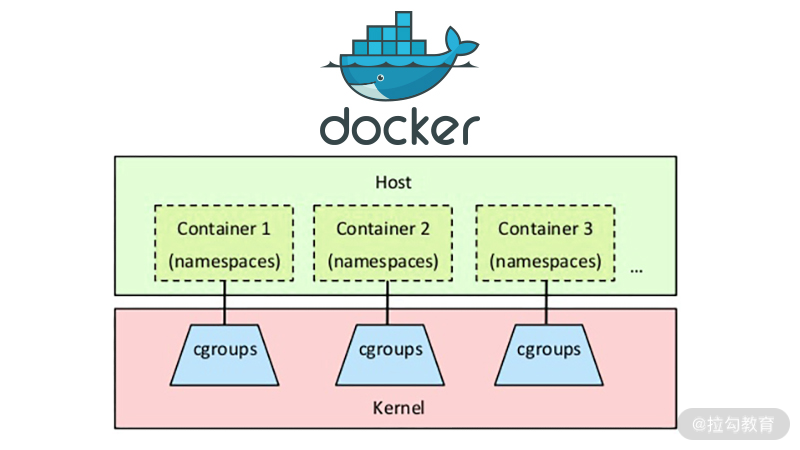

<!DOCTYPE html>

<html xmlns="http://www.w3.org/1999/xhtml">
<head>
<head>
<meta content="text/html; charset=utf-8" http-equiv="Content-Type"/>
<meta content="width=device-width, initial-scale=1, maximum-scale=1.0, user-scalable=no" name="viewport"/>
<meta content="zh-cn" http-equiv="content-language"/>
<meta content="19 容器化升级对服务有哪些影响？" name="description"/>
<link href="/static/favicon.png" rel="icon"/>
<title>19 容器化升级对服务有哪些影响？ </title>
<link href="/static/index.css" rel="stylesheet"/>
<link href="/static/highlight.min.css" rel="stylesheet"/>

<meta content="Hexo 4.2.0" name="generator"/>

</head>
<body>

<a href="/">

技术文章摘抄
</a>

<ul class="uncollapsible">
<li><a class="current-tab" href="/">首页</a></li>
<li><a href="../">上一级</a></li>
</ul>
<ul class="uncollapsible">
<li>
<a class="menu-item" href="/%e4%b8%93%e6%a0%8f/%e5%88%86%e5%b8%83%e5%bc%8f%e6%8a%80%e6%9c%af%e5%8e%9f%e7%90%86%e4%b8%8e%e5%ae%9e%e6%88%9845%e8%ae%b2-%e5%ae%8c/00%20%e5%bc%80%e7%af%87%e8%af%8d%ef%bc%9a%e6%90%ad%e5%bb%ba%e5%88%86%e5%b8%83%e5%bc%8f%e7%9f%a5%e8%af%86%e4%bd%93%e7%b3%bb%ef%bc%8c%e6%8c%91%e6%88%98%e9%ab%98%e8%96%aa%20Offer.md" id="00 开篇词：搭建分布式知识体系，挑战高薪 Offer.md">00 开篇词：搭建分布式知识体系，挑战高薪 Offer.md</a>
</li>
<li>
<a class="menu-item" href="/%e4%b8%93%e6%a0%8f/%e5%88%86%e5%b8%83%e5%bc%8f%e6%8a%80%e6%9c%af%e5%8e%9f%e7%90%86%e4%b8%8e%e5%ae%9e%e6%88%9845%e8%ae%b2-%e5%ae%8c/01%20%e5%a6%82%e4%bd%95%e8%af%81%e6%98%8e%e5%88%86%e5%b8%83%e5%bc%8f%e7%b3%bb%e7%bb%9f%e7%9a%84%20CAP%20%e7%90%86%e8%ae%ba%ef%bc%9f.md" id="01 如何证明分布式系统的 CAP 理论？.md">01 如何证明分布式系统的 CAP 理论？.md</a>
</li>
<li>
<a class="menu-item" href="/%e4%b8%93%e6%a0%8f/%e5%88%86%e5%b8%83%e5%bc%8f%e6%8a%80%e6%9c%af%e5%8e%9f%e7%90%86%e4%b8%8e%e5%ae%9e%e6%88%9845%e8%ae%b2-%e5%ae%8c/02%20%e4%b8%8d%e5%90%8c%e6%95%b0%e6%8d%ae%e4%b8%80%e8%87%b4%e6%80%a7%e6%a8%a1%e5%9e%8b%e6%9c%89%e5%93%aa%e4%ba%9b%e5%ba%94%e7%94%a8%ef%bc%9f.md" id="02 不同数据一致性模型有哪些应用？.md">02 不同数据一致性模型有哪些应用？.md</a>
</li>
<li>
<a class="menu-item" href="/%e4%b8%93%e6%a0%8f/%e5%88%86%e5%b8%83%e5%bc%8f%e6%8a%80%e6%9c%af%e5%8e%9f%e7%90%86%e4%b8%8e%e5%ae%9e%e6%88%9845%e8%ae%b2-%e5%ae%8c/03%20%e5%a6%82%e4%bd%95%e9%80%8f%e5%bd%bb%e7%90%86%e8%a7%a3%20Paxos%20%e7%ae%97%e6%b3%95%ef%bc%9f.md" id="03 如何透彻理解 Paxos 算法？.md">03 如何透彻理解 Paxos 算法？.md</a>
</li>
<li>
<a class="menu-item" href="/%e4%b8%93%e6%a0%8f/%e5%88%86%e5%b8%83%e5%bc%8f%e6%8a%80%e6%9c%af%e5%8e%9f%e7%90%86%e4%b8%8e%e5%ae%9e%e6%88%9845%e8%ae%b2-%e5%ae%8c/04%20ZooKeeper%20%e5%a6%82%e4%bd%95%e4%bf%9d%e8%af%81%e6%95%b0%e6%8d%ae%e4%b8%80%e8%87%b4%e6%80%a7%ef%bc%9f.md" id="04 ZooKeeper 如何保证数据一致性？.md">04 ZooKeeper 如何保证数据一致性？.md</a>
</li>
<li>
<a class="menu-item" href="/%e4%b8%93%e6%a0%8f/%e5%88%86%e5%b8%83%e5%bc%8f%e6%8a%80%e6%9c%af%e5%8e%9f%e7%90%86%e4%b8%8e%e5%ae%9e%e6%88%9845%e8%ae%b2-%e5%ae%8c/05%20%e5%85%b1%e8%af%86%e9%97%ae%e9%a2%98%ef%bc%9a%e5%8c%ba%e5%9d%97%e9%93%be%e5%a6%82%e4%bd%95%e7%a1%ae%e8%ae%a4%e8%ae%b0%e8%b4%a6%e6%9d%83%ef%bc%9f.md" id="05 共识问题：区块链如何确认记账权？.md">05 共识问题：区块链如何确认记账权？.md</a>
</li>
<li>
<a class="menu-item" href="/%e4%b8%93%e6%a0%8f/%e5%88%86%e5%b8%83%e5%bc%8f%e6%8a%80%e6%9c%af%e5%8e%9f%e7%90%86%e4%b8%8e%e5%ae%9e%e6%88%9845%e8%ae%b2-%e5%ae%8c/06%20%e5%a6%82%e4%bd%95%e5%87%86%e5%a4%87%e4%b8%80%e7%ba%bf%e4%ba%92%e8%81%94%e7%bd%91%e5%85%ac%e5%8f%b8%e9%9d%a2%e8%af%95%ef%bc%9f.md" id="06 如何准备一线互联网公司面试？.md">06 如何准备一线互联网公司面试？.md</a>
</li>
<li>
<a class="menu-item" href="/%e4%b8%93%e6%a0%8f/%e5%88%86%e5%b8%83%e5%bc%8f%e6%8a%80%e6%9c%af%e5%8e%9f%e7%90%86%e4%b8%8e%e5%ae%9e%e6%88%9845%e8%ae%b2-%e5%ae%8c/07%20%e5%88%86%e5%b8%83%e5%bc%8f%e4%ba%8b%e5%8a%a1%e6%9c%89%e5%93%aa%e4%ba%9b%e8%a7%a3%e5%86%b3%e6%96%b9%e6%a1%88%ef%bc%9f.md" id="07 分布式事务有哪些解决方案？.md">07 分布式事务有哪些解决方案？.md</a>
</li>
<li>
<a class="menu-item" href="/%e4%b8%93%e6%a0%8f/%e5%88%86%e5%b8%83%e5%bc%8f%e6%8a%80%e6%9c%af%e5%8e%9f%e7%90%86%e4%b8%8e%e5%ae%9e%e6%88%9845%e8%ae%b2-%e5%ae%8c/08%20%e5%af%b9%e6%af%94%e4%b8%a4%e9%98%b6%e6%ae%b5%e6%8f%90%e4%ba%a4%ef%bc%8c%e4%b8%89%e9%98%b6%e6%ae%b5%e5%8d%8f%e8%ae%ae%e6%9c%89%e5%93%aa%e4%ba%9b%e6%94%b9%e8%bf%9b%ef%bc%9f.md" id="08 对比两阶段提交，三阶段协议有哪些改进？.md">08 对比两阶段提交，三阶段协议有哪些改进？.md</a>
</li>
<li>
<a class="menu-item" href="/%e4%b8%93%e6%a0%8f/%e5%88%86%e5%b8%83%e5%bc%8f%e6%8a%80%e6%9c%af%e5%8e%9f%e7%90%86%e4%b8%8e%e5%ae%9e%e6%88%9845%e8%ae%b2-%e5%ae%8c/09%20MySQL%20%e6%95%b0%e6%8d%ae%e5%ba%93%e5%a6%82%e4%bd%95%e5%ae%9e%e7%8e%b0%20XA%20%e8%a7%84%e8%8c%83%ef%bc%9f.md" id="09 MySQL 数据库如何实现 XA 规范？.md">09 MySQL 数据库如何实现 XA 规范？.md</a>
</li>
<li>
<a class="menu-item" href="/%e4%b8%93%e6%a0%8f/%e5%88%86%e5%b8%83%e5%bc%8f%e6%8a%80%e6%9c%af%e5%8e%9f%e7%90%86%e4%b8%8e%e5%ae%9e%e6%88%9845%e8%ae%b2-%e5%ae%8c/10%20%e5%a6%82%e4%bd%95%e5%9c%a8%e4%b8%9a%e5%8a%a1%e4%b8%ad%e4%bd%93%e7%8e%b0%20TCC%20%e4%ba%8b%e5%8a%a1%e6%a8%a1%e5%9e%8b%ef%bc%9f.md" id="10 如何在业务中体现 TCC 事务模型？.md">10 如何在业务中体现 TCC 事务模型？.md</a>
</li>
<li>
<a class="menu-item" href="/%e4%b8%93%e6%a0%8f/%e5%88%86%e5%b8%83%e5%bc%8f%e6%8a%80%e6%9c%af%e5%8e%9f%e7%90%86%e4%b8%8e%e5%ae%9e%e6%88%9845%e8%ae%b2-%e5%ae%8c/11%20%e5%88%86%e5%b8%83%e5%bc%8f%e9%94%81%e6%9c%89%e5%93%aa%e4%ba%9b%e5%ba%94%e7%94%a8%e5%9c%ba%e6%99%af%e5%92%8c%e5%ae%9e%e7%8e%b0%ef%bc%9f.md" id="11 分布式锁有哪些应用场景和实现？.md">11 分布式锁有哪些应用场景和实现？.md</a>
</li>
<li>
<a class="menu-item" href="/%e4%b8%93%e6%a0%8f/%e5%88%86%e5%b8%83%e5%bc%8f%e6%8a%80%e6%9c%af%e5%8e%9f%e7%90%86%e4%b8%8e%e5%ae%9e%e6%88%9845%e8%ae%b2-%e5%ae%8c/12%20%e5%a6%82%e4%bd%95%e4%bd%bf%e7%94%a8%20Redis%20%e5%bf%ab%e9%80%9f%e5%ae%9e%e7%8e%b0%e5%88%86%e5%b8%83%e5%bc%8f%e9%94%81%ef%bc%9f.md" id="12 如何使用 Redis 快速实现分布式锁？.md">12 如何使用 Redis 快速实现分布式锁？.md</a>
</li>
<li>
<a class="menu-item" href="/%e4%b8%93%e6%a0%8f/%e5%88%86%e5%b8%83%e5%bc%8f%e6%8a%80%e6%9c%af%e5%8e%9f%e7%90%86%e4%b8%8e%e5%ae%9e%e6%88%9845%e8%ae%b2-%e5%ae%8c/13%20%e5%88%86%e5%b8%83%e5%bc%8f%e4%ba%8b%e5%8a%a1%e8%80%83%e7%82%b9%e6%a2%b3%e7%90%86%20+%20%e9%ab%98%e9%a2%91%e9%9d%a2%e8%af%95%e9%a2%98.md" id="13 分布式事务考点梳理 + 高频面试题.md">13 分布式事务考点梳理 + 高频面试题.md</a>
</li>
<li>
<a class="menu-item" href="/%e4%b8%93%e6%a0%8f/%e5%88%86%e5%b8%83%e5%bc%8f%e6%8a%80%e6%9c%af%e5%8e%9f%e7%90%86%e4%b8%8e%e5%ae%9e%e6%88%9845%e8%ae%b2-%e5%ae%8c/14%20%e5%a6%82%e4%bd%95%e7%90%86%e8%a7%a3%20RPC%20%e8%bf%9c%e7%a8%8b%e6%9c%8d%e5%8a%a1%e8%b0%83%e7%94%a8%ef%bc%9f.md" id="14 如何理解 RPC 远程服务调用？.md">14 如何理解 RPC 远程服务调用？.md</a>
</li>
<li>
<a class="menu-item" href="/%e4%b8%93%e6%a0%8f/%e5%88%86%e5%b8%83%e5%bc%8f%e6%8a%80%e6%9c%af%e5%8e%9f%e7%90%86%e4%b8%8e%e5%ae%9e%e6%88%9845%e8%ae%b2-%e5%ae%8c/15%20%e4%b8%ba%e4%bb%80%e4%b9%88%e5%be%ae%e6%9c%8d%e5%8a%a1%e9%9c%80%e8%a6%81%20API%20%e7%bd%91%e5%85%b3%ef%bc%9f.md" id="15 为什么微服务需要 API 网关？.md">15 为什么微服务需要 API 网关？.md</a>
</li>
<li>
<a class="menu-item" href="/%e4%b8%93%e6%a0%8f/%e5%88%86%e5%b8%83%e5%bc%8f%e6%8a%80%e6%9c%af%e5%8e%9f%e7%90%86%e4%b8%8e%e5%ae%9e%e6%88%9845%e8%ae%b2-%e5%ae%8c/16%20%e5%a6%82%e4%bd%95%e5%ae%9e%e7%8e%b0%e6%9c%8d%e5%8a%a1%e6%b3%a8%e5%86%8c%e4%b8%8e%e5%8f%91%e7%8e%b0%ef%bc%9f.md" id="16 如何实现服务注册与发现？.md">16 如何实现服务注册与发现？.md</a>
</li>
<li>
<a class="menu-item" href="/%e4%b8%93%e6%a0%8f/%e5%88%86%e5%b8%83%e5%bc%8f%e6%8a%80%e6%9c%af%e5%8e%9f%e7%90%86%e4%b8%8e%e5%ae%9e%e6%88%9845%e8%ae%b2-%e5%ae%8c/17%20%e5%a6%82%e4%bd%95%e5%ae%9e%e7%8e%b0%e5%88%86%e5%b8%83%e5%bc%8f%e8%b0%83%e7%94%a8%e8%b7%9f%e8%b8%aa%ef%bc%9f.md" id="17 如何实现分布式调用跟踪？.md">17 如何实现分布式调用跟踪？.md</a>
</li>
<li>
<a class="menu-item" href="/%e4%b8%93%e6%a0%8f/%e5%88%86%e5%b8%83%e5%bc%8f%e6%8a%80%e6%9c%af%e5%8e%9f%e7%90%86%e4%b8%8e%e5%ae%9e%e6%88%9845%e8%ae%b2-%e5%ae%8c/18%20%e5%88%86%e5%b8%83%e5%bc%8f%e4%b8%8b%e5%a6%82%e4%bd%95%e5%ae%9e%e7%8e%b0%e9%85%8d%e7%bd%ae%e7%ae%a1%e7%90%86%ef%bc%9f.md" id="18 分布式下如何实现配置管理？.md">18 分布式下如何实现配置管理？.md</a>
</li>
<li>
<a class="menu-item" href="/%e4%b8%93%e6%a0%8f/%e5%88%86%e5%b8%83%e5%bc%8f%e6%8a%80%e6%9c%af%e5%8e%9f%e7%90%86%e4%b8%8e%e5%ae%9e%e6%88%9845%e8%ae%b2-%e5%ae%8c/19%20%e5%ae%b9%e5%99%a8%e5%8c%96%e5%8d%87%e7%ba%a7%e5%af%b9%e6%9c%8d%e5%8a%a1%e6%9c%89%e5%93%aa%e4%ba%9b%e5%bd%b1%e5%93%8d%ef%bc%9f.md" id="19 容器化升级对服务有哪些影响？.md">19 容器化升级对服务有哪些影响？.md</a>
</li>
<li>
<a class="menu-item" href="/%e4%b8%93%e6%a0%8f/%e5%88%86%e5%b8%83%e5%bc%8f%e6%8a%80%e6%9c%af%e5%8e%9f%e7%90%86%e4%b8%8e%e5%ae%9e%e6%88%9845%e8%ae%b2-%e5%ae%8c/20%20ServiceMesh%ef%bc%9a%e6%9c%8d%e5%8a%a1%e7%bd%91%e6%a0%bc%e6%9c%89%e5%93%aa%e4%ba%9b%e5%ba%94%e7%94%a8%ef%bc%9f.md" id="20 ServiceMesh：服务网格有哪些应用？.md">20 ServiceMesh：服务网格有哪些应用？.md</a>
</li>
<li>
<a class="menu-item" href="/%e4%b8%93%e6%a0%8f/%e5%88%86%e5%b8%83%e5%bc%8f%e6%8a%80%e6%9c%af%e5%8e%9f%e7%90%86%e4%b8%8e%e5%ae%9e%e6%88%9845%e8%ae%b2-%e5%ae%8c/21%20Dubbo%20vs%20Spring%20Cloud%ef%bc%9a%e4%b8%a4%e5%a4%a7%e6%8a%80%e6%9c%af%e6%a0%88%e5%a6%82%e4%bd%95%e9%80%89%e5%9e%8b%ef%bc%9f.md" id="21 Dubbo vs Spring Cloud：两大技术栈如何选型？.md">21 Dubbo vs Spring Cloud：两大技术栈如何选型？.md</a>
</li>
<li>
<a class="menu-item" href="/%e4%b8%93%e6%a0%8f/%e5%88%86%e5%b8%83%e5%bc%8f%e6%8a%80%e6%9c%af%e5%8e%9f%e7%90%86%e4%b8%8e%e5%ae%9e%e6%88%9845%e8%ae%b2-%e5%ae%8c/22%20%e5%88%86%e5%b8%83%e5%bc%8f%e6%9c%8d%e5%8a%a1%e8%80%83%e7%82%b9%e6%a2%b3%e7%90%86%20+%20%e9%ab%98%e9%a2%91%e9%9d%a2%e8%af%95%e9%a2%98.md" id="22 分布式服务考点梳理 + 高频面试题.md">22 分布式服务考点梳理 + 高频面试题.md</a>
</li>
<li>
<a class="menu-item" href="/%e4%b8%93%e6%a0%8f/%e5%88%86%e5%b8%83%e5%bc%8f%e6%8a%80%e6%9c%af%e5%8e%9f%e7%90%86%e4%b8%8e%e5%ae%9e%e6%88%9845%e8%ae%b2-%e5%ae%8c/23%20%e8%af%bb%e5%86%99%e5%88%86%e7%a6%bb%e5%a6%82%e4%bd%95%e5%9c%a8%e4%b8%9a%e5%8a%a1%e4%b8%ad%e8%90%bd%e5%9c%b0%ef%bc%9f.md" id="23 读写分离如何在业务中落地？.md">23 读写分离如何在业务中落地？.md</a>
</li>
<li>
<a class="menu-item" href="/%e4%b8%93%e6%a0%8f/%e5%88%86%e5%b8%83%e5%bc%8f%e6%8a%80%e6%9c%af%e5%8e%9f%e7%90%86%e4%b8%8e%e5%ae%9e%e6%88%9845%e8%ae%b2-%e5%ae%8c/24%20%e4%b8%ba%e4%bb%80%e4%b9%88%e9%9c%80%e8%a6%81%e5%88%86%e5%ba%93%e5%88%86%e8%a1%a8%ef%bc%8c%e5%a6%82%e4%bd%95%e5%ae%9e%e7%8e%b0%ef%bc%9f.md" id="24 为什么需要分库分表，如何实现？.md">24 为什么需要分库分表，如何实现？.md</a>
</li>
<li>
<a class="menu-item" href="/%e4%b8%93%e6%a0%8f/%e5%88%86%e5%b8%83%e5%bc%8f%e6%8a%80%e6%9c%af%e5%8e%9f%e7%90%86%e4%b8%8e%e5%ae%9e%e6%88%9845%e8%ae%b2-%e5%ae%8c/25%20%e5%ad%98%e5%82%a8%e6%8b%86%e5%88%86%e5%90%8e%ef%bc%8c%e5%a6%82%e4%bd%95%e8%a7%a3%e5%86%b3%e5%94%af%e4%b8%80%e4%b8%bb%e9%94%ae%e9%97%ae%e9%a2%98%ef%bc%9f.md" id="25 存储拆分后，如何解决唯一主键问题？.md">25 存储拆分后，如何解决唯一主键问题？.md</a>
</li>
<li>
<a class="menu-item" href="/%e4%b8%93%e6%a0%8f/%e5%88%86%e5%b8%83%e5%bc%8f%e6%8a%80%e6%9c%af%e5%8e%9f%e7%90%86%e4%b8%8e%e5%ae%9e%e6%88%9845%e8%ae%b2-%e5%ae%8c/26%20%e5%88%86%e5%ba%93%e5%88%86%e8%a1%a8%e4%bb%a5%e5%90%8e%ef%bc%8c%e5%a6%82%e4%bd%95%e5%ae%9e%e7%8e%b0%e6%89%a9%e5%ae%b9%ef%bc%9f.md" id="26 分库分表以后，如何实现扩容？.md">26 分库分表以后，如何实现扩容？.md</a>
</li>
<li>
<a class="menu-item" href="/%e4%b8%93%e6%a0%8f/%e5%88%86%e5%b8%83%e5%bc%8f%e6%8a%80%e6%9c%af%e5%8e%9f%e7%90%86%e4%b8%8e%e5%ae%9e%e6%88%9845%e8%ae%b2-%e5%ae%8c/27%20NoSQL%20%e6%95%b0%e6%8d%ae%e5%ba%93%e6%9c%89%e5%93%aa%e4%ba%9b%e5%85%b8%e5%9e%8b%e5%ba%94%e7%94%a8%ef%bc%9f.md" id="27 NoSQL 数据库有哪些典型应用？.md">27 NoSQL 数据库有哪些典型应用？.md</a>
</li>
<li>
<a class="menu-item" href="/%e4%b8%93%e6%a0%8f/%e5%88%86%e5%b8%83%e5%bc%8f%e6%8a%80%e6%9c%af%e5%8e%9f%e7%90%86%e4%b8%8e%e5%ae%9e%e6%88%9845%e8%ae%b2-%e5%ae%8c/28%20ElasticSearch%20%e6%98%af%e5%a6%82%e4%bd%95%e5%bb%ba%e7%ab%8b%e7%b4%a2%e5%bc%95%e7%9a%84%ef%bc%9f.md" id="28 ElasticSearch 是如何建立索引的？.md">28 ElasticSearch 是如何建立索引的？.md</a>
</li>
<li>
<a class="menu-item" href="/%e4%b8%93%e6%a0%8f/%e5%88%86%e5%b8%83%e5%bc%8f%e6%8a%80%e6%9c%af%e5%8e%9f%e7%90%86%e4%b8%8e%e5%ae%9e%e6%88%9845%e8%ae%b2-%e5%ae%8c/29%20%e5%88%86%e5%b8%83%e5%bc%8f%e5%ad%98%e5%82%a8%e8%80%83%e7%82%b9%e6%a2%b3%e7%90%86%20+%20%e9%ab%98%e9%a2%91%e9%9d%a2%e8%af%95%e9%a2%98.md" id="29 分布式存储考点梳理 + 高频面试题.md">29 分布式存储考点梳理 + 高频面试题.md</a>
</li>
<li>
<a class="menu-item" href="/%e4%b8%93%e6%a0%8f/%e5%88%86%e5%b8%83%e5%bc%8f%e6%8a%80%e6%9c%af%e5%8e%9f%e7%90%86%e4%b8%8e%e5%ae%9e%e6%88%9845%e8%ae%b2-%e5%ae%8c/30%20%e6%b6%88%e6%81%af%e9%98%9f%e5%88%97%e6%9c%89%e5%93%aa%e4%ba%9b%e5%ba%94%e7%94%a8%e5%9c%ba%e6%99%af%ef%bc%9f.md" id="30 消息队列有哪些应用场景？.md">30 消息队列有哪些应用场景？.md</a>
</li>
<li>
<a class="menu-item" href="/%e4%b8%93%e6%a0%8f/%e5%88%86%e5%b8%83%e5%bc%8f%e6%8a%80%e6%9c%af%e5%8e%9f%e7%90%86%e4%b8%8e%e5%ae%9e%e6%88%9845%e8%ae%b2-%e5%ae%8c/31%20%e9%9b%86%e7%be%a4%e6%b6%88%e8%b4%b9%e5%92%8c%e5%b9%bf%e6%92%ad%e6%b6%88%e8%b4%b9%e6%9c%89%e4%bb%80%e4%b9%88%e5%8c%ba%e5%88%ab%ef%bc%9f.md" id="31 集群消费和广播消费有什么区别？.md">31 集群消费和广播消费有什么区别？.md</a>
</li>
<li>
<a class="menu-item" href="/%e4%b8%93%e6%a0%8f/%e5%88%86%e5%b8%83%e5%bc%8f%e6%8a%80%e6%9c%af%e5%8e%9f%e7%90%86%e4%b8%8e%e5%ae%9e%e6%88%9845%e8%ae%b2-%e5%ae%8c/32%20%e4%b8%9a%e5%8a%a1%e4%b8%8a%e9%9c%80%e8%a6%81%e9%a1%ba%e5%ba%8f%e6%b6%88%e8%b4%b9%ef%bc%8c%e6%80%8e%e4%b9%88%e4%bf%9d%e8%af%81%e6%97%b6%e5%ba%8f%e6%80%a7%ef%bc%9f.md" id="32 业务上需要顺序消费，怎么保证时序性？.md">32 业务上需要顺序消费，怎么保证时序性？.md</a>
</li>
<li>
<a class="menu-item" href="/%e4%b8%93%e6%a0%8f/%e5%88%86%e5%b8%83%e5%bc%8f%e6%8a%80%e6%9c%af%e5%8e%9f%e7%90%86%e4%b8%8e%e5%ae%9e%e6%88%9845%e8%ae%b2-%e5%ae%8c/33%20%e6%b6%88%e6%81%af%e5%b9%82%e7%ad%89%ef%bc%9a%e5%a6%82%e4%bd%95%e4%bf%9d%e8%af%81%e6%b6%88%e6%81%af%e4%b8%8d%e8%a2%ab%e9%87%8d%e5%a4%8d%e6%b6%88%e8%b4%b9%ef%bc%9f.md" id="33 消息幂等：如何保证消息不被重复消费？.md">33 消息幂等：如何保证消息不被重复消费？.md</a>
</li>
<li>
<a class="menu-item" href="/%e4%b8%93%e6%a0%8f/%e5%88%86%e5%b8%83%e5%bc%8f%e6%8a%80%e6%9c%af%e5%8e%9f%e7%90%86%e4%b8%8e%e5%ae%9e%e6%88%9845%e8%ae%b2-%e5%ae%8c/34%20%e9%ab%98%e5%8f%af%e7%94%a8%ef%bc%9a%e5%a6%82%e4%bd%95%e5%ae%9e%e7%8e%b0%e6%b6%88%e6%81%af%e9%98%9f%e5%88%97%e7%9a%84%20HA%ef%bc%9f.md" id="34 高可用：如何实现消息队列的 HA？.md">34 高可用：如何实现消息队列的 HA？.md</a>
</li>
<li>
<a class="menu-item" href="/%e4%b8%93%e6%a0%8f/%e5%88%86%e5%b8%83%e5%bc%8f%e6%8a%80%e6%9c%af%e5%8e%9f%e7%90%86%e4%b8%8e%e5%ae%9e%e6%88%9845%e8%ae%b2-%e5%ae%8c/35%20%e6%b6%88%e6%81%af%e9%98%9f%e5%88%97%e9%80%89%e5%9e%8b%ef%bc%9aKafka%20%e5%a6%82%e4%bd%95%e5%ae%9e%e7%8e%b0%e9%ab%98%e6%80%a7%e8%83%bd%ef%bc%9f.md" id="35 消息队列选型：Kafka 如何实现高性能？.md">35 消息队列选型：Kafka 如何实现高性能？.md</a>
</li>
<li>
<a class="menu-item" href="/%e4%b8%93%e6%a0%8f/%e5%88%86%e5%b8%83%e5%bc%8f%e6%8a%80%e6%9c%af%e5%8e%9f%e7%90%86%e4%b8%8e%e5%ae%9e%e6%88%9845%e8%ae%b2-%e5%ae%8c/36%20%e6%b6%88%e6%81%af%e9%98%9f%e5%88%97%e9%80%89%e5%9e%8b%ef%bc%9aRocketMQ%20%e9%80%82%e7%94%a8%e5%93%aa%e4%ba%9b%e5%9c%ba%e6%99%af%ef%bc%9f.md" id="36 消息队列选型：RocketMQ 适用哪些场景？.md">36 消息队列选型：RocketMQ 适用哪些场景？.md</a>
</li>
<li>
<a class="menu-item" href="/%e4%b8%93%e6%a0%8f/%e5%88%86%e5%b8%83%e5%bc%8f%e6%8a%80%e6%9c%af%e5%8e%9f%e7%90%86%e4%b8%8e%e5%ae%9e%e6%88%9845%e8%ae%b2-%e5%ae%8c/37%20%e6%b6%88%e6%81%af%e9%98%9f%e5%88%97%e8%80%83%e7%82%b9%e6%a2%b3%e7%90%86%20+%20%e9%ab%98%e9%a2%91%e9%9d%a2%e8%af%95%e9%a2%98.md" id="37 消息队列考点梳理 + 高频面试题.md">37 消息队列考点梳理 + 高频面试题.md</a>
</li>
<li>
<a class="menu-item" href="/%e4%b8%93%e6%a0%8f/%e5%88%86%e5%b8%83%e5%bc%8f%e6%8a%80%e6%9c%af%e5%8e%9f%e7%90%86%e4%b8%8e%e5%ae%9e%e6%88%9845%e8%ae%b2-%e5%ae%8c/38%20%e4%b8%8d%e6%ad%a2%e4%b8%9a%e5%8a%a1%e7%bc%93%e5%ad%98%ef%bc%8c%e5%88%86%e5%b8%83%e5%bc%8f%e7%b3%bb%e7%bb%9f%e4%b8%ad%e8%bf%98%e6%9c%89%e5%93%aa%e4%ba%9b%e7%bc%93%e5%ad%98%ef%bc%9f.md" id="38 不止业务缓存，分布式系统中还有哪些缓存？.md">38 不止业务缓存，分布式系统中还有哪些缓存？.md</a>
</li>
<li>
<a class="menu-item" href="/%e4%b8%93%e6%a0%8f/%e5%88%86%e5%b8%83%e5%bc%8f%e6%8a%80%e6%9c%af%e5%8e%9f%e7%90%86%e4%b8%8e%e5%ae%9e%e6%88%9845%e8%ae%b2-%e5%ae%8c/39%20%e5%a6%82%e4%bd%95%e9%81%bf%e5%85%8d%e7%bc%93%e5%ad%98%e7%a9%bf%e9%80%8f%e3%80%81%e7%bc%93%e5%ad%98%e5%87%bb%e7%a9%bf%e3%80%81%e7%bc%93%e5%ad%98%e9%9b%aa%e5%b4%a9%ef%bc%9f.md" id="39 如何避免缓存穿透、缓存击穿、缓存雪崩？.md">39 如何避免缓存穿透、缓存击穿、缓存雪崩？.md</a>
</li>
<li>
<a class="menu-item" href="/%e4%b8%93%e6%a0%8f/%e5%88%86%e5%b8%83%e5%bc%8f%e6%8a%80%e6%9c%af%e5%8e%9f%e7%90%86%e4%b8%8e%e5%ae%9e%e6%88%9845%e8%ae%b2-%e5%ae%8c/40%20%e7%bb%8f%e5%85%b8%e9%97%ae%e9%a2%98%ef%bc%9a%e5%85%88%e6%9b%b4%e6%96%b0%e6%95%b0%e6%8d%ae%e5%ba%93%ef%bc%8c%e8%bf%98%e6%98%af%e5%85%88%e6%9b%b4%e6%96%b0%e7%bc%93%e5%ad%98%ef%bc%9f.md" id="40 经典问题：先更新数据库，还是先更新缓存？.md">40 经典问题：先更新数据库，还是先更新缓存？.md</a>
</li>
<li>
<a class="menu-item" href="/%e4%b8%93%e6%a0%8f/%e5%88%86%e5%b8%83%e5%bc%8f%e6%8a%80%e6%9c%af%e5%8e%9f%e7%90%86%e4%b8%8e%e5%ae%9e%e6%88%9845%e8%ae%b2-%e5%ae%8c/41%20%e5%a4%b1%e6%95%88%e7%ad%96%e7%95%a5%ef%bc%9a%e7%bc%93%e5%ad%98%e8%bf%87%e6%9c%9f%e9%83%bd%e6%9c%89%e5%93%aa%e4%ba%9b%e7%ad%96%e7%95%a5%ef%bc%9f.md" id="41 失效策略：缓存过期都有哪些策略？.md">41 失效策略：缓存过期都有哪些策略？.md</a>
</li>
<li>
<a class="menu-item" href="/%e4%b8%93%e6%a0%8f/%e5%88%86%e5%b8%83%e5%bc%8f%e6%8a%80%e6%9c%af%e5%8e%9f%e7%90%86%e4%b8%8e%e5%ae%9e%e6%88%9845%e8%ae%b2-%e5%ae%8c/42%20%e8%b4%9f%e8%bd%bd%e5%9d%87%e8%a1%a1%ef%bc%9a%e4%b8%80%e8%87%b4%e6%80%a7%e5%93%88%e5%b8%8c%e8%a7%a3%e5%86%b3%e4%ba%86%e5%93%aa%e4%ba%9b%e9%97%ae%e9%a2%98%ef%bc%9f.md" id="42 负载均衡：一致性哈希解决了哪些问题？.md">42 负载均衡：一致性哈希解决了哪些问题？.md</a>
</li>
<li>
<a class="menu-item" href="/%e4%b8%93%e6%a0%8f/%e5%88%86%e5%b8%83%e5%bc%8f%e6%8a%80%e6%9c%af%e5%8e%9f%e7%90%86%e4%b8%8e%e5%ae%9e%e6%88%9845%e8%ae%b2-%e5%ae%8c/43%20%e7%bc%93%e5%ad%98%e9%ab%98%e5%8f%af%e7%94%a8%ef%bc%9a%e7%bc%93%e5%ad%98%e5%a6%82%e4%bd%95%e4%bf%9d%e8%af%81%e9%ab%98%e5%8f%af%e7%94%a8%ef%bc%9f.md" id="43 缓存高可用：缓存如何保证高可用？.md">43 缓存高可用：缓存如何保证高可用？.md</a>
</li>
<li>
<a class="menu-item" href="/%e4%b8%93%e6%a0%8f/%e5%88%86%e5%b8%83%e5%bc%8f%e6%8a%80%e6%9c%af%e5%8e%9f%e7%90%86%e4%b8%8e%e5%ae%9e%e6%88%9845%e8%ae%b2-%e5%ae%8c/44%20%e5%88%86%e5%b8%83%e5%bc%8f%e7%bc%93%e5%ad%98%e8%80%83%e7%82%b9%e6%a2%b3%e7%90%86%20+%20%e9%ab%98%e9%a2%91%e9%9d%a2%e8%af%95%e9%a2%98.md" id="44 分布式缓存考点梳理 + 高频面试题.md">44 分布式缓存考点梳理 + 高频面试题.md</a>
</li>
<li>
<a class="menu-item" href="/%e4%b8%93%e6%a0%8f/%e5%88%86%e5%b8%83%e5%bc%8f%e6%8a%80%e6%9c%af%e5%8e%9f%e7%90%86%e4%b8%8e%e5%ae%9e%e6%88%9845%e8%ae%b2-%e5%ae%8c/45%20%e4%bb%8e%e5%8f%8c%e5%8d%81%e4%b8%80%e7%9c%8b%e9%ab%98%e5%8f%af%e7%94%a8%e7%9a%84%e4%bf%9d%e9%9a%9c%e6%96%b9%e5%bc%8f.md" id="45 从双十一看高可用的保障方式.md">45 从双十一看高可用的保障方式.md</a>
</li>
<li>
<a class="menu-item" href="/%e4%b8%93%e6%a0%8f/%e5%88%86%e5%b8%83%e5%bc%8f%e6%8a%80%e6%9c%af%e5%8e%9f%e7%90%86%e4%b8%8e%e5%ae%9e%e6%88%9845%e8%ae%b2-%e5%ae%8c/46%20%e9%ab%98%e5%b9%b6%e5%8f%91%e5%9c%ba%e6%99%af%e4%b8%8b%e5%a6%82%e4%bd%95%e5%ae%9e%e7%8e%b0%e7%b3%bb%e7%bb%9f%e9%99%90%e6%b5%81%ef%bc%9f.md" id="46 高并发场景下如何实现系统限流？.md">46 高并发场景下如何实现系统限流？.md</a>
</li>
<li>
<a class="menu-item" href="/%e4%b8%93%e6%a0%8f/%e5%88%86%e5%b8%83%e5%bc%8f%e6%8a%80%e6%9c%af%e5%8e%9f%e7%90%86%e4%b8%8e%e5%ae%9e%e6%88%9845%e8%ae%b2-%e5%ae%8c/47%20%e9%99%8d%e7%ba%a7%e5%92%8c%e7%86%94%e6%96%ad%ef%bc%9a%e5%a6%82%e4%bd%95%e5%a2%9e%e5%bc%ba%e6%9c%8d%e5%8a%a1%e7%a8%b3%e5%ae%9a%e6%80%a7%ef%bc%9f.md" id="47 降级和熔断：如何增强服务稳定性？.md">47 降级和熔断：如何增强服务稳定性？.md</a>
</li>
<li>
<a class="menu-item" href="/%e4%b8%93%e6%a0%8f/%e5%88%86%e5%b8%83%e5%bc%8f%e6%8a%80%e6%9c%af%e5%8e%9f%e7%90%86%e4%b8%8e%e5%ae%9e%e6%88%9845%e8%ae%b2-%e5%ae%8c/48%20%e5%a6%82%e4%bd%95%e9%80%89%e6%8b%a9%e9%80%82%e5%90%88%e4%b8%9a%e5%8a%a1%e7%9a%84%e8%b4%9f%e8%bd%bd%e5%9d%87%e8%a1%a1%e7%ad%96%e7%95%a5%ef%bc%9f.md" id="48 如何选择适合业务的负载均衡策略？.md">48 如何选择适合业务的负载均衡策略？.md</a>
</li>
<li>
<a class="menu-item" href="/%e4%b8%93%e6%a0%8f/%e5%88%86%e5%b8%83%e5%bc%8f%e6%8a%80%e6%9c%af%e5%8e%9f%e7%90%86%e4%b8%8e%e5%ae%9e%e6%88%9845%e8%ae%b2-%e5%ae%8c/49%20%e7%ba%bf%e4%b8%8a%e6%9c%8d%e5%8a%a1%e6%9c%89%e5%93%aa%e4%ba%9b%e7%a8%b3%e5%ae%9a%e6%80%a7%e6%8c%87%e6%a0%87%ef%bc%9f.md" id="49 线上服务有哪些稳定性指标？.md">49 线上服务有哪些稳定性指标？.md</a>
</li>
<li>
<a class="menu-item" href="/%e4%b8%93%e6%a0%8f/%e5%88%86%e5%b8%83%e5%bc%8f%e6%8a%80%e6%9c%af%e5%8e%9f%e7%90%86%e4%b8%8e%e5%ae%9e%e6%88%9845%e8%ae%b2-%e5%ae%8c/50%20%e5%88%86%e5%b8%83%e5%bc%8f%e4%b8%8b%e6%9c%89%e5%93%aa%e4%ba%9b%e5%a5%bd%e7%94%a8%e7%9a%84%e7%9b%91%e6%8e%a7%e7%bb%84%e4%bb%b6%ef%bc%9f.md" id="50 分布式下有哪些好用的监控组件？.md">50 分布式下有哪些好用的监控组件？.md</a>
</li>
<li>
<a class="menu-item" href="/%e4%b8%93%e6%a0%8f/%e5%88%86%e5%b8%83%e5%bc%8f%e6%8a%80%e6%9c%af%e5%8e%9f%e7%90%86%e4%b8%8e%e5%ae%9e%e6%88%9845%e8%ae%b2-%e5%ae%8c/51%20%e5%88%86%e5%b8%83%e5%bc%8f%e4%b8%8b%e5%a6%82%e4%bd%95%e5%ae%9e%e7%8e%b0%e7%bb%9f%e4%b8%80%e6%97%a5%e5%bf%97%e7%b3%bb%e7%bb%9f%ef%bc%9f.md" id="51 分布式下如何实现统一日志系统？.md">51 分布式下如何实现统一日志系统？.md</a>
</li>
<li>
<a class="menu-item" href="/%e4%b8%93%e6%a0%8f/%e5%88%86%e5%b8%83%e5%bc%8f%e6%8a%80%e6%9c%af%e5%8e%9f%e7%90%86%e4%b8%8e%e5%ae%9e%e6%88%9845%e8%ae%b2-%e5%ae%8c/52%20%e5%88%86%e5%b8%83%e5%bc%8f%e8%b7%af%e6%bc%ab%e6%bc%ab%ef%bc%8c%e5%8e%9a%e7%a7%af%e8%96%84%e5%8f%91%e6%89%8d%e6%98%af%e7%8e%8b%e9%81%93.md" id="52 分布式路漫漫，厚积薄发才是王道.md">52 分布式路漫漫，厚积薄发才是王道.md</a>
</li>
<li><a href="/assets/捐赠.md">捐赠</a></li>
</ul>

<header class="navbar">
<section class="navbar-section">
<a onclick="open_sidebar()">
<i class="icon icon-menu"></i>
</a>
</section>
</header>

<h1 class="title" data-id="19 容器化升级对服务有哪些影响？" id="title">19 容器化升级对服务有哪些影响？</h1>

容器技术是近几年计算机领域的热门技术，特别是随着各种云服务的发展，越来越多的服务运行在以 Docker 为代表的容器之内。

这一课时我们就来分享一下容器化技术相关的知识。

<h3 id="容器化技术简介">容器化技术简介</h3>

相比传统虚拟化技术，容器技术是一种更加轻量级的操作系统隔离方案，可以将应用程序及其运行依赖环境打包到镜像中，通过容器引擎进行调度，并且提供进程隔离和资源限制的运行环境。

<h4 id="虚拟化技术">虚拟化技术</h4>

虚拟化技术通过 Hypervisor 实现虚拟机与底层硬件的解耦，虚拟机实现依赖 Hypervisor 层，Hypervisor 是整个虚拟机的核心所在。

Hypervisor 是什么呢 ? 也可以叫作虚拟机监视器 VMM（Virtual Machine Monitor），是一种运行在基础物理服务器和操作系统之间的中间软件层，可允许多个操作系统和应用共享硬件。

Hypervisor 虚拟机可以模拟机器硬件资源，协调虚拟机对硬件资源的访问，同时在各个虚拟机之间进行隔离。

每一个虚拟机都包括执行的应用，依赖的二进制和库资源，以及一个完整的 OS 操作系统，虚拟机运行以后，预分配给它的资源将全部被占用。

<h3 id="容器化技术">容器化技术</h3>

在容器技术中，最具代表性且应用最广泛的是 Docker 技术。

Docker 是一个开源的应用容器引擎，可以打包应用以及依赖包到一个可移植的容器中，然后发布到服务器上，Docker 容器基于镜像运行，可部署在物理机或虚拟机上，通过容器引擎与容器编排调度平台实现容器化应用的生命周期管理。

使用容器化技术有哪些好处呢？

Docker 不同于 VM，只包含应用程序及依赖库，处于一个隔离的环境中，这使得 Docker 更加轻量高效，启动容器只需几秒钟之内完成。由于 Docker 轻量、资源占用少，可以更方便地部署标准化应用，一台主机上可以同时运行上千个 Docker 容器。

<h4 id="两种虚拟化技术的对比">两种虚拟化技术的对比</h4>

虚拟机是一个运行在宿主机之上的完整操作系统，虚拟机运行自身操作系统会占用较多的 CPU、内存、硬盘资源等。

虚拟化技术为用户提供了一个完整的虚拟机，包括操作系统在内，容器化技术为应用程序提供了隔离的运行空间，容器之间共享同一个上层操作系统内核。虚拟化技术有更佳的隔离性和安全性，但是更新和升级困难，容器化具有快速扩展、灵活性和易用性等优势，但其隔离性较差、安全性相对较低。

实际部署一般是把两种技术结合起来，比如一个虚拟机中运行多个容器，这样既保证了较好的强隔离性和安全性，也有了快速扩展、灵活性和易用性。

<h3 id="容器化的原理">容器化的原理</h3>

容器技术的核心是如何实现容器内资源的限制，以及不同容器之间的隔离，这些是基于 Linux 的 Namespace 和 CGroups 技术。

<h4 id="namespace">Namespace</h4>
<blockquote>

Namespace 的目的是通过抽象方法使得 Namespace 中的进程看起来拥有它们自己的隔离的全局系统资源实例。
Linux 内核实现了六种 Namespace：Mount namespaces、UTS namespaces、IPC namespaces、PID namespaces、Network namespaces、User namespaces，功能分别为：隔离文件系统、定义 hostname 和 domainame、特定的进程间通信资源、独立进程 ID 结构、独立网络设备、用户和组 ID 空间。

</blockquote>

Docker 在创建一个容器的时候，会创建以上六种 Namespace 实例，然后将隔离的系统资源放入到相应的 Namespace 中，使得每个容器只能看到自己独立的系统资源。

<h4 id="cgroups">Cgroups</h4>

Docker 利用 CGroups 进行资源隔离。CGroups（Control Groups）也是 Linux 内核中提供的一种机制，它的功能主要是限制、记录、隔离进程所使用的物理资源，比如 CPU、Mermory、IO、Network 等。

简单来说，CGroups 在接收到调用时，会给指定的进程挂上钩子，这个钩子会在资源被使用的时候触发，触发时会根据资源的类别，比如 CPU、Mermory、IO 等，然后使用对应的方法进行限制。

CGroups 中有一个术语叫作 Subsystem 子系统，也就是一个资源调度控制器，CPU Subsystem 负责 CPU 的时间分配，Mermory Subsystem 负责 Mermory 的使用量等。Docker 启动一个容器后，会在 /sys/fs/cgroup 目录下生成带有此容器 ID 的文件夹，里面就是调用 CGroups 的配置文件，从而实现通过 CGroups 限制容器的资源使用率。

<h3 id="微服务如何适配容器化">微服务如何适配容器化</h3>

微服务的设计思想是对系统功能进行解耦，拆分为单独的服务，可以独立运行，而容器进一步对这种解耦性进行了扩展，应用容器技术可以对服务进行快速水平扩展，从而到达弹性部署业务的能力。在各种云服务概念兴起之后，微服务结合 Docker 部署，更加方便微服务架构运维部署落地。

微服务结合容器有很多优点，但是另一方面，也给服务的部署和应用提出了一些新的问题。

以 Java 服务为例，容器与虚拟机不同，其资源限制通过 CGroup 来实现，而容器内部进程如果不感知 CGroup 的限制，就进行内存、CPU 分配的话，则可能会导致资源冲突的问题。

Java 8 之前的版本无法跟 Docker 很好的配合，JVM 通过容器获取的可用内存和 CPU 数量并不是 Docker 允许使用的可用内存和 CPU 数量。

我们在开发中会应用一些线程池，通常会根据 CPU 核心数来配置，比如使用：

<pre><code>Runtime.getRuntime().availableProcessors()
</code></pre>

在 1.8 版本更早的实现，在容器内获取的是上层物理机或者虚拟机的 CPU 核心数，这就使得线程池配置不符合我们期望的设置。

另一个影响体现在 GC 中，JVM 垃圾对象回收对 Java 程序执行性能有一定的影响，默认的 JVM 使用公式“ParallelGCThreads = (ncpus &lt;= 8) ? ncpus : 3 + ((ncpus * 5) / 8)” 来计算并行 GC 的线程数，其中 ncpus 是 JVM 发现的系统 CPU 个数。如果 JVM 应用了错误的 CPU 核心数，会导致 JVM 启动过多的 GC 线程，导致 GC 性能下降，Java 服务的延时增加。

<h3 id="总结">总结</h3>

这一课时和你分享了容器技术的发展，以 Docker 为代表的容器化技术的实现原理，以及大规模容器化之下，微服务如何适配等问题。

本课时的内容以概念为主，如果你在工作中没有接触过容器化场景，可以到 Docker 官网学习入门指南、了解 Docker 命令，并动手实践一下 Docker 部署。

© 2019 - 2023 <a href="/cdn-cgi/l/email-protection#f29e9e9ecbc6c3c3c2c5b2959f939b9edc919d9f" target="_blank">Liangliang Lee</a>.
                    Powered by <a href="https://github.com/gin-gonic/gin" target="_blank">gin</a> and <a href="https://github.com/kaiiiz/hexo-theme-book" target="_blank">hexo-theme-book</a>.

</body>

</head></html>