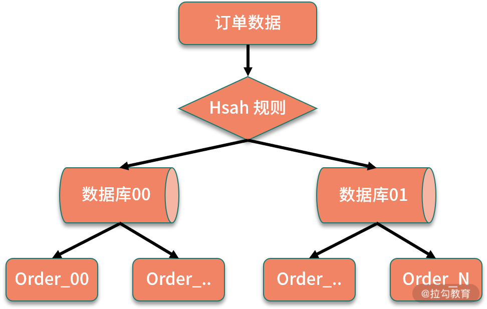
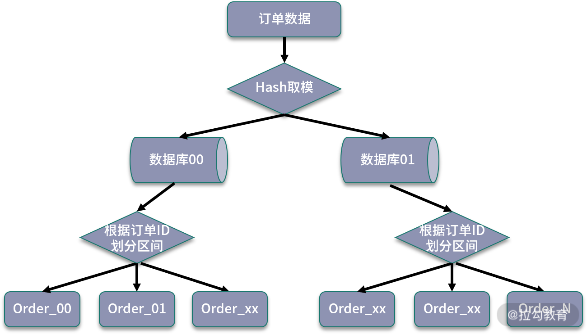

<!DOCTYPE html>

<html xmlns="http://www.w3.org/1999/xhtml">
<head>
<head>
<meta content="text/html; charset=utf-8" http-equiv="Content-Type"/>
<meta content="width=device-width, initial-scale=1, maximum-scale=1.0, user-scalable=no" name="viewport"/>
<meta content="zh-cn" http-equiv="content-language"/>
<meta content="26 分库分表以后，如何实现扩容？" name="description"/>
<link href="/static/favicon.png" rel="icon"/>
<title>26 分库分表以后，如何实现扩容？ </title>
<link href="/static/index.css" rel="stylesheet"/>
<link href="/static/highlight.min.css" rel="stylesheet"/>

<meta content="Hexo 4.2.0" name="generator"/>

</head>
<body>

<a href="/">

技术文章摘抄
</a>

<ul class="uncollapsible">
<li><a class="current-tab" href="/">首页</a></li>
<li><a href="../">上一级</a></li>
</ul>
<ul class="uncollapsible">
<li>
<a class="menu-item" href="/%e4%b8%93%e6%a0%8f/%e5%88%86%e5%b8%83%e5%bc%8f%e6%8a%80%e6%9c%af%e5%8e%9f%e7%90%86%e4%b8%8e%e5%ae%9e%e6%88%9845%e8%ae%b2-%e5%ae%8c/00%20%e5%bc%80%e7%af%87%e8%af%8d%ef%bc%9a%e6%90%ad%e5%bb%ba%e5%88%86%e5%b8%83%e5%bc%8f%e7%9f%a5%e8%af%86%e4%bd%93%e7%b3%bb%ef%bc%8c%e6%8c%91%e6%88%98%e9%ab%98%e8%96%aa%20Offer.md" id="00 开篇词：搭建分布式知识体系，挑战高薪 Offer.md">00 开篇词：搭建分布式知识体系，挑战高薪 Offer.md</a>
</li>
<li>
<a class="menu-item" href="/%e4%b8%93%e6%a0%8f/%e5%88%86%e5%b8%83%e5%bc%8f%e6%8a%80%e6%9c%af%e5%8e%9f%e7%90%86%e4%b8%8e%e5%ae%9e%e6%88%9845%e8%ae%b2-%e5%ae%8c/01%20%e5%a6%82%e4%bd%95%e8%af%81%e6%98%8e%e5%88%86%e5%b8%83%e5%bc%8f%e7%b3%bb%e7%bb%9f%e7%9a%84%20CAP%20%e7%90%86%e8%ae%ba%ef%bc%9f.md" id="01 如何证明分布式系统的 CAP 理论？.md">01 如何证明分布式系统的 CAP 理论？.md</a>
</li>
<li>
<a class="menu-item" href="/%e4%b8%93%e6%a0%8f/%e5%88%86%e5%b8%83%e5%bc%8f%e6%8a%80%e6%9c%af%e5%8e%9f%e7%90%86%e4%b8%8e%e5%ae%9e%e6%88%9845%e8%ae%b2-%e5%ae%8c/02%20%e4%b8%8d%e5%90%8c%e6%95%b0%e6%8d%ae%e4%b8%80%e8%87%b4%e6%80%a7%e6%a8%a1%e5%9e%8b%e6%9c%89%e5%93%aa%e4%ba%9b%e5%ba%94%e7%94%a8%ef%bc%9f.md" id="02 不同数据一致性模型有哪些应用？.md">02 不同数据一致性模型有哪些应用？.md</a>
</li>
<li>
<a class="menu-item" href="/%e4%b8%93%e6%a0%8f/%e5%88%86%e5%b8%83%e5%bc%8f%e6%8a%80%e6%9c%af%e5%8e%9f%e7%90%86%e4%b8%8e%e5%ae%9e%e6%88%9845%e8%ae%b2-%e5%ae%8c/03%20%e5%a6%82%e4%bd%95%e9%80%8f%e5%bd%bb%e7%90%86%e8%a7%a3%20Paxos%20%e7%ae%97%e6%b3%95%ef%bc%9f.md" id="03 如何透彻理解 Paxos 算法？.md">03 如何透彻理解 Paxos 算法？.md</a>
</li>
<li>
<a class="menu-item" href="/%e4%b8%93%e6%a0%8f/%e5%88%86%e5%b8%83%e5%bc%8f%e6%8a%80%e6%9c%af%e5%8e%9f%e7%90%86%e4%b8%8e%e5%ae%9e%e6%88%9845%e8%ae%b2-%e5%ae%8c/04%20ZooKeeper%20%e5%a6%82%e4%bd%95%e4%bf%9d%e8%af%81%e6%95%b0%e6%8d%ae%e4%b8%80%e8%87%b4%e6%80%a7%ef%bc%9f.md" id="04 ZooKeeper 如何保证数据一致性？.md">04 ZooKeeper 如何保证数据一致性？.md</a>
</li>
<li>
<a class="menu-item" href="/%e4%b8%93%e6%a0%8f/%e5%88%86%e5%b8%83%e5%bc%8f%e6%8a%80%e6%9c%af%e5%8e%9f%e7%90%86%e4%b8%8e%e5%ae%9e%e6%88%9845%e8%ae%b2-%e5%ae%8c/05%20%e5%85%b1%e8%af%86%e9%97%ae%e9%a2%98%ef%bc%9a%e5%8c%ba%e5%9d%97%e9%93%be%e5%a6%82%e4%bd%95%e7%a1%ae%e8%ae%a4%e8%ae%b0%e8%b4%a6%e6%9d%83%ef%bc%9f.md" id="05 共识问题：区块链如何确认记账权？.md">05 共识问题：区块链如何确认记账权？.md</a>
</li>
<li>
<a class="menu-item" href="/%e4%b8%93%e6%a0%8f/%e5%88%86%e5%b8%83%e5%bc%8f%e6%8a%80%e6%9c%af%e5%8e%9f%e7%90%86%e4%b8%8e%e5%ae%9e%e6%88%9845%e8%ae%b2-%e5%ae%8c/06%20%e5%a6%82%e4%bd%95%e5%87%86%e5%a4%87%e4%b8%80%e7%ba%bf%e4%ba%92%e8%81%94%e7%bd%91%e5%85%ac%e5%8f%b8%e9%9d%a2%e8%af%95%ef%bc%9f.md" id="06 如何准备一线互联网公司面试？.md">06 如何准备一线互联网公司面试？.md</a>
</li>
<li>
<a class="menu-item" href="/%e4%b8%93%e6%a0%8f/%e5%88%86%e5%b8%83%e5%bc%8f%e6%8a%80%e6%9c%af%e5%8e%9f%e7%90%86%e4%b8%8e%e5%ae%9e%e6%88%9845%e8%ae%b2-%e5%ae%8c/07%20%e5%88%86%e5%b8%83%e5%bc%8f%e4%ba%8b%e5%8a%a1%e6%9c%89%e5%93%aa%e4%ba%9b%e8%a7%a3%e5%86%b3%e6%96%b9%e6%a1%88%ef%bc%9f.md" id="07 分布式事务有哪些解决方案？.md">07 分布式事务有哪些解决方案？.md</a>
</li>
<li>
<a class="menu-item" href="/%e4%b8%93%e6%a0%8f/%e5%88%86%e5%b8%83%e5%bc%8f%e6%8a%80%e6%9c%af%e5%8e%9f%e7%90%86%e4%b8%8e%e5%ae%9e%e6%88%9845%e8%ae%b2-%e5%ae%8c/08%20%e5%af%b9%e6%af%94%e4%b8%a4%e9%98%b6%e6%ae%b5%e6%8f%90%e4%ba%a4%ef%bc%8c%e4%b8%89%e9%98%b6%e6%ae%b5%e5%8d%8f%e8%ae%ae%e6%9c%89%e5%93%aa%e4%ba%9b%e6%94%b9%e8%bf%9b%ef%bc%9f.md" id="08 对比两阶段提交，三阶段协议有哪些改进？.md">08 对比两阶段提交，三阶段协议有哪些改进？.md</a>
</li>
<li>
<a class="menu-item" href="/%e4%b8%93%e6%a0%8f/%e5%88%86%e5%b8%83%e5%bc%8f%e6%8a%80%e6%9c%af%e5%8e%9f%e7%90%86%e4%b8%8e%e5%ae%9e%e6%88%9845%e8%ae%b2-%e5%ae%8c/09%20MySQL%20%e6%95%b0%e6%8d%ae%e5%ba%93%e5%a6%82%e4%bd%95%e5%ae%9e%e7%8e%b0%20XA%20%e8%a7%84%e8%8c%83%ef%bc%9f.md" id="09 MySQL 数据库如何实现 XA 规范？.md">09 MySQL 数据库如何实现 XA 规范？.md</a>
</li>
<li>
<a class="menu-item" href="/%e4%b8%93%e6%a0%8f/%e5%88%86%e5%b8%83%e5%bc%8f%e6%8a%80%e6%9c%af%e5%8e%9f%e7%90%86%e4%b8%8e%e5%ae%9e%e6%88%9845%e8%ae%b2-%e5%ae%8c/10%20%e5%a6%82%e4%bd%95%e5%9c%a8%e4%b8%9a%e5%8a%a1%e4%b8%ad%e4%bd%93%e7%8e%b0%20TCC%20%e4%ba%8b%e5%8a%a1%e6%a8%a1%e5%9e%8b%ef%bc%9f.md" id="10 如何在业务中体现 TCC 事务模型？.md">10 如何在业务中体现 TCC 事务模型？.md</a>
</li>
<li>
<a class="menu-item" href="/%e4%b8%93%e6%a0%8f/%e5%88%86%e5%b8%83%e5%bc%8f%e6%8a%80%e6%9c%af%e5%8e%9f%e7%90%86%e4%b8%8e%e5%ae%9e%e6%88%9845%e8%ae%b2-%e5%ae%8c/11%20%e5%88%86%e5%b8%83%e5%bc%8f%e9%94%81%e6%9c%89%e5%93%aa%e4%ba%9b%e5%ba%94%e7%94%a8%e5%9c%ba%e6%99%af%e5%92%8c%e5%ae%9e%e7%8e%b0%ef%bc%9f.md" id="11 分布式锁有哪些应用场景和实现？.md">11 分布式锁有哪些应用场景和实现？.md</a>
</li>
<li>
<a class="menu-item" href="/%e4%b8%93%e6%a0%8f/%e5%88%86%e5%b8%83%e5%bc%8f%e6%8a%80%e6%9c%af%e5%8e%9f%e7%90%86%e4%b8%8e%e5%ae%9e%e6%88%9845%e8%ae%b2-%e5%ae%8c/12%20%e5%a6%82%e4%bd%95%e4%bd%bf%e7%94%a8%20Redis%20%e5%bf%ab%e9%80%9f%e5%ae%9e%e7%8e%b0%e5%88%86%e5%b8%83%e5%bc%8f%e9%94%81%ef%bc%9f.md" id="12 如何使用 Redis 快速实现分布式锁？.md">12 如何使用 Redis 快速实现分布式锁？.md</a>
</li>
<li>
<a class="menu-item" href="/%e4%b8%93%e6%a0%8f/%e5%88%86%e5%b8%83%e5%bc%8f%e6%8a%80%e6%9c%af%e5%8e%9f%e7%90%86%e4%b8%8e%e5%ae%9e%e6%88%9845%e8%ae%b2-%e5%ae%8c/13%20%e5%88%86%e5%b8%83%e5%bc%8f%e4%ba%8b%e5%8a%a1%e8%80%83%e7%82%b9%e6%a2%b3%e7%90%86%20+%20%e9%ab%98%e9%a2%91%e9%9d%a2%e8%af%95%e9%a2%98.md" id="13 分布式事务考点梳理 + 高频面试题.md">13 分布式事务考点梳理 + 高频面试题.md</a>
</li>
<li>
<a class="menu-item" href="/%e4%b8%93%e6%a0%8f/%e5%88%86%e5%b8%83%e5%bc%8f%e6%8a%80%e6%9c%af%e5%8e%9f%e7%90%86%e4%b8%8e%e5%ae%9e%e6%88%9845%e8%ae%b2-%e5%ae%8c/14%20%e5%a6%82%e4%bd%95%e7%90%86%e8%a7%a3%20RPC%20%e8%bf%9c%e7%a8%8b%e6%9c%8d%e5%8a%a1%e8%b0%83%e7%94%a8%ef%bc%9f.md" id="14 如何理解 RPC 远程服务调用？.md">14 如何理解 RPC 远程服务调用？.md</a>
</li>
<li>
<a class="menu-item" href="/%e4%b8%93%e6%a0%8f/%e5%88%86%e5%b8%83%e5%bc%8f%e6%8a%80%e6%9c%af%e5%8e%9f%e7%90%86%e4%b8%8e%e5%ae%9e%e6%88%9845%e8%ae%b2-%e5%ae%8c/15%20%e4%b8%ba%e4%bb%80%e4%b9%88%e5%be%ae%e6%9c%8d%e5%8a%a1%e9%9c%80%e8%a6%81%20API%20%e7%bd%91%e5%85%b3%ef%bc%9f.md" id="15 为什么微服务需要 API 网关？.md">15 为什么微服务需要 API 网关？.md</a>
</li>
<li>
<a class="menu-item" href="/%e4%b8%93%e6%a0%8f/%e5%88%86%e5%b8%83%e5%bc%8f%e6%8a%80%e6%9c%af%e5%8e%9f%e7%90%86%e4%b8%8e%e5%ae%9e%e6%88%9845%e8%ae%b2-%e5%ae%8c/16%20%e5%a6%82%e4%bd%95%e5%ae%9e%e7%8e%b0%e6%9c%8d%e5%8a%a1%e6%b3%a8%e5%86%8c%e4%b8%8e%e5%8f%91%e7%8e%b0%ef%bc%9f.md" id="16 如何实现服务注册与发现？.md">16 如何实现服务注册与发现？.md</a>
</li>
<li>
<a class="menu-item" href="/%e4%b8%93%e6%a0%8f/%e5%88%86%e5%b8%83%e5%bc%8f%e6%8a%80%e6%9c%af%e5%8e%9f%e7%90%86%e4%b8%8e%e5%ae%9e%e6%88%9845%e8%ae%b2-%e5%ae%8c/17%20%e5%a6%82%e4%bd%95%e5%ae%9e%e7%8e%b0%e5%88%86%e5%b8%83%e5%bc%8f%e8%b0%83%e7%94%a8%e8%b7%9f%e8%b8%aa%ef%bc%9f.md" id="17 如何实现分布式调用跟踪？.md">17 如何实现分布式调用跟踪？.md</a>
</li>
<li>
<a class="menu-item" href="/%e4%b8%93%e6%a0%8f/%e5%88%86%e5%b8%83%e5%bc%8f%e6%8a%80%e6%9c%af%e5%8e%9f%e7%90%86%e4%b8%8e%e5%ae%9e%e6%88%9845%e8%ae%b2-%e5%ae%8c/18%20%e5%88%86%e5%b8%83%e5%bc%8f%e4%b8%8b%e5%a6%82%e4%bd%95%e5%ae%9e%e7%8e%b0%e9%85%8d%e7%bd%ae%e7%ae%a1%e7%90%86%ef%bc%9f.md" id="18 分布式下如何实现配置管理？.md">18 分布式下如何实现配置管理？.md</a>
</li>
<li>
<a class="menu-item" href="/%e4%b8%93%e6%a0%8f/%e5%88%86%e5%b8%83%e5%bc%8f%e6%8a%80%e6%9c%af%e5%8e%9f%e7%90%86%e4%b8%8e%e5%ae%9e%e6%88%9845%e8%ae%b2-%e5%ae%8c/19%20%e5%ae%b9%e5%99%a8%e5%8c%96%e5%8d%87%e7%ba%a7%e5%af%b9%e6%9c%8d%e5%8a%a1%e6%9c%89%e5%93%aa%e4%ba%9b%e5%bd%b1%e5%93%8d%ef%bc%9f.md" id="19 容器化升级对服务有哪些影响？.md">19 容器化升级对服务有哪些影响？.md</a>
</li>
<li>
<a class="menu-item" href="/%e4%b8%93%e6%a0%8f/%e5%88%86%e5%b8%83%e5%bc%8f%e6%8a%80%e6%9c%af%e5%8e%9f%e7%90%86%e4%b8%8e%e5%ae%9e%e6%88%9845%e8%ae%b2-%e5%ae%8c/20%20ServiceMesh%ef%bc%9a%e6%9c%8d%e5%8a%a1%e7%bd%91%e6%a0%bc%e6%9c%89%e5%93%aa%e4%ba%9b%e5%ba%94%e7%94%a8%ef%bc%9f.md" id="20 ServiceMesh：服务网格有哪些应用？.md">20 ServiceMesh：服务网格有哪些应用？.md</a>
</li>
<li>
<a class="menu-item" href="/%e4%b8%93%e6%a0%8f/%e5%88%86%e5%b8%83%e5%bc%8f%e6%8a%80%e6%9c%af%e5%8e%9f%e7%90%86%e4%b8%8e%e5%ae%9e%e6%88%9845%e8%ae%b2-%e5%ae%8c/21%20Dubbo%20vs%20Spring%20Cloud%ef%bc%9a%e4%b8%a4%e5%a4%a7%e6%8a%80%e6%9c%af%e6%a0%88%e5%a6%82%e4%bd%95%e9%80%89%e5%9e%8b%ef%bc%9f.md" id="21 Dubbo vs Spring Cloud：两大技术栈如何选型？.md">21 Dubbo vs Spring Cloud：两大技术栈如何选型？.md</a>
</li>
<li>
<a class="menu-item" href="/%e4%b8%93%e6%a0%8f/%e5%88%86%e5%b8%83%e5%bc%8f%e6%8a%80%e6%9c%af%e5%8e%9f%e7%90%86%e4%b8%8e%e5%ae%9e%e6%88%9845%e8%ae%b2-%e5%ae%8c/22%20%e5%88%86%e5%b8%83%e5%bc%8f%e6%9c%8d%e5%8a%a1%e8%80%83%e7%82%b9%e6%a2%b3%e7%90%86%20+%20%e9%ab%98%e9%a2%91%e9%9d%a2%e8%af%95%e9%a2%98.md" id="22 分布式服务考点梳理 + 高频面试题.md">22 分布式服务考点梳理 + 高频面试题.md</a>
</li>
<li>
<a class="menu-item" href="/%e4%b8%93%e6%a0%8f/%e5%88%86%e5%b8%83%e5%bc%8f%e6%8a%80%e6%9c%af%e5%8e%9f%e7%90%86%e4%b8%8e%e5%ae%9e%e6%88%9845%e8%ae%b2-%e5%ae%8c/23%20%e8%af%bb%e5%86%99%e5%88%86%e7%a6%bb%e5%a6%82%e4%bd%95%e5%9c%a8%e4%b8%9a%e5%8a%a1%e4%b8%ad%e8%90%bd%e5%9c%b0%ef%bc%9f.md" id="23 读写分离如何在业务中落地？.md">23 读写分离如何在业务中落地？.md</a>
</li>
<li>
<a class="menu-item" href="/%e4%b8%93%e6%a0%8f/%e5%88%86%e5%b8%83%e5%bc%8f%e6%8a%80%e6%9c%af%e5%8e%9f%e7%90%86%e4%b8%8e%e5%ae%9e%e6%88%9845%e8%ae%b2-%e5%ae%8c/24%20%e4%b8%ba%e4%bb%80%e4%b9%88%e9%9c%80%e8%a6%81%e5%88%86%e5%ba%93%e5%88%86%e8%a1%a8%ef%bc%8c%e5%a6%82%e4%bd%95%e5%ae%9e%e7%8e%b0%ef%bc%9f.md" id="24 为什么需要分库分表，如何实现？.md">24 为什么需要分库分表，如何实现？.md</a>
</li>
<li>
<a class="menu-item" href="/%e4%b8%93%e6%a0%8f/%e5%88%86%e5%b8%83%e5%bc%8f%e6%8a%80%e6%9c%af%e5%8e%9f%e7%90%86%e4%b8%8e%e5%ae%9e%e6%88%9845%e8%ae%b2-%e5%ae%8c/25%20%e5%ad%98%e5%82%a8%e6%8b%86%e5%88%86%e5%90%8e%ef%bc%8c%e5%a6%82%e4%bd%95%e8%a7%a3%e5%86%b3%e5%94%af%e4%b8%80%e4%b8%bb%e9%94%ae%e9%97%ae%e9%a2%98%ef%bc%9f.md" id="25 存储拆分后，如何解决唯一主键问题？.md">25 存储拆分后，如何解决唯一主键问题？.md</a>
</li>
<li>
<a class="menu-item" href="/%e4%b8%93%e6%a0%8f/%e5%88%86%e5%b8%83%e5%bc%8f%e6%8a%80%e6%9c%af%e5%8e%9f%e7%90%86%e4%b8%8e%e5%ae%9e%e6%88%9845%e8%ae%b2-%e5%ae%8c/26%20%e5%88%86%e5%ba%93%e5%88%86%e8%a1%a8%e4%bb%a5%e5%90%8e%ef%bc%8c%e5%a6%82%e4%bd%95%e5%ae%9e%e7%8e%b0%e6%89%a9%e5%ae%b9%ef%bc%9f.md" id="26 分库分表以后，如何实现扩容？.md">26 分库分表以后，如何实现扩容？.md</a>
</li>
<li>
<a class="menu-item" href="/%e4%b8%93%e6%a0%8f/%e5%88%86%e5%b8%83%e5%bc%8f%e6%8a%80%e6%9c%af%e5%8e%9f%e7%90%86%e4%b8%8e%e5%ae%9e%e6%88%9845%e8%ae%b2-%e5%ae%8c/27%20NoSQL%20%e6%95%b0%e6%8d%ae%e5%ba%93%e6%9c%89%e5%93%aa%e4%ba%9b%e5%85%b8%e5%9e%8b%e5%ba%94%e7%94%a8%ef%bc%9f.md" id="27 NoSQL 数据库有哪些典型应用？.md">27 NoSQL 数据库有哪些典型应用？.md</a>
</li>
<li>
<a class="menu-item" href="/%e4%b8%93%e6%a0%8f/%e5%88%86%e5%b8%83%e5%bc%8f%e6%8a%80%e6%9c%af%e5%8e%9f%e7%90%86%e4%b8%8e%e5%ae%9e%e6%88%9845%e8%ae%b2-%e5%ae%8c/28%20ElasticSearch%20%e6%98%af%e5%a6%82%e4%bd%95%e5%bb%ba%e7%ab%8b%e7%b4%a2%e5%bc%95%e7%9a%84%ef%bc%9f.md" id="28 ElasticSearch 是如何建立索引的？.md">28 ElasticSearch 是如何建立索引的？.md</a>
</li>
<li>
<a class="menu-item" href="/%e4%b8%93%e6%a0%8f/%e5%88%86%e5%b8%83%e5%bc%8f%e6%8a%80%e6%9c%af%e5%8e%9f%e7%90%86%e4%b8%8e%e5%ae%9e%e6%88%9845%e8%ae%b2-%e5%ae%8c/29%20%e5%88%86%e5%b8%83%e5%bc%8f%e5%ad%98%e5%82%a8%e8%80%83%e7%82%b9%e6%a2%b3%e7%90%86%20+%20%e9%ab%98%e9%a2%91%e9%9d%a2%e8%af%95%e9%a2%98.md" id="29 分布式存储考点梳理 + 高频面试题.md">29 分布式存储考点梳理 + 高频面试题.md</a>
</li>
<li>
<a class="menu-item" href="/%e4%b8%93%e6%a0%8f/%e5%88%86%e5%b8%83%e5%bc%8f%e6%8a%80%e6%9c%af%e5%8e%9f%e7%90%86%e4%b8%8e%e5%ae%9e%e6%88%9845%e8%ae%b2-%e5%ae%8c/30%20%e6%b6%88%e6%81%af%e9%98%9f%e5%88%97%e6%9c%89%e5%93%aa%e4%ba%9b%e5%ba%94%e7%94%a8%e5%9c%ba%e6%99%af%ef%bc%9f.md" id="30 消息队列有哪些应用场景？.md">30 消息队列有哪些应用场景？.md</a>
</li>
<li>
<a class="menu-item" href="/%e4%b8%93%e6%a0%8f/%e5%88%86%e5%b8%83%e5%bc%8f%e6%8a%80%e6%9c%af%e5%8e%9f%e7%90%86%e4%b8%8e%e5%ae%9e%e6%88%9845%e8%ae%b2-%e5%ae%8c/31%20%e9%9b%86%e7%be%a4%e6%b6%88%e8%b4%b9%e5%92%8c%e5%b9%bf%e6%92%ad%e6%b6%88%e8%b4%b9%e6%9c%89%e4%bb%80%e4%b9%88%e5%8c%ba%e5%88%ab%ef%bc%9f.md" id="31 集群消费和广播消费有什么区别？.md">31 集群消费和广播消费有什么区别？.md</a>
</li>
<li>
<a class="menu-item" href="/%e4%b8%93%e6%a0%8f/%e5%88%86%e5%b8%83%e5%bc%8f%e6%8a%80%e6%9c%af%e5%8e%9f%e7%90%86%e4%b8%8e%e5%ae%9e%e6%88%9845%e8%ae%b2-%e5%ae%8c/32%20%e4%b8%9a%e5%8a%a1%e4%b8%8a%e9%9c%80%e8%a6%81%e9%a1%ba%e5%ba%8f%e6%b6%88%e8%b4%b9%ef%bc%8c%e6%80%8e%e4%b9%88%e4%bf%9d%e8%af%81%e6%97%b6%e5%ba%8f%e6%80%a7%ef%bc%9f.md" id="32 业务上需要顺序消费，怎么保证时序性？.md">32 业务上需要顺序消费，怎么保证时序性？.md</a>
</li>
<li>
<a class="menu-item" href="/%e4%b8%93%e6%a0%8f/%e5%88%86%e5%b8%83%e5%bc%8f%e6%8a%80%e6%9c%af%e5%8e%9f%e7%90%86%e4%b8%8e%e5%ae%9e%e6%88%9845%e8%ae%b2-%e5%ae%8c/33%20%e6%b6%88%e6%81%af%e5%b9%82%e7%ad%89%ef%bc%9a%e5%a6%82%e4%bd%95%e4%bf%9d%e8%af%81%e6%b6%88%e6%81%af%e4%b8%8d%e8%a2%ab%e9%87%8d%e5%a4%8d%e6%b6%88%e8%b4%b9%ef%bc%9f.md" id="33 消息幂等：如何保证消息不被重复消费？.md">33 消息幂等：如何保证消息不被重复消费？.md</a>
</li>
<li>
<a class="menu-item" href="/%e4%b8%93%e6%a0%8f/%e5%88%86%e5%b8%83%e5%bc%8f%e6%8a%80%e6%9c%af%e5%8e%9f%e7%90%86%e4%b8%8e%e5%ae%9e%e6%88%9845%e8%ae%b2-%e5%ae%8c/34%20%e9%ab%98%e5%8f%af%e7%94%a8%ef%bc%9a%e5%a6%82%e4%bd%95%e5%ae%9e%e7%8e%b0%e6%b6%88%e6%81%af%e9%98%9f%e5%88%97%e7%9a%84%20HA%ef%bc%9f.md" id="34 高可用：如何实现消息队列的 HA？.md">34 高可用：如何实现消息队列的 HA？.md</a>
</li>
<li>
<a class="menu-item" href="/%e4%b8%93%e6%a0%8f/%e5%88%86%e5%b8%83%e5%bc%8f%e6%8a%80%e6%9c%af%e5%8e%9f%e7%90%86%e4%b8%8e%e5%ae%9e%e6%88%9845%e8%ae%b2-%e5%ae%8c/35%20%e6%b6%88%e6%81%af%e9%98%9f%e5%88%97%e9%80%89%e5%9e%8b%ef%bc%9aKafka%20%e5%a6%82%e4%bd%95%e5%ae%9e%e7%8e%b0%e9%ab%98%e6%80%a7%e8%83%bd%ef%bc%9f.md" id="35 消息队列选型：Kafka 如何实现高性能？.md">35 消息队列选型：Kafka 如何实现高性能？.md</a>
</li>
<li>
<a class="menu-item" href="/%e4%b8%93%e6%a0%8f/%e5%88%86%e5%b8%83%e5%bc%8f%e6%8a%80%e6%9c%af%e5%8e%9f%e7%90%86%e4%b8%8e%e5%ae%9e%e6%88%9845%e8%ae%b2-%e5%ae%8c/36%20%e6%b6%88%e6%81%af%e9%98%9f%e5%88%97%e9%80%89%e5%9e%8b%ef%bc%9aRocketMQ%20%e9%80%82%e7%94%a8%e5%93%aa%e4%ba%9b%e5%9c%ba%e6%99%af%ef%bc%9f.md" id="36 消息队列选型：RocketMQ 适用哪些场景？.md">36 消息队列选型：RocketMQ 适用哪些场景？.md</a>
</li>
<li>
<a class="menu-item" href="/%e4%b8%93%e6%a0%8f/%e5%88%86%e5%b8%83%e5%bc%8f%e6%8a%80%e6%9c%af%e5%8e%9f%e7%90%86%e4%b8%8e%e5%ae%9e%e6%88%9845%e8%ae%b2-%e5%ae%8c/37%20%e6%b6%88%e6%81%af%e9%98%9f%e5%88%97%e8%80%83%e7%82%b9%e6%a2%b3%e7%90%86%20+%20%e9%ab%98%e9%a2%91%e9%9d%a2%e8%af%95%e9%a2%98.md" id="37 消息队列考点梳理 + 高频面试题.md">37 消息队列考点梳理 + 高频面试题.md</a>
</li>
<li>
<a class="menu-item" href="/%e4%b8%93%e6%a0%8f/%e5%88%86%e5%b8%83%e5%bc%8f%e6%8a%80%e6%9c%af%e5%8e%9f%e7%90%86%e4%b8%8e%e5%ae%9e%e6%88%9845%e8%ae%b2-%e5%ae%8c/38%20%e4%b8%8d%e6%ad%a2%e4%b8%9a%e5%8a%a1%e7%bc%93%e5%ad%98%ef%bc%8c%e5%88%86%e5%b8%83%e5%bc%8f%e7%b3%bb%e7%bb%9f%e4%b8%ad%e8%bf%98%e6%9c%89%e5%93%aa%e4%ba%9b%e7%bc%93%e5%ad%98%ef%bc%9f.md" id="38 不止业务缓存，分布式系统中还有哪些缓存？.md">38 不止业务缓存，分布式系统中还有哪些缓存？.md</a>
</li>
<li>
<a class="menu-item" href="/%e4%b8%93%e6%a0%8f/%e5%88%86%e5%b8%83%e5%bc%8f%e6%8a%80%e6%9c%af%e5%8e%9f%e7%90%86%e4%b8%8e%e5%ae%9e%e6%88%9845%e8%ae%b2-%e5%ae%8c/39%20%e5%a6%82%e4%bd%95%e9%81%bf%e5%85%8d%e7%bc%93%e5%ad%98%e7%a9%bf%e9%80%8f%e3%80%81%e7%bc%93%e5%ad%98%e5%87%bb%e7%a9%bf%e3%80%81%e7%bc%93%e5%ad%98%e9%9b%aa%e5%b4%a9%ef%bc%9f.md" id="39 如何避免缓存穿透、缓存击穿、缓存雪崩？.md">39 如何避免缓存穿透、缓存击穿、缓存雪崩？.md</a>
</li>
<li>
<a class="menu-item" href="/%e4%b8%93%e6%a0%8f/%e5%88%86%e5%b8%83%e5%bc%8f%e6%8a%80%e6%9c%af%e5%8e%9f%e7%90%86%e4%b8%8e%e5%ae%9e%e6%88%9845%e8%ae%b2-%e5%ae%8c/40%20%e7%bb%8f%e5%85%b8%e9%97%ae%e9%a2%98%ef%bc%9a%e5%85%88%e6%9b%b4%e6%96%b0%e6%95%b0%e6%8d%ae%e5%ba%93%ef%bc%8c%e8%bf%98%e6%98%af%e5%85%88%e6%9b%b4%e6%96%b0%e7%bc%93%e5%ad%98%ef%bc%9f.md" id="40 经典问题：先更新数据库，还是先更新缓存？.md">40 经典问题：先更新数据库，还是先更新缓存？.md</a>
</li>
<li>
<a class="menu-item" href="/%e4%b8%93%e6%a0%8f/%e5%88%86%e5%b8%83%e5%bc%8f%e6%8a%80%e6%9c%af%e5%8e%9f%e7%90%86%e4%b8%8e%e5%ae%9e%e6%88%9845%e8%ae%b2-%e5%ae%8c/41%20%e5%a4%b1%e6%95%88%e7%ad%96%e7%95%a5%ef%bc%9a%e7%bc%93%e5%ad%98%e8%bf%87%e6%9c%9f%e9%83%bd%e6%9c%89%e5%93%aa%e4%ba%9b%e7%ad%96%e7%95%a5%ef%bc%9f.md" id="41 失效策略：缓存过期都有哪些策略？.md">41 失效策略：缓存过期都有哪些策略？.md</a>
</li>
<li>
<a class="menu-item" href="/%e4%b8%93%e6%a0%8f/%e5%88%86%e5%b8%83%e5%bc%8f%e6%8a%80%e6%9c%af%e5%8e%9f%e7%90%86%e4%b8%8e%e5%ae%9e%e6%88%9845%e8%ae%b2-%e5%ae%8c/42%20%e8%b4%9f%e8%bd%bd%e5%9d%87%e8%a1%a1%ef%bc%9a%e4%b8%80%e8%87%b4%e6%80%a7%e5%93%88%e5%b8%8c%e8%a7%a3%e5%86%b3%e4%ba%86%e5%93%aa%e4%ba%9b%e9%97%ae%e9%a2%98%ef%bc%9f.md" id="42 负载均衡：一致性哈希解决了哪些问题？.md">42 负载均衡：一致性哈希解决了哪些问题？.md</a>
</li>
<li>
<a class="menu-item" href="/%e4%b8%93%e6%a0%8f/%e5%88%86%e5%b8%83%e5%bc%8f%e6%8a%80%e6%9c%af%e5%8e%9f%e7%90%86%e4%b8%8e%e5%ae%9e%e6%88%9845%e8%ae%b2-%e5%ae%8c/43%20%e7%bc%93%e5%ad%98%e9%ab%98%e5%8f%af%e7%94%a8%ef%bc%9a%e7%bc%93%e5%ad%98%e5%a6%82%e4%bd%95%e4%bf%9d%e8%af%81%e9%ab%98%e5%8f%af%e7%94%a8%ef%bc%9f.md" id="43 缓存高可用：缓存如何保证高可用？.md">43 缓存高可用：缓存如何保证高可用？.md</a>
</li>
<li>
<a class="menu-item" href="/%e4%b8%93%e6%a0%8f/%e5%88%86%e5%b8%83%e5%bc%8f%e6%8a%80%e6%9c%af%e5%8e%9f%e7%90%86%e4%b8%8e%e5%ae%9e%e6%88%9845%e8%ae%b2-%e5%ae%8c/44%20%e5%88%86%e5%b8%83%e5%bc%8f%e7%bc%93%e5%ad%98%e8%80%83%e7%82%b9%e6%a2%b3%e7%90%86%20+%20%e9%ab%98%e9%a2%91%e9%9d%a2%e8%af%95%e9%a2%98.md" id="44 分布式缓存考点梳理 + 高频面试题.md">44 分布式缓存考点梳理 + 高频面试题.md</a>
</li>
<li>
<a class="menu-item" href="/%e4%b8%93%e6%a0%8f/%e5%88%86%e5%b8%83%e5%bc%8f%e6%8a%80%e6%9c%af%e5%8e%9f%e7%90%86%e4%b8%8e%e5%ae%9e%e6%88%9845%e8%ae%b2-%e5%ae%8c/45%20%e4%bb%8e%e5%8f%8c%e5%8d%81%e4%b8%80%e7%9c%8b%e9%ab%98%e5%8f%af%e7%94%a8%e7%9a%84%e4%bf%9d%e9%9a%9c%e6%96%b9%e5%bc%8f.md" id="45 从双十一看高可用的保障方式.md">45 从双十一看高可用的保障方式.md</a>
</li>
<li>
<a class="menu-item" href="/%e4%b8%93%e6%a0%8f/%e5%88%86%e5%b8%83%e5%bc%8f%e6%8a%80%e6%9c%af%e5%8e%9f%e7%90%86%e4%b8%8e%e5%ae%9e%e6%88%9845%e8%ae%b2-%e5%ae%8c/46%20%e9%ab%98%e5%b9%b6%e5%8f%91%e5%9c%ba%e6%99%af%e4%b8%8b%e5%a6%82%e4%bd%95%e5%ae%9e%e7%8e%b0%e7%b3%bb%e7%bb%9f%e9%99%90%e6%b5%81%ef%bc%9f.md" id="46 高并发场景下如何实现系统限流？.md">46 高并发场景下如何实现系统限流？.md</a>
</li>
<li>
<a class="menu-item" href="/%e4%b8%93%e6%a0%8f/%e5%88%86%e5%b8%83%e5%bc%8f%e6%8a%80%e6%9c%af%e5%8e%9f%e7%90%86%e4%b8%8e%e5%ae%9e%e6%88%9845%e8%ae%b2-%e5%ae%8c/47%20%e9%99%8d%e7%ba%a7%e5%92%8c%e7%86%94%e6%96%ad%ef%bc%9a%e5%a6%82%e4%bd%95%e5%a2%9e%e5%bc%ba%e6%9c%8d%e5%8a%a1%e7%a8%b3%e5%ae%9a%e6%80%a7%ef%bc%9f.md" id="47 降级和熔断：如何增强服务稳定性？.md">47 降级和熔断：如何增强服务稳定性？.md</a>
</li>
<li>
<a class="menu-item" href="/%e4%b8%93%e6%a0%8f/%e5%88%86%e5%b8%83%e5%bc%8f%e6%8a%80%e6%9c%af%e5%8e%9f%e7%90%86%e4%b8%8e%e5%ae%9e%e6%88%9845%e8%ae%b2-%e5%ae%8c/48%20%e5%a6%82%e4%bd%95%e9%80%89%e6%8b%a9%e9%80%82%e5%90%88%e4%b8%9a%e5%8a%a1%e7%9a%84%e8%b4%9f%e8%bd%bd%e5%9d%87%e8%a1%a1%e7%ad%96%e7%95%a5%ef%bc%9f.md" id="48 如何选择适合业务的负载均衡策略？.md">48 如何选择适合业务的负载均衡策略？.md</a>
</li>
<li>
<a class="menu-item" href="/%e4%b8%93%e6%a0%8f/%e5%88%86%e5%b8%83%e5%bc%8f%e6%8a%80%e6%9c%af%e5%8e%9f%e7%90%86%e4%b8%8e%e5%ae%9e%e6%88%9845%e8%ae%b2-%e5%ae%8c/49%20%e7%ba%bf%e4%b8%8a%e6%9c%8d%e5%8a%a1%e6%9c%89%e5%93%aa%e4%ba%9b%e7%a8%b3%e5%ae%9a%e6%80%a7%e6%8c%87%e6%a0%87%ef%bc%9f.md" id="49 线上服务有哪些稳定性指标？.md">49 线上服务有哪些稳定性指标？.md</a>
</li>
<li>
<a class="menu-item" href="/%e4%b8%93%e6%a0%8f/%e5%88%86%e5%b8%83%e5%bc%8f%e6%8a%80%e6%9c%af%e5%8e%9f%e7%90%86%e4%b8%8e%e5%ae%9e%e6%88%9845%e8%ae%b2-%e5%ae%8c/50%20%e5%88%86%e5%b8%83%e5%bc%8f%e4%b8%8b%e6%9c%89%e5%93%aa%e4%ba%9b%e5%a5%bd%e7%94%a8%e7%9a%84%e7%9b%91%e6%8e%a7%e7%bb%84%e4%bb%b6%ef%bc%9f.md" id="50 分布式下有哪些好用的监控组件？.md">50 分布式下有哪些好用的监控组件？.md</a>
</li>
<li>
<a class="menu-item" href="/%e4%b8%93%e6%a0%8f/%e5%88%86%e5%b8%83%e5%bc%8f%e6%8a%80%e6%9c%af%e5%8e%9f%e7%90%86%e4%b8%8e%e5%ae%9e%e6%88%9845%e8%ae%b2-%e5%ae%8c/51%20%e5%88%86%e5%b8%83%e5%bc%8f%e4%b8%8b%e5%a6%82%e4%bd%95%e5%ae%9e%e7%8e%b0%e7%bb%9f%e4%b8%80%e6%97%a5%e5%bf%97%e7%b3%bb%e7%bb%9f%ef%bc%9f.md" id="51 分布式下如何实现统一日志系统？.md">51 分布式下如何实现统一日志系统？.md</a>
</li>
<li>
<a class="menu-item" href="/%e4%b8%93%e6%a0%8f/%e5%88%86%e5%b8%83%e5%bc%8f%e6%8a%80%e6%9c%af%e5%8e%9f%e7%90%86%e4%b8%8e%e5%ae%9e%e6%88%9845%e8%ae%b2-%e5%ae%8c/52%20%e5%88%86%e5%b8%83%e5%bc%8f%e8%b7%af%e6%bc%ab%e6%bc%ab%ef%bc%8c%e5%8e%9a%e7%a7%af%e8%96%84%e5%8f%91%e6%89%8d%e6%98%af%e7%8e%8b%e9%81%93.md" id="52 分布式路漫漫，厚积薄发才是王道.md">52 分布式路漫漫，厚积薄发才是王道.md</a>
</li>
<li><a href="/assets/捐赠.md">捐赠</a></li>
</ul>

<header class="navbar">
<section class="navbar-section">
<a onclick="open_sidebar()">
<i class="icon icon-menu"></i>
</a>
</section>
</header>

<h1 class="title" data-id="26 分库分表以后，如何实现扩容？" id="title">26 分库分表以后，如何实现扩容？</h1>

在实际开发中，数据库的扩容和不同的分库分表规则直接相关，今天我们从系统设计的角度，抽象了一个项目开发中出现的业务场景，从数据库设计、路由规则，以及数据迁移方案的角度进行讨论。

<h3 id="从业务场景出发进行讨论">从业务场景出发进行讨论</h3>

假设这样一个业务场景，现在要设计电商网站的订单数据库模块，经过对业务增长的估算，预估三年后，数据规模可能达到 6000 万，每日订单数会超过 10 万。

首先选择<strong>存储实现</strong>，订单作为电商业务的核心数据，应该尽量避免数据丢失，并且对数据一致性有强要求，肯定是选择支持事务的关系型数据库，比如使用 MySQL 及 InnoDB 存储引擎。

然后是<strong>数据库的高可用</strong>，订单数据是典型读多写少的数据，不仅要面向消费者端的读请求，内部也有很多上下游关联的业务模块在调用，针对订单进行数据查询的调用量会非常大。基于这一点，我们在业务中配置基于主从复制的读写分离，并且设置多个从库，提高数据安全。

最后是<strong>数据规模</strong>，6000 万的数据量，显然超出了单表的承受范围，参考《阿里巴巴 Java 开发手册》中「单表行数超过 500 万行」进行分表的建议，此时需要考虑进行分库分表，那么如何设计路由规则和拆分方案呢？接下来会对此展开讨论。

<h3 id="路由规则与扩容方案">路由规则与扩容方案</h3>

现在我们考虑 3 种路由规则：对主键进行哈希取模、基于数据范围进行路由、结合哈希和数据范围的分库分表规则。

<h4 id="1-哈希取模的方式">1. 哈希取模的方式</h4>

哈希取模是分库分表中最常见的一种方案，也就是根据不同的业务主键输入，对数据库进行取模，得到插入数据的位置。

6000 万的数据规模，我们按照单表承载百万数量级来拆分，拆分成 64 张表，进一步可以把 64 张表拆分到两个数据库中，每个库中配置 32 张表。当新订单创建时，首先生成订单 ID，对数据库个数取模，计算对应访问的数据库；接下来对数据表取模，计算路由到的数据表，当处理查询操作时，也通过同样的规则处理，这样就实现了通过订单 ID 定位到具体数据表。

规则示意图</img>

通过哈希取模的方式进行路由，优点是数据拆分比较均匀，但缺点是不利于后面的扩容。假设我们的订单增长速度超出预估，数据规模很快达到了几亿的数量级，原先的数据表已经不满足性能要求，数据库需要继续进行拆分。

数据库拆分以后，订单库和表的数量都需要调整，路由规则也需要调整，为了适配新的分库分表规则，保证数据的读写正常，不可避免地要进行数据迁移，具体的操作，可以分为<strong>停机迁移</strong>和<strong>不停机迁移</strong>两种方式。

<ul>
<li>停机迁移</li>
</ul>

停机迁移的方式比较简单，比如我们在使用一些网站或者应用时，经常会收到某段时间内暂停服务的通知，一般是在这段时间内，完成数据迁移，将历史数据按照新的规则重新分配到新的存储中，然后切换服务。

<ul>
<li>不停机迁移</li>
</ul>

不停机迁移也就是常说的动态扩容，依赖业务上的双写操作实现，需要同时处理存量和增量数据，并且做好各种数据校验。

一般来说，具体的数据库扩容方式有基于原有存储增加节点，以及重新部署一套新的数据库两种策略，针对不同的扩容方式，需要不同的迁移方案和双写策略支持。

如果重新部署新的数据库存储，可以粗略地分为以下的步骤：

<ul>
<li>创建一套新的订单数据库；</li>
<li>在某个时间点上，将历史数据按照新的路由规则分配到新的数据库中；</li>
<li>在旧数据库的操作中开启双写，同时写入到两个数据库；</li>
<li>用新的读写服务逐步替代旧服务，同步进行数据不一致校验，最后完成全面切流。</li>
</ul>

这是一个非常简化的流程，实际开发中要处理的细节有很多，感兴趣的同学可以去了解下数据迁移的 ETL 等标准化流程。

<h4 id="2-基于数据范围进行拆分">2. 基于数据范围进行拆分</h4>

基于数据范围进行路由，通常是根据特定的字段进行划分不同区间，对订单表进行拆分中，如果基于数据范围路由，可以按照订单 ID 进行范围的划分。

同样是拆分成 64 张数据表，可以把订单 ID 在 3000万 以下的数据划分到第一个订单库，3000 万以上的数据划分到第二个订单库，在每个数据库中，继续按照每张表 100万 的范围进行划分。

规则示意图

可以看到，基于数据范围进行路由的规则，当进行扩容时，可以直接增加新的存储，将新生成的数据区间映射到新添加的存储节点中，不需要进行节点之间的调整，也不需要迁移历史数据。

但是这种方式的缺点就是数据访问不均匀。如果按照这种规则，另外一个数据库在很长一段时间内都得不到应用，导致数据节点负荷不均，在极端情况下，当前热点库可能出现性能瓶颈，无法发挥分库分表带来的性能优势。

<h4 id="3-结合数据范围和哈希取模">3. 结合数据范围和哈希取模</h4>

现在考虑，如果结合以上两种方式数据范围和哈希取模，那么是不是可以实现数据均匀分布，也可以更好地进行扩容？

我们设计这样的一个路由规则，首先对订单 ID 进行哈希取模，然后对取模后的数据再次进行范围分区。

订单数据库进一步拆分

可以看到，通过哈希取模结合数据区间的方式，可以比较好地平衡两种路由方案的优缺点。当数据写入时，首先通过一次取模，计算出一个数据库，然后使用订单 ID 的范围，进行二次计算，将数据分散到不同的数据表中。

这种方式避免了单纯基于数据范围可能出现的热点存储，并且在后期扩展时，可以直接增加对应的扩展表，避免了复杂的数据迁移工作。

上面我们通过一个业务场景设计，思考了分库分表下的几种路由规则和扩容方案，这是一个开放性问题，思路要比方案更重要，而实际业务也要比这个复杂得多，你可以结合项目实践，思考在你负责的模块中，是如何设计路由规则，以及可以如何进行数据扩容的。

<h3 id="总结">总结</h3>

这一课时从一个真实业务场景的设计出发，分享了分库分表不同路由规则的设计，对应的优缺点，以及对扩容方式的影响。

今天的问题如果出现在面试中，可以认为是一个典型的系统设计类问题，那么回答系统设计类问题，有哪些要注意的点呢？

首先，系统设计类问题出现在面试中，很重要的一方面是考察沟通，要和面试官确认整体的数据规模，输入和输出，明确系统设计的边界，比如数据规模不同，直接影响数据库表的设计方式。

其次，是找到主要问题，理解系统的瓶颈，然后就可以应用各种系统设计的技巧，进行各个业务层的设计。

© 2019 - 2023 <a href="/cdn-cgi/l/email-protection#ddb1b1b1e4e9ececedea9dbab0bcb4b1f3beb2b0" target="_blank">Liangliang Lee</a>.
                    Powered by <a href="https://github.com/gin-gonic/gin" target="_blank">gin</a> and <a href="https://github.com/kaiiiz/hexo-theme-book" target="_blank">hexo-theme-book</a>.

</body>

</head></html>