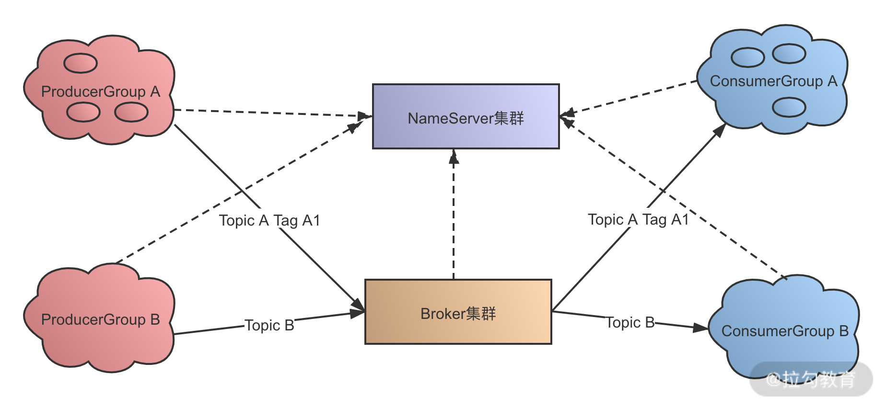
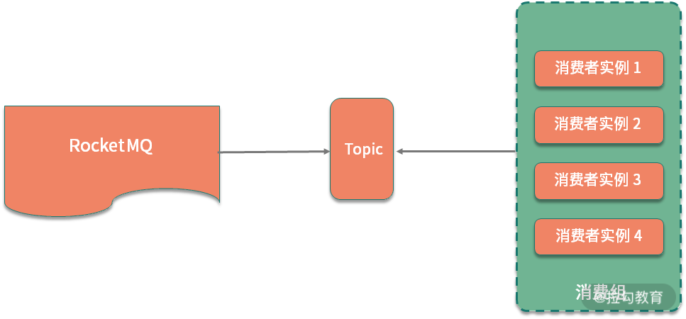

<!DOCTYPE html>

<html xmlns="http://www.w3.org/1999/xhtml">
<head>
<head>
<meta content="text/html; charset=utf-8" http-equiv="Content-Type"/>
<meta content="width=device-width, initial-scale=1, maximum-scale=1.0, user-scalable=no" name="viewport"/>
<meta content="zh-cn" http-equiv="content-language"/>
<meta content="31 集群消费和广播消费有什么区别？" name="description"/>
<link href="/static/favicon.png" rel="icon"/>
<title>31 集群消费和广播消费有什么区别？ </title>
<link href="/static/index.css" rel="stylesheet"/>
<link href="/static/highlight.min.css" rel="stylesheet"/>

<meta content="Hexo 4.2.0" name="generator"/>

</head>
<body>

<a href="/">

技术文章摘抄
</a>

<ul class="uncollapsible">
<li><a class="current-tab" href="/">首页</a></li>
<li><a href="../">上一级</a></li>
</ul>
<ul class="uncollapsible">
<li>
<a class="menu-item" href="/%e4%b8%93%e6%a0%8f/%e5%88%86%e5%b8%83%e5%bc%8f%e6%8a%80%e6%9c%af%e5%8e%9f%e7%90%86%e4%b8%8e%e5%ae%9e%e6%88%9845%e8%ae%b2-%e5%ae%8c/00%20%e5%bc%80%e7%af%87%e8%af%8d%ef%bc%9a%e6%90%ad%e5%bb%ba%e5%88%86%e5%b8%83%e5%bc%8f%e7%9f%a5%e8%af%86%e4%bd%93%e7%b3%bb%ef%bc%8c%e6%8c%91%e6%88%98%e9%ab%98%e8%96%aa%20Offer.md" id="00 开篇词：搭建分布式知识体系，挑战高薪 Offer.md">00 开篇词：搭建分布式知识体系，挑战高薪 Offer.md</a>
</li>
<li>
<a class="menu-item" href="/%e4%b8%93%e6%a0%8f/%e5%88%86%e5%b8%83%e5%bc%8f%e6%8a%80%e6%9c%af%e5%8e%9f%e7%90%86%e4%b8%8e%e5%ae%9e%e6%88%9845%e8%ae%b2-%e5%ae%8c/01%20%e5%a6%82%e4%bd%95%e8%af%81%e6%98%8e%e5%88%86%e5%b8%83%e5%bc%8f%e7%b3%bb%e7%bb%9f%e7%9a%84%20CAP%20%e7%90%86%e8%ae%ba%ef%bc%9f.md" id="01 如何证明分布式系统的 CAP 理论？.md">01 如何证明分布式系统的 CAP 理论？.md</a>
</li>
<li>
<a class="menu-item" href="/%e4%b8%93%e6%a0%8f/%e5%88%86%e5%b8%83%e5%bc%8f%e6%8a%80%e6%9c%af%e5%8e%9f%e7%90%86%e4%b8%8e%e5%ae%9e%e6%88%9845%e8%ae%b2-%e5%ae%8c/02%20%e4%b8%8d%e5%90%8c%e6%95%b0%e6%8d%ae%e4%b8%80%e8%87%b4%e6%80%a7%e6%a8%a1%e5%9e%8b%e6%9c%89%e5%93%aa%e4%ba%9b%e5%ba%94%e7%94%a8%ef%bc%9f.md" id="02 不同数据一致性模型有哪些应用？.md">02 不同数据一致性模型有哪些应用？.md</a>
</li>
<li>
<a class="menu-item" href="/%e4%b8%93%e6%a0%8f/%e5%88%86%e5%b8%83%e5%bc%8f%e6%8a%80%e6%9c%af%e5%8e%9f%e7%90%86%e4%b8%8e%e5%ae%9e%e6%88%9845%e8%ae%b2-%e5%ae%8c/03%20%e5%a6%82%e4%bd%95%e9%80%8f%e5%bd%bb%e7%90%86%e8%a7%a3%20Paxos%20%e7%ae%97%e6%b3%95%ef%bc%9f.md" id="03 如何透彻理解 Paxos 算法？.md">03 如何透彻理解 Paxos 算法？.md</a>
</li>
<li>
<a class="menu-item" href="/%e4%b8%93%e6%a0%8f/%e5%88%86%e5%b8%83%e5%bc%8f%e6%8a%80%e6%9c%af%e5%8e%9f%e7%90%86%e4%b8%8e%e5%ae%9e%e6%88%9845%e8%ae%b2-%e5%ae%8c/04%20ZooKeeper%20%e5%a6%82%e4%bd%95%e4%bf%9d%e8%af%81%e6%95%b0%e6%8d%ae%e4%b8%80%e8%87%b4%e6%80%a7%ef%bc%9f.md" id="04 ZooKeeper 如何保证数据一致性？.md">04 ZooKeeper 如何保证数据一致性？.md</a>
</li>
<li>
<a class="menu-item" href="/%e4%b8%93%e6%a0%8f/%e5%88%86%e5%b8%83%e5%bc%8f%e6%8a%80%e6%9c%af%e5%8e%9f%e7%90%86%e4%b8%8e%e5%ae%9e%e6%88%9845%e8%ae%b2-%e5%ae%8c/05%20%e5%85%b1%e8%af%86%e9%97%ae%e9%a2%98%ef%bc%9a%e5%8c%ba%e5%9d%97%e9%93%be%e5%a6%82%e4%bd%95%e7%a1%ae%e8%ae%a4%e8%ae%b0%e8%b4%a6%e6%9d%83%ef%bc%9f.md" id="05 共识问题：区块链如何确认记账权？.md">05 共识问题：区块链如何确认记账权？.md</a>
</li>
<li>
<a class="menu-item" href="/%e4%b8%93%e6%a0%8f/%e5%88%86%e5%b8%83%e5%bc%8f%e6%8a%80%e6%9c%af%e5%8e%9f%e7%90%86%e4%b8%8e%e5%ae%9e%e6%88%9845%e8%ae%b2-%e5%ae%8c/06%20%e5%a6%82%e4%bd%95%e5%87%86%e5%a4%87%e4%b8%80%e7%ba%bf%e4%ba%92%e8%81%94%e7%bd%91%e5%85%ac%e5%8f%b8%e9%9d%a2%e8%af%95%ef%bc%9f.md" id="06 如何准备一线互联网公司面试？.md">06 如何准备一线互联网公司面试？.md</a>
</li>
<li>
<a class="menu-item" href="/%e4%b8%93%e6%a0%8f/%e5%88%86%e5%b8%83%e5%bc%8f%e6%8a%80%e6%9c%af%e5%8e%9f%e7%90%86%e4%b8%8e%e5%ae%9e%e6%88%9845%e8%ae%b2-%e5%ae%8c/07%20%e5%88%86%e5%b8%83%e5%bc%8f%e4%ba%8b%e5%8a%a1%e6%9c%89%e5%93%aa%e4%ba%9b%e8%a7%a3%e5%86%b3%e6%96%b9%e6%a1%88%ef%bc%9f.md" id="07 分布式事务有哪些解决方案？.md">07 分布式事务有哪些解决方案？.md</a>
</li>
<li>
<a class="menu-item" href="/%e4%b8%93%e6%a0%8f/%e5%88%86%e5%b8%83%e5%bc%8f%e6%8a%80%e6%9c%af%e5%8e%9f%e7%90%86%e4%b8%8e%e5%ae%9e%e6%88%9845%e8%ae%b2-%e5%ae%8c/08%20%e5%af%b9%e6%af%94%e4%b8%a4%e9%98%b6%e6%ae%b5%e6%8f%90%e4%ba%a4%ef%bc%8c%e4%b8%89%e9%98%b6%e6%ae%b5%e5%8d%8f%e8%ae%ae%e6%9c%89%e5%93%aa%e4%ba%9b%e6%94%b9%e8%bf%9b%ef%bc%9f.md" id="08 对比两阶段提交，三阶段协议有哪些改进？.md">08 对比两阶段提交，三阶段协议有哪些改进？.md</a>
</li>
<li>
<a class="menu-item" href="/%e4%b8%93%e6%a0%8f/%e5%88%86%e5%b8%83%e5%bc%8f%e6%8a%80%e6%9c%af%e5%8e%9f%e7%90%86%e4%b8%8e%e5%ae%9e%e6%88%9845%e8%ae%b2-%e5%ae%8c/09%20MySQL%20%e6%95%b0%e6%8d%ae%e5%ba%93%e5%a6%82%e4%bd%95%e5%ae%9e%e7%8e%b0%20XA%20%e8%a7%84%e8%8c%83%ef%bc%9f.md" id="09 MySQL 数据库如何实现 XA 规范？.md">09 MySQL 数据库如何实现 XA 规范？.md</a>
</li>
<li>
<a class="menu-item" href="/%e4%b8%93%e6%a0%8f/%e5%88%86%e5%b8%83%e5%bc%8f%e6%8a%80%e6%9c%af%e5%8e%9f%e7%90%86%e4%b8%8e%e5%ae%9e%e6%88%9845%e8%ae%b2-%e5%ae%8c/10%20%e5%a6%82%e4%bd%95%e5%9c%a8%e4%b8%9a%e5%8a%a1%e4%b8%ad%e4%bd%93%e7%8e%b0%20TCC%20%e4%ba%8b%e5%8a%a1%e6%a8%a1%e5%9e%8b%ef%bc%9f.md" id="10 如何在业务中体现 TCC 事务模型？.md">10 如何在业务中体现 TCC 事务模型？.md</a>
</li>
<li>
<a class="menu-item" href="/%e4%b8%93%e6%a0%8f/%e5%88%86%e5%b8%83%e5%bc%8f%e6%8a%80%e6%9c%af%e5%8e%9f%e7%90%86%e4%b8%8e%e5%ae%9e%e6%88%9845%e8%ae%b2-%e5%ae%8c/11%20%e5%88%86%e5%b8%83%e5%bc%8f%e9%94%81%e6%9c%89%e5%93%aa%e4%ba%9b%e5%ba%94%e7%94%a8%e5%9c%ba%e6%99%af%e5%92%8c%e5%ae%9e%e7%8e%b0%ef%bc%9f.md" id="11 分布式锁有哪些应用场景和实现？.md">11 分布式锁有哪些应用场景和实现？.md</a>
</li>
<li>
<a class="menu-item" href="/%e4%b8%93%e6%a0%8f/%e5%88%86%e5%b8%83%e5%bc%8f%e6%8a%80%e6%9c%af%e5%8e%9f%e7%90%86%e4%b8%8e%e5%ae%9e%e6%88%9845%e8%ae%b2-%e5%ae%8c/12%20%e5%a6%82%e4%bd%95%e4%bd%bf%e7%94%a8%20Redis%20%e5%bf%ab%e9%80%9f%e5%ae%9e%e7%8e%b0%e5%88%86%e5%b8%83%e5%bc%8f%e9%94%81%ef%bc%9f.md" id="12 如何使用 Redis 快速实现分布式锁？.md">12 如何使用 Redis 快速实现分布式锁？.md</a>
</li>
<li>
<a class="menu-item" href="/%e4%b8%93%e6%a0%8f/%e5%88%86%e5%b8%83%e5%bc%8f%e6%8a%80%e6%9c%af%e5%8e%9f%e7%90%86%e4%b8%8e%e5%ae%9e%e6%88%9845%e8%ae%b2-%e5%ae%8c/13%20%e5%88%86%e5%b8%83%e5%bc%8f%e4%ba%8b%e5%8a%a1%e8%80%83%e7%82%b9%e6%a2%b3%e7%90%86%20+%20%e9%ab%98%e9%a2%91%e9%9d%a2%e8%af%95%e9%a2%98.md" id="13 分布式事务考点梳理 + 高频面试题.md">13 分布式事务考点梳理 + 高频面试题.md</a>
</li>
<li>
<a class="menu-item" href="/%e4%b8%93%e6%a0%8f/%e5%88%86%e5%b8%83%e5%bc%8f%e6%8a%80%e6%9c%af%e5%8e%9f%e7%90%86%e4%b8%8e%e5%ae%9e%e6%88%9845%e8%ae%b2-%e5%ae%8c/14%20%e5%a6%82%e4%bd%95%e7%90%86%e8%a7%a3%20RPC%20%e8%bf%9c%e7%a8%8b%e6%9c%8d%e5%8a%a1%e8%b0%83%e7%94%a8%ef%bc%9f.md" id="14 如何理解 RPC 远程服务调用？.md">14 如何理解 RPC 远程服务调用？.md</a>
</li>
<li>
<a class="menu-item" href="/%e4%b8%93%e6%a0%8f/%e5%88%86%e5%b8%83%e5%bc%8f%e6%8a%80%e6%9c%af%e5%8e%9f%e7%90%86%e4%b8%8e%e5%ae%9e%e6%88%9845%e8%ae%b2-%e5%ae%8c/15%20%e4%b8%ba%e4%bb%80%e4%b9%88%e5%be%ae%e6%9c%8d%e5%8a%a1%e9%9c%80%e8%a6%81%20API%20%e7%bd%91%e5%85%b3%ef%bc%9f.md" id="15 为什么微服务需要 API 网关？.md">15 为什么微服务需要 API 网关？.md</a>
</li>
<li>
<a class="menu-item" href="/%e4%b8%93%e6%a0%8f/%e5%88%86%e5%b8%83%e5%bc%8f%e6%8a%80%e6%9c%af%e5%8e%9f%e7%90%86%e4%b8%8e%e5%ae%9e%e6%88%9845%e8%ae%b2-%e5%ae%8c/16%20%e5%a6%82%e4%bd%95%e5%ae%9e%e7%8e%b0%e6%9c%8d%e5%8a%a1%e6%b3%a8%e5%86%8c%e4%b8%8e%e5%8f%91%e7%8e%b0%ef%bc%9f.md" id="16 如何实现服务注册与发现？.md">16 如何实现服务注册与发现？.md</a>
</li>
<li>
<a class="menu-item" href="/%e4%b8%93%e6%a0%8f/%e5%88%86%e5%b8%83%e5%bc%8f%e6%8a%80%e6%9c%af%e5%8e%9f%e7%90%86%e4%b8%8e%e5%ae%9e%e6%88%9845%e8%ae%b2-%e5%ae%8c/17%20%e5%a6%82%e4%bd%95%e5%ae%9e%e7%8e%b0%e5%88%86%e5%b8%83%e5%bc%8f%e8%b0%83%e7%94%a8%e8%b7%9f%e8%b8%aa%ef%bc%9f.md" id="17 如何实现分布式调用跟踪？.md">17 如何实现分布式调用跟踪？.md</a>
</li>
<li>
<a class="menu-item" href="/%e4%b8%93%e6%a0%8f/%e5%88%86%e5%b8%83%e5%bc%8f%e6%8a%80%e6%9c%af%e5%8e%9f%e7%90%86%e4%b8%8e%e5%ae%9e%e6%88%9845%e8%ae%b2-%e5%ae%8c/18%20%e5%88%86%e5%b8%83%e5%bc%8f%e4%b8%8b%e5%a6%82%e4%bd%95%e5%ae%9e%e7%8e%b0%e9%85%8d%e7%bd%ae%e7%ae%a1%e7%90%86%ef%bc%9f.md" id="18 分布式下如何实现配置管理？.md">18 分布式下如何实现配置管理？.md</a>
</li>
<li>
<a class="menu-item" href="/%e4%b8%93%e6%a0%8f/%e5%88%86%e5%b8%83%e5%bc%8f%e6%8a%80%e6%9c%af%e5%8e%9f%e7%90%86%e4%b8%8e%e5%ae%9e%e6%88%9845%e8%ae%b2-%e5%ae%8c/19%20%e5%ae%b9%e5%99%a8%e5%8c%96%e5%8d%87%e7%ba%a7%e5%af%b9%e6%9c%8d%e5%8a%a1%e6%9c%89%e5%93%aa%e4%ba%9b%e5%bd%b1%e5%93%8d%ef%bc%9f.md" id="19 容器化升级对服务有哪些影响？.md">19 容器化升级对服务有哪些影响？.md</a>
</li>
<li>
<a class="menu-item" href="/%e4%b8%93%e6%a0%8f/%e5%88%86%e5%b8%83%e5%bc%8f%e6%8a%80%e6%9c%af%e5%8e%9f%e7%90%86%e4%b8%8e%e5%ae%9e%e6%88%9845%e8%ae%b2-%e5%ae%8c/20%20ServiceMesh%ef%bc%9a%e6%9c%8d%e5%8a%a1%e7%bd%91%e6%a0%bc%e6%9c%89%e5%93%aa%e4%ba%9b%e5%ba%94%e7%94%a8%ef%bc%9f.md" id="20 ServiceMesh：服务网格有哪些应用？.md">20 ServiceMesh：服务网格有哪些应用？.md</a>
</li>
<li>
<a class="menu-item" href="/%e4%b8%93%e6%a0%8f/%e5%88%86%e5%b8%83%e5%bc%8f%e6%8a%80%e6%9c%af%e5%8e%9f%e7%90%86%e4%b8%8e%e5%ae%9e%e6%88%9845%e8%ae%b2-%e5%ae%8c/21%20Dubbo%20vs%20Spring%20Cloud%ef%bc%9a%e4%b8%a4%e5%a4%a7%e6%8a%80%e6%9c%af%e6%a0%88%e5%a6%82%e4%bd%95%e9%80%89%e5%9e%8b%ef%bc%9f.md" id="21 Dubbo vs Spring Cloud：两大技术栈如何选型？.md">21 Dubbo vs Spring Cloud：两大技术栈如何选型？.md</a>
</li>
<li>
<a class="menu-item" href="/%e4%b8%93%e6%a0%8f/%e5%88%86%e5%b8%83%e5%bc%8f%e6%8a%80%e6%9c%af%e5%8e%9f%e7%90%86%e4%b8%8e%e5%ae%9e%e6%88%9845%e8%ae%b2-%e5%ae%8c/22%20%e5%88%86%e5%b8%83%e5%bc%8f%e6%9c%8d%e5%8a%a1%e8%80%83%e7%82%b9%e6%a2%b3%e7%90%86%20+%20%e9%ab%98%e9%a2%91%e9%9d%a2%e8%af%95%e9%a2%98.md" id="22 分布式服务考点梳理 + 高频面试题.md">22 分布式服务考点梳理 + 高频面试题.md</a>
</li>
<li>
<a class="menu-item" href="/%e4%b8%93%e6%a0%8f/%e5%88%86%e5%b8%83%e5%bc%8f%e6%8a%80%e6%9c%af%e5%8e%9f%e7%90%86%e4%b8%8e%e5%ae%9e%e6%88%9845%e8%ae%b2-%e5%ae%8c/23%20%e8%af%bb%e5%86%99%e5%88%86%e7%a6%bb%e5%a6%82%e4%bd%95%e5%9c%a8%e4%b8%9a%e5%8a%a1%e4%b8%ad%e8%90%bd%e5%9c%b0%ef%bc%9f.md" id="23 读写分离如何在业务中落地？.md">23 读写分离如何在业务中落地？.md</a>
</li>
<li>
<a class="menu-item" href="/%e4%b8%93%e6%a0%8f/%e5%88%86%e5%b8%83%e5%bc%8f%e6%8a%80%e6%9c%af%e5%8e%9f%e7%90%86%e4%b8%8e%e5%ae%9e%e6%88%9845%e8%ae%b2-%e5%ae%8c/24%20%e4%b8%ba%e4%bb%80%e4%b9%88%e9%9c%80%e8%a6%81%e5%88%86%e5%ba%93%e5%88%86%e8%a1%a8%ef%bc%8c%e5%a6%82%e4%bd%95%e5%ae%9e%e7%8e%b0%ef%bc%9f.md" id="24 为什么需要分库分表，如何实现？.md">24 为什么需要分库分表，如何实现？.md</a>
</li>
<li>
<a class="menu-item" href="/%e4%b8%93%e6%a0%8f/%e5%88%86%e5%b8%83%e5%bc%8f%e6%8a%80%e6%9c%af%e5%8e%9f%e7%90%86%e4%b8%8e%e5%ae%9e%e6%88%9845%e8%ae%b2-%e5%ae%8c/25%20%e5%ad%98%e5%82%a8%e6%8b%86%e5%88%86%e5%90%8e%ef%bc%8c%e5%a6%82%e4%bd%95%e8%a7%a3%e5%86%b3%e5%94%af%e4%b8%80%e4%b8%bb%e9%94%ae%e9%97%ae%e9%a2%98%ef%bc%9f.md" id="25 存储拆分后，如何解决唯一主键问题？.md">25 存储拆分后，如何解决唯一主键问题？.md</a>
</li>
<li>
<a class="menu-item" href="/%e4%b8%93%e6%a0%8f/%e5%88%86%e5%b8%83%e5%bc%8f%e6%8a%80%e6%9c%af%e5%8e%9f%e7%90%86%e4%b8%8e%e5%ae%9e%e6%88%9845%e8%ae%b2-%e5%ae%8c/26%20%e5%88%86%e5%ba%93%e5%88%86%e8%a1%a8%e4%bb%a5%e5%90%8e%ef%bc%8c%e5%a6%82%e4%bd%95%e5%ae%9e%e7%8e%b0%e6%89%a9%e5%ae%b9%ef%bc%9f.md" id="26 分库分表以后，如何实现扩容？.md">26 分库分表以后，如何实现扩容？.md</a>
</li>
<li>
<a class="menu-item" href="/%e4%b8%93%e6%a0%8f/%e5%88%86%e5%b8%83%e5%bc%8f%e6%8a%80%e6%9c%af%e5%8e%9f%e7%90%86%e4%b8%8e%e5%ae%9e%e6%88%9845%e8%ae%b2-%e5%ae%8c/27%20NoSQL%20%e6%95%b0%e6%8d%ae%e5%ba%93%e6%9c%89%e5%93%aa%e4%ba%9b%e5%85%b8%e5%9e%8b%e5%ba%94%e7%94%a8%ef%bc%9f.md" id="27 NoSQL 数据库有哪些典型应用？.md">27 NoSQL 数据库有哪些典型应用？.md</a>
</li>
<li>
<a class="menu-item" href="/%e4%b8%93%e6%a0%8f/%e5%88%86%e5%b8%83%e5%bc%8f%e6%8a%80%e6%9c%af%e5%8e%9f%e7%90%86%e4%b8%8e%e5%ae%9e%e6%88%9845%e8%ae%b2-%e5%ae%8c/28%20ElasticSearch%20%e6%98%af%e5%a6%82%e4%bd%95%e5%bb%ba%e7%ab%8b%e7%b4%a2%e5%bc%95%e7%9a%84%ef%bc%9f.md" id="28 ElasticSearch 是如何建立索引的？.md">28 ElasticSearch 是如何建立索引的？.md</a>
</li>
<li>
<a class="menu-item" href="/%e4%b8%93%e6%a0%8f/%e5%88%86%e5%b8%83%e5%bc%8f%e6%8a%80%e6%9c%af%e5%8e%9f%e7%90%86%e4%b8%8e%e5%ae%9e%e6%88%9845%e8%ae%b2-%e5%ae%8c/29%20%e5%88%86%e5%b8%83%e5%bc%8f%e5%ad%98%e5%82%a8%e8%80%83%e7%82%b9%e6%a2%b3%e7%90%86%20+%20%e9%ab%98%e9%a2%91%e9%9d%a2%e8%af%95%e9%a2%98.md" id="29 分布式存储考点梳理 + 高频面试题.md">29 分布式存储考点梳理 + 高频面试题.md</a>
</li>
<li>
<a class="menu-item" href="/%e4%b8%93%e6%a0%8f/%e5%88%86%e5%b8%83%e5%bc%8f%e6%8a%80%e6%9c%af%e5%8e%9f%e7%90%86%e4%b8%8e%e5%ae%9e%e6%88%9845%e8%ae%b2-%e5%ae%8c/30%20%e6%b6%88%e6%81%af%e9%98%9f%e5%88%97%e6%9c%89%e5%93%aa%e4%ba%9b%e5%ba%94%e7%94%a8%e5%9c%ba%e6%99%af%ef%bc%9f.md" id="30 消息队列有哪些应用场景？.md">30 消息队列有哪些应用场景？.md</a>
</li>
<li>
<a class="menu-item" href="/%e4%b8%93%e6%a0%8f/%e5%88%86%e5%b8%83%e5%bc%8f%e6%8a%80%e6%9c%af%e5%8e%9f%e7%90%86%e4%b8%8e%e5%ae%9e%e6%88%9845%e8%ae%b2-%e5%ae%8c/31%20%e9%9b%86%e7%be%a4%e6%b6%88%e8%b4%b9%e5%92%8c%e5%b9%bf%e6%92%ad%e6%b6%88%e8%b4%b9%e6%9c%89%e4%bb%80%e4%b9%88%e5%8c%ba%e5%88%ab%ef%bc%9f.md" id="31 集群消费和广播消费有什么区别？.md">31 集群消费和广播消费有什么区别？.md</a>
</li>
<li>
<a class="menu-item" href="/%e4%b8%93%e6%a0%8f/%e5%88%86%e5%b8%83%e5%bc%8f%e6%8a%80%e6%9c%af%e5%8e%9f%e7%90%86%e4%b8%8e%e5%ae%9e%e6%88%9845%e8%ae%b2-%e5%ae%8c/32%20%e4%b8%9a%e5%8a%a1%e4%b8%8a%e9%9c%80%e8%a6%81%e9%a1%ba%e5%ba%8f%e6%b6%88%e8%b4%b9%ef%bc%8c%e6%80%8e%e4%b9%88%e4%bf%9d%e8%af%81%e6%97%b6%e5%ba%8f%e6%80%a7%ef%bc%9f.md" id="32 业务上需要顺序消费，怎么保证时序性？.md">32 业务上需要顺序消费，怎么保证时序性？.md</a>
</li>
<li>
<a class="menu-item" href="/%e4%b8%93%e6%a0%8f/%e5%88%86%e5%b8%83%e5%bc%8f%e6%8a%80%e6%9c%af%e5%8e%9f%e7%90%86%e4%b8%8e%e5%ae%9e%e6%88%9845%e8%ae%b2-%e5%ae%8c/33%20%e6%b6%88%e6%81%af%e5%b9%82%e7%ad%89%ef%bc%9a%e5%a6%82%e4%bd%95%e4%bf%9d%e8%af%81%e6%b6%88%e6%81%af%e4%b8%8d%e8%a2%ab%e9%87%8d%e5%a4%8d%e6%b6%88%e8%b4%b9%ef%bc%9f.md" id="33 消息幂等：如何保证消息不被重复消费？.md">33 消息幂等：如何保证消息不被重复消费？.md</a>
</li>
<li>
<a class="menu-item" href="/%e4%b8%93%e6%a0%8f/%e5%88%86%e5%b8%83%e5%bc%8f%e6%8a%80%e6%9c%af%e5%8e%9f%e7%90%86%e4%b8%8e%e5%ae%9e%e6%88%9845%e8%ae%b2-%e5%ae%8c/34%20%e9%ab%98%e5%8f%af%e7%94%a8%ef%bc%9a%e5%a6%82%e4%bd%95%e5%ae%9e%e7%8e%b0%e6%b6%88%e6%81%af%e9%98%9f%e5%88%97%e7%9a%84%20HA%ef%bc%9f.md" id="34 高可用：如何实现消息队列的 HA？.md">34 高可用：如何实现消息队列的 HA？.md</a>
</li>
<li>
<a class="menu-item" href="/%e4%b8%93%e6%a0%8f/%e5%88%86%e5%b8%83%e5%bc%8f%e6%8a%80%e6%9c%af%e5%8e%9f%e7%90%86%e4%b8%8e%e5%ae%9e%e6%88%9845%e8%ae%b2-%e5%ae%8c/35%20%e6%b6%88%e6%81%af%e9%98%9f%e5%88%97%e9%80%89%e5%9e%8b%ef%bc%9aKafka%20%e5%a6%82%e4%bd%95%e5%ae%9e%e7%8e%b0%e9%ab%98%e6%80%a7%e8%83%bd%ef%bc%9f.md" id="35 消息队列选型：Kafka 如何实现高性能？.md">35 消息队列选型：Kafka 如何实现高性能？.md</a>
</li>
<li>
<a class="menu-item" href="/%e4%b8%93%e6%a0%8f/%e5%88%86%e5%b8%83%e5%bc%8f%e6%8a%80%e6%9c%af%e5%8e%9f%e7%90%86%e4%b8%8e%e5%ae%9e%e6%88%9845%e8%ae%b2-%e5%ae%8c/36%20%e6%b6%88%e6%81%af%e9%98%9f%e5%88%97%e9%80%89%e5%9e%8b%ef%bc%9aRocketMQ%20%e9%80%82%e7%94%a8%e5%93%aa%e4%ba%9b%e5%9c%ba%e6%99%af%ef%bc%9f.md" id="36 消息队列选型：RocketMQ 适用哪些场景？.md">36 消息队列选型：RocketMQ 适用哪些场景？.md</a>
</li>
<li>
<a class="menu-item" href="/%e4%b8%93%e6%a0%8f/%e5%88%86%e5%b8%83%e5%bc%8f%e6%8a%80%e6%9c%af%e5%8e%9f%e7%90%86%e4%b8%8e%e5%ae%9e%e6%88%9845%e8%ae%b2-%e5%ae%8c/37%20%e6%b6%88%e6%81%af%e9%98%9f%e5%88%97%e8%80%83%e7%82%b9%e6%a2%b3%e7%90%86%20+%20%e9%ab%98%e9%a2%91%e9%9d%a2%e8%af%95%e9%a2%98.md" id="37 消息队列考点梳理 + 高频面试题.md">37 消息队列考点梳理 + 高频面试题.md</a>
</li>
<li>
<a class="menu-item" href="/%e4%b8%93%e6%a0%8f/%e5%88%86%e5%b8%83%e5%bc%8f%e6%8a%80%e6%9c%af%e5%8e%9f%e7%90%86%e4%b8%8e%e5%ae%9e%e6%88%9845%e8%ae%b2-%e5%ae%8c/38%20%e4%b8%8d%e6%ad%a2%e4%b8%9a%e5%8a%a1%e7%bc%93%e5%ad%98%ef%bc%8c%e5%88%86%e5%b8%83%e5%bc%8f%e7%b3%bb%e7%bb%9f%e4%b8%ad%e8%bf%98%e6%9c%89%e5%93%aa%e4%ba%9b%e7%bc%93%e5%ad%98%ef%bc%9f.md" id="38 不止业务缓存，分布式系统中还有哪些缓存？.md">38 不止业务缓存，分布式系统中还有哪些缓存？.md</a>
</li>
<li>
<a class="menu-item" href="/%e4%b8%93%e6%a0%8f/%e5%88%86%e5%b8%83%e5%bc%8f%e6%8a%80%e6%9c%af%e5%8e%9f%e7%90%86%e4%b8%8e%e5%ae%9e%e6%88%9845%e8%ae%b2-%e5%ae%8c/39%20%e5%a6%82%e4%bd%95%e9%81%bf%e5%85%8d%e7%bc%93%e5%ad%98%e7%a9%bf%e9%80%8f%e3%80%81%e7%bc%93%e5%ad%98%e5%87%bb%e7%a9%bf%e3%80%81%e7%bc%93%e5%ad%98%e9%9b%aa%e5%b4%a9%ef%bc%9f.md" id="39 如何避免缓存穿透、缓存击穿、缓存雪崩？.md">39 如何避免缓存穿透、缓存击穿、缓存雪崩？.md</a>
</li>
<li>
<a class="menu-item" href="/%e4%b8%93%e6%a0%8f/%e5%88%86%e5%b8%83%e5%bc%8f%e6%8a%80%e6%9c%af%e5%8e%9f%e7%90%86%e4%b8%8e%e5%ae%9e%e6%88%9845%e8%ae%b2-%e5%ae%8c/40%20%e7%bb%8f%e5%85%b8%e9%97%ae%e9%a2%98%ef%bc%9a%e5%85%88%e6%9b%b4%e6%96%b0%e6%95%b0%e6%8d%ae%e5%ba%93%ef%bc%8c%e8%bf%98%e6%98%af%e5%85%88%e6%9b%b4%e6%96%b0%e7%bc%93%e5%ad%98%ef%bc%9f.md" id="40 经典问题：先更新数据库，还是先更新缓存？.md">40 经典问题：先更新数据库，还是先更新缓存？.md</a>
</li>
<li>
<a class="menu-item" href="/%e4%b8%93%e6%a0%8f/%e5%88%86%e5%b8%83%e5%bc%8f%e6%8a%80%e6%9c%af%e5%8e%9f%e7%90%86%e4%b8%8e%e5%ae%9e%e6%88%9845%e8%ae%b2-%e5%ae%8c/41%20%e5%a4%b1%e6%95%88%e7%ad%96%e7%95%a5%ef%bc%9a%e7%bc%93%e5%ad%98%e8%bf%87%e6%9c%9f%e9%83%bd%e6%9c%89%e5%93%aa%e4%ba%9b%e7%ad%96%e7%95%a5%ef%bc%9f.md" id="41 失效策略：缓存过期都有哪些策略？.md">41 失效策略：缓存过期都有哪些策略？.md</a>
</li>
<li>
<a class="menu-item" href="/%e4%b8%93%e6%a0%8f/%e5%88%86%e5%b8%83%e5%bc%8f%e6%8a%80%e6%9c%af%e5%8e%9f%e7%90%86%e4%b8%8e%e5%ae%9e%e6%88%9845%e8%ae%b2-%e5%ae%8c/42%20%e8%b4%9f%e8%bd%bd%e5%9d%87%e8%a1%a1%ef%bc%9a%e4%b8%80%e8%87%b4%e6%80%a7%e5%93%88%e5%b8%8c%e8%a7%a3%e5%86%b3%e4%ba%86%e5%93%aa%e4%ba%9b%e9%97%ae%e9%a2%98%ef%bc%9f.md" id="42 负载均衡：一致性哈希解决了哪些问题？.md">42 负载均衡：一致性哈希解决了哪些问题？.md</a>
</li>
<li>
<a class="menu-item" href="/%e4%b8%93%e6%a0%8f/%e5%88%86%e5%b8%83%e5%bc%8f%e6%8a%80%e6%9c%af%e5%8e%9f%e7%90%86%e4%b8%8e%e5%ae%9e%e6%88%9845%e8%ae%b2-%e5%ae%8c/43%20%e7%bc%93%e5%ad%98%e9%ab%98%e5%8f%af%e7%94%a8%ef%bc%9a%e7%bc%93%e5%ad%98%e5%a6%82%e4%bd%95%e4%bf%9d%e8%af%81%e9%ab%98%e5%8f%af%e7%94%a8%ef%bc%9f.md" id="43 缓存高可用：缓存如何保证高可用？.md">43 缓存高可用：缓存如何保证高可用？.md</a>
</li>
<li>
<a class="menu-item" href="/%e4%b8%93%e6%a0%8f/%e5%88%86%e5%b8%83%e5%bc%8f%e6%8a%80%e6%9c%af%e5%8e%9f%e7%90%86%e4%b8%8e%e5%ae%9e%e6%88%9845%e8%ae%b2-%e5%ae%8c/44%20%e5%88%86%e5%b8%83%e5%bc%8f%e7%bc%93%e5%ad%98%e8%80%83%e7%82%b9%e6%a2%b3%e7%90%86%20+%20%e9%ab%98%e9%a2%91%e9%9d%a2%e8%af%95%e9%a2%98.md" id="44 分布式缓存考点梳理 + 高频面试题.md">44 分布式缓存考点梳理 + 高频面试题.md</a>
</li>
<li>
<a class="menu-item" href="/%e4%b8%93%e6%a0%8f/%e5%88%86%e5%b8%83%e5%bc%8f%e6%8a%80%e6%9c%af%e5%8e%9f%e7%90%86%e4%b8%8e%e5%ae%9e%e6%88%9845%e8%ae%b2-%e5%ae%8c/45%20%e4%bb%8e%e5%8f%8c%e5%8d%81%e4%b8%80%e7%9c%8b%e9%ab%98%e5%8f%af%e7%94%a8%e7%9a%84%e4%bf%9d%e9%9a%9c%e6%96%b9%e5%bc%8f.md" id="45 从双十一看高可用的保障方式.md">45 从双十一看高可用的保障方式.md</a>
</li>
<li>
<a class="menu-item" href="/%e4%b8%93%e6%a0%8f/%e5%88%86%e5%b8%83%e5%bc%8f%e6%8a%80%e6%9c%af%e5%8e%9f%e7%90%86%e4%b8%8e%e5%ae%9e%e6%88%9845%e8%ae%b2-%e5%ae%8c/46%20%e9%ab%98%e5%b9%b6%e5%8f%91%e5%9c%ba%e6%99%af%e4%b8%8b%e5%a6%82%e4%bd%95%e5%ae%9e%e7%8e%b0%e7%b3%bb%e7%bb%9f%e9%99%90%e6%b5%81%ef%bc%9f.md" id="46 高并发场景下如何实现系统限流？.md">46 高并发场景下如何实现系统限流？.md</a>
</li>
<li>
<a class="menu-item" href="/%e4%b8%93%e6%a0%8f/%e5%88%86%e5%b8%83%e5%bc%8f%e6%8a%80%e6%9c%af%e5%8e%9f%e7%90%86%e4%b8%8e%e5%ae%9e%e6%88%9845%e8%ae%b2-%e5%ae%8c/47%20%e9%99%8d%e7%ba%a7%e5%92%8c%e7%86%94%e6%96%ad%ef%bc%9a%e5%a6%82%e4%bd%95%e5%a2%9e%e5%bc%ba%e6%9c%8d%e5%8a%a1%e7%a8%b3%e5%ae%9a%e6%80%a7%ef%bc%9f.md" id="47 降级和熔断：如何增强服务稳定性？.md">47 降级和熔断：如何增强服务稳定性？.md</a>
</li>
<li>
<a class="menu-item" href="/%e4%b8%93%e6%a0%8f/%e5%88%86%e5%b8%83%e5%bc%8f%e6%8a%80%e6%9c%af%e5%8e%9f%e7%90%86%e4%b8%8e%e5%ae%9e%e6%88%9845%e8%ae%b2-%e5%ae%8c/48%20%e5%a6%82%e4%bd%95%e9%80%89%e6%8b%a9%e9%80%82%e5%90%88%e4%b8%9a%e5%8a%a1%e7%9a%84%e8%b4%9f%e8%bd%bd%e5%9d%87%e8%a1%a1%e7%ad%96%e7%95%a5%ef%bc%9f.md" id="48 如何选择适合业务的负载均衡策略？.md">48 如何选择适合业务的负载均衡策略？.md</a>
</li>
<li>
<a class="menu-item" href="/%e4%b8%93%e6%a0%8f/%e5%88%86%e5%b8%83%e5%bc%8f%e6%8a%80%e6%9c%af%e5%8e%9f%e7%90%86%e4%b8%8e%e5%ae%9e%e6%88%9845%e8%ae%b2-%e5%ae%8c/49%20%e7%ba%bf%e4%b8%8a%e6%9c%8d%e5%8a%a1%e6%9c%89%e5%93%aa%e4%ba%9b%e7%a8%b3%e5%ae%9a%e6%80%a7%e6%8c%87%e6%a0%87%ef%bc%9f.md" id="49 线上服务有哪些稳定性指标？.md">49 线上服务有哪些稳定性指标？.md</a>
</li>
<li>
<a class="menu-item" href="/%e4%b8%93%e6%a0%8f/%e5%88%86%e5%b8%83%e5%bc%8f%e6%8a%80%e6%9c%af%e5%8e%9f%e7%90%86%e4%b8%8e%e5%ae%9e%e6%88%9845%e8%ae%b2-%e5%ae%8c/50%20%e5%88%86%e5%b8%83%e5%bc%8f%e4%b8%8b%e6%9c%89%e5%93%aa%e4%ba%9b%e5%a5%bd%e7%94%a8%e7%9a%84%e7%9b%91%e6%8e%a7%e7%bb%84%e4%bb%b6%ef%bc%9f.md" id="50 分布式下有哪些好用的监控组件？.md">50 分布式下有哪些好用的监控组件？.md</a>
</li>
<li>
<a class="menu-item" href="/%e4%b8%93%e6%a0%8f/%e5%88%86%e5%b8%83%e5%bc%8f%e6%8a%80%e6%9c%af%e5%8e%9f%e7%90%86%e4%b8%8e%e5%ae%9e%e6%88%9845%e8%ae%b2-%e5%ae%8c/51%20%e5%88%86%e5%b8%83%e5%bc%8f%e4%b8%8b%e5%a6%82%e4%bd%95%e5%ae%9e%e7%8e%b0%e7%bb%9f%e4%b8%80%e6%97%a5%e5%bf%97%e7%b3%bb%e7%bb%9f%ef%bc%9f.md" id="51 分布式下如何实现统一日志系统？.md">51 分布式下如何实现统一日志系统？.md</a>
</li>
<li>
<a class="menu-item" href="/%e4%b8%93%e6%a0%8f/%e5%88%86%e5%b8%83%e5%bc%8f%e6%8a%80%e6%9c%af%e5%8e%9f%e7%90%86%e4%b8%8e%e5%ae%9e%e6%88%9845%e8%ae%b2-%e5%ae%8c/52%20%e5%88%86%e5%b8%83%e5%bc%8f%e8%b7%af%e6%bc%ab%e6%bc%ab%ef%bc%8c%e5%8e%9a%e7%a7%af%e8%96%84%e5%8f%91%e6%89%8d%e6%98%af%e7%8e%8b%e9%81%93.md" id="52 分布式路漫漫，厚积薄发才是王道.md">52 分布式路漫漫，厚积薄发才是王道.md</a>
</li>
<li><a href="/assets/捐赠.md">捐赠</a></li>
</ul>

<header class="navbar">
<section class="navbar-section">
<a onclick="open_sidebar()">
<i class="icon icon-menu"></i>
</a>
</section>
</header>

<h1 class="title" data-id="31 集群消费和广播消费有什么区别？" id="title">31 集群消费和广播消费有什么区别？</h1>

为了规范消息队列中生产者和消费者的行为，消息中间件的构建中会实现不同的消费模型。这一课时讨论的话题来自 RocketMQ 中具体的两种消费模式，是消息队列中两种典型消费模型的实现。接下来我们就一起来看一下消息队列都有哪些消费模型，以及对应的具体实现。

<h3 id="消息队列的消费模型">消息队列的消费模型</h3>

先来看一下消息队列的两种基础模型，也就是<strong>点对点</strong>和<strong>发布订阅方式。</strong>

这两种模型来源于消息队列的 JMS 实现标准，消息队列有不同的实现标准，比如 AMQP 和 JMS，其中 JMS（Java Message Service）是 Java 语言平台的一个消息队列规范，上一课时中讲过的 ActiveMQ 就是其典型实现。

AMQP 和 JMS 的区别是，AMQP 额外引入了 Exchange 的 Binding 的角色，生产者首先将消息发送给 Exchange，经过 Binding 分发给不同的队列。

和 JMS 一样，AMQP 也定义了几种不同的消息模型，包括 direct exchange、topic change、headers exchange、system exchange 等。其中 direct exchange 可以类比点对点，其他的模型可以类比发布订阅，这里不做展开介绍了，具体可参考 AMPQ 的其他资料查阅。

<h4 id="点到点模型">点到点模型</h4>

在点对点模型下，生产者向一个特定的队列发布消息，消费者从该队列中读取消息，每条消息只会被一个消费者处理。

<h4 id="发布-订阅模型">发布/订阅模型</h4>

大部分人在浏览资讯网站时会订阅喜欢的频道，比如人文社科，或者娱乐新闻，消息队列的发布订阅也是这种机制。在发布订阅模型中，消费者通过一个 Topic 来订阅消息，生产者将消息发布到指定的队列中。如果存在多个消费者，那么一条消息就会被多个消费者都消费一次。

点对点模型和发布订阅模型，主要区别是消息能否被多次消费，发布订阅模型实现的是广播机制。如果只有一个消费者，则可以认为是点对点模型的一个特例。

现代消息队列基本都支持上面的两种消费模型，但由于消息队列自身的一些特性，以及不同的应用场景，具体实现上还有许多的区别。下面看一下几种代表性的消息队列。

<h3 id="kafka-的消费模式">Kafka 的消费模式</h3>

先来看一下 Kafka，在分析 Kafka 消费模式之前，先来了解一下 Kafka 的应用设计。

Kafka 系统中的角色可以分为以下几种：

<ul>
<li>Producer：消息生产者，负责发布消息到 broker。</li>
<li>Consumer：消息消费者，从 broker 中读取消息。</li>
<li>Broker：Broker 在 Kafka 中是消息处理的节点，可以对比服务器，一个节点就是一个 broker，Kafka 集群由一个或多个 broker 组成。</li>
<li>Topic：Topic 的语义和发布订阅模型中的主题是一致的，Kafka 通过 Topic 对消息进行归类，每一条消息都需要指定一个 Topic。</li>
<li>ConsumerGroup：消费组是对消费端的进一步拆分，每个消费者都属于一个特定的消费组，如果没有指定，则属于默认的消费组。</li>
</ul>

上面是一个 Kafka 集群的示意图，图中的 ZooKeeper 在 Kafka 中主要用于维护 Offset 偏移量，以及集群下的 Leader 选举，节点管理等。ZooKeeper 在 Kafka 中的作用，也是消息队列面试中的一个高频问题，感兴趣的同学可以去扩展一下。

从上面的分析中可以看到，Kafka 的消费是基于 Topic 的，属于发布订阅机制，它会持久化消息，消息消费完后不会立即删除，会保留历史消息，可以比较好地支持多消费者订阅。

<h3 id="rocketmq-的消费模式">RocketMQ 的消费模式</h3>

RocketMQ 实现的也是典型的发布订阅模型，在细节上和 Kafka 又有一些区别。RocketMQ 的系统设计主要由 NameServer、Broker、Producer 及 Consumer 几部分构成。

NameServer 在 RocketMQ 集群中作为节点的路由中心，可以管理 Broker 集群，以及节点间的通信，在后面的消息队列高可用课时，我会进一步分析集群下的高可用实现。

具体的消费模式中，RocketMQ 和 Kafka 类似，除了 Producer 和 Consumer，主要分为 Message、Topic、Queue 及 ConsumerGroup 这几部分，同时，RocketMQ 额外支持 Tag 类型的划分。

<ul>
<li>Topic：在 RocketMQ 中，Topic 表示消息的第一级归属，每条消息都要有一个 Topic，一个 Group 可以订阅多个主题的消息。对于电商业务，根据业务不同，可以分为商品创建消息、订单消息、物流消息等。</li>
<li>Tag：RocetMQ 提供了二级消息分类，也就是 Tag，使用起来更加灵活。比如在电商业务中，一个订单消息可以分为订单完成消息、订单创建消息等，Tag 的添加，使得 RokcetMQ 中对消息的订阅更加方便。</li>
<li>ConsumerGroup：一个消费组可以订阅多个 Topic，这个是对订阅模式的扩展。</li>
</ul>

在 RocketMQ 中，一个 Topic 下可以有多个 Queue，正是因为 Queue 的引入，使得 RocketMQ 的集群具有了水平扩展能力。

在上一课时中提过， Kafka 使用 Scala 实现、RabbitMQ 使用 Erlang 实现，而 RokcetMQ 是使用 Java 语言实现的。从编程语言的角度，RocketMQ 的源码学习起来比较方便，也推荐你看一下 RokcetMQ 的源码，<a href="https://github.com/apache/rocketmq" target="_blank">点击这里查看源码</a>。

RocketMQ 的消费模式分为<strong>集群消费</strong>和<strong>广播消费</strong>两种，默认是集群消费。那么，在 RocketMQ 中这两种模式有什么区别呢?

集群消费实现了对点对点模型的扩展，任意一条消息只需要被集群内的任意一个消费者处理即可，同一个消费组下的各个消费端，会使用负载均衡的方式消费。对应 Topic 下的信息，集群消费模式的示意图如下。

广播消费实现的是发布订阅模式，发送到消费组中的消息，会被多个消费者分别处理一次。在集群消费中，为了将消息分发给消费组中的多个实例，需要实现消息的路由，也就是我们常说的负载均衡，在 RocketMQ 中，支持多种负载均衡的策略，主要包括以下几种：

<ul>
<li>平均分配策略，默认的策略</li>
<li>环形分配策略</li>
<li>手动配置分配策略</li>
<li>机房分配策略</li>
<li>一致性哈希分配策略</li>
</ul>

以上的几种策略，可以在 RocketMQ 的源码中 AllocateMessageQueueStrategy 接口相关的实现中：

<h3 id="总结">总结</h3>

这一课时分析了消息队列中的两种消息模型，以及不同消息模型在 Kafka 和 RocketMQ 等消息队列中的具体实现。

消息模型的概念是分布式消息的基础知识，不同的消息模型会影响消息队列的设计，进而影响消息队列在消息一致性、时序性，以及传输可靠性上的实现方式。了解了这些，才能更好地展开关于消息队列各种特性的讨论。

在分布式系统中，为了保证高可用，引入了各种集群和副本技术，使得实际消息队列中的实现往往要比模型定义中复杂很多。上面提到的 Kafka 和 RocketMQ 实现的都是以发布订阅模式为主，但是在另外一个消息队列 RabbitMQ 中，实现的就是点对点的消息传输模式。RabbitMQ 是 AMQP 模型的典型实现，那么 RabbitMQ 是如何实现集群扩展的呢，以及集群模式有哪些区别？感兴趣的同学可以找相关的资料来了解一下，欢迎留言分享。

© 2019 - 2023 <a href="/cdn-cgi/l/email-protection#c9a5a5a5f0fdf8f8f9fe89aea4a8a0a5e7aaa6a4" target="_blank">Liangliang Lee</a>.
                    Powered by <a href="https://github.com/gin-gonic/gin" target="_blank">gin</a> and <a href="https://github.com/kaiiiz/hexo-theme-book" target="_blank">hexo-theme-book</a>.

</body>

</head></html>