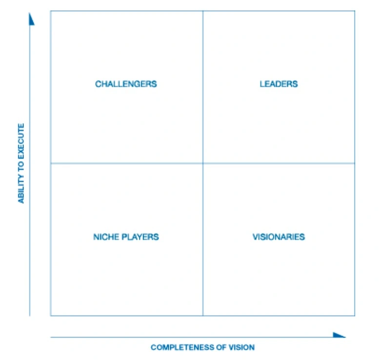

<!DOCTYPE html>

<html xmlns="http://www.w3.org/1999/xhtml">
<head>
<head>
<meta content="text/html; charset=utf-8" http-equiv="Content-Type"/>
<meta content="width=device-width, initial-scale=1, maximum-scale=1.0, user-scalable=no" name="viewport"/>
<meta content="zh-cn" http-equiv="content-language"/>
<meta content="106 分析企业的两要素：远见和执行力" name="description"/>
<link href="/static/favicon.png" rel="icon"/>
<title>106 分析企业的两要素：远见和执行力 </title>
<link href="/static/index.css" rel="stylesheet"/>
<link href="/static/highlight.min.css" rel="stylesheet"/>

<meta content="Hexo 4.2.0" name="generator"/>

</head>
<body>

<a href="/">

技术文章摘抄
</a>

<ul class="uncollapsible">
<li><a class="current-tab" href="/">首页</a></li>
<li><a href="../">上一级</a></li>
</ul>
<ul class="uncollapsible">
<li>
<a class="menu-item" href="/%e4%b8%93%e6%a0%8f/%e6%8a%80%e6%9c%af%e4%b8%8e%e5%95%86%e4%b8%9a%e6%a1%88%e4%be%8b%e8%a7%a3%e8%af%bb/000%20%e5%bc%80%e7%af%87%e8%af%8d%20%e7%aa%81%e7%a0%b4%e6%8a%80%e6%9c%af%e6%80%9d%e7%bb%b4%ef%bc%8c%e7%ab%99%e5%9c%a8%e5%95%86%e4%b8%9a%e7%9a%84%e8%a7%92%e5%ba%a6%e7%9c%8b%e9%97%ae%e9%a2%98.md" id="000 开篇词 突破技术思维，站在商业的角度看问题.md">000 开篇词 突破技术思维，站在商业的角度看问题.md</a>
</li>
<li>
<a class="menu-item" href="/%e4%b8%93%e6%a0%8f/%e6%8a%80%e6%9c%af%e4%b8%8e%e5%95%86%e4%b8%9a%e6%a1%88%e4%be%8b%e8%a7%a3%e8%af%bb/001%20%e8%a5%bf%e9%9b%85%e5%9b%beIT%e5%85%ac%e5%8f%b8%e4%b9%8bRealNetworks%ef%bc%9a%e4%b8%80%e4%b8%aa%e5%b8%9d%e5%9b%bd%e7%9a%84%e5%85%b4%e8%a1%b0%ef%bc%88%e4%b8%8a%ef%bc%89.md" id="001 西雅图IT公司之RealNetworks：一个帝国的兴衰（上）.md">001 西雅图IT公司之RealNetworks：一个帝国的兴衰（上）.md</a>
</li>
<li>
<a class="menu-item" href="/%e4%b8%93%e6%a0%8f/%e6%8a%80%e6%9c%af%e4%b8%8e%e5%95%86%e4%b8%9a%e6%a1%88%e4%be%8b%e8%a7%a3%e8%af%bb/002%20%e8%a5%bf%e9%9b%85%e5%9b%beIT%e5%85%ac%e5%8f%b8%e4%b9%8bRealNetworks%ef%bc%9a%e4%b8%80%e4%b8%aa%e5%b8%9d%e5%9b%bd%e7%9a%84%e5%85%b4%e8%a1%b0%ef%bc%88%e4%b8%8b%ef%bc%89.md" id="002 西雅图IT公司之RealNetworks：一个帝国的兴衰（下）.md">002 西雅图IT公司之RealNetworks：一个帝国的兴衰（下）.md</a>
</li>
<li>
<a class="menu-item" href="/%e4%b8%93%e6%a0%8f/%e6%8a%80%e6%9c%af%e4%b8%8e%e5%95%86%e4%b8%9a%e6%a1%88%e4%be%8b%e8%a7%a3%e8%af%bb/003%20%e4%bb%a5RealNetworks%e4%b8%ba%e4%be%8b%ef%bc%8c%e8%b0%88%e8%b0%88%e5%88%9d%e5%88%9b%e5%85%ac%e5%8f%b8%e5%a6%82%e4%bd%95%e5%ba%94%e5%af%b9%e5%b7%a8%e5%a4%b4%e7%a2%be%e5%8e%8b.md" id="003 以RealNetworks为例，谈谈初创公司如何应对巨头碾压.md">003 以RealNetworks为例，谈谈初创公司如何应对巨头碾压.md</a>
</li>
<li>
<a class="menu-item" href="/%e4%b8%93%e6%a0%8f/%e6%8a%80%e6%9c%af%e4%b8%8e%e5%95%86%e4%b8%9a%e6%a1%88%e4%be%8b%e8%a7%a3%e8%af%bb/004%20%e5%8f%af%e8%a7%86%e5%8c%96%e5%88%86%e6%9e%90%e9%bc%bb%e7%a5%96Tableau.md" id="004 可视化分析鼻祖Tableau.md">004 可视化分析鼻祖Tableau.md</a>
</li>
<li>
<a class="menu-item" href="/%e4%b8%93%e6%a0%8f/%e6%8a%80%e6%9c%af%e4%b8%8e%e5%95%86%e4%b8%9a%e6%a1%88%e4%be%8b%e8%a7%a3%e8%af%bb/005%20%e4%bb%8eTableau%e4%b8%8a%e5%b8%82%ef%bc%8c%e7%9c%8b%e5%ad%a6%e6%9c%af%e7%95%8c%e5%92%8c%e5%b7%a5%e4%b8%9a%e7%95%8c%e4%ba%ba%e5%a3%ab%e5%88%9b%e4%b8%9a.md" id="005 从Tableau上市，看学术界和工业界人士创业.md">005 从Tableau上市，看学术界和工业界人士创业.md</a>
</li>
<li>
<a class="menu-item" href="/%e4%b8%93%e6%a0%8f/%e6%8a%80%e6%9c%af%e4%b8%8e%e5%95%86%e4%b8%9a%e6%a1%88%e4%be%8b%e8%a7%a3%e8%af%bb/006%20%e5%9c%a8%e7%ba%bf%e6%97%85%e6%b8%b8%e5%b8%9d%e5%9b%bdExpedia%e5%b4%9b%e8%b5%b7%e7%9a%84%e8%83%8c%e5%90%8e.md" id="006 在线旅游帝国Expedia崛起的背后.md">006 在线旅游帝国Expedia崛起的背后.md</a>
</li>
<li>
<a class="menu-item" href="/%e4%b8%93%e6%a0%8f/%e6%8a%80%e6%9c%af%e4%b8%8e%e5%95%86%e4%b8%9a%e6%a1%88%e4%be%8b%e8%a7%a3%e8%af%bb/007%20%e6%88%bf%e4%ba%a7%e7%bb%8f%e7%ba%aa%e7%9a%84%e9%a2%a0%e8%a6%86%e8%80%85Redfin%ef%bc%9a%e5%9c%a8%e2%80%9c%e4%bc%a0%e7%bb%9f%e2%80%9d%e4%b8%8e%e2%80%9c%e7%8e%b0%e4%bb%a3%e2%80%9d%e9%97%b4%e5%be%98%e5%be%8a.md" id="007 房产经纪的颠覆者Redfin：在“传统”与“现代”间徘徊.md">007 房产经纪的颠覆者Redfin：在“传统”与“现代”间徘徊.md</a>
</li>
<li>
<a class="menu-item" href="/%e4%b8%93%e6%a0%8f/%e6%8a%80%e6%9c%af%e4%b8%8e%e5%95%86%e4%b8%9a%e6%a1%88%e4%be%8b%e8%a7%a3%e8%af%bb/008%20%e6%88%bf%e4%ba%a7%e7%bb%8f%e7%ba%aa%e7%9a%84%e2%80%9c%e5%8d%8f%e4%bd%9c%e8%80%85%e2%80%9dZillow%ef%bc%9a%e4%b8%80%e4%b8%aa%e5%9c%b0%e4%ba%a7%e6%95%b0%e6%8d%ae%e5%b9%b3%e5%8f%b0.md" id="008 房产经纪的“协作者”Zillow：一个地产数据平台.md">008 房产经纪的“协作者”Zillow：一个地产数据平台.md</a>
</li>
<li>
<a class="menu-item" href="/%e4%b8%93%e6%a0%8f/%e6%8a%80%e6%9c%af%e4%b8%8e%e5%95%86%e4%b8%9a%e6%a1%88%e4%be%8b%e8%a7%a3%e8%af%bb/009%20%e9%a2%a0%e8%a6%86%e8%bf%98%e6%98%af%e5%8d%8f%e4%bd%9c%ef%bc%8c%e6%88%bf%e5%9c%b0%e4%ba%a7%e5%b8%82%e5%9c%ba%e4%b8%8aRedfin%e5%92%8cZillow%e7%9a%84%e6%8a%89%e6%8b%a9.md" id="009 颠覆还是协作，房地产市场上Redfin和Zillow的抉择.md">009 颠覆还是协作，房地产市场上Redfin和Zillow的抉择.md</a>
</li>
<li>
<a class="menu-item" href="/%e4%b8%93%e6%a0%8f/%e6%8a%80%e6%9c%af%e4%b8%8e%e5%95%86%e4%b8%9a%e6%a1%88%e4%be%8b%e8%a7%a3%e8%af%bb/010%20%e5%ba%94%e7%94%a8%e4%ba%a4%e4%bb%98%e7%bd%91%e7%bb%9c%e5%a4%a7%e5%8e%82F5%ef%bc%9a%e2%80%9c%e4%b8%80%e6%8b%9b%e9%b2%9c%e2%80%9d%e4%b9%8b%e6%ae%87.md" id="010 应用交付网络大厂F5：“一招鲜”之殇.md">010 应用交付网络大厂F5：“一招鲜”之殇.md</a>
</li>
<li>
<a class="menu-item" href="/%e4%b8%93%e6%a0%8f/%e6%8a%80%e6%9c%af%e4%b8%8e%e5%95%86%e4%b8%9a%e6%a1%88%e4%be%8b%e8%a7%a3%e8%af%bb/011%20%e5%9c%a8%e7%ba%bf%e5%b7%ae%e6%97%85%e6%8a%a5%e9%94%80%e9%bc%bb%e7%a5%96Concur%ef%bc%9a%e5%9c%a8%e8%bd%ac%e5%9e%8b%e4%b8%ad%e8%8e%b7%e5%be%97%e5%8f%91%e5%b1%95.md" id="011 在线差旅报销鼻祖Concur：在转型中获得发展.md">011 在线差旅报销鼻祖Concur：在转型中获得发展.md</a>
</li>
<li>
<a class="menu-item" href="/%e4%b8%93%e6%a0%8f/%e6%8a%80%e6%9c%af%e4%b8%8e%e5%95%86%e4%b8%9a%e6%a1%88%e4%be%8b%e8%a7%a3%e8%af%bb/012%20%e6%bc%ab%e8%b0%88%e4%bc%81%e4%b8%9a%e8%bd%ac%e5%9e%8b%ef%bc%9a%e5%9c%a8%e5%b8%82%e5%9c%ba%e5%8f%98%e8%bf%81%e4%b8%ad%e5%af%bb%e6%89%be%e7%94%9f%e6%9c%ba.md" id="012 漫谈企业转型：在市场变迁中寻找生机.md">012 漫谈企业转型：在市场变迁中寻找生机.md</a>
</li>
<li>
<a class="menu-item" href="/%e4%b8%93%e6%a0%8f/%e6%8a%80%e6%9c%af%e4%b8%8e%e5%95%86%e4%b8%9a%e6%a1%88%e4%be%8b%e8%a7%a3%e8%af%bb/013%20%e5%85%8b%e9%9b%b7%e5%85%ac%e5%8f%b8%e6%b2%89%e6%b5%ae%e5%bd%95%ef%bc%9a%e8%a1%8c%e8%b5%b0%e5%9c%a8%e8%b6%85%e7%ba%a7%e8%ae%a1%e7%ae%97%e6%9c%ba%e5%b8%82%e5%9c%ba.md" id="013 克雷公司沉浮录：行走在超级计算机市场.md">013 克雷公司沉浮录：行走在超级计算机市场.md</a>
</li>
<li>
<a class="menu-item" href="/%e4%b8%93%e6%a0%8f/%e6%8a%80%e6%9c%af%e4%b8%8e%e5%95%86%e4%b8%9a%e6%a1%88%e4%be%8b%e8%a7%a3%e8%af%bb/014%20%e2%80%9c%e5%8d%95%e4%b8%80%e5%8c%96%e2%80%9d%e7%9a%84%e9%9a%90%e5%bf%a7%ef%bc%9a%e4%bb%8e%e5%85%8b%e9%9b%b7%e5%85%ac%e5%8f%b8%e7%9c%8b%e2%80%9c%e4%b8%80%e6%9d%a1%e8%85%bf%e8%b5%b0%e8%b7%af%e2%80%9d.md" id="014 “单一化”的隐忧：从克雷公司看“一条腿走路”.md">014 “单一化”的隐忧：从克雷公司看“一条腿走路”.md</a>
</li>
<li>
<a class="menu-item" href="/%e4%b8%93%e6%a0%8f/%e6%8a%80%e6%9c%af%e4%b8%8e%e5%95%86%e4%b8%9a%e6%a1%88%e4%be%8b%e8%a7%a3%e8%af%bb/015%20Halo%e7%9a%84%e5%bc%80%e5%8f%91%e8%80%85Bungie%ef%bc%9a%e4%b8%8e%e5%be%ae%e8%bd%af%e7%9a%84%e8%81%9a%e6%95%a3.md" id="015 Halo的开发者Bungie：与微软的聚散.md">015 Halo的开发者Bungie：与微软的聚散.md</a>
</li>
<li>
<a class="menu-item" href="/%e4%b8%93%e6%a0%8f/%e6%8a%80%e6%9c%af%e4%b8%8e%e5%95%86%e4%b8%9a%e6%a1%88%e4%be%8b%e8%a7%a3%e8%af%bb/016%20%e2%80%9c%e5%8d%96%e8%ba%ab%e2%80%9d%e9%a1%bb%e8%b0%a8%e6%85%8e%ef%bc%9a%e5%88%9b%e4%b8%9a%e5%85%ac%e5%8f%b8%e9%9d%a2%e4%b8%b4%e7%9a%84%e6%8a%89%e6%8b%a9.md" id="016 “卖身”须谨慎：创业公司面临的抉择.md">016 “卖身”须谨慎：创业公司面临的抉择.md</a>
</li>
<li>
<a class="menu-item" href="/%e4%b8%93%e6%a0%8f/%e6%8a%80%e6%9c%af%e4%b8%8e%e5%95%86%e4%b8%9a%e6%a1%88%e4%be%8b%e8%a7%a3%e8%af%bb/017%20%e4%ba%9a%e9%a9%ac%e9%80%8a%e9%a2%86%e5%af%bc%e5%8a%9b%e5%87%86%e5%88%99%e4%b9%8b%e8%a6%81%e6%9c%89%e7%a1%ac%e9%aa%a8%e5%a4%b4.md" id="017 亚马逊领导力准则之要有硬骨头.md">017 亚马逊领导力准则之要有硬骨头.md</a>
</li>
<li>
<a class="menu-item" href="/%e4%b8%93%e6%a0%8f/%e6%8a%80%e6%9c%af%e4%b8%8e%e5%95%86%e4%b8%9a%e6%a1%88%e4%be%8b%e8%a7%a3%e8%af%bb/018%20%e4%ba%9a%e9%a9%ac%e9%80%8a%e9%a2%86%e5%af%bc%e5%8a%9b%e5%87%86%e5%88%99%e4%b9%8b%e5%86%b3%e7%ad%96%e6%ad%a3%e7%a1%ae.md" id="018 亚马逊领导力准则之决策正确.md">018 亚马逊领导力准则之决策正确.md</a>
</li>
<li>
<a class="menu-item" href="/%e4%b8%93%e6%a0%8f/%e6%8a%80%e6%9c%af%e4%b8%8e%e5%95%86%e4%b8%9a%e6%a1%88%e4%be%8b%e8%a7%a3%e8%af%bb/019%20%e4%ba%9a%e9%a9%ac%e9%80%8a%e9%a2%86%e5%af%bc%e5%8a%9b%e5%87%86%e5%88%99%e4%b9%8b%e5%ae%a2%e6%88%b7%e8%87%b3%e5%b0%9a.md" id="019 亚马逊领导力准则之客户至尚.md">019 亚马逊领导力准则之客户至尚.md</a>
</li>
<li>
<a class="menu-item" href="/%e4%b8%93%e6%a0%8f/%e6%8a%80%e6%9c%af%e4%b8%8e%e5%95%86%e4%b8%9a%e6%a1%88%e4%be%8b%e8%a7%a3%e8%af%bb/020%20%e4%ba%9a%e9%a9%ac%e9%80%8a%e9%a2%86%e5%af%bc%e5%8a%9b%e5%87%86%e5%88%99%e4%b9%8b%e5%8b%a4%e4%bf%ad%e8%8a%82%e7%ba%a6.md" id="020 亚马逊领导力准则之勤俭节约.md">020 亚马逊领导力准则之勤俭节约.md</a>
</li>
<li>
<a class="menu-item" href="/%e4%b8%93%e6%a0%8f/%e6%8a%80%e6%9c%af%e4%b8%8e%e5%95%86%e4%b8%9a%e6%a1%88%e4%be%8b%e8%a7%a3%e8%af%bb/021%20%e4%ba%9a%e9%a9%ac%e9%80%8a%e9%a2%86%e5%af%bc%e5%8a%9b%e5%87%86%e5%88%99%e4%b9%8b%e4%b8%bb%e4%ba%ba%e7%bf%81%e7%b2%be%e7%a5%9e.md" id="021 亚马逊领导力准则之主人翁精神.md">021 亚马逊领导力准则之主人翁精神.md</a>
</li>
<li>
<a class="menu-item" href="/%e4%b8%93%e6%a0%8f/%e6%8a%80%e6%9c%af%e4%b8%8e%e5%95%86%e4%b8%9a%e6%a1%88%e4%be%8b%e8%a7%a3%e8%af%bb/022%20%e4%ba%9a%e9%a9%ac%e9%80%8a%e9%a2%86%e5%af%bc%e5%8a%9b%e5%87%86%e5%88%99%e4%b9%8b%e9%80%89%e8%b4%a4%e8%82%b2%e8%83%bd.md" id="022 亚马逊领导力准则之选贤育能.md">022 亚马逊领导力准则之选贤育能.md</a>
</li>
<li>
<a class="menu-item" href="/%e4%b8%93%e6%a0%8f/%e6%8a%80%e6%9c%af%e4%b8%8e%e5%95%86%e4%b8%9a%e6%a1%88%e4%be%8b%e8%a7%a3%e8%af%bb/023%20%e4%ba%9a%e9%a9%ac%e9%80%8a%e9%a2%86%e5%af%bc%e5%8a%9b%e5%87%86%e5%88%99%e4%b9%8b%e6%9c%80%e9%ab%98%e6%a0%87%e5%87%86.md" id="023 亚马逊领导力准则之最高标准.md">023 亚马逊领导力准则之最高标准.md</a>
</li>
<li>
<a class="menu-item" href="/%e4%b8%93%e6%a0%8f/%e6%8a%80%e6%9c%af%e4%b8%8e%e5%95%86%e4%b8%9a%e6%a1%88%e4%be%8b%e8%a7%a3%e8%af%bb/024%20%e4%ba%9a%e9%a9%ac%e9%80%8a%e9%a2%86%e5%af%bc%e5%8a%9b%e5%87%86%e5%88%99%e4%b9%8b%e5%88%9b%e6%96%b0%e7%ae%80%e5%8c%96.md" id="024 亚马逊领导力准则之创新简化.md">024 亚马逊领导力准则之创新简化.md</a>
</li>
<li>
<a class="menu-item" href="/%e4%b8%93%e6%a0%8f/%e6%8a%80%e6%9c%af%e4%b8%8e%e5%95%86%e4%b8%9a%e6%a1%88%e4%be%8b%e8%a7%a3%e8%af%bb/025%20%e4%ba%9a%e9%a9%ac%e9%80%8a%e9%a2%86%e5%af%bc%e5%8a%9b%e5%87%86%e5%88%99%e4%b9%8b%e5%b4%87%e5%b0%9a%e8%a1%8c%e5%8a%a8.md" id="025 亚马逊领导力准则之崇尚行动.md">025 亚马逊领导力准则之崇尚行动.md</a>
</li>
<li>
<a class="menu-item" href="/%e4%b8%93%e6%a0%8f/%e6%8a%80%e6%9c%af%e4%b8%8e%e5%95%86%e4%b8%9a%e6%a1%88%e4%be%8b%e8%a7%a3%e8%af%bb/026%20%e4%ba%9a%e9%a9%ac%e9%80%8a%e9%a2%86%e5%af%bc%e5%8a%9b%e5%87%86%e5%88%99%e4%b9%8b%e8%bf%9c%e8%a7%81%e5%8d%93%e8%af%86.md" id="026 亚马逊领导力准则之远见卓识.md">026 亚马逊领导力准则之远见卓识.md</a>
</li>
<li>
<a class="menu-item" href="/%e4%b8%93%e6%a0%8f/%e6%8a%80%e6%9c%af%e4%b8%8e%e5%95%86%e4%b8%9a%e6%a1%88%e4%be%8b%e8%a7%a3%e8%af%bb/027%20%e4%ba%9a%e9%a9%ac%e9%80%8a%e9%a2%86%e5%af%bc%e5%8a%9b%e5%87%86%e5%88%99%e4%b9%8b%e5%a5%bd%e5%a5%87%e6%b1%82%e7%9f%a5%e4%b8%8e%e8%b5%a2%e5%be%97%e4%bf%a1%e4%bb%bb.md" id="027 亚马逊领导力准则之好奇求知与赢得信任.md">027 亚马逊领导力准则之好奇求知与赢得信任.md</a>
</li>
<li>
<a class="menu-item" href="/%e4%b8%93%e6%a0%8f/%e6%8a%80%e6%9c%af%e4%b8%8e%e5%95%86%e4%b8%9a%e6%a1%88%e4%be%8b%e8%a7%a3%e8%af%bb/028%20%e4%ba%9a%e9%a9%ac%e9%80%8a%e9%a2%86%e5%af%bc%e5%8a%9b%e5%87%86%e5%88%99%e4%b9%8b%e5%88%a8%e6%a0%b9%e9%97%ae%e5%ba%95%e4%b8%8e%e8%be%be%e6%88%90%e4%b8%9a%e7%bb%a9.md" id="028 亚马逊领导力准则之刨根问底与达成业绩.md">028 亚马逊领导力准则之刨根问底与达成业绩.md</a>
</li>
<li>
<a class="menu-item" href="/%e4%b8%93%e6%a0%8f/%e6%8a%80%e6%9c%af%e4%b8%8e%e5%95%86%e4%b8%9a%e6%a1%88%e4%be%8b%e8%a7%a3%e8%af%bb/029%20%e6%99%ba%e8%83%bd%e9%9f%b3%e7%ae%b1%e7%9a%84%e6%88%98%e6%96%97%ef%bc%9a%e4%ba%9a%e9%a9%ac%e9%80%8a%e7%9a%84%e7%a1%ac%e4%bb%b6%e8%b7%af.md" id="029 智能音箱的战斗：亚马逊的硬件路.md">029 智能音箱的战斗：亚马逊的硬件路.md</a>
</li>
<li>
<a class="menu-item" href="/%e4%b8%93%e6%a0%8f/%e6%8a%80%e6%9c%af%e4%b8%8e%e5%95%86%e4%b8%9a%e6%a1%88%e4%be%8b%e8%a7%a3%e8%af%bb/030%20%e6%99%ba%e8%83%bd%e9%9f%b3%e7%ae%b1%e7%9a%84%e6%88%98%e6%96%97%ef%bc%9aEcho%e6%94%bb%e5%9f%8e%e7%95%a5%e5%9c%b0.md" id="030 智能音箱的战斗：Echo攻城略地.md">030 智能音箱的战斗：Echo攻城略地.md</a>
</li>
<li>
<a class="menu-item" href="/%e4%b8%93%e6%a0%8f/%e6%8a%80%e6%9c%af%e4%b8%8e%e5%95%86%e4%b8%9a%e6%a1%88%e4%be%8b%e8%a7%a3%e8%af%bb/031%20%e6%99%ba%e8%83%bd%e9%9f%b3%e7%ae%b1%e7%9a%84%e6%88%98%e6%96%97%ef%bc%9a%e8%af%ad%e9%9f%b3%e5%8a%a9%e6%89%8bAlexa.md" id="031 智能音箱的战斗：语音助手Alexa.md">031 智能音箱的战斗：语音助手Alexa.md</a>
</li>
<li>
<a class="menu-item" href="/%e4%b8%93%e6%a0%8f/%e6%8a%80%e6%9c%af%e4%b8%8e%e5%95%86%e4%b8%9a%e6%a1%88%e4%be%8b%e8%a7%a3%e8%af%bb/032%20%e6%99%ba%e8%83%bd%e9%9f%b3%e7%ae%b1%e7%9a%84%e6%88%98%e6%96%97%ef%bc%9a%e8%b0%b7%e6%ad%8c%e7%9a%84%e6%9d%80%e5%85%a5.md" id="032 智能音箱的战斗：谷歌的杀入.md">032 智能音箱的战斗：谷歌的杀入.md</a>
</li>
<li>
<a class="menu-item" href="/%e4%b8%93%e6%a0%8f/%e6%8a%80%e6%9c%af%e4%b8%8e%e5%95%86%e4%b8%9a%e6%a1%88%e4%be%8b%e8%a7%a3%e8%af%bb/033%20%e6%99%ba%e8%83%bd%e9%9f%b3%e7%ae%b1%e7%9a%84%e6%88%98%e6%96%97%ef%bc%9a%e4%ba%9a%e9%a9%ac%e9%80%8a%e7%9a%84%e6%88%98%e7%95%a5%e5%b8%83%e5%b1%80.md" id="033 智能音箱的战斗：亚马逊的战略布局.md">033 智能音箱的战斗：亚马逊的战略布局.md</a>
</li>
<li>
<a class="menu-item" href="/%e4%b8%93%e6%a0%8f/%e6%8a%80%e6%9c%af%e4%b8%8e%e5%95%86%e4%b8%9a%e6%a1%88%e4%be%8b%e8%a7%a3%e8%af%bb/034%20%e6%99%ba%e8%83%bd%e9%9f%b3%e7%ae%b1%e7%9a%84%e6%88%98%e6%96%97%ef%bc%9a%e5%b7%a8%e5%a4%b4%e7%ba%b7%e7%ba%b7%e5%85%a5%e5%9c%ba.md" id="034 智能音箱的战斗：巨头纷纷入场.md">034 智能音箱的战斗：巨头纷纷入场.md</a>
</li>
<li>
<a class="menu-item" href="/%e4%b8%93%e6%a0%8f/%e6%8a%80%e6%9c%af%e4%b8%8e%e5%95%86%e4%b8%9a%e6%a1%88%e4%be%8b%e8%a7%a3%e8%af%bb/035%20%e6%99%ba%e8%83%bd%e9%9f%b3%e7%ae%b1%e7%9a%84%e6%88%98%e6%96%97%ef%bc%9a%e7%99%bd%e9%a9%ac%e9%9d%9e%e9%a9%ac.md" id="035 智能音箱的战斗：白马非马.md">035 智能音箱的战斗：白马非马.md</a>
</li>
<li>
<a class="menu-item" href="/%e4%b8%93%e6%a0%8f/%e6%8a%80%e6%9c%af%e4%b8%8e%e5%95%86%e4%b8%9a%e6%a1%88%e4%be%8b%e8%a7%a3%e8%af%bb/036%20%e5%a6%82%e4%bd%95%e9%80%8f%e8%bf%87%e4%b8%80%e4%b8%aa%e9%a2%86%e5%9f%9f%e5%8e%bb%e8%81%94%e5%90%88%e5%88%86%e6%9e%90%e5%a4%9a%e5%ae%b6%e4%bc%81%e4%b8%9a%ef%bc%9f.md" id="036 如何透过一个领域去联合分析多家企业？.md">036 如何透过一个领域去联合分析多家企业？.md</a>
</li>
<li>
<a class="menu-item" href="/%e4%b8%93%e6%a0%8f/%e6%8a%80%e6%9c%af%e4%b8%8e%e5%95%86%e4%b8%9a%e6%a1%88%e4%be%8b%e8%a7%a3%e8%af%bb/037%20%e7%ae%a1%e4%b8%ad%e7%aa%a5%e8%b1%b9%e4%b9%8b%e4%bb%8e%e9%9d%a2%e8%af%95%e7%9c%8b%e4%bc%81%e4%b8%9a%e6%96%87%e5%8c%96%ef%bc%9a%e5%be%ae%e8%bd%af.md" id="037 管中窥豹之从面试看企业文化：微软.md">037 管中窥豹之从面试看企业文化：微软.md</a>
</li>
<li>
<a class="menu-item" href="/%e4%b8%93%e6%a0%8f/%e6%8a%80%e6%9c%af%e4%b8%8e%e5%95%86%e4%b8%9a%e6%a1%88%e4%be%8b%e8%a7%a3%e8%af%bb/038%20%e7%ae%a1%e4%b8%ad%e7%aa%a5%e8%b1%b9%e4%b9%8b%e4%bb%8e%e9%9d%a2%e8%af%95%e7%9c%8b%e4%bc%81%e4%b8%9a%e6%96%87%e5%8c%96%ef%bc%9a%e4%ba%9a%e9%a9%ac%e9%80%8a.md" id="038 管中窥豹之从面试看企业文化：亚马逊.md">038 管中窥豹之从面试看企业文化：亚马逊.md</a>
</li>
<li>
<a class="menu-item" href="/%e4%b8%93%e6%a0%8f/%e6%8a%80%e6%9c%af%e4%b8%8e%e5%95%86%e4%b8%9a%e6%a1%88%e4%be%8b%e8%a7%a3%e8%af%bb/039%20%e7%ae%a1%e4%b8%ad%e7%aa%a5%e8%b1%b9%e4%b9%8b%e4%bb%8e%e9%9d%a2%e8%af%95%e7%9c%8b%e4%bc%81%e4%b8%9a%e6%96%87%e5%8c%96%ef%bc%9a%e8%b0%b7%e6%ad%8c.md" id="039 管中窥豹之从面试看企业文化：谷歌.md">039 管中窥豹之从面试看企业文化：谷歌.md</a>
</li>
<li>
<a class="menu-item" href="/%e4%b8%93%e6%a0%8f/%e6%8a%80%e6%9c%af%e4%b8%8e%e5%95%86%e4%b8%9a%e6%a1%88%e4%be%8b%e8%a7%a3%e8%af%bb/040%20%e7%ae%a1%e4%b8%ad%e7%aa%a5%e8%b1%b9%e4%b9%8b%e4%bb%8e%e9%9d%a2%e8%af%95%e7%9c%8b%e4%bc%81%e4%b8%9a%e6%96%87%e5%8c%96%ef%bc%9a%e7%94%b2%e9%aa%a8%e6%96%87.md" id="040 管中窥豹之从面试看企业文化：甲骨文.md">040 管中窥豹之从面试看企业文化：甲骨文.md</a>
</li>
<li>
<a class="menu-item" href="/%e4%b8%93%e6%a0%8f/%e6%8a%80%e6%9c%af%e4%b8%8e%e5%95%86%e4%b8%9a%e6%a1%88%e4%be%8b%e8%a7%a3%e8%af%bb/041%20%e7%ae%a1%e4%b8%ad%e7%aa%a5%e8%b1%b9%e4%b9%8b%e4%bb%8e%e9%9d%a2%e8%af%95%e7%9c%8b%e4%bc%81%e4%b8%9a%e6%96%87%e5%8c%96%ef%bc%9aFacebook.md" id="041 管中窥豹之从面试看企业文化：Facebook.md">041 管中窥豹之从面试看企业文化：Facebook.md</a>
</li>
<li>
<a class="menu-item" href="/%e4%b8%93%e6%a0%8f/%e6%8a%80%e6%9c%af%e4%b8%8e%e5%95%86%e4%b8%9a%e6%a1%88%e4%be%8b%e8%a7%a3%e8%af%bb/042%20%e9%80%8f%e8%bf%87%e4%bc%81%e4%b8%9a%e7%94%a8%e4%ba%ba%e4%b9%8b%e9%81%93%e7%9c%8b%e4%bc%81%e4%b8%9a%e5%8f%91%e5%b1%95.md" id="042 透过企业用人之道看企业发展.md">042 透过企业用人之道看企业发展.md</a>
</li>
<li>
<a class="menu-item" href="/%e4%b8%93%e6%a0%8f/%e6%8a%80%e6%9c%af%e4%b8%8e%e5%95%86%e4%b8%9a%e6%a1%88%e4%be%8b%e8%a7%a3%e8%af%bb/043%20%e5%8a%9e%e5%85%ac%e8%bd%af%e4%bb%b6%e7%9a%84%e6%88%98%e6%96%97%ef%bc%9a%e5%bc%80%e7%af%87.md" id="043 办公软件的战斗：开篇.md">043 办公软件的战斗：开篇.md</a>
</li>
<li>
<a class="menu-item" href="/%e4%b8%93%e6%a0%8f/%e6%8a%80%e6%9c%af%e4%b8%8e%e5%95%86%e4%b8%9a%e6%a1%88%e4%be%8b%e8%a7%a3%e8%af%bb/044%20VisiCalc%ef%bc%9a%e7%ac%ac%e4%b8%80%e4%b8%aa%e7%94%b5%e5%ad%90%e8%a1%a8%e6%a0%bc%e8%bd%af%e4%bb%b6%e7%9a%84%e8%af%9e%e7%94%9f.md" id="044 VisiCalc：第一个电子表格软件的诞生.md">044 VisiCalc：第一个电子表格软件的诞生.md</a>
</li>
<li>
<a class="menu-item" href="/%e4%b8%93%e6%a0%8f/%e6%8a%80%e6%9c%af%e4%b8%8e%e5%95%86%e4%b8%9a%e6%a1%88%e4%be%8b%e8%a7%a3%e8%af%bb/045%20WordStar%ef%bc%9a%e7%ac%ac%e4%b8%80%e4%b8%aa%e5%ad%97%e5%a4%84%e7%90%86%e8%bd%af%e4%bb%b6%e7%9a%84%e6%95%85%e4%ba%8b.md" id="045 WordStar：第一个字处理软件的故事.md">045 WordStar：第一个字处理软件的故事.md</a>
</li>
<li>
<a class="menu-item" href="/%e4%b8%93%e6%a0%8f/%e6%8a%80%e6%9c%af%e4%b8%8e%e5%95%86%e4%b8%9a%e6%a1%88%e4%be%8b%e8%a7%a3%e8%af%bb/046%20%e5%be%ae%e8%bd%af%ef%bc%9a%e5%8a%9e%e5%85%ac%e8%bd%af%e4%bb%b6%e6%88%98%e5%9c%ba%e7%9a%84%e8%9e%b3%e8%9e%82.md" id="046 微软：办公软件战场的螳螂.md">046 微软：办公软件战场的螳螂.md</a>
</li>
<li>
<a class="menu-item" href="/%e4%b8%93%e6%a0%8f/%e6%8a%80%e6%9c%af%e4%b8%8e%e5%95%86%e4%b8%9a%e6%a1%88%e4%be%8b%e8%a7%a3%e8%af%bb/047%20WordPerfect%ef%bc%9a%e5%ad%97%e5%a4%84%e7%90%86%e8%bd%af%e4%bb%b6%e7%9a%84%e6%96%b0%e7%a7%80.md" id="047 WordPerfect：字处理软件的新秀.md">047 WordPerfect：字处理软件的新秀.md</a>
</li>
<li>
<a class="menu-item" href="/%e4%b8%93%e6%a0%8f/%e6%8a%80%e6%9c%af%e4%b8%8e%e5%95%86%e4%b8%9a%e6%a1%88%e4%be%8b%e8%a7%a3%e8%af%bb/048%20Lotus%201-2-3%ef%bc%9a%e8%8e%b2%e8%8a%b1%e5%85%ac%e5%8f%b8%e7%9a%84%e7%94%b5%e5%ad%90%e8%a1%a8%e6%a0%bc%e5%b8%9d%e5%9b%bd.md" id="048 Lotus 1-2-3：莲花公司的电子表格帝国.md">048 Lotus 1-2-3：莲花公司的电子表格帝国.md</a>
</li>
<li>
<a class="menu-item" href="/%e4%b8%93%e6%a0%8f/%e6%8a%80%e6%9c%af%e4%b8%8e%e5%95%86%e4%b8%9a%e6%a1%88%e4%be%8b%e8%a7%a3%e8%af%bb/049%20%e7%ba%a2%e7%8b%ae%e4%bc%9a%e6%88%98%ef%bc%9a%e5%be%ae%e8%bd%af%e7%9a%84%e5%8f%8d%e5%87%bb.md" id="049 红狮会战：微软的反击.md">049 红狮会战：微软的反击.md</a>
</li>
<li>
<a class="menu-item" href="/%e4%b8%93%e6%a0%8f/%e6%8a%80%e6%9c%af%e4%b8%8e%e5%95%86%e4%b8%9a%e6%a1%88%e4%be%8b%e8%a7%a3%e8%af%bb/050%20%e5%a4%a7%e6%9d%80%e5%99%a8Lotus%20Notes%20%e5%92%8c%e8%a2%ab%e6%94%b6%e8%b4%ad%e7%9a%84%e8%8e%b2%e8%8a%b1%e5%85%ac%e5%8f%b8.md" id="050 大杀器Lotus Notes 和被收购的莲花公司.md">050 大杀器Lotus Notes 和被收购的莲花公司.md</a>
</li>
<li>
<a class="menu-item" href="/%e4%b8%93%e6%a0%8f/%e6%8a%80%e6%9c%af%e4%b8%8e%e5%95%86%e4%b8%9a%e6%a1%88%e4%be%8b%e8%a7%a3%e8%af%bb/051%20%e6%97%a0%e6%95%8c%e5%af%82%e5%af%9e%e7%9a%84%e5%be%ae%e8%bd%af%e4%b9%8b%e4%b8%ba%e5%88%9b%e6%96%b0%e8%80%8c%e5%88%9b%e6%96%b0.md" id="051 无敌寂寞的微软之为创新而创新.md">051 无敌寂寞的微软之为创新而创新.md</a>
</li>
<li>
<a class="menu-item" href="/%e4%b8%93%e6%a0%8f/%e6%8a%80%e6%9c%af%e4%b8%8e%e5%95%86%e4%b8%9a%e6%a1%88%e4%be%8b%e8%a7%a3%e8%af%bb/052%20%e5%8a%9e%e5%85%ac%e8%bd%af%e4%bb%b6%e7%9a%84%e6%96%b0%e6%97%b6%e4%bb%a3%ef%bc%9a%e5%be%ae%e8%bd%af%e5%92%8c%e8%b0%b7%e6%ad%8c%e7%9a%84%e6%88%98%e6%96%97.md" id="052 办公软件的新时代：微软和谷歌的战斗.md">052 办公软件的新时代：微软和谷歌的战斗.md</a>
</li>
<li>
<a class="menu-item" href="/%e4%b8%93%e6%a0%8f/%e6%8a%80%e6%9c%af%e4%b8%8e%e5%95%86%e4%b8%9a%e6%a1%88%e4%be%8b%e8%a7%a3%e8%af%bb/053%20%e5%bc%82%e5%86%9b%e7%aa%81%e8%b5%b7%e7%9a%84Slack.md" id="053 异军突起的Slack.md">053 异军突起的Slack.md</a>
</li>
<li>
<a class="menu-item" href="/%e4%b8%93%e6%a0%8f/%e6%8a%80%e6%9c%af%e4%b8%8e%e5%95%86%e4%b8%9a%e6%a1%88%e4%be%8b%e8%a7%a3%e8%af%bb/054%20%e5%8a%9e%e5%85%ac%e8%bd%af%e4%bb%b6%e6%88%98%e6%96%97%e7%9a%84%e5%90%af%e7%a4%ba%ef%bc%9a%e5%86%85%e5%bf%a7%e6%80%bb%e6%98%af%e5%bc%ba%e4%ba%8e%e5%a4%96%e6%82%a3.md" id="054 办公软件战斗的启示：内忧总是强于外患.md">054 办公软件战斗的启示：内忧总是强于外患.md</a>
</li>
<li>
<a class="menu-item" href="/%e4%b8%93%e6%a0%8f/%e6%8a%80%e6%9c%af%e4%b8%8e%e5%95%86%e4%b8%9a%e6%a1%88%e4%be%8b%e8%a7%a3%e8%af%bb/055%20%e5%8a%9e%e5%85%ac%e8%bd%af%e4%bb%b6%e6%88%98%e6%96%97%e7%9a%84%e5%90%af%e7%a4%ba%ef%bc%9a%e6%95%8c%e4%ba%ba%e7%9a%84%e5%87%ba%e7%8e%b0%e5%b8%b8%e5%b8%b8%e5%87%ba%e5%85%b6%e4%b8%8d%e6%84%8f.md" id="055 办公软件战斗的启示：敌人的出现常常出其不意.md">055 办公软件战斗的启示：敌人的出现常常出其不意.md</a>
</li>
<li>
<a class="menu-item" href="/%e4%b8%93%e6%a0%8f/%e6%8a%80%e6%9c%af%e4%b8%8e%e5%95%86%e4%b8%9a%e6%a1%88%e4%be%8b%e8%a7%a3%e8%af%bb/056%20%e5%8d%8a%e6%9d%a1%e5%91%bd%e7%9a%84Dota%e5%b8%9d%e5%9b%bdValve%ef%bc%9a%e5%8d%8a%e6%9d%a1%e5%91%bd.md" id="056 半条命的Dota帝国Valve：半条命.md">056 半条命的Dota帝国Valve：半条命.md</a>
</li>
<li>
<a class="menu-item" href="/%e4%b8%93%e6%a0%8f/%e6%8a%80%e6%9c%af%e4%b8%8e%e5%95%86%e4%b8%9a%e6%a1%88%e4%be%8b%e8%a7%a3%e8%af%bb/057%20%e5%8d%8a%e6%9d%a1%e5%91%bd%e7%9a%84Dota%e5%b8%9d%e5%9b%bdValve%ef%bc%9aSteam%e5%b9%b3%e5%8f%b0.md" id="057 半条命的Dota帝国Valve：Steam平台.md">057 半条命的Dota帝国Valve：Steam平台.md</a>
</li>
<li>
<a class="menu-item" href="/%e4%b8%93%e6%a0%8f/%e6%8a%80%e6%9c%af%e4%b8%8e%e5%95%86%e4%b8%9a%e6%a1%88%e4%be%8b%e8%a7%a3%e8%af%bb/058%20%e5%8d%8a%e6%9d%a1%e5%91%bd%e7%9a%84Dota%e5%b8%9d%e5%9b%bdValve%ef%bc%9aDota%202.md" id="058 半条命的Dota帝国Valve：Dota 2.md">058 半条命的Dota帝国Valve：Dota 2.md</a>
</li>
<li>
<a class="menu-item" href="/%e4%b8%93%e6%a0%8f/%e6%8a%80%e6%9c%af%e4%b8%8e%e5%95%86%e4%b8%9a%e6%a1%88%e4%be%8b%e8%a7%a3%e8%af%bb/059%20%e5%8d%8a%e6%9d%a1%e5%91%bd%e7%9a%84Dota%e5%b8%9d%e5%9b%bdValve%ef%bc%9a%e6%97%a0%e9%a2%86%e5%af%bc%e7%ae%a1%e7%90%86.md" id="059 半条命的Dota帝国Valve：无领导管理.md">059 半条命的Dota帝国Valve：无领导管理.md</a>
</li>
<li>
<a class="menu-item" href="/%e4%b8%93%e6%a0%8f/%e6%8a%80%e6%9c%af%e4%b8%8e%e5%95%86%e4%b8%9a%e6%a1%88%e4%be%8b%e8%a7%a3%e8%af%bb/060%20%e5%8d%8a%e6%9d%a1%e5%91%bd%e7%9a%84Dota%e5%b8%9d%e5%9b%bdValve%ef%bc%9a%e8%99%9a%e6%8b%9f%e7%8e%b0%e5%ae%9e.md" id="060 半条命的Dota帝国Valve：虚拟现实.md">060 半条命的Dota帝国Valve：虚拟现实.md</a>
</li>
<li>
<a class="menu-item" href="/%e4%b8%93%e6%a0%8f/%e6%8a%80%e6%9c%af%e4%b8%8e%e5%95%86%e4%b8%9a%e6%a1%88%e4%be%8b%e8%a7%a3%e8%af%bb/061%20Gabe%20Newell%ef%bc%9aValve%e5%b8%9d%e5%9b%bd%e5%88%b6%e5%ba%a6%e7%9a%84%e5%88%a9%e5%bc%8a.md" id="061 Gabe Newell：Valve帝国制度的利弊.md">061 Gabe Newell：Valve帝国制度的利弊.md</a>
</li>
<li>
<a class="menu-item" href="/%e4%b8%93%e6%a0%8f/%e6%8a%80%e6%9c%af%e4%b8%8e%e5%95%86%e4%b8%9a%e6%a1%88%e4%be%8b%e8%a7%a3%e8%af%bb/062%20%e6%96%87%e6%a1%a3%e6%95%b0%e6%8d%ae%e5%ba%93%e7%9a%84%e7%bc%94%e9%80%a0%e8%80%85MongoDB%ef%bc%88%e4%b8%8a%ef%bc%89.md" id="062 文档数据库的缔造者MongoDB（上）.md">062 文档数据库的缔造者MongoDB（上）.md</a>
</li>
<li>
<a class="menu-item" href="/%e4%b8%93%e6%a0%8f/%e6%8a%80%e6%9c%af%e4%b8%8e%e5%95%86%e4%b8%9a%e6%a1%88%e4%be%8b%e8%a7%a3%e8%af%bb/063%20%e6%96%87%e6%a1%a3%e6%95%b0%e6%8d%ae%e5%ba%93%e7%9a%84%e7%bc%94%e9%80%a0%e8%80%85MongoDB%ef%bc%88%e4%b8%8b%ef%bc%89.md" id="063 文档数据库的缔造者MongoDB（下）.md">063 文档数据库的缔造者MongoDB（下）.md</a>
</li>
<li>
<a class="menu-item" href="/%e4%b8%93%e6%a0%8f/%e6%8a%80%e6%9c%af%e4%b8%8e%e5%95%86%e4%b8%9a%e6%a1%88%e4%be%8b%e8%a7%a3%e8%af%bb/064%20%e4%bb%a5MongoDB%e4%b8%ba%e4%be%8b%ef%bc%8c%e7%9c%8b%e5%9f%ba%e7%a1%80%e6%9e%b6%e6%9e%84%e7%b1%bb%e4%ba%a7%e5%93%81%e5%88%9b%e4%b8%9a.md" id="064 以MongoDB为例，看基础架构类产品创业.md">064 以MongoDB为例，看基础架构类产品创业.md</a>
</li>
<li>
<a class="menu-item" href="/%e4%b8%93%e6%a0%8f/%e6%8a%80%e6%9c%af%e4%b8%8e%e5%95%86%e4%b8%9a%e6%a1%88%e4%be%8b%e8%a7%a3%e8%af%bb/065%20%e7%9b%b4%e9%9d%a2MongoDB%ef%bc%8c%e8%b0%88%e5%be%ae%e8%bd%af%e7%9a%84NoSQL%e6%88%98%e7%95%a5.md" id="065 直面MongoDB，谈微软的NoSQL战略.md">065 直面MongoDB，谈微软的NoSQL战略.md</a>
</li>
<li>
<a class="menu-item" href="/%e4%b8%93%e6%a0%8f/%e6%8a%80%e6%9c%af%e4%b8%8e%e5%95%86%e4%b8%9a%e6%a1%88%e4%be%8b%e8%a7%a3%e8%af%bb/066%20Hadoop%e4%b8%89%e5%9b%bd%e4%b9%8b%e9%ad%8f%e5%9b%bdCloudera.md" id="066 Hadoop三国之魏国Cloudera.md">066 Hadoop三国之魏国Cloudera.md</a>
</li>
<li>
<a class="menu-item" href="/%e4%b8%93%e6%a0%8f/%e6%8a%80%e6%9c%af%e4%b8%8e%e5%95%86%e4%b8%9a%e6%a1%88%e4%be%8b%e8%a7%a3%e8%af%bb/067%20Hadoop%e4%b8%89%e5%9b%bd%e4%b9%8b%e5%90%b4%e5%9b%bdMapR.md" id="067 Hadoop三国之吴国MapR.md">067 Hadoop三国之吴国MapR.md</a>
</li>
<li>
<a class="menu-item" href="/%e4%b8%93%e6%a0%8f/%e6%8a%80%e6%9c%af%e4%b8%8e%e5%95%86%e4%b8%9a%e6%a1%88%e4%be%8b%e8%a7%a3%e8%af%bb/068%20Hadoop%e4%b8%89%e5%9b%bd%e4%b9%8b%e8%9c%80%e5%9b%bdHortonworks.md" id="068 Hadoop三国之蜀国Hortonworks.md">068 Hadoop三国之蜀国Hortonworks.md</a>
</li>
<li>
<a class="menu-item" href="/%e4%b8%93%e6%a0%8f/%e6%8a%80%e6%9c%af%e4%b8%8e%e5%95%86%e4%b8%9a%e6%a1%88%e4%be%8b%e8%a7%a3%e8%af%bb/069%20Hadoop%e5%8f%8a%e5%85%b6%e5%8f%91%e8%a1%8c%e5%95%86%e7%9a%84%e6%9c%aa%e6%9d%a5.md" id="069 Hadoop及其发行商的未来.md">069 Hadoop及其发行商的未来.md</a>
</li>
<li>
<a class="menu-item" href="/%e4%b8%93%e6%a0%8f/%e6%8a%80%e6%9c%af%e4%b8%8e%e5%95%86%e4%b8%9a%e6%a1%88%e4%be%8b%e8%a7%a3%e8%af%bb/070%20%e8%b0%b7%e6%ad%8c%e7%9a%84%e5%a4%a7%e6%95%b0%e6%8d%ae%e8%b7%af%ef%bc%9a%e4%bb%8e%e2%80%9c%e4%b8%89%e9%a9%be%e9%a9%ac%e8%bd%a6%e2%80%9d%e5%88%b0%e4%b8%80%e6%97%a0%e6%89%80%e6%9c%89.md" id="070 谷歌的大数据路：从“三驾马车”到一无所有.md">070 谷歌的大数据路：从“三驾马车”到一无所有.md</a>
</li>
<li>
<a class="menu-item" href="/%e4%b8%93%e6%a0%8f/%e6%8a%80%e6%9c%af%e4%b8%8e%e5%95%86%e4%b8%9a%e6%a1%88%e4%be%8b%e8%a7%a3%e8%af%bb/071%20%e8%b0%b7%e6%ad%8c%e7%9a%84%e5%a4%a7%e6%95%b0%e6%8d%ae%e8%b7%af%ef%bc%9a%e4%b8%80%e5%9c%ba%e5%bd%b1%e5%93%8d%e6%b7%b1%e8%bf%9c%e7%9a%84%e8%ae%ba%e6%88%98.md" id="071 谷歌的大数据路：一场影响深远的论战.md">071 谷歌的大数据路：一场影响深远的论战.md</a>
</li>
<li>
<a class="menu-item" href="/%e4%b8%93%e6%a0%8f/%e6%8a%80%e6%9c%af%e4%b8%8e%e5%95%86%e4%b8%9a%e6%a1%88%e4%be%8b%e8%a7%a3%e8%af%bb/072%20%e8%b0%b7%e6%ad%8c%e7%9a%84%e5%a4%a7%e6%95%b0%e6%8d%ae%e8%b7%af%ef%bc%9a%e8%b0%b7%e6%ad%8c%e7%9a%84%e2%80%9c%e9%bb%91%e7%a7%91%e6%8a%80%e2%80%9d.md" id="072 谷歌的大数据路：谷歌的“黑科技”.md">072 谷歌的大数据路：谷歌的“黑科技”.md</a>
</li>
<li>
<a class="menu-item" href="/%e4%b8%93%e6%a0%8f/%e6%8a%80%e6%9c%af%e4%b8%8e%e5%95%86%e4%b8%9a%e6%a1%88%e4%be%8b%e8%a7%a3%e8%af%bb/073%20%e5%a6%82%e4%bd%95%e8%af%bb%e6%87%82%e7%b1%bb%e4%bc%bc%e8%b0%b7%e6%ad%8c%e2%80%9c%e4%b8%89%e9%a9%be%e9%a9%ac%e8%bd%a6%e2%80%9d%e8%bf%99%e6%a0%b7%e7%9a%84%e6%8a%80%e6%9c%af%e8%ae%ba%e6%96%87%ef%bc%9f.md" id="073 如何读懂类似谷歌“三驾马车”这样的技术论文？.md">073 如何读懂类似谷歌“三驾马车”这样的技术论文？.md</a>
</li>
<li>
<a class="menu-item" href="/%e4%b8%93%e6%a0%8f/%e6%8a%80%e6%9c%af%e4%b8%8e%e5%95%86%e4%b8%9a%e6%a1%88%e4%be%8b%e8%a7%a3%e8%af%bb/074%20%e9%9b%85%e8%99%8e%ef%bc%9a%e5%a4%a7%e6%95%b0%e6%8d%ae%e9%a2%86%e5%9f%9f%e7%9a%84%e2%80%9c%e6%b4%bb%e9%9b%b7%e9%94%8b%e2%80%9d.md" id="074 雅虎：大数据领域的“活雷锋”.md">074 雅虎：大数据领域的“活雷锋”.md</a>
</li>
<li>
<a class="menu-item" href="/%e4%b8%93%e6%a0%8f/%e6%8a%80%e6%9c%af%e4%b8%8e%e5%95%86%e4%b8%9a%e6%a1%88%e4%be%8b%e8%a7%a3%e8%af%bb/075%20IBM%e7%9a%84%e5%a4%a7%e6%95%b0%e6%8d%ae%e8%b7%af%e4%b9%8b%e8%b5%b7%e6%97%a9%e8%b4%aa%e9%bb%91%e8%b5%b6%e4%ba%86%e6%99%9a%e9%9b%86.md" id="075 IBM的大数据路之起早贪黑赶了晚集.md">075 IBM的大数据路之起早贪黑赶了晚集.md</a>
</li>
<li>
<a class="menu-item" href="/%e4%b8%93%e6%a0%8f/%e6%8a%80%e6%9c%af%e4%b8%8e%e5%95%86%e4%b8%9a%e6%a1%88%e4%be%8b%e8%a7%a3%e8%af%bb/076%20%e7%a4%be%e4%ba%a4%e5%85%ac%e5%8f%b8%e4%bb%ac%e7%9a%84%e5%a4%a7%e6%95%b0%e6%8d%ae%e8%b4%a1%e7%8c%ae.md" id="076 社交公司们的大数据贡献.md">076 社交公司们的大数据贡献.md</a>
</li>
<li>
<a class="menu-item" href="/%e4%b8%93%e6%a0%8f/%e6%8a%80%e6%9c%af%e4%b8%8e%e5%95%86%e4%b8%9a%e6%a1%88%e4%be%8b%e8%a7%a3%e8%af%bb/077%20%e5%be%ae%e8%bd%af%e7%9a%84%e5%a4%a7%e6%95%b0%e6%8d%ae%e5%8f%91%e5%b1%95%e5%8f%b2%ef%bc%9a%e5%be%ae%e8%bd%af%e7%a1%85%e8%b0%b7%e7%a0%94%e7%a9%b6%e9%99%a2.md" id="077 微软的大数据发展史：微软硅谷研究院.md">077 微软的大数据发展史：微软硅谷研究院.md</a>
</li>
<li>
<a class="menu-item" href="/%e4%b8%93%e6%a0%8f/%e6%8a%80%e6%9c%af%e4%b8%8e%e5%95%86%e4%b8%9a%e6%a1%88%e4%be%8b%e8%a7%a3%e8%af%bb/078%20%e5%be%ae%e8%bd%af%e7%9a%84%e5%a4%a7%e6%95%b0%e6%8d%ae%e5%8f%91%e5%b1%95%e5%8f%b2%ef%bc%9a%e5%bf%85%e5%ba%94%e7%9a%84Cosmos.md" id="078 微软的大数据发展史：必应的Cosmos.md">078 微软的大数据发展史：必应的Cosmos.md</a>
</li>
<li>
<a class="menu-item" href="/%e4%b8%93%e6%a0%8f/%e6%8a%80%e6%9c%af%e4%b8%8e%e5%95%86%e4%b8%9a%e6%a1%88%e4%be%8b%e8%a7%a3%e8%af%bb/079%20%e5%be%ae%e8%bd%af%e7%9a%84%e5%a4%a7%e6%95%b0%e6%8d%ae%e5%8f%91%e5%b1%95%e5%8f%b2%ef%bc%9aAzure%e7%9a%84%e5%a4%a7%e6%95%b0%e6%8d%ae%e5%8f%91%e5%b1%95.md" id="079 微软的大数据发展史：Azure的大数据发展.md">079 微软的大数据发展史：Azure的大数据发展.md</a>
</li>
<li>
<a class="menu-item" href="/%e4%b8%93%e6%a0%8f/%e6%8a%80%e6%9c%af%e4%b8%8e%e5%95%86%e4%b8%9a%e6%a1%88%e4%be%8b%e8%a7%a3%e8%af%bb/080%20%e4%ba%9a%e9%a9%ac%e9%80%8a%e7%9a%84%e5%a4%a7%e6%95%b0%e6%8d%ae%e6%95%85%e4%ba%8b%ef%bc%9a%e4%bb%8e%e5%85%88%e9%a9%b1%e8%80%85%e5%88%b0%e6%8f%92%e7%ae%a1%e5%90%b8%e8%a1%80%e5%bc%80%e6%ba%90.md" id="080 亚马逊的大数据故事：从先驱者到插管吸血开源.md">080 亚马逊的大数据故事：从先驱者到插管吸血开源.md</a>
</li>
<li>
<a class="menu-item" href="/%e4%b8%93%e6%a0%8f/%e6%8a%80%e6%9c%af%e4%b8%8e%e5%95%86%e4%b8%9a%e6%a1%88%e4%be%8b%e8%a7%a3%e8%af%bb/081%20%e4%ba%9a%e9%a9%ac%e9%80%8a%e7%9a%84%e5%a4%a7%e6%95%b0%e6%8d%ae%e6%95%85%e4%ba%8b%ef%bc%9a%e5%88%9b%e6%96%b0%e5%92%8c%e6%8b%bf%e6%9d%a5%e5%b9%b6%e5%ad%98%e7%9a%84%e4%ba%91%e6%9c%8d%e5%8a%a1.md" id="081 亚马逊的大数据故事：创新和拿来并存的云服务.md">081 亚马逊的大数据故事：创新和拿来并存的云服务.md</a>
</li>
<li>
<a class="menu-item" href="/%e4%b8%93%e6%a0%8f/%e6%8a%80%e6%9c%af%e4%b8%8e%e5%95%86%e4%b8%9a%e6%a1%88%e4%be%8b%e8%a7%a3%e8%af%bb/082%20%e9%98%bf%e9%87%8c%e5%b7%b4%e5%b7%b4%e7%9a%84%e5%a4%a7%e6%95%b0%e6%8d%ae%e6%95%85%e4%ba%8b%ef%bc%9a%e6%95%b0%e6%8d%ae%e5%88%86%e6%9e%90%e5%b9%b3%e5%8f%b0%e5%8f%91%e5%b1%95%e5%8f%b2.md" id="082 阿里巴巴的大数据故事：数据分析平台发展史.md">082 阿里巴巴的大数据故事：数据分析平台发展史.md</a>
</li>
<li>
<a class="menu-item" href="/%e4%b8%93%e6%a0%8f/%e6%8a%80%e6%9c%af%e4%b8%8e%e5%95%86%e4%b8%9a%e6%a1%88%e4%be%8b%e8%a7%a3%e8%af%bb/083%20%e9%98%bf%e9%87%8c%e5%b7%b4%e5%b7%b4%e7%9a%84%e5%a4%a7%e6%95%b0%e6%8d%ae%e6%95%85%e4%ba%8b%ef%bc%9a%e6%b5%81%e8%ae%a1%e7%ae%97%e5%bc%95%e6%93%8e%e5%8f%91%e5%b1%95%e5%8f%b2.md" id="083 阿里巴巴的大数据故事：流计算引擎发展史.md">083 阿里巴巴的大数据故事：流计算引擎发展史.md</a>
</li>
<li>
<a class="menu-item" href="/%e4%b8%93%e6%a0%8f/%e6%8a%80%e6%9c%af%e4%b8%8e%e5%95%86%e4%b8%9a%e6%a1%88%e4%be%8b%e8%a7%a3%e8%af%bb/084%20%e5%a4%a7%e5%85%ac%e5%8f%b8%e7%9a%84%e5%a4%a7%e6%95%b0%e6%8d%ae%e6%88%98%e7%95%a5%e5%be%97%e5%a4%b1%ef%bc%9a%e8%87%aa%e5%bb%ba%e8%bd%ae%e5%ad%90%e6%88%90%e6%9c%ac%e9%ab%98.md" id="084 大公司的大数据战略得失：自建轮子成本高.md">084 大公司的大数据战略得失：自建轮子成本高.md</a>
</li>
<li>
<a class="menu-item" href="/%e4%b8%93%e6%a0%8f/%e6%8a%80%e6%9c%af%e4%b8%8e%e5%95%86%e4%b8%9a%e6%a1%88%e4%be%8b%e8%a7%a3%e8%af%bb/085%20%e5%a4%a7%e5%85%ac%e5%8f%b8%e7%9a%84%e5%a4%a7%e6%95%b0%e6%8d%ae%e6%88%98%e7%95%a5%e5%be%97%e5%a4%b1%ef%bc%9a%e6%8a%b1%e5%9b%a2%e5%8f%96%e6%9a%96%e9%9a%be%e6%95%8c%e6%8f%92%e7%ae%a1%e5%90%b8%e8%a1%80%e8%80%85.md" id="085 大公司的大数据战略得失：抱团取暖难敌插管吸血者.md">085 大公司的大数据战略得失：抱团取暖难敌插管吸血者.md</a>
</li>
<li>
<a class="menu-item" href="/%e4%b8%93%e6%a0%8f/%e6%8a%80%e6%9c%af%e4%b8%8e%e5%95%86%e4%b8%9a%e6%a1%88%e4%be%8b%e8%a7%a3%e8%af%bb/086%20Palantir%ef%bc%9a%e7%a5%9e%e7%a7%98%e7%9a%84%e5%a4%a7%e6%95%b0%e6%8d%ae%e7%8b%ac%e8%a7%92%e5%85%bd.md" id="086 Palantir：神秘的大数据独角兽.md">086 Palantir：神秘的大数据独角兽.md</a>
</li>
<li>
<a class="menu-item" href="/%e4%b8%93%e6%a0%8f/%e6%8a%80%e6%9c%af%e4%b8%8e%e5%95%86%e4%b8%9a%e6%a1%88%e4%be%8b%e8%a7%a3%e8%af%bb/087Splunk%ef%bc%9a%e6%9c%ba%e5%99%a8%e5%a4%a7%e6%95%b0%e6%8d%ae%e7%9a%84%e5%88%86%e6%9e%90%e5%b8%9d%e5%9b%bd.md" id="087Splunk：机器大数据的分析帝国.md">087Splunk：机器大数据的分析帝国.md</a>
</li>
<li>
<a class="menu-item" href="/%e4%b8%93%e6%a0%8f/%e6%8a%80%e6%9c%af%e4%b8%8e%e5%95%86%e4%b8%9a%e6%a1%88%e4%be%8b%e8%a7%a3%e8%af%bb/088%20Confluent%ef%bc%9a%e5%9c%a8Kafka%e4%b8%8a%e9%a3%9e%e9%a9%b0%e7%9a%84%e6%95%b0%e6%8d%ae%e4%ba%a4%e6%8d%a2%e8%80%85.md" id="088 Confluent：在Kafka上飞驰的数据交换者.md">088 Confluent：在Kafka上飞驰的数据交换者.md</a>
</li>
<li>
<a class="menu-item" href="/%e4%b8%93%e6%a0%8f/%e6%8a%80%e6%9c%af%e4%b8%8e%e5%95%86%e4%b8%9a%e6%a1%88%e4%be%8b%e8%a7%a3%e8%af%bb/089%20Powerset%ef%bc%9aHBase%e7%9a%84%e8%80%81%e4%b8%9c%e5%ae%b6.md" id="089 Powerset：HBase的老东家.md">089 Powerset：HBase的老东家.md</a>
</li>
<li>
<a class="menu-item" href="/%e4%b8%93%e6%a0%8f/%e6%8a%80%e6%9c%af%e4%b8%8e%e5%95%86%e4%b8%9a%e6%a1%88%e4%be%8b%e8%a7%a3%e8%af%bb/090%20Cassandra%e5%92%8cDataStax%e7%9a%84%e6%95%85%e4%ba%8b.md" id="090 Cassandra和DataStax的故事.md">090 Cassandra和DataStax的故事.md</a>
</li>
<li>
<a class="menu-item" href="/%e4%b8%93%e6%a0%8f/%e6%8a%80%e6%9c%af%e4%b8%8e%e5%95%86%e4%b8%9a%e6%a1%88%e4%be%8b%e8%a7%a3%e8%af%bb/091%20Databricks%e4%b9%8bSpark%e7%9a%84%e6%95%b0%e6%8d%ae%e9%87%91%e7%a0%96%e7%8e%8b%e5%9b%bd.md" id="091 Databricks之Spark的数据金砖王国.md">091 Databricks之Spark的数据金砖王国.md</a>
</li>
<li>
<a class="menu-item" href="/%e4%b8%93%e6%a0%8f/%e6%8a%80%e6%9c%af%e4%b8%8e%e5%95%86%e4%b8%9a%e6%a1%88%e4%be%8b%e8%a7%a3%e8%af%bb/092%20Data%20Artisans%ef%bc%9a%e6%b5%b4%e7%81%ab%e9%87%8d%e7%94%9f%e7%9a%84%e6%96%b0%e4%b8%80%e4%bb%a3%e5%a4%a7%e6%95%b0%e6%8d%ae%e8%ae%a1%e7%ae%97%e5%bc%95%e6%93%8eFlink.md" id="092 Data Artisans：浴火重生的新一代大数据计算引擎Flink.md">092 Data Artisans：浴火重生的新一代大数据计算引擎Flink.md</a>
</li>
<li>
<a class="menu-item" href="/%e4%b8%93%e6%a0%8f/%e6%8a%80%e6%9c%af%e4%b8%8e%e5%95%86%e4%b8%9a%e6%a1%88%e4%be%8b%e8%a7%a3%e8%af%bb/093%20Dremio_%e5%9c%a8Drill%e5%92%8cArrow%e4%b8%8a%e7%9a%84%e5%a4%a7%e6%95%b0%e6%8d%ae%e5%85%ac%e5%8f%b8.md" id="093 Dremio_在Drill和Arrow上的大数据公司.md">093 Dremio_在Drill和Arrow上的大数据公司.md</a>
</li>
<li>
<a class="menu-item" href="/%e4%b8%93%e6%a0%8f/%e6%8a%80%e6%9c%af%e4%b8%8e%e5%95%86%e4%b8%9a%e6%a1%88%e4%be%8b%e8%a7%a3%e8%af%bb/094%20Imply%ef%bc%9a%e5%9f%ba%e4%ba%8eDruid%e7%9a%84%e5%a4%a7%e6%95%b0%e6%8d%ae%e5%88%86%e6%9e%90%e5%85%ac%e5%8f%b8.md" id="094 Imply：基于Druid的大数据分析公司.md">094 Imply：基于Druid的大数据分析公司.md</a>
</li>
<li>
<a class="menu-item" href="/%e4%b8%93%e6%a0%8f/%e6%8a%80%e6%9c%af%e4%b8%8e%e5%95%86%e4%b8%9a%e6%a1%88%e4%be%8b%e8%a7%a3%e8%af%bb/095%20Kyligence%ef%bc%9a%e9%98%bf%e5%b8%95%e5%a5%87%e9%ba%92%e9%ba%9f%e8%83%8c%e5%90%8e%e7%9a%84%e5%a4%a7%e6%95%b0%e6%8d%ae%e5%85%ac%e5%8f%b8.md" id="095 Kyligence：阿帕奇麒麟背后的大数据公司.md">095 Kyligence：阿帕奇麒麟背后的大数据公司.md</a>
</li>
<li>
<a class="menu-item" href="/%e4%b8%93%e6%a0%8f/%e6%8a%80%e6%9c%af%e4%b8%8e%e5%95%86%e4%b8%9a%e6%a1%88%e4%be%8b%e8%a7%a3%e8%af%bb/096%20Snowflake_%e4%ba%91%e7%ab%af%e7%9a%84%e5%bc%b9%e6%80%a7%e6%95%b0%e6%8d%ae%e4%bb%93%e5%ba%93.md" id="096 Snowflake_云端的弹性数据仓库.md">096 Snowflake_云端的弹性数据仓库.md</a>
</li>
<li>
<a class="menu-item" href="/%e4%b8%93%e6%a0%8f/%e6%8a%80%e6%9c%af%e4%b8%8e%e5%95%86%e4%b8%9a%e6%a1%88%e4%be%8b%e8%a7%a3%e8%af%bb/097%20TiDB%ef%bc%9a%e4%b8%80%e4%b8%aa%e5%9b%bd%e4%ba%a7%e6%96%b0%e6%95%b0%e6%8d%ae%e5%ba%93%e7%9a%84%e5%88%9b%e4%b8%9a%e6%95%85%e4%ba%8b.md" id="097 TiDB：一个国产新数据库的创业故事.md">097 TiDB：一个国产新数据库的创业故事.md</a>
</li>
<li>
<a class="menu-item" href="/%e4%b8%93%e6%a0%8f/%e6%8a%80%e6%9c%af%e4%b8%8e%e5%95%86%e4%b8%9a%e6%a1%88%e4%be%8b%e8%a7%a3%e8%af%bb/098%20%e5%a4%a7%e6%95%b0%e6%8d%ae%e5%88%9b%e4%b8%9a%e5%85%ac%e5%8f%b8%e7%9a%84%e5%89%8d%e6%99%af%ef%bc%9a%e7%ba%a2%e6%b5%b7%e5%88%9b%e4%b8%9a%e5%a4%9a%e8%89%b0%e8%be%9b.md" id="098 大数据创业公司的前景：红海创业多艰辛.md">098 大数据创业公司的前景：红海创业多艰辛.md</a>
</li>
<li>
<a class="menu-item" href="/%e4%b8%93%e6%a0%8f/%e6%8a%80%e6%9c%af%e4%b8%8e%e5%95%86%e4%b8%9a%e6%a1%88%e4%be%8b%e8%a7%a3%e8%af%bb/099%20%e5%a6%82%e4%bd%95%e9%80%9a%e8%bf%87%e4%bc%81%e4%b8%9a%e6%8a%80%e6%9c%af%e7%a7%af%e7%b4%af%e5%8e%bb%e5%88%86%e6%9e%90%e4%b8%80%e5%ae%b6%e4%bc%81%e4%b8%9a%ef%bc%9f.md" id="099 如何通过企业技术积累去分析一家企业？.md">099 如何通过企业技术积累去分析一家企业？.md</a>
</li>
<li>
<a class="menu-item" href="/%e4%b8%93%e6%a0%8f/%e6%8a%80%e6%9c%af%e4%b8%8e%e5%95%86%e4%b8%9a%e6%a1%88%e4%be%8b%e8%a7%a3%e8%af%bb/100%20%e4%bb%81%e7%a7%91%ef%bc%9a%e8%a2%ab%e8%bf%ab%e5%86%8d%e5%88%9b%e4%b8%9a%e7%9a%84David%20Duffield.md" id="100 仁科：被迫再创业的David Duffield.md">100 仁科：被迫再创业的David Duffield.md</a>
</li>
<li>
<a class="menu-item" href="/%e4%b8%93%e6%a0%8f/%e6%8a%80%e6%9c%af%e4%b8%8e%e5%95%86%e4%b8%9a%e6%a1%88%e4%be%8b%e8%a7%a3%e8%af%bb/101%20%e4%bb%81%e7%a7%91%ef%bc%9a%e9%a3%9e%e8%b7%83%e5%8f%91%e5%b1%95%e7%9a%84%e4%bc%81%e4%b8%9a%e7%ba%a7%e8%bd%af%e4%bb%b6%e5%b8%9d%e5%9b%bd.md" id="101 仁科：飞跃发展的企业级软件帝国.md">101 仁科：飞跃发展的企业级软件帝国.md</a>
</li>
<li>
<a class="menu-item" href="/%e4%b8%93%e6%a0%8f/%e6%8a%80%e6%9c%af%e4%b8%8e%e5%95%86%e4%b8%9a%e6%a1%88%e4%be%8b%e8%a7%a3%e8%af%bb/102%20%e4%bb%81%e7%a7%91%ef%bc%9a%e6%94%b6%e8%b4%ad%e5%92%8c%e8%a2%ab%e6%94%b6%e8%b4%ad.md" id="102 仁科：收购和被收购.md">102 仁科：收购和被收购.md</a>
</li>
<li>
<a class="menu-item" href="/%e4%b8%93%e6%a0%8f/%e6%8a%80%e6%9c%af%e4%b8%8e%e5%95%86%e4%b8%9a%e6%a1%88%e4%be%8b%e8%a7%a3%e8%af%bb/103%20%e4%bb%81%e7%a7%91%e7%9a%84%e6%88%90%e4%b8%8e%e8%b4%a5.md" id="103 仁科的成与败.md">103 仁科的成与败.md</a>
</li>
<li>
<a class="menu-item" href="/%e4%b8%93%e6%a0%8f/%e6%8a%80%e6%9c%af%e4%b8%8e%e5%95%86%e4%b8%9a%e6%a1%88%e4%be%8b%e8%a7%a3%e8%af%bb/104%20WorkDay%ef%bc%9a%e6%9d%9c%e8%8f%b2%e5%b0%94%e5%be%b7%e5%a4%8d%e4%bb%87%e8%ae%b0.md" id="104 WorkDay：杜菲尔德复仇记.md">104 WorkDay：杜菲尔德复仇记.md</a>
</li>
<li>
<a class="menu-item" href="/%e4%b8%93%e6%a0%8f/%e6%8a%80%e6%9c%af%e4%b8%8e%e5%95%86%e4%b8%9a%e6%a1%88%e4%be%8b%e8%a7%a3%e8%af%bb/105%20David%20Duffield%e7%9a%84%e7%9c%bc%e7%95%8c%e5%92%8c%e6%88%90%e8%b4%a5.md" id="105 David Duffield的眼界和成败.md">105 David Duffield的眼界和成败.md</a>
</li>
<li>
<a class="menu-item" href="/%e4%b8%93%e6%a0%8f/%e6%8a%80%e6%9c%af%e4%b8%8e%e5%95%86%e4%b8%9a%e6%a1%88%e4%be%8b%e8%a7%a3%e8%af%bb/106%20%e5%88%86%e6%9e%90%e4%bc%81%e4%b8%9a%e7%9a%84%e4%b8%a4%e8%a6%81%e7%b4%a0%ef%bc%9a%e8%bf%9c%e8%a7%81%e5%92%8c%e6%89%a7%e8%a1%8c%e5%8a%9b.md" id="106 分析企业的两要素：远见和执行力.md">106 分析企业的两要素：远见和执行力.md</a>
</li>
<li>
<a class="menu-item" href="/%e4%b8%93%e6%a0%8f/%e6%8a%80%e6%9c%af%e4%b8%8e%e5%95%86%e4%b8%9a%e6%a1%88%e4%be%8b%e8%a7%a3%e8%af%bb/107%20Zenefits%ef%bc%9a%e4%b8%80%e4%b8%aa%e5%8d%96%e4%bf%9d%e9%99%a9%e7%9a%84%e5%88%9b%e4%b8%9a%e5%85%ac%e5%8f%b8.md" id="107 Zenefits：一个卖保险的创业公司.md">107 Zenefits：一个卖保险的创业公司.md</a>
</li>
<li>
<a class="menu-item" href="/%e4%b8%93%e6%a0%8f/%e6%8a%80%e6%9c%af%e4%b8%8e%e5%95%86%e4%b8%9a%e6%a1%88%e4%be%8b%e8%a7%a3%e8%af%bb/108%20Glassdoor%ef%bc%9a%e8%ae%a9%e5%85%ac%e5%8f%b8%e4%bf%a1%e6%81%af%e5%af%b9%e4%b8%aa%e4%ba%ba%e9%80%8f%e6%98%8e.md" id="108 Glassdoor：让公司信息对个人透明.md">108 Glassdoor：让公司信息对个人透明.md</a>
</li>
<li>
<a class="menu-item" href="/%e4%b8%93%e6%a0%8f/%e6%8a%80%e6%9c%af%e4%b8%8e%e5%95%86%e4%b8%9a%e6%a1%88%e4%be%8b%e8%a7%a3%e8%af%bb/109%20%e4%bb%8e%e5%b7%b4%e9%a1%bf%e7%9a%84%e5%88%9b%e4%b8%9a%e5%8f%b2%e7%9c%8b%e5%b7%b4%e9%a1%bf.md" id="109 从巴顿的创业史看巴顿.md">109 从巴顿的创业史看巴顿.md</a>
</li>
<li>
<a class="menu-item" href="/%e4%b8%93%e6%a0%8f/%e6%8a%80%e6%9c%af%e4%b8%8e%e5%95%86%e4%b8%9a%e6%a1%88%e4%be%8b%e8%a7%a3%e8%af%bb/110%20%e5%85%8d%e8%b4%b9%e8%bf%98%e6%98%af%e6%94%b6%e8%b4%b9%ef%bc%9fWinRAR%e7%9a%84%e7%94%9f%e6%84%8f%e7%bb%8f.md" id="110 免费还是收费？WinRAR的生意经.md">110 免费还是收费？WinRAR的生意经.md</a>
</li>
<li>
<a class="menu-item" href="/%e4%b8%93%e6%a0%8f/%e6%8a%80%e6%9c%af%e4%b8%8e%e5%95%86%e4%b8%9a%e6%a1%88%e4%be%8b%e8%a7%a3%e8%af%bb/111%20%e5%91%a8%e9%b8%bf%e7%a5%8e%e5%92%8cBAT%e7%9a%84%e6%b2%89%e6%b5%ae%e5%bd%95%ef%bc%88%e4%b8%8a%ef%bc%89.md" id="111 周鸿祎和BAT的沉浮录（上）.md">111 周鸿祎和BAT的沉浮录（上）.md</a>
</li>
<li>
<a class="menu-item" href="/%e4%b8%93%e6%a0%8f/%e6%8a%80%e6%9c%af%e4%b8%8e%e5%95%86%e4%b8%9a%e6%a1%88%e4%be%8b%e8%a7%a3%e8%af%bb/112%20%e5%91%a8%e9%b8%bf%e7%a5%8e%e5%92%8cBAT%e7%9a%84%e6%b2%89%e6%b5%ae%e5%bd%95%ef%bc%88%e4%b8%ad%ef%bc%89.md" id="112 周鸿祎和BAT的沉浮录（中）.md">112 周鸿祎和BAT的沉浮录（中）.md</a>
</li>
<li>
<a class="menu-item" href="/%e4%b8%93%e6%a0%8f/%e6%8a%80%e6%9c%af%e4%b8%8e%e5%95%86%e4%b8%9a%e6%a1%88%e4%be%8b%e8%a7%a3%e8%af%bb/113%20%e5%91%a8%e9%b8%bf%e7%a5%8e%e5%92%8cBAT%e7%9a%84%e6%b2%89%e6%b5%ae%e5%bd%95%ef%bc%88%e4%b8%8b%ef%bc%89.md" id="113 周鸿祎和BAT的沉浮录（下）.md">113 周鸿祎和BAT的沉浮录（下）.md</a>
</li>
<li>
<a class="menu-item" href="/%e4%b8%93%e6%a0%8f/%e6%8a%80%e6%9c%af%e4%b8%8e%e5%95%86%e4%b8%9a%e6%a1%88%e4%be%8b%e8%a7%a3%e8%af%bb/114%20%e5%91%a8%e9%b8%bf%e7%a5%8e%e5%92%8cBAT%e7%9a%84%e6%b2%89%e6%b5%ae%e5%bd%95%ef%bc%88%e5%90%8e%e8%ae%b0%ef%bc%89.md" id="114 周鸿祎和BAT的沉浮录（后记）.md">114 周鸿祎和BAT的沉浮录（后记）.md</a>
</li>
<li>
<a class="menu-item" href="/%e4%b8%93%e6%a0%8f/%e6%8a%80%e6%9c%af%e4%b8%8e%e5%95%86%e4%b8%9a%e6%a1%88%e4%be%8b%e8%a7%a3%e8%af%bb/115%20%e4%ba%92%e8%81%94%e7%bd%91%e7%ac%ac%e4%b8%80%e8%82%a1%e9%9b%85%e8%99%8e%e7%9a%84%e5%85%b4%e8%a1%b0%ef%bc%9a%e9%9c%b8%e4%b8%bb%e7%9a%84%e8%af%9e%e7%94%9f.md" id="115 互联网第一股雅虎的兴衰：霸主的诞生.md">115 互联网第一股雅虎的兴衰：霸主的诞生.md</a>
</li>
<li>
<a class="menu-item" href="/%e4%b8%93%e6%a0%8f/%e6%8a%80%e6%9c%af%e4%b8%8e%e5%95%86%e4%b8%9a%e6%a1%88%e4%be%8b%e8%a7%a3%e8%af%bb/116%20%e4%ba%92%e8%81%94%e7%bd%91%e7%ac%ac%e4%b8%80%e8%82%a1%e9%9b%85%e8%99%8e%e7%9a%84%e5%85%b4%e8%a1%b0%ef%bc%9a%e8%bf%90%e6%b0%94%e4%b8%8d%e6%95%8c%e6%8a%80%e6%9c%af.md" id="116 互联网第一股雅虎的兴衰：运气不敌技术.md">116 互联网第一股雅虎的兴衰：运气不敌技术.md</a>
</li>
<li>
<a class="menu-item" href="/%e4%b8%93%e6%a0%8f/%e6%8a%80%e6%9c%af%e4%b8%8e%e5%95%86%e4%b8%9a%e6%a1%88%e4%be%8b%e8%a7%a3%e8%af%bb/117%20%e4%ba%92%e8%81%94%e7%bd%91%e7%ac%ac%e4%b8%80%e8%82%a1%e9%9b%85%e8%99%8e%e7%9a%84%e5%85%b4%e8%a1%b0%ef%bc%9a%e6%b2%a1%e6%9c%89%e6%95%91%e4%b8%96%e4%b8%bb.md" id="117 互联网第一股雅虎的兴衰：没有救世主.md">117 互联网第一股雅虎的兴衰：没有救世主.md</a>
</li>
<li>
<a class="menu-item" href="/%e4%b8%93%e6%a0%8f/%e6%8a%80%e6%9c%af%e4%b8%8e%e5%95%86%e4%b8%9a%e6%a1%88%e4%be%8b%e8%a7%a3%e8%af%bb/118%20%e6%88%90%e4%b9%9f%e6%9d%a8%e8%87%b4%e8%bf%9c%ef%bc%8c%e8%b4%a5%e4%b9%9f%e6%9d%a8%e8%87%b4%e8%bf%9c.md" id="118 成也杨致远，败也杨致远.md">118 成也杨致远，败也杨致远.md</a>
</li>
<li>
<a class="menu-item" href="/%e4%b8%93%e6%a0%8f/%e6%8a%80%e6%9c%af%e4%b8%8e%e5%95%86%e4%b8%9a%e6%a1%88%e4%be%8b%e8%a7%a3%e8%af%bb/119%20%e4%bc%81%e4%b8%9a%e5%9b%a0%e4%ba%ba%e6%88%90%e4%ba%8b%ef%bc%8c%e9%a2%86%e5%af%bc%e4%ba%ba%e5%be%88%e9%87%8d%e8%a6%81.md" id="119 企业因人成事，领导人很重要.md">119 企业因人成事，领导人很重要.md</a>
</li>
<li>
<a class="menu-item" href="/%e4%b8%93%e6%a0%8f/%e6%8a%80%e6%9c%af%e4%b8%8e%e5%95%86%e4%b8%9a%e6%a1%88%e4%be%8b%e8%a7%a3%e8%af%bb/120%20%e5%bd%bc%e5%be%97%20%c2%b7%20%e8%92%82%e5%b0%94%e7%9a%84%e6%8a%95%e8%b5%84%e4%ba%ba%e7%94%9f.md" id="120 彼得 · 蒂尔的投资人生.md">120 彼得 · 蒂尔的投资人生.md</a>
</li>
<li>
<a class="menu-item" href="/%e4%b8%93%e6%a0%8f/%e6%8a%80%e6%9c%af%e4%b8%8e%e5%95%86%e4%b8%9a%e6%a1%88%e4%be%8b%e8%a7%a3%e8%af%bb/121%20%e5%95%86%e4%b8%9a%e4%b9%8b%e5%a4%96%e7%9a%84%e5%bd%bc%e5%be%97%20%c2%b7%20%e8%92%82%e5%b0%94.md" id="121 商业之外的彼得 · 蒂尔.md">121 商业之外的彼得 · 蒂尔.md</a>
</li>
<li>
<a class="menu-item" href="/%e4%b8%93%e6%a0%8f/%e6%8a%80%e6%9c%af%e4%b8%8e%e5%95%86%e4%b8%9a%e6%a1%88%e4%be%8b%e8%a7%a3%e8%af%bb/122%20%e5%88%9b%e4%b8%9a%e7%9a%84%e6%99%ba%e6%85%a7%ef%bc%9a%e4%bb%8e%e5%bd%bc%e5%be%97%c2%b7%e8%92%82%e5%b0%94%e7%9a%84%e5%88%9b%e6%8a%95%e5%93%b2%e5%ad%a6%e8%af%b4%e8%b5%b7.md" id="122 创业的智慧：从彼得·蒂尔的创投哲学说起.md">122 创业的智慧：从彼得·蒂尔的创投哲学说起.md</a>
</li>
<li>
<a class="menu-item" href="/%e4%b8%93%e6%a0%8f/%e6%8a%80%e6%9c%af%e4%b8%8e%e5%95%86%e4%b8%9a%e6%a1%88%e4%be%8b%e8%a7%a3%e8%af%bb/123%20%e8%b0%b7%e6%ad%8c%e7%9a%84%e5%88%9b%e6%96%b0%e7%b2%be%e7%a5%9e%ef%bc%9a%e5%a5%bd%e7%9a%84%e3%80%81%e5%9d%8f%e7%9a%84%e5%92%8c%e4%b8%91%e9%99%8b%e7%9a%84%ef%bc%88%e4%b8%8a%ef%bc%89.md" id="123 谷歌的创新精神：好的、坏的和丑陋的（上）.md">123 谷歌的创新精神：好的、坏的和丑陋的（上）.md</a>
</li>
<li>
<a class="menu-item" href="/%e4%b8%93%e6%a0%8f/%e6%8a%80%e6%9c%af%e4%b8%8e%e5%95%86%e4%b8%9a%e6%a1%88%e4%be%8b%e8%a7%a3%e8%af%bb/124%20%e8%b0%b7%e6%ad%8c%e7%9a%84%e5%88%9b%e6%96%b0%e7%b2%be%e7%a5%9e%ef%bc%9a%e5%a5%bd%e7%9a%84%e3%80%81%e5%9d%8f%e7%9a%84%e5%92%8c%e4%b8%91%e9%99%8b%e7%9a%84%ef%bc%88%e4%b8%8b%ef%bc%89.md" id="124 谷歌的创新精神：好的、坏的和丑陋的（下）.md">124 谷歌的创新精神：好的、坏的和丑陋的（下）.md</a>
</li>
<li>
<a class="menu-item" href="/%e4%b8%93%e6%a0%8f/%e6%8a%80%e6%9c%af%e4%b8%8e%e5%95%86%e4%b8%9a%e6%a1%88%e4%be%8b%e8%a7%a3%e8%af%bb/125%20Facebook%e7%9a%84%e9%bb%91%e5%ae%a2%e7%b2%be%e7%a5%9e.md" id="125 Facebook的黑客精神.md">125 Facebook的黑客精神.md</a>
</li>
<li>
<a class="menu-item" href="/%e4%b8%93%e6%a0%8f/%e6%8a%80%e6%9c%af%e4%b8%8e%e5%95%86%e4%b8%9a%e6%a1%88%e4%be%8b%e8%a7%a3%e8%af%bb/126%20Twitter%ef%bc%9a%e8%93%9d%e8%89%b2%e5%b0%8f%e9%b8%9f%e8%bf%98%e8%83%bd%e9%a3%9e%e5%a4%9a%e4%b9%85%ef%bc%88%e4%b8%8a%ef%bc%89.md" id="126 Twitter：蓝色小鸟还能飞多久（上）.md">126 Twitter：蓝色小鸟还能飞多久（上）.md</a>
</li>
<li>
<a class="menu-item" href="/%e4%b8%93%e6%a0%8f/%e6%8a%80%e6%9c%af%e4%b8%8e%e5%95%86%e4%b8%9a%e6%a1%88%e4%be%8b%e8%a7%a3%e8%af%bb/127%20Twitter%ef%bc%9a%e8%93%9d%e8%89%b2%e5%b0%8f%e9%b8%9f%e8%bf%98%e8%83%bd%e9%a3%9e%e5%a4%9a%e4%b9%85%ef%bc%88%e4%b8%8b%ef%bc%89.md" id="127 Twitter：蓝色小鸟还能飞多久（下）.md">127 Twitter：蓝色小鸟还能飞多久（下）.md</a>
</li>
<li>
<a class="menu-item" href="/%e4%b8%93%e6%a0%8f/%e6%8a%80%e6%9c%af%e4%b8%8e%e5%95%86%e4%b8%9a%e6%a1%88%e4%be%8b%e8%a7%a3%e8%af%bb/128%20%e8%b5%9a%e9%92%b1%e6%98%af%e6%a0%b9%e6%9c%ac%ef%bc%8c%e6%8d%a2CEO%e4%b9%9f%e6%b2%a1%e6%95%91.md" id="128 赚钱是根本，换CEO也没救.md">128 赚钱是根本，换CEO也没救.md</a>
</li>
<li>
<a class="menu-item" href="/%e4%b8%93%e6%a0%8f/%e6%8a%80%e6%9c%af%e4%b8%8e%e5%95%86%e4%b8%9a%e6%a1%88%e4%be%8b%e8%a7%a3%e8%af%bb/129%20Square%ef%bc%9a%e6%89%8b%e6%9c%baPOS%e6%9c%ba%e5%92%8c%e6%af%94%e7%89%b9%e5%b8%81%e4%ba%a4%e6%98%93.md" id="129 Square：手机POS机和比特币交易.md">129 Square：手机POS机和比特币交易.md</a>
</li>
<li>
<a class="menu-item" href="/%e4%b8%93%e6%a0%8f/%e6%8a%80%e6%9c%af%e4%b8%8e%e5%95%86%e4%b8%9a%e6%a1%88%e4%be%8b%e8%a7%a3%e8%af%bb/130%20%e5%88%9b%e6%84%8f%e5%be%88%e9%87%8d%e8%a6%81%ef%bc%8c%e4%bd%86%e4%b8%8d%e6%98%af%e4%b8%80%e5%88%87.md" id="130 创意很重要，但不是一切.md">130 创意很重要，但不是一切.md</a>
</li>
<li>
<a class="menu-item" href="/%e4%b8%93%e6%a0%8f/%e6%8a%80%e6%9c%af%e4%b8%8e%e5%95%86%e4%b8%9a%e6%a1%88%e4%be%8b%e8%a7%a3%e8%af%bb/131%20%e6%9d%b0%e5%85%8b%c2%b7%e5%a4%9a%e8%a5%bf%ef%bc%9a%e5%88%86%e8%ba%ab%e6%9c%89%e6%9c%af%e4%b9%8b%e5%85%bc%e4%bb%bb%e4%b8%a4%e5%ae%b6%e4%b8%8a%e5%b8%82%e5%85%ac%e5%8f%b8CEO.md" id="131 杰克·多西：分身有术之兼任两家上市公司CEO.md">131 杰克·多西：分身有术之兼任两家上市公司CEO.md</a>
</li>
<li>
<a class="menu-item" href="/%e4%b8%93%e6%a0%8f/%e6%8a%80%e6%9c%af%e4%b8%8e%e5%95%86%e4%b8%9a%e6%a1%88%e4%be%8b%e8%a7%a3%e8%af%bb/132%20Groupon%ef%bc%9a%e5%9b%a2%e8%b4%ad%e9%bc%bb%e7%a5%96%e7%9a%84%e5%85%b4%e8%a1%b0.md" id="132 Groupon：团购鼻祖的兴衰.md">132 Groupon：团购鼻祖的兴衰.md</a>
</li>
<li>
<a class="menu-item" href="/%e4%b8%93%e6%a0%8f/%e6%8a%80%e6%9c%af%e4%b8%8e%e5%95%86%e4%b8%9a%e6%a1%88%e4%be%8b%e8%a7%a3%e8%af%bb/133%20%e5%8d%96%e6%8e%89%e8%87%aa%e5%b7%b1%e6%98%af%e4%b8%8d%e6%98%af%e6%9b%b4%e5%a5%bd.md" id="133 卖掉自己是不是更好.md">133 卖掉自己是不是更好.md</a>
</li>
<li>
<a class="menu-item" href="/%e4%b8%93%e6%a0%8f/%e6%8a%80%e6%9c%af%e4%b8%8e%e5%95%86%e4%b8%9a%e6%a1%88%e4%be%8b%e8%a7%a3%e8%af%bb/134%20%e4%bc%81%e4%b8%9a%e5%9c%a8%e7%ba%bf%e5%ad%98%e5%82%a8Box.md" id="134 企业在线存储Box.md">134 企业在线存储Box.md</a>
</li>
<li>
<a class="menu-item" href="/%e4%b8%93%e6%a0%8f/%e6%8a%80%e6%9c%af%e4%b8%8e%e5%95%86%e4%b8%9a%e6%a1%88%e4%be%8b%e8%a7%a3%e8%af%bb/135%20%e4%b8%aa%e4%ba%ba%e5%9c%a8%e7%ba%bf%e5%ad%98%e5%82%a8%20Dropbox.md" id="135 个人在线存储 Dropbox.md">135 个人在线存储 Dropbox.md</a>
</li>
<li>
<a class="menu-item" href="/%e4%b8%93%e6%a0%8f/%e6%8a%80%e6%9c%af%e4%b8%8e%e5%95%86%e4%b8%9a%e6%a1%88%e4%be%8b%e8%a7%a3%e8%af%bb/136%20%e5%81%9a%e4%ba%a7%e5%93%81%e5%85%88%e5%81%9a%e6%b6%88%e8%b4%b9%e8%80%85%e5%b8%82%e5%9c%ba%ef%bc%8c%e8%bf%98%e6%98%af%e5%85%88%e5%81%9a%e4%bc%81%e4%b8%9a%e5%b8%82%e5%9c%ba.md" id="136 做产品先做消费者市场，还是先做企业市场.md">136 做产品先做消费者市场，还是先做企业市场.md</a>
</li>
<li>
<a class="menu-item" href="/%e4%b8%93%e6%a0%8f/%e6%8a%80%e6%9c%af%e4%b8%8e%e5%95%86%e4%b8%9a%e6%a1%88%e4%be%8b%e8%a7%a3%e8%af%bb/137%20%e4%bb%8a%e5%a4%a9%e6%88%91%e4%bb%ac%e9%83%bd%e6%9d%a5Pin%e5%9b%be%e7%89%87%e4%b9%8bPinterest%e7%9a%84%e5%9b%be%e7%89%87%e7%a4%be%e4%ba%a4%e8%b7%af.md" id="137 今天我们都来Pin图片之Pinterest的图片社交路.md">137 今天我们都来Pin图片之Pinterest的图片社交路.md</a>
</li>
<li>
<a class="menu-item" href="/%e4%b8%93%e6%a0%8f/%e6%8a%80%e6%9c%af%e4%b8%8e%e5%95%86%e4%b8%9a%e6%a1%88%e4%be%8b%e8%a7%a3%e8%af%bb/138%20%e4%bc%81%e4%b8%9a%e4%b8%8d%e4%b8%8a%e5%b8%82%e4%b8%ba%e5%93%aa%e8%88%ac.md" id="138 企业不上市为哪般.md">138 企业不上市为哪般.md</a>
</li>
<li>
<a class="menu-item" href="/%e4%b8%93%e6%a0%8f/%e6%8a%80%e6%9c%af%e4%b8%8e%e5%95%86%e4%b8%9a%e6%a1%88%e4%be%8b%e8%a7%a3%e8%af%bb/139%20%e5%be%ae%e8%bd%af%e7%9a%84%e7%bb%bc%e5%90%88%e5%b7%a5%e7%a8%8b%e5%b8%88%e6%94%b9%e9%9d%a9.md" id="139 微软的综合工程师改革.md">139 微软的综合工程师改革.md</a>
</li>
<li>
<a class="menu-item" href="/%e4%b8%93%e6%a0%8f/%e6%8a%80%e6%9c%af%e4%b8%8e%e5%95%86%e4%b8%9a%e6%a1%88%e4%be%8b%e8%a7%a3%e8%af%bb/140%20SaaS%e5%85%88%e9%a9%b1Salesforce.md" id="140 SaaS先驱Salesforce.md">140 SaaS先驱Salesforce.md</a>
</li>
<li>
<a class="menu-item" href="/%e4%b8%93%e6%a0%8f/%e6%8a%80%e6%9c%af%e4%b8%8e%e5%95%86%e4%b8%9a%e6%a1%88%e4%be%8b%e8%a7%a3%e8%af%bb/141%20%e5%a4%aa%e8%b6%85%e5%89%8d%e5%a5%bd%e4%b8%8d%e5%a5%bd.md" id="141 太超前好不好.md">141 太超前好不好.md</a>
</li>
<li>
<a class="menu-item" href="/%e4%b8%93%e6%a0%8f/%e6%8a%80%e6%9c%af%e4%b8%8e%e5%95%86%e4%b8%9a%e6%a1%88%e4%be%8b%e8%a7%a3%e8%af%bb/142%20Sun%ef%bc%9a%e5%a4%aa%e9%98%b3%e7%9a%84%e5%8d%87%e8%b5%b7.md" id="142 Sun：太阳的升起.md">142 Sun：太阳的升起.md</a>
</li>
<li>
<a class="menu-item" href="/%e4%b8%93%e6%a0%8f/%e6%8a%80%e6%9c%af%e4%b8%8e%e5%95%86%e4%b8%9a%e6%a1%88%e4%be%8b%e8%a7%a3%e8%af%bb/143%20Sun%ef%bc%9a%e5%a4%aa%e9%98%b3%e7%9a%84%e9%99%a8%e8%90%bd.md" id="143 Sun：太阳的陨落.md">143 Sun：太阳的陨落.md</a>
</li>
<li>
<a class="menu-item" href="/%e4%b8%93%e6%a0%8f/%e6%8a%80%e6%9c%af%e4%b8%8e%e5%95%86%e4%b8%9a%e6%a1%88%e4%be%8b%e8%a7%a3%e8%af%bb/144%20%e7%9c%8b%e9%94%99%e6%95%8c%e4%ba%ba%e5%a4%9a%e5%8f%af%e6%80%95.md" id="144 看错敌人多可怕.md">144 看错敌人多可怕.md</a>
</li>
<li>
<a class="menu-item" href="/%e4%b8%93%e6%a0%8f/%e6%8a%80%e6%9c%af%e4%b8%8e%e5%95%86%e4%b8%9a%e6%a1%88%e4%be%8b%e8%a7%a3%e8%af%bb/145%20SAP%e7%9a%84HANA%e6%88%98%e7%95%a5%ef%bc%88%e4%b8%8a%ef%bc%89.md" id="145 SAP的HANA战略（上）.md">145 SAP的HANA战略（上）.md</a>
</li>
<li>
<a class="menu-item" href="/%e4%b8%93%e6%a0%8f/%e6%8a%80%e6%9c%af%e4%b8%8e%e5%95%86%e4%b8%9a%e6%a1%88%e4%be%8b%e8%a7%a3%e8%af%bb/146%20SAP%e7%9a%84HANA%e6%88%98%e7%95%a5%ef%bc%88%e4%b8%8b%ef%bc%89.md" id="146 SAP的HANA战略（下）.md">146 SAP的HANA战略（下）.md</a>
</li>
<li>
<a class="menu-item" href="/%e4%b8%93%e6%a0%8f/%e6%8a%80%e6%9c%af%e4%b8%8e%e5%95%86%e4%b8%9a%e6%a1%88%e4%be%8b%e8%a7%a3%e8%af%bb/147%20%e6%88%90%e5%8a%9f%e7%9a%84%e5%bf%bd%e6%82%a0%20%e5%8a%a0%20%e6%88%90%e5%8a%9f%e7%9a%84%e6%89%a7%e8%a1%8c%20%e7%ad%89%e4%ba%8e%20%e6%88%90%e5%8a%9f%e7%9a%84%e4%ba%a7%e5%93%81.md" id="147 成功的忽悠 加 成功的执行 等于 成功的产品.md">147 成功的忽悠 加 成功的执行 等于 成功的产品.md</a>
</li>
<li>
<a class="menu-item" href="/%e4%b8%93%e6%a0%8f/%e6%8a%80%e6%9c%af%e4%b8%8e%e5%95%86%e4%b8%9a%e6%a1%88%e4%be%8b%e8%a7%a3%e8%af%bb/148%20SQL%20Server%e5%8f%91%e5%b1%95%e5%8f%b2.md" id="148 SQL Server发展史.md">148 SQL Server发展史.md</a>
</li>
<li>
<a class="menu-item" href="/%e4%b8%93%e6%a0%8f/%e6%8a%80%e6%9c%af%e4%b8%8e%e5%95%86%e4%b8%9a%e6%a1%88%e4%be%8b%e8%a7%a3%e8%af%bb/149%20%e7%9c%bc%e5%85%89%e5%86%b3%e5%ae%9a%e4%b8%80%e5%88%87.md" id="149 眼光决定一切.md">149 眼光决定一切.md</a>
</li>
<li>
<a class="menu-item" href="/%e4%b8%93%e6%a0%8f/%e6%8a%80%e6%9c%af%e4%b8%8e%e5%95%86%e4%b8%9a%e6%a1%88%e4%be%8b%e8%a7%a3%e8%af%bb/150%20Ashton-Tate%ef%bc%9a%e6%a1%8c%e9%9d%a2%e6%95%b0%e6%8d%ae%e5%ba%93%e7%8e%8b%e8%80%85%e7%9a%84%e5%85%b4%e8%a1%b0.md" id="150 Ashton-Tate：桌面数据库王者的兴衰.md">150 Ashton-Tate：桌面数据库王者的兴衰.md</a>
</li>
<li>
<a class="menu-item" href="/%e4%b8%93%e6%a0%8f/%e6%8a%80%e6%9c%af%e4%b8%8e%e5%95%86%e4%b8%9a%e6%a1%88%e4%be%8b%e8%a7%a3%e8%af%bb/151%20%e6%97%a0%e6%95%8c%e4%b8%8d%e5%8f%af%e4%bb%a5%e8%82%86%e6%84%8f%e5%a6%84%e4%b8%ba.md" id="151 无敌不可以肆意妄为.md">151 无敌不可以肆意妄为.md</a>
</li>
<li>
<a class="menu-item" href="/%e4%b8%93%e6%a0%8f/%e6%8a%80%e6%9c%af%e4%b8%8e%e5%95%86%e4%b8%9a%e6%a1%88%e4%be%8b%e8%a7%a3%e8%af%bb/152%20Reddit%ef%bc%9a%e5%a4%a9%e6%b6%af%e8%ae%ba%e5%9d%9b%e7%be%8e%e5%9b%bd%e7%89%88.md" id="152 Reddit：天涯论坛美国版.md">152 Reddit：天涯论坛美国版.md</a>
</li>
<li>
<a class="menu-item" href="/%e4%b8%93%e6%a0%8f/%e6%8a%80%e6%9c%af%e4%b8%8e%e5%95%86%e4%b8%9a%e6%a1%88%e4%be%8b%e8%a7%a3%e8%af%bb/153%20Hacker%20News%ef%bc%9a%e5%88%9b%e4%b8%9a%e7%a4%be%e4%ba%a4%e4%b8%a4%e4%b8%8d%e8%af%af.md" id="153 Hacker News：创业社交两不误.md">153 Hacker News：创业社交两不误.md</a>
</li>
<li>
<a class="menu-item" href="/%e4%b8%93%e6%a0%8f/%e6%8a%80%e6%9c%af%e4%b8%8e%e5%95%86%e4%b8%9a%e6%a1%88%e4%be%8b%e8%a7%a3%e8%af%bb/154%20Y%20Combinator%ef%bc%9a%e5%ad%b5%e5%8c%96%e5%99%a8%e8%bf%98%e6%98%af%e5%9f%b9%e8%ae%ad%e7%8f%ad%ef%bc%9f.md" id="154 Y Combinator：孵化器还是培训班？.md">154 Y Combinator：孵化器还是培训班？.md</a>
</li>
<li>
<a class="menu-item" href="/%e4%b8%93%e6%a0%8f/%e6%8a%80%e6%9c%af%e4%b8%8e%e5%95%86%e4%b8%9a%e6%a1%88%e4%be%8b%e8%a7%a3%e8%af%bb/155%20%e5%88%9b%e4%b8%9a%e5%85%ac%e5%8f%b8%e8%bf%9b%e5%ad%b5%e5%8c%96%e5%99%a8%e7%9c%9f%e7%9a%84%e5%80%bc%e5%be%97%e5%90%97%ef%bc%9f.md" id="155 创业公司进孵化器真的值得吗？.md">155 创业公司进孵化器真的值得吗？.md</a>
</li>
<li>
<a class="menu-item" href="/%e4%b8%93%e6%a0%8f/%e6%8a%80%e6%9c%af%e4%b8%8e%e5%95%86%e4%b8%9a%e6%a1%88%e4%be%8b%e8%a7%a3%e8%af%bb/156%20Paul%20Graham%ef%bc%9a%e7%a1%85%e8%b0%b7%e5%88%9b%e4%b8%9a%e6%95%99%e7%88%b6.md" id="156 Paul Graham：硅谷创业教父.md">156 Paul Graham：硅谷创业教父.md</a>
</li>
<li>
<a class="menu-item" href="/%e4%b8%93%e6%a0%8f/%e6%8a%80%e6%9c%af%e4%b8%8e%e5%95%86%e4%b8%9a%e6%a1%88%e4%be%8b%e8%a7%a3%e8%af%bb/157%20Zynga%ef%bc%9a%e5%8f%91%e5%ae%b6%e4%bb%8e%e5%86%9c%e5%9c%ba%e5%bc%80%e5%a7%8b.md" id="157 Zynga：发家从农场开始.md">157 Zynga：发家从农场开始.md</a>
</li>
<li>
<a class="menu-item" href="/%e4%b8%93%e6%a0%8f/%e6%8a%80%e6%9c%af%e4%b8%8e%e5%95%86%e4%b8%9a%e6%a1%88%e4%be%8b%e8%a7%a3%e8%af%bb/158%20%e8%ae%baZynga%e7%9a%84%e5%80%92%e5%8f%b0.md" id="158 论Zynga的倒台.md">158 论Zynga的倒台.md</a>
</li>
<li>
<a class="menu-item" href="/%e4%b8%93%e6%a0%8f/%e6%8a%80%e6%9c%af%e4%b8%8e%e5%95%86%e4%b8%9a%e6%a1%88%e4%be%8b%e8%a7%a3%e8%af%bb/159%20%e4%bc%81%e4%b8%9a%e5%88%86%e6%9e%90%e8%a6%81%e6%b1%82%e7%bb%bc%e5%90%88%e7%b4%a0%e8%b4%a8.md" id="159 企业分析要求综合素质.md">159 企业分析要求综合素质.md</a>
</li>
<li>
<a class="menu-item" href="/%e4%b8%93%e6%a0%8f/%e6%8a%80%e6%9c%af%e4%b8%8e%e5%95%86%e4%b8%9a%e6%a1%88%e4%be%8b%e8%a7%a3%e8%af%bb/%e7%bb%93%e6%9d%9f%e8%af%ad%20%e7%a7%af%e8%b7%ac%e6%ad%a5%ef%bc%8c%e8%80%8c%e7%bb%88%e8%87%b3%e5%8d%83%e9%87%8c.md" id="结束语 积跬步，而终至千里.md">结束语 积跬步，而终至千里.md</a>
</li>
<li><a href="/assets/捐赠.md">捐赠</a></li>
</ul>

<header class="navbar">
<section class="navbar-section">
<a onclick="open_sidebar()">
<i class="icon icon-menu"></i>
</a>
</section>
</header>

<h1 class="title" data-id="106 分析企业的两要素：远见和执行力" id="title">106 分析企业的两要素：远见和执行力</h1>

分析企业有很多种方式，其中一种是看两个维度：远见和执行力。这也是我分析一家企业时常用的办法，它受到了Gartner魔力象限图的启发。

Gartner公司是全球最权威的IT研究和顾问咨询公司，通过为客户提供客观、公正的论证报告及市场调研报告，协助客户进行市场分析、技术选择、项目论证、投资决策，为决策者在投资风险和管理、营销策略、发展方向等重大问题上提供重要咨询建议，帮助决策者作出正确抉择。

一个魔力象限图包括两个维度：远见和执行力。Gartner按照在这两个维度上打分的高低，把市场上这个领域内所有的公司分成四类：

<ol>
<li>领导者：远见高，执行力高</li>
<li>探索者：远见高，执行力低</li>
<li>观望者：远见低，执行力低</li>
<li>挑战者：远见低，执行力高</li>
</ol>

<pre><code>  **Gartner魔力象限图（来源：Gartner）**
</code></pre>

Gartner认为一个行业的领导者必定是远见和执行力双高。我有次和国内某著名IT企业的一个副总裁吃饭，期间聊起企业到底靠什么才能成功的话题，对方给出的答案也是：远见和执行力。

为什么说通过远见和执行力这两个维度对企业进行分析是一个行之有效的办法呢？接下来，我通过几个例子详细说一下。

既没有远见也没有执行力的公司，经典的代表应该是惠普了。惠普在转型过程中，把自己有价值的东西，比如医疗仪器都卖了或者拆分了；于此同时，自己则努力要成为全球领先的大PC机制造商。

放弃了高科技的东西，去做毫无前途的PC机制造商，在我看来这就如同杀鸡取卵；不过后者的目标在吞并康柏之后倒是实现了。

惠普在合并过程中保留了两者的品牌和生产线，没有优化供应渠道，没有优化产品线，也没有就两者的生产设施进行有效地整合。所以惠普的合并，并没有给用户带来价廉物美的PC，也没有给惠普带来丰厚的利润。这是典型的既没有执行力也没有远见，企业只能眼看着走下坡路。

有执行力却没有远见的企业，联想大概算一个。“贸工技”这个概念就是联想提出来的，意思是贸易最重要，工业生产其次，科技是企业发展里面最不重要的。为了迎合“贸工技”概念，联想1995年撤销总工程师，取消了包括程控交换机在内很多项目的研发，让自己成为了一个PC机组装公司。

联想作为一个企业，执行力可谓十分强大，一旦开始走PC机制造大厂的道路，就很快地奔着这条路一往无前。在收购了IBM的PC机资产之后，更是迅速成为中国和全球最大的PC机制造厂商之一。

而且和惠普不同的是，联想的整合能力非常强，整合IBM的资产以后就迅速地降低了成本。IBM著名品牌笔记本电脑ThinkPad以贵闻名，联想接手之后硬是将价格迅速下调，销量迅速上升，一时之间赚了不少银子。

可惜的是，路选错了，纵使执行力再强，纵使一时能赚到钱，联想依旧因为技术积累差，变成了一个和惠普一样看不到未来的企业。

接下来，说下有远见却没有执行力的企业。2008年夏天我在IBM Almaden研究院实习，记得当时研究院做了一个讲座，内容是预测未来几年科技将如何发展以及IBM该怎样应对。

预测报告里大致是这样讲的：未来是云计算的天下；大数据和基于数据分析的决策也很重要，人工智能技术的发展会占据一个非常重要的地位。

我当时和IBM的几个院士以及研究员都有过深入的交谈。可以这样说，之所以我在一年以后毕业时毅然选择了大数据方向，并且加入微软，就是因为这次实习的时候接触到了这群人，这群人带给我的影响很深远。

作为这个预测的体现，IBM早早就提出了智慧城市、智慧地球的概念。这种全球联网，基于大数据和云计算，采用人工智能基于数据做出决策的智慧软件，是不是很熟悉？今天的各大互联网公司都在往这个方向走。

那么今天的IBM发展得怎么样呢？云计算转型做了几次又推倒重来，早早进入大数据领域，又把自己做的东西推翻了，全盘赌在Spark上。至于IBM引以为傲的人工智能，Watson在医疗领域的扩展也连连失利。有谁敢说IBM成功了？更重要的是，当初提出这些远见的人，纷纷都离开IBM去谷歌等其他公司了。

为什么会失败呢？我和里面的一些人后来也聊过。IBM的整个管理体系非常官僚，做事情非常没有效率，而且办公室政治严重，同样的事情好多人在做，有时最后谁胜出也不看技术怎么样，要看背后的后台。所以有能力的人不一定有资源干活，有资源的人又有自己的想法，到最后就是项目不断推倒重来，有能力的人待不下去，项目一直都无法落地。

最后，说一下有远见也有执行力的企业。有远见也有执行力的企业，亚马逊是一个代表。亚马逊的领导力准则里面，对领导者的远见和执行力都提出了非常直接而深刻的要求。比如，从远见的角度来说，领导人要think big，从执行力的角度来说，领导人要bias on action，等等。

杰夫 · 贝佐斯（Jeff Bezos）在2000年前后就开始注意到云计算市场了。作为第一步，他曾经做出了亚马逊历史上对内部系统最大的改变。他要求亚马逊的任何一个功能，都必须成为一个服务，服务和服务之间需要通过HTTP来访问。这种做法使得内部结构服务化，从而内部的服务很容易开放出来给外部客户使用，成为云计算服务。

2006年的时候，亚马逊上线了第一个云计算服务：云存储服务S3。之后亚马逊经年累月、孜孜不倦地在云计算上投入，而云计算真正火起来是这几年才有的事儿。等到大家都看到云计算是趋势的时候，亚马逊不但早早就关注到了那个市场，更是早早就构建了各种各样的云服务。由此可见，远见和执行力的结合，才能成就行业的领导者。

<strong>看一个公司只要认真分析这两个方面就可以给我们很多启示，那么如何就这两个方面做出判断呢？</strong>

首先来看执行力，执行力相对更好判断，因为过去的状况往往可以用于论证一个企业未来几年的表现。一个执行力很强的企业，不可能在未来两三年内突然之间大变样，不知执行力为何物。

其次来看远见。远见相对难判断，你不能简单地基于过去预测未来。你可以这样想：如果我这次不能够很有远见地判断出这个领域是趋势，是不是就意味着下次在另一个领域也同样没有远见？

比如，微软错失了移动互联网，但是在云计算的布局上却显得非常有远见。那么，我们能用微软在移动互联网上的惨败，来判断它在云计算上的布局是个毫无远见的想法吗？由此可见，远见不能简单地依赖企业的过往表现来做出判断。

就我个人的经验来看，要判断一个企业是不是有远见，很多时候要看这个企业的领导人是谁，这个领导人又有什么样的特质。另外也要想一想，我作为判断一个企业是不是有远见的人，自己对于这个企业前进的方向又有多了解？

比如说，我在数据库和大数据领域耕耘超过十年，所以对自己在这一领域的判断力是有自信的，对于某个想法有远见还是没远见，我的判断多少有可以借鉴的地方。但是如果让我去判断物联网的发展趋势，或者机器人领域应该如何发展，我也只能两眼一抹黑了。

最后总结一下。

<ol>
<li>对于任何一个企业，远见和执行力都缺一不可。而要分析一家企业，我们可以简单地从其过往表现看其接下来的执行力，但不能因此简单地判断其是否具有远见。</li>
<li>远见，对一家企业的领导人提出了更高的要求，无论他是保有在相关领域的多年经验，还是他过去在某些领域曾经表现出远见，都不直接代表他在未来的另外一个领域依然同样有远见。</li>
<li>要想看懂一个企业，分析者自身的能力也是一个关键，因为分析者自己如果没有足够的远见，就无法判断企业和企业领导人是否有远见。</li>
</ol>

© 2019 - 2023 <a href="/cdn-cgi/l/email-protection#b8d4d4d4818c8989888ff8dfd5d9d1d496dbd7d5" target="_blank">Liangliang Lee</a>.
                    Powered by <a href="https://github.com/gin-gonic/gin" target="_blank">gin</a> and <a href="https://github.com/kaiiiz/hexo-theme-book" target="_blank">hexo-theme-book</a>.

</body>

</head></html>