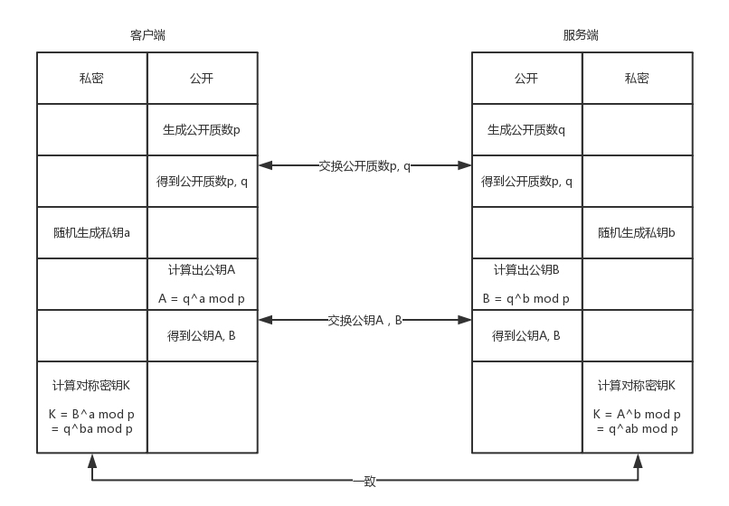
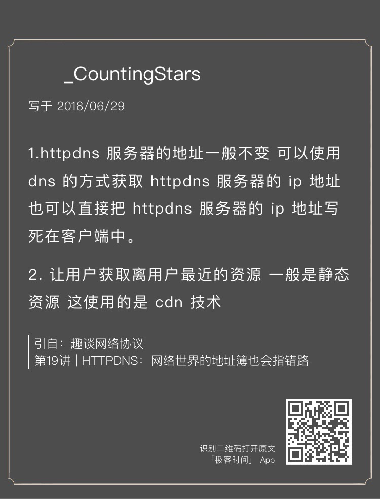

<!DOCTYPE html>

<html xmlns="http://www.w3.org/1999/xhtml">
<head>
<head>
<meta content="text/html; charset=utf-8" http-equiv="Content-Type"/>
<meta content="width=device-width, initial-scale=1, maximum-scale=1.0, user-scalable=no" name="viewport"/>
<meta content="zh-cn" http-equiv="content-language"/>
<meta content="协议专栏特别福利 答疑解惑4期" name="description"/>
<link href="/static/favicon.png" rel="icon"/>
<title>协议专栏特别福利 答疑解惑4期 </title>
<link href="/static/index.css" rel="stylesheet"/>
<link href="/static/highlight.min.css" rel="stylesheet"/>

<meta content="Hexo 4.2.0" name="generator"/>

</head>
<body>

<a href="/">

技术文章摘抄
</a>

<ul class="uncollapsible">
<li><a class="current-tab" href="/">首页</a></li>
<li><a href="../">上一级</a></li>
</ul>
<ul class="uncollapsible">
<li>
<a class="menu-item" href="/%e4%b8%93%e6%a0%8f/%e8%b6%a3%e8%b0%88%e7%bd%91%e7%bb%9c%e5%8d%8f%e8%ae%ae/00%20%e5%bc%80%e7%af%87%e8%af%8d%20%e6%83%b3%e6%88%90%e4%b8%ba%e6%8a%80%e6%9c%af%e7%89%9b%e4%ba%ba%ef%bc%9f%e5%85%88%e6%90%9e%e5%ae%9a%e7%bd%91%e7%bb%9c%e5%8d%8f%e8%ae%ae%ef%bc%81.md" id="00 开篇词 想成为技术牛人？先搞定网络协议！.md">00 开篇词 想成为技术牛人？先搞定网络协议！.md</a>
</li>
<li>
<a class="menu-item" href="/%e4%b8%93%e6%a0%8f/%e8%b6%a3%e8%b0%88%e7%bd%91%e7%bb%9c%e5%8d%8f%e8%ae%ae/01%20%e4%b8%ba%e4%bb%80%e4%b9%88%e8%a6%81%e5%ad%a6%e4%b9%a0%e7%bd%91%e7%bb%9c%e5%8d%8f%e8%ae%ae%ef%bc%9f.md" id="01 为什么要学习网络协议？.md">01 为什么要学习网络协议？.md</a>
</li>
<li>
<a class="menu-item" href="/%e4%b8%93%e6%a0%8f/%e8%b6%a3%e8%b0%88%e7%bd%91%e7%bb%9c%e5%8d%8f%e8%ae%ae/02%20%e7%bd%91%e7%bb%9c%e5%88%86%e5%b1%82%e7%9a%84%e7%9c%9f%e5%ae%9e%e5%90%ab%e4%b9%89%e6%98%af%e4%bb%80%e4%b9%88%ef%bc%9f.md" id="02 网络分层的真实含义是什么？.md">02 网络分层的真实含义是什么？.md</a>
</li>
<li>
<a class="menu-item" href="/%e4%b8%93%e6%a0%8f/%e8%b6%a3%e8%b0%88%e7%bd%91%e7%bb%9c%e5%8d%8f%e8%ae%ae/03%20ifconfig%ef%bc%9a%e6%9c%80%e7%86%9f%e6%82%89%e5%8f%88%e9%99%8c%e7%94%9f%e7%9a%84%e5%91%bd%e4%bb%a4%e8%a1%8c.md" id="03 ifconfig：最熟悉又陌生的命令行.md">03 ifconfig：最熟悉又陌生的命令行.md</a>
</li>
<li>
<a class="menu-item" href="/%e4%b8%93%e6%a0%8f/%e8%b6%a3%e8%b0%88%e7%bd%91%e7%bb%9c%e5%8d%8f%e8%ae%ae/04%20DHCP%e4%b8%8ePXE%ef%bc%9aIP%e6%98%af%e6%80%8e%e4%b9%88%e6%9d%a5%e7%9a%84%ef%bc%8c%e5%8f%88%e6%98%af%e6%80%8e%e4%b9%88%e6%b2%a1%e7%9a%84%ef%bc%9f.md" id="04 DHCP与PXE：IP是怎么来的，又是怎么没的？.md">04 DHCP与PXE：IP是怎么来的，又是怎么没的？.md</a>
</li>
<li>
<a class="menu-item" href="/%e4%b8%93%e6%a0%8f/%e8%b6%a3%e8%b0%88%e7%bd%91%e7%bb%9c%e5%8d%8f%e8%ae%ae/05%20%e4%bb%8e%e7%89%a9%e7%90%86%e5%b1%82%e5%88%b0MAC%e5%b1%82%ef%bc%9a%e5%a6%82%e4%bd%95%e5%9c%a8%e5%ae%bf%e8%88%8d%e9%87%8c%e8%87%aa%e5%b7%b1%e7%bb%84%e7%bd%91%e7%8e%a9%e8%81%94%e6%9c%ba%e6%b8%b8%e6%88%8f%ef%bc%9f.md" id="05 从物理层到MAC层：如何在宿舍里自己组网玩联机游戏？.md">05 从物理层到MAC层：如何在宿舍里自己组网玩联机游戏？.md</a>
</li>
<li>
<a class="menu-item" href="/%e4%b8%93%e6%a0%8f/%e8%b6%a3%e8%b0%88%e7%bd%91%e7%bb%9c%e5%8d%8f%e8%ae%ae/06%20%e4%ba%a4%e6%8d%a2%e6%9c%ba%e4%b8%8eVLAN%ef%bc%9a%e5%8a%9e%e5%85%ac%e5%ae%a4%e5%a4%aa%e5%a4%8d%e6%9d%82%ef%bc%8c%e6%88%91%e8%a6%81%e5%9b%9e%e5%ad%a6%e6%a0%a1.md" id="06 交换机与VLAN：办公室太复杂，我要回学校.md">06 交换机与VLAN：办公室太复杂，我要回学校.md</a>
</li>
<li>
<a class="menu-item" href="/%e4%b8%93%e6%a0%8f/%e8%b6%a3%e8%b0%88%e7%bd%91%e7%bb%9c%e5%8d%8f%e8%ae%ae/07%20ICMP%e4%b8%8eping%ef%bc%9a%e6%8a%95%e7%9f%b3%e9%97%ae%e8%b7%af%e7%9a%84%e4%be%a6%e5%af%9f%e5%85%b5.md" id="07 ICMP与ping：投石问路的侦察兵.md">07 ICMP与ping：投石问路的侦察兵.md</a>
</li>
<li>
<a class="menu-item" href="/%e4%b8%93%e6%a0%8f/%e8%b6%a3%e8%b0%88%e7%bd%91%e7%bb%9c%e5%8d%8f%e8%ae%ae/08%20%e4%b8%96%e7%95%8c%e8%bf%99%e4%b9%88%e5%a4%a7%ef%bc%8c%e6%88%91%e6%83%b3%e5%87%ba%e7%bd%91%e5%85%b3%ef%bc%9a%e6%ac%a7%e6%b4%b2%e5%8d%81%e5%9b%bd%e6%b8%b8%e4%b8%8e%e7%8e%84%e5%a5%98%e8%a5%bf%e8%a1%8c.md" id="08 世界这么大，我想出网关：欧洲十国游与玄奘西行.md">08 世界这么大，我想出网关：欧洲十国游与玄奘西行.md</a>
</li>
<li>
<a class="menu-item" href="/%e4%b8%93%e6%a0%8f/%e8%b6%a3%e8%b0%88%e7%bd%91%e7%bb%9c%e5%8d%8f%e8%ae%ae/09%20%e8%b7%af%e7%94%b1%e5%8d%8f%e8%ae%ae%ef%bc%9a%e8%a5%bf%e5%87%ba%e7%bd%91%e5%85%b3%e6%97%a0%e6%95%85%e4%ba%ba%ef%bc%8c%e6%95%a2%e9%97%ae%e8%b7%af%e5%9c%a8%e4%bd%95%e6%96%b9.md" id="09 路由协议：西出网关无故人，敢问路在何方.md">09 路由协议：西出网关无故人，敢问路在何方.md</a>
</li>
<li>
<a class="menu-item" href="/%e4%b8%93%e6%a0%8f/%e8%b6%a3%e8%b0%88%e7%bd%91%e7%bb%9c%e5%8d%8f%e8%ae%ae/10%20UDP%e5%8d%8f%e8%ae%ae%ef%bc%9a%e5%9b%a0%e6%80%a7%e5%96%84%e8%80%8c%e7%ae%80%e5%8d%95%ef%bc%8c%e9%9a%be%e5%85%8d%e7%a2%b0%e5%88%b0%e2%80%9c%e5%9f%8e%e4%bc%9a%e7%8e%a9%e2%80%9d.md" id="10 UDP协议：因性善而简单，难免碰到“城会玩”.md">10 UDP协议：因性善而简单，难免碰到“城会玩”.md</a>
</li>
<li>
<a class="menu-item" href="/%e4%b8%93%e6%a0%8f/%e8%b6%a3%e8%b0%88%e7%bd%91%e7%bb%9c%e5%8d%8f%e8%ae%ae/11%20TCP%e5%8d%8f%e8%ae%ae%ef%bc%88%e4%b8%8a%ef%bc%89%ef%bc%9a%e5%9b%a0%e6%80%a7%e6%81%b6%e8%80%8c%e5%a4%8d%e6%9d%82%ef%bc%8c%e5%85%88%e6%81%b6%e5%90%8e%e5%96%84%e5%8f%8d%e8%bd%bb%e6%9d%be.md" id="11 TCP协议（上）：因性恶而复杂，先恶后善反轻松.md">11 TCP协议（上）：因性恶而复杂，先恶后善反轻松.md</a>
</li>
<li>
<a class="menu-item" href="/%e4%b8%93%e6%a0%8f/%e8%b6%a3%e8%b0%88%e7%bd%91%e7%bb%9c%e5%8d%8f%e8%ae%ae/12%20TCP%e5%8d%8f%e8%ae%ae%ef%bc%88%e4%b8%8b%ef%bc%89%ef%bc%9a%e8%a5%bf%e8%a1%8c%e5%bf%85%e5%ae%9a%e5%a4%9a%e5%a6%96%e5%ad%bd%ef%bc%8c%e6%81%92%e5%bf%83%e6%99%ba%e6%85%a7%e6%b6%88%e7%a3%a8%e9%9a%be.md" id="12 TCP协议（下）：西行必定多妖孽，恒心智慧消磨难.md">12 TCP协议（下）：西行必定多妖孽，恒心智慧消磨难.md</a>
</li>
<li>
<a class="menu-item" href="/%e4%b8%93%e6%a0%8f/%e8%b6%a3%e8%b0%88%e7%bd%91%e7%bb%9c%e5%8d%8f%e8%ae%ae/13%20%e5%a5%97%e6%8e%a5%e5%ad%97Socket%ef%bc%9aTalk%20is%20cheap,%20show%20me%20the%20code.md" id="13 套接字Socket：Talk is cheap, show me the code.md">13 套接字Socket：Talk is cheap, show me the code.md</a>
</li>
<li>
<a class="menu-item" href="/%e4%b8%93%e6%a0%8f/%e8%b6%a3%e8%b0%88%e7%bd%91%e7%bb%9c%e5%8d%8f%e8%ae%ae/14%20HTTP%e5%8d%8f%e8%ae%ae%ef%bc%9a%e7%9c%8b%e4%b8%aa%e6%96%b0%e9%97%bb%e5%8e%9f%e6%9d%a5%e8%bf%99%e4%b9%88%e9%ba%bb%e7%83%a6.md" id="14 HTTP协议：看个新闻原来这么麻烦.md">14 HTTP协议：看个新闻原来这么麻烦.md</a>
</li>
<li>
<a class="menu-item" href="/%e4%b8%93%e6%a0%8f/%e8%b6%a3%e8%b0%88%e7%bd%91%e7%bb%9c%e5%8d%8f%e8%ae%ae/15%20HTTPS%e5%8d%8f%e8%ae%ae%ef%bc%9a%e7%82%b9%e5%a4%96%e5%8d%96%e7%9a%84%e8%bf%87%e7%a8%8b%e5%8e%9f%e6%9d%a5%e8%bf%99%e4%b9%88%e5%a4%8d%e6%9d%82.md" id="15 HTTPS协议：点外卖的过程原来这么复杂.md">15 HTTPS协议：点外卖的过程原来这么复杂.md</a>
</li>
<li>
<a class="menu-item" href="/%e4%b8%93%e6%a0%8f/%e8%b6%a3%e8%b0%88%e7%bd%91%e7%bb%9c%e5%8d%8f%e8%ae%ae/16%20%e6%b5%81%e5%aa%92%e4%bd%93%e5%8d%8f%e8%ae%ae%ef%bc%9a%e5%a6%82%e4%bd%95%e5%9c%a8%e7%9b%b4%e6%92%ad%e9%87%8c%e7%9c%8b%e5%88%b0%e7%be%8e%e5%a5%b3%e5%b8%85%e5%93%a5%ef%bc%9f.md" id="16 流媒体协议：如何在直播里看到美女帅哥？.md">16 流媒体协议：如何在直播里看到美女帅哥？.md</a>
</li>
<li>
<a class="menu-item" href="/%e4%b8%93%e6%a0%8f/%e8%b6%a3%e8%b0%88%e7%bd%91%e7%bb%9c%e5%8d%8f%e8%ae%ae/17%20P2P%e5%8d%8f%e8%ae%ae%ef%bc%9a%e6%88%91%e4%b8%8b%e5%b0%8f%e7%94%b5%e5%bd%b1%ef%bc%8c99%25%e6%80%a5%e6%ad%bb%e4%bd%a0.md" id="17 P2P协议：我下小电影，99%急死你.md">17 P2P协议：我下小电影，99%急死你.md</a>
</li>
<li>
<a class="menu-item" href="/%e4%b8%93%e6%a0%8f/%e8%b6%a3%e8%b0%88%e7%bd%91%e7%bb%9c%e5%8d%8f%e8%ae%ae/18%20DNS%e5%8d%8f%e8%ae%ae%ef%bc%9a%e7%bd%91%e7%bb%9c%e4%b8%96%e7%95%8c%e7%9a%84%e5%9c%b0%e5%9d%80%e7%b0%bf.md" id="18 DNS协议：网络世界的地址簿.md">18 DNS协议：网络世界的地址簿.md</a>
</li>
<li>
<a class="menu-item" href="/%e4%b8%93%e6%a0%8f/%e8%b6%a3%e8%b0%88%e7%bd%91%e7%bb%9c%e5%8d%8f%e8%ae%ae/19%20HttpDNS%ef%bc%9a%e7%bd%91%e7%bb%9c%e4%b8%96%e7%95%8c%e7%9a%84%e5%9c%b0%e5%9d%80%e7%b0%bf%e4%b9%9f%e4%bc%9a%e6%8c%87%e9%94%99%e8%b7%af.md" id="19 HttpDNS：网络世界的地址簿也会指错路.md">19 HttpDNS：网络世界的地址簿也会指错路.md</a>
</li>
<li>
<a class="menu-item" href="/%e4%b8%93%e6%a0%8f/%e8%b6%a3%e8%b0%88%e7%bd%91%e7%bb%9c%e5%8d%8f%e8%ae%ae/20%20CDN%ef%bc%9a%e4%bd%a0%e5%8e%bb%e5%b0%8f%e5%8d%96%e9%83%a8%e5%8f%96%e8%bf%87%e5%bf%ab%e9%80%92%e4%b9%88%ef%bc%9f.md" id="20 CDN：你去小卖部取过快递么？.md">20 CDN：你去小卖部取过快递么？.md</a>
</li>
<li>
<a class="menu-item" href="/%e4%b8%93%e6%a0%8f/%e8%b6%a3%e8%b0%88%e7%bd%91%e7%bb%9c%e5%8d%8f%e8%ae%ae/21%20%e6%95%b0%e6%8d%ae%e4%b8%ad%e5%bf%83%ef%bc%9a%e6%88%91%e6%98%af%e5%bc%80%e5%8f%91%e5%95%86%ef%bc%8c%e8%87%aa%e5%b7%b1%e6%8b%bf%e5%9c%b0%e7%9b%96%e5%88%ab%e5%a2%85.md" id="21 数据中心：我是开发商，自己拿地盖别墅.md">21 数据中心：我是开发商，自己拿地盖别墅.md</a>
</li>
<li>
<a class="menu-item" href="/%e4%b8%93%e6%a0%8f/%e8%b6%a3%e8%b0%88%e7%bd%91%e7%bb%9c%e5%8d%8f%e8%ae%ae/22%20VPN%ef%bc%9a%e6%9c%9d%e4%b8%ad%e6%9c%89%e4%ba%ba%e5%a5%bd%e5%81%9a%e5%ae%98.md" id="22 VPN：朝中有人好做官.md">22 VPN：朝中有人好做官.md</a>
</li>
<li>
<a class="menu-item" href="/%e4%b8%93%e6%a0%8f/%e8%b6%a3%e8%b0%88%e7%bd%91%e7%bb%9c%e5%8d%8f%e8%ae%ae/23%20%e7%a7%bb%e5%8a%a8%e7%bd%91%e7%bb%9c%ef%bc%9a%e5%8e%bb%e5%b7%b4%e5%a1%9e%e7%bd%97%e9%82%a3%ef%bc%8c%e6%89%8b%e6%9c%ba%e4%b9%9f%e4%b8%8a%e4%b8%8d%e4%ba%86%e8%84%b8%e4%b9%a6.md" id="23 移动网络：去巴塞罗那，手机也上不了脸书.md">23 移动网络：去巴塞罗那，手机也上不了脸书.md</a>
</li>
<li>
<a class="menu-item" href="/%e4%b8%93%e6%a0%8f/%e8%b6%a3%e8%b0%88%e7%bd%91%e7%bb%9c%e5%8d%8f%e8%ae%ae/24%20%e4%ba%91%e4%b8%ad%e7%bd%91%e7%bb%9c%ef%bc%9a%e8%87%aa%e5%b7%b1%e6%8b%bf%e5%9c%b0%e6%88%90%e6%9c%ac%e9%ab%98%ef%bc%8c%e8%b4%ad%e4%b9%b0%e5%85%ac%e5%af%93%e6%9b%b4%e7%81%b5%e6%b4%bb.md" id="24 云中网络：自己拿地成本高，购买公寓更灵活.md">24 云中网络：自己拿地成本高，购买公寓更灵活.md</a>
</li>
<li>
<a class="menu-item" href="/%e4%b8%93%e6%a0%8f/%e8%b6%a3%e8%b0%88%e7%bd%91%e7%bb%9c%e5%8d%8f%e8%ae%ae/25%20%e8%bd%af%e4%bb%b6%e5%ae%9a%e4%b9%89%e7%bd%91%e7%bb%9c%ef%bc%9a%e5%85%b1%e4%ba%ab%e5%9f%ba%e7%a1%80%e8%ae%be%e6%96%bd%e7%9a%84%e5%b0%8f%e5%8c%ba%e7%89%a9%e4%b8%9a%e7%ae%a1%e7%90%86%e5%8a%9e%e6%b3%95.md" id="25 软件定义网络：共享基础设施的小区物业管理办法.md">25 软件定义网络：共享基础设施的小区物业管理办法.md</a>
</li>
<li>
<a class="menu-item" href="/%e4%b8%93%e6%a0%8f/%e8%b6%a3%e8%b0%88%e7%bd%91%e7%bb%9c%e5%8d%8f%e8%ae%ae/26%20%e4%ba%91%e4%b8%ad%e7%9a%84%e7%bd%91%e7%bb%9c%e5%ae%89%e5%85%a8%ef%bc%9a%e8%99%bd%e7%84%b6%e4%b8%8d%e6%98%af%e5%9c%9f%e8%b1%aa%ef%bc%8c%e4%b9%9f%e9%9c%80%e8%a6%81%e5%9f%ba%e6%9c%ac%e5%ae%89%e5%85%a8%e5%92%8c%e4%bf%9d%e9%9a%9c.md" id="26 云中的网络安全：虽然不是土豪，也需要基本安全和保障.md">26 云中的网络安全：虽然不是土豪，也需要基本安全和保障.md</a>
</li>
<li>
<a class="menu-item" href="/%e4%b8%93%e6%a0%8f/%e8%b6%a3%e8%b0%88%e7%bd%91%e7%bb%9c%e5%8d%8f%e8%ae%ae/27%20%e4%ba%91%e4%b8%ad%e7%9a%84%e7%bd%91%e7%bb%9cQoS%ef%bc%9a%e9%82%bb%e5%b1%85%e7%96%af%e7%8b%82%e4%b8%8b%e7%94%b5%e5%bd%b1%ef%bc%8c%e6%88%91%e8%af%a5%e6%80%8e%e4%b9%88%e5%8a%9e%ef%bc%9f.md" id="27 云中的网络QoS：邻居疯狂下电影，我该怎么办？.md">27 云中的网络QoS：邻居疯狂下电影，我该怎么办？.md</a>
</li>
<li>
<a class="menu-item" href="/%e4%b8%93%e6%a0%8f/%e8%b6%a3%e8%b0%88%e7%bd%91%e7%bb%9c%e5%8d%8f%e8%ae%ae/28%20%e4%ba%91%e4%b8%ad%e7%bd%91%e7%bb%9c%e7%9a%84%e9%9a%94%e7%a6%bbGRE%e3%80%81VXLAN%ef%bc%9a%e8%99%bd%e7%84%b6%e4%bd%8f%e4%b8%80%e4%b8%aa%e5%b0%8f%e5%8c%ba%ef%bc%8c%e4%b9%9f%e8%a6%81%e4%bf%9d%e6%8a%a4%e9%9a%90%e7%a7%81.md" id="28 云中网络的隔离GRE、VXLAN：虽然住一个小区，也要保护隐私.md">28 云中网络的隔离GRE、VXLAN：虽然住一个小区，也要保护隐私.md</a>
</li>
<li>
<a class="menu-item" href="/%e4%b8%93%e6%a0%8f/%e8%b6%a3%e8%b0%88%e7%bd%91%e7%bb%9c%e5%8d%8f%e8%ae%ae/29%20%e5%ae%b9%e5%99%a8%e7%bd%91%e7%bb%9c%ef%bc%9a%e6%9d%a5%e5%8e%bb%e8%87%aa%e7%94%b1%e7%9a%84%e6%97%a5%e5%ad%90%ef%bc%8c%e4%b8%8d%e4%b9%b0%e5%85%ac%e5%af%93%e5%8e%bb%e5%90%88%e7%a7%9f.md" id="29 容器网络：来去自由的日子，不买公寓去合租.md">29 容器网络：来去自由的日子，不买公寓去合租.md</a>
</li>
<li>
<a class="menu-item" href="/%e4%b8%93%e6%a0%8f/%e8%b6%a3%e8%b0%88%e7%bd%91%e7%bb%9c%e5%8d%8f%e8%ae%ae/30%20%e5%ae%b9%e5%99%a8%e7%bd%91%e7%bb%9c%e4%b9%8bFlannel%ef%bc%9a%e6%af%8f%e4%ba%ba%e4%b8%80%e4%ba%a9%e4%b8%89%e5%88%86%e5%9c%b0.md" id="30 容器网络之Flannel：每人一亩三分地.md">30 容器网络之Flannel：每人一亩三分地.md</a>
</li>
<li>
<a class="menu-item" href="/%e4%b8%93%e6%a0%8f/%e8%b6%a3%e8%b0%88%e7%bd%91%e7%bb%9c%e5%8d%8f%e8%ae%ae/31%20%e5%ae%b9%e5%99%a8%e7%bd%91%e7%bb%9c%e4%b9%8bCalico%ef%bc%9a%e4%b8%ba%e9%ab%98%e6%95%88%e8%af%b4%e5%87%ba%e5%96%84%e6%84%8f%e7%9a%84%e8%b0%8e%e8%a8%80.md" id="31 容器网络之Calico：为高效说出善意的谎言.md">31 容器网络之Calico：为高效说出善意的谎言.md</a>
</li>
<li>
<a class="menu-item" href="/%e4%b8%93%e6%a0%8f/%e8%b6%a3%e8%b0%88%e7%bd%91%e7%bb%9c%e5%8d%8f%e8%ae%ae/32%20RPC%e5%8d%8f%e8%ae%ae%e7%bb%bc%e8%bf%b0%ef%bc%9a%e8%bf%9c%e5%9c%a8%e5%a4%a9%e8%be%b9%ef%bc%8c%e8%bf%91%e5%9c%a8%e7%9c%bc%e5%89%8d.md" id="32 RPC协议综述：远在天边，近在眼前.md">32 RPC协议综述：远在天边，近在眼前.md</a>
</li>
<li>
<a class="menu-item" href="/%e4%b8%93%e6%a0%8f/%e8%b6%a3%e8%b0%88%e7%bd%91%e7%bb%9c%e5%8d%8f%e8%ae%ae/33%20%e5%9f%ba%e4%ba%8eXML%e7%9a%84SOAP%e5%8d%8f%e8%ae%ae%ef%bc%9a%e4%b8%8d%e8%a6%81%e8%af%b4NBA%ef%bc%8c%e8%af%b7%e8%af%b4%e7%be%8e%e5%9b%bd%e8%81%8c%e4%b8%9a%e7%af%ae%e7%90%83%e8%81%94%e8%b5%9b.md" id="33 基于XML的SOAP协议：不要说NBA，请说美国职业篮球联赛.md">33 基于XML的SOAP协议：不要说NBA，请说美国职业篮球联赛.md</a>
</li>
<li>
<a class="menu-item" href="/%e4%b8%93%e6%a0%8f/%e8%b6%a3%e8%b0%88%e7%bd%91%e7%bb%9c%e5%8d%8f%e8%ae%ae/34%20%e5%9f%ba%e4%ba%8eJSON%e7%9a%84RESTful%e6%8e%a5%e5%8f%a3%e5%8d%8f%e8%ae%ae%ef%bc%9a%e6%88%91%e4%b8%8d%e5%85%b3%e5%bf%83%e8%bf%87%e7%a8%8b%ef%bc%8c%e8%af%b7%e7%bb%99%e6%88%91%e7%bb%93%e6%9e%9c.md" id="34 基于JSON的RESTful接口协议：我不关心过程，请给我结果.md">34 基于JSON的RESTful接口协议：我不关心过程，请给我结果.md</a>
</li>
<li>
<a class="menu-item" href="/%e4%b8%93%e6%a0%8f/%e8%b6%a3%e8%b0%88%e7%bd%91%e7%bb%9c%e5%8d%8f%e8%ae%ae/35%20%e4%ba%8c%e8%bf%9b%e5%88%b6%e7%b1%bbRPC%e5%8d%8f%e8%ae%ae%ef%bc%9a%e8%bf%98%e6%98%af%e5%8f%abNBA%e5%90%a7%ef%bc%8c%e6%80%bb%e8%af%b4%e5%85%a8%e7%a7%b0%e5%a4%9a%e8%b4%b9%e5%8a%b2.md" id="35 二进制类RPC协议：还是叫NBA吧，总说全称多费劲.md">35 二进制类RPC协议：还是叫NBA吧，总说全称多费劲.md</a>
</li>
<li>
<a class="menu-item" href="/%e4%b8%93%e6%a0%8f/%e8%b6%a3%e8%b0%88%e7%bd%91%e7%bb%9c%e5%8d%8f%e8%ae%ae/36%20%e8%b7%a8%e8%af%ad%e8%a8%80%e7%b1%bbRPC%e5%8d%8f%e8%ae%ae%ef%bc%9a%e4%ba%a4%e6%b5%81%e4%b9%8b%e5%89%8d%ef%bc%8c%e5%8f%8c%e6%96%b9%e5%85%88%e6%9d%a5%e4%b8%aa%e4%b8%93%e4%b8%9a%e6%9c%af%e8%af%ad%e8%a1%a8.md" id="36 跨语言类RPC协议：交流之前，双方先来个专业术语表.md">36 跨语言类RPC协议：交流之前，双方先来个专业术语表.md</a>
</li>
<li>
<a class="menu-item" href="/%e4%b8%93%e6%a0%8f/%e8%b6%a3%e8%b0%88%e7%bd%91%e7%bb%9c%e5%8d%8f%e8%ae%ae/37%20%e7%9f%a5%e8%af%86%e4%b8%b2%ef%bc%9a%e7%94%a8%e5%8f%8c%e5%8d%81%e4%b8%80%e7%9a%84%e6%95%85%e4%ba%8b%e4%b8%b2%e8%b5%b7%e7%a2%8e%e7%89%87%e7%9a%84%e7%bd%91%e7%bb%9c%e5%8d%8f%e8%ae%ae%ef%bc%88%e4%b8%8a%ef%bc%89.md" id="37 知识串：用双十一的故事串起碎片的网络协议（上）.md">37 知识串：用双十一的故事串起碎片的网络协议（上）.md</a>
</li>
<li>
<a class="menu-item" href="/%e4%b8%93%e6%a0%8f/%e8%b6%a3%e8%b0%88%e7%bd%91%e7%bb%9c%e5%8d%8f%e8%ae%ae/38%20%e7%9f%a5%e8%af%86%e4%b8%b2%ef%bc%9a%e7%94%a8%e5%8f%8c%e5%8d%81%e4%b8%80%e7%9a%84%e6%95%85%e4%ba%8b%e4%b8%b2%e8%b5%b7%e7%a2%8e%e7%89%87%e7%9a%84%e7%bd%91%e7%bb%9c%e5%8d%8f%e8%ae%ae%ef%bc%88%e4%b8%ad%ef%bc%89.md" id="38 知识串：用双十一的故事串起碎片的网络协议（中）.md">38 知识串：用双十一的故事串起碎片的网络协议（中）.md</a>
</li>
<li>
<a class="menu-item" href="/%e4%b8%93%e6%a0%8f/%e8%b6%a3%e8%b0%88%e7%bd%91%e7%bb%9c%e5%8d%8f%e8%ae%ae/39%20%e7%9f%a5%e8%af%86%e4%b8%b2%ef%bc%9a%e7%94%a8%e5%8f%8c%e5%8d%81%e4%b8%80%e7%9a%84%e6%95%85%e4%ba%8b%e4%b8%b2%e8%b5%b7%e7%a2%8e%e7%89%87%e7%9a%84%e7%bd%91%e7%bb%9c%e5%8d%8f%e8%ae%ae%ef%bc%88%e4%b8%8b%ef%bc%89.md" id="39 知识串：用双十一的故事串起碎片的网络协议（下）.md">39 知识串：用双十一的故事串起碎片的网络协议（下）.md</a>
</li>
<li>
<a class="menu-item" href="/%e4%b8%93%e6%a0%8f/%e8%b6%a3%e8%b0%88%e7%bd%91%e7%bb%9c%e5%8d%8f%e8%ae%ae/40%20%e6%90%ad%e5%bb%ba%e4%b8%80%e4%b8%aa%e7%bd%91%e7%bb%9c%e5%ae%9e%e9%aa%8c%e7%8e%af%e5%a2%83%ef%bc%9a%e6%8e%88%e4%ba%ba%e4%bb%a5%e9%b1%bc%e4%b8%8d%e5%a6%82%e6%8e%88%e4%ba%ba%e4%bb%a5%e6%b8%94.md" id="40 搭建一个网络实验环境：授人以鱼不如授人以渔.md">40 搭建一个网络实验环境：授人以鱼不如授人以渔.md</a>
</li>
<li>
<a class="menu-item" href="/%e4%b8%93%e6%a0%8f/%e8%b6%a3%e8%b0%88%e7%bd%91%e7%bb%9c%e5%8d%8f%e8%ae%ae/%e5%8a%a0%e9%a4%901%20%e5%88%9b%e4%bd%9c%e6%95%85%e4%ba%8b%ef%bc%9a%e6%88%91%e6%98%af%e5%a6%82%e4%bd%95%e5%88%9b%e4%bd%9c%e2%80%9c%e8%b6%a3%e8%b0%88%e7%bd%91%e7%bb%9c%e5%8d%8f%e8%ae%ae%e2%80%9d%e4%b8%93%e6%a0%8f%e7%9a%84%ef%bc%9f.md" id="加餐1 创作故事：我是如何创作“趣谈网络协议”专栏的？.md">加餐1 创作故事：我是如何创作“趣谈网络协议”专栏的？.md</a>
</li>
<li>
<a class="menu-item" href="/%e4%b8%93%e6%a0%8f/%e8%b6%a3%e8%b0%88%e7%bd%91%e7%bb%9c%e5%8d%8f%e8%ae%ae/%e5%8d%8f%e8%ae%ae%e4%b8%93%e6%a0%8f%e7%89%b9%e5%88%ab%e7%a6%8f%e5%88%a9%20%e7%ad%94%e7%96%91%e8%a7%a3%e6%83%911%e6%9c%9f.md" id="协议专栏特别福利 答疑解惑1期.md">协议专栏特别福利 答疑解惑1期.md</a>
</li>
<li>
<a class="menu-item" href="/%e4%b8%93%e6%a0%8f/%e8%b6%a3%e8%b0%88%e7%bd%91%e7%bb%9c%e5%8d%8f%e8%ae%ae/%e5%8d%8f%e8%ae%ae%e4%b8%93%e6%a0%8f%e7%89%b9%e5%88%ab%e7%a6%8f%e5%88%a9%20%e7%ad%94%e7%96%91%e8%a7%a3%e6%83%912%e6%9c%9f.md" id="协议专栏特别福利 答疑解惑2期.md">协议专栏特别福利 答疑解惑2期.md</a>
</li>
<li>
<a class="menu-item" href="/%e4%b8%93%e6%a0%8f/%e8%b6%a3%e8%b0%88%e7%bd%91%e7%bb%9c%e5%8d%8f%e8%ae%ae/%e5%8d%8f%e8%ae%ae%e4%b8%93%e6%a0%8f%e7%89%b9%e5%88%ab%e7%a6%8f%e5%88%a9%20%e7%ad%94%e7%96%91%e8%a7%a3%e6%83%913%e6%9c%9f.md" id="协议专栏特别福利 答疑解惑3期.md">协议专栏特别福利 答疑解惑3期.md</a>
</li>
<li>
<a class="menu-item" href="/%e4%b8%93%e6%a0%8f/%e8%b6%a3%e8%b0%88%e7%bd%91%e7%bb%9c%e5%8d%8f%e8%ae%ae/%e5%8d%8f%e8%ae%ae%e4%b8%93%e6%a0%8f%e7%89%b9%e5%88%ab%e7%a6%8f%e5%88%a9%20%e7%ad%94%e7%96%91%e8%a7%a3%e6%83%914%e6%9c%9f.md" id="协议专栏特别福利 答疑解惑4期.md">协议专栏特别福利 答疑解惑4期.md</a>
</li>
<li>
<a class="menu-item" href="/%e4%b8%93%e6%a0%8f/%e8%b6%a3%e8%b0%88%e7%bd%91%e7%bb%9c%e5%8d%8f%e8%ae%ae/%e5%8d%8f%e8%ae%ae%e4%b8%93%e6%a0%8f%e7%89%b9%e5%88%ab%e7%a6%8f%e5%88%a9%20%e7%ad%94%e7%96%91%e8%a7%a3%e6%83%915%e6%9c%9f.md" id="协议专栏特别福利 答疑解惑5期.md">协议专栏特别福利 答疑解惑5期.md</a>
</li>
<li>
<a class="menu-item" href="/%e4%b8%93%e6%a0%8f/%e8%b6%a3%e8%b0%88%e7%bd%91%e7%bb%9c%e5%8d%8f%e8%ae%ae/%e7%bb%93%e6%9d%9f%e8%af%ad%20%e6%94%be%e5%bc%83%e5%ae%8c%e7%be%8e%e4%b8%bb%e4%b9%89%ef%bc%8c%e6%89%a7%e8%a1%8c%e5%8a%9b%e5%b0%b1%e6%98%af%e9%99%90%e6%97%b6%e9%99%90%e9%87%8f%e8%ae%a4%e7%9c%9f%e5%ae%8c%e6%88%90.md" id="结束语 放弃完美主义，执行力就是限时限量认真完成.md">结束语 放弃完美主义，执行力就是限时限量认真完成.md</a>
</li>
<li><a href="/assets/捐赠.md">捐赠</a></li>
</ul>

<header class="navbar">
<section class="navbar-section">
<a onclick="open_sidebar()">
<i class="icon icon-menu"></i>
</a>
</section>
</header>

<h1 class="title" data-id="协议专栏特别福利 答疑解惑4期" id="title">协议专栏特别福利 答疑解惑4期</h1>

你好，我是刘超。

第四期答疑涵盖第14讲至第21讲的内容。我依旧对课后思考题和留言中比较有代表性的问题作出回答。你可以点击文章名，回到对应的章节复习，也可以继续在留言区写下你的疑问，我会持续不断地解答。希望对你有帮助。

<h2 id="第14讲-http协议-看个新闻原来这么麻烦">《第14讲 | HTTP协议：看个新闻原来这么麻烦》</h2>
<h3 id="课后思考题">课后思考题</h3>

QUIC是一个精巧的协议，所以它肯定不止今天我提到的四种机制，你知道还有哪些吗？

云学讲了一个QUIC的特性。

QUIC还有其他特性，一个是<strong>快速建立连接</strong>。这个我放在下面HTTPS的时候一起说。另一个是<strong>拥塞控制</strong>，QUIC协议当前默认使用了TCP协议的CUBIC（拥塞控制算法）。

你还记得TCP的拥塞控制算法吗？每当收到一个ACK的时候，就需要调整拥塞窗口的大小。但是这也造成了一个后果，那就是RTT比较小的，窗口增长快。

然而这并不符合当前网络的真实状况，因为当前的网络带宽比较大，但是由于遍布全球，RTT也比较长，因而基于RTT的窗口调整策略，不仅不公平，而且由于窗口增加慢，有时候带宽没满，数据就发送完了，因而巨大的带宽都浪费掉了。

CUBIC进行了不同的设计，它的窗口增长函数仅仅取决于连续两次拥塞事件的时间间隔值，窗口增长完全独立于网络的时延RTT。

CUBIC的窗口大小以及变化过程如图所示。

当出现丢包事件时，CUBIC会记录这时的拥塞窗口大小，把它作为Wmax。接着，CUBIC会通过某个因子执行拥塞窗口的乘法减小，然后，沿着立方函数进行窗口的恢复。

从图中可以看出，一开始恢复的速度是比较快的，后来便从快速恢复阶段进入拥塞避免阶段，也即当窗口接近Wmax的时候，增加速度变慢；立方函数在Wmax处达到稳定点，增长速度为零，之后，在平稳期慢慢增长，沿着立方函数的开始探索新的最大窗口。

<h3 id="留言问题">留言问题</h3>

HTTP的keepalive模式是什么样？

在没有keepalive模式下，每个HTTP请求都要建立一个TCP连接，并且使用一次之后就断开这个TCP连接。

使用keepalive之后，在一次TCP连接中可以持续发送多份数据而不会断开连接，可以减少TCP连接建立次数，减少TIME_WAIT状态连接。

然而，长时间的TCP连接容易导致系统资源无效占用，因而需要设置正确的keepalive timeout时间。当一个HTTP产生的TCP连接在传送完最后一个响应后，还需要等待keepalive timeout秒后，才能关闭这个连接。如果这个期间又有新的请求过来，可以复用TCP连接。

<h2 id="第15讲-https协议-点外卖的过程原来这么复杂">《第15讲 | HTTPS协议：点外卖的过程原来这么复杂》</h2>
<h3 id="课后思考题-1">课后思考题</h3>

HTTPS 协议比较复杂，沟通过程太繁复，这样会导致效率问题，那你知道有哪些手段可以解决这些问题吗？

通过HTTPS访问的确复杂，至少经历四个阶段：DNS查询、TCP连接建立、TLS连接建立，最后才是HTTP发送数据。我们可以一项一项来优化这个过程。

首先如果使用基于UDP的QUIC，可以省略掉TCP的三次握手。至于TLS的建立，如果按文章中基于TLS 1.2的，双方要交换key，经过两个来回，也即两个RTT，才能完成握手。但是咱们讲IPSec的时候，讲过通过共享密钥、DH算法进行握手的场景。

在TLS 1.3中，握手过程中移除了ServerKeyExchange和ClientKeyExchange，DH参数可以通过key_share进行传输。这样只要一个来回，就可以搞定RTT了。

对于QUIC来讲，也可以这样做。当客户端首次发起QUIC连接时，会发送一个client hello消息，服务器会回复一个消息，里面包括server config，类似于TLS1.3中的key_share交换。当客户端获取到server config以后，就可以直接计算出密钥，发送应用数据了。

<h3 id="留言问题-1">留言问题</h3>

1.HTTPS的双向认证流程是什么样的？

2.随机数和premaster的含义是什么？

<h2 id="第16讲-流媒体协议-如何在直播里看到美女帅哥">《第16讲 | 流媒体协议：如何在直播里看到美女帅哥？》</h2>
<h3 id="课后思考题-2">课后思考题</h3>

你觉得基于 RTMP 的视频流传输的机制存在什么问题？如何进行优化？

Jason的回答很对。

Jealone的回答更加具体。

当前有基于自研UDP协议传输的，也有基于QUIC协议传输的。

<h3 id="留言问题-2">留言问题</h3>

RTMP建立连接的序列是什么样的？

的确，这个图我画错了，我重新画了一个。

不过文章中这部分的文字描述是没问题的。

客户端发送C0、C1、 C2，服务器发送S0、 S1、 S2。

首先，客户端发送C0表明自己的版本号，不必等对方的回复，然后发送C1表明自己的时间戳。

服务器只有在收到C0的时候，才能返回S0，表明自己的版本号。如果版本不匹配，可以断开连接。

服务器发送完S0后，也不用等什么，就直接发送自己的时间戳S1。客户端收到S1的时候，发一个知道了对方时间戳的ACK C2。同理服务器收到C1的时候，发一个知道了对方时间戳的ACK S2。

于是，握手完成。

<h2 id="第17讲-p2p协议-我下小电影-99-急死你">《第17讲 | P2P协议：我下小电影，99%急死你》</h2>
<h3 id="课后思考题-3">课后思考题</h3>

除了这种去中心化分布式哈希的算法，你还能想到其他的应用场景吗？

<h3 id="留言问题-3">留言问题</h3>

99%卡住的原因是什么？

<h2 id="第18讲-dns协议-网络世界的地址簿">《第18讲 | DNS协议：网络世界的地址簿》</h2>
<h3 id="课后思考题-4">课后思考题</h3>

全局负载均衡使用过程中，常常遇到失灵的情况，你知道具体有哪些情况吗？对应应该怎么来解决呢？

<h3 id="留言问题-4">留言问题</h3>

如果权威DNS连不上，怎么办？

一般情况下，DNS是基于UDP协议的。在应用层设置一个超时器，如果UDP发出没有回应，则会进行重试。

DNS服务器一般也是高可用的，很少情况下会挂。即便挂了，也会很快切换，重试一般就会成功。

对于客户端来讲，为了DNS解析能够成功，也会配置多个DNS服务器，当一个不成功的时候，可以选择另一个来尝试。

<h2 id="第19讲-httpdns-网络世界的地址簿也会指错路">《第19讲 | HttpDNS：网络世界的地址簿也会指错路》</h2>
<h3 id="课后思考题-5">课后思考题</h3>

使用 HttpDNS，需要向 HttpDNS 服务器请求解析域名，可是客户端怎么知道 HttpDNS 服务器的地址或者域名呢？

<h2 id="第20讲-cdn-你去小卖部取过快递么">《第20讲 | CDN：你去小卖部取过快递么？》</h2>
<h3 id="课后思考题-6">课后思考题</h3>

这一节讲了CDN使用DNS进行全局负载均衡的例子，CDN如何使用HttpDNS呢？

<h2 id="第21讲-数据中心-我是开发商-自己拿地盖别墅">《第21讲 | 数据中心：我是开发商，自己拿地盖别墅》</h2>
<h3 id="课后思考题-7">课后思考题</h3>

对于数据中心来讲，高可用是非常重要的，每个设备都要考虑高可用，那跨机房的高可用，你知道应该怎么做吗？

其实跨机房的高可用分两个级别，分别是<strong>同城双活</strong>和<strong>异地灾备</strong>。

<strong>同城双活</strong>，就是在同一个城市，距离大概30km到100km的两个数据中心之间，通过高速专线互联的方式，让两个数据中心形成一个大二层网络。

同城双活最重要的是，数据如何从一个数据中心同步到另一个数据中心，并且在一个数据中心故障的时候，实现存储设备的切换，保证状态能够快速切换到另一个数据中心。在高速光纤互联情况下，主流的存储厂商都可以做到在一定距离之内的两台存储设备的近实时同步。数据双活是一切双活的基础。

基于双数据中心的数据同步，可以形成一个统一的存储池，从而数据库层在共享存储池的情况下可以近实时地切换，例如Oracle RAC。

虚拟机在统一的存储池的情况下，也可以实现跨机房的HA，在一个机房切换到另一个机房。

SLB负载均衡实现同一机房的各个虚拟机之间的负载均衡。GSLB可以实现跨机房的负载均衡，实现外部访问的切换。

如果在两个数据中心距离很近，并且大二层可通的情况下，也可以使用VRRP协议，通过VIP方式进行外部访问的切换。

下面我们说<strong>异地灾备</strong>。

异地灾备的第一大问题还是数据的问题，也即生产数据中心的数据如何备份到容灾数据中心。由于异地距离比较远，不可能像双活一样采取近同步的方式，只能通过异步的方式进行同步。可以预见的问题是，容灾切换的时候，数据会丢失一部分。

由于容灾数据中心平时是不用的，不是所有的业务都会进行容灾，否则成本太高。

对于数据的问题，我比较建议从业务层面进行容灾。由于数据同步会比较慢，可以根据业务需求高优先级同步重要的数据，因而容灾的层次越高越好。

例如，有的用户完全不想操心，直接使用存储层面的异步复制。对于存储设备来讲，它是无法区分放在存储上的虚拟机，哪台是重要的，哪台是不重要的，只会完全根据块进行复制，很可能就会先复制了不重要的虚拟机。

如果用户想对虚拟机做区分，则可以使用虚拟机层面的异步复制。用户知道哪些虚拟机更重要一些，哪些虚拟机不重要，则可以先同步重要的虚拟机。

对业务来讲，如果用户可以根据业务层情况，在更细的粒度上区分数据是否重要。重要的数据，例如交易数据，需要优先同步；不重要的数据，例如日志数据，就不需要优先同步。

在有异地容灾的情况下，可以平时进行容灾演练，看容灾数据中心是否能够真正起作用，别容灾了半天，最后用的时候掉链子。

感谢第14讲至第21讲中对内容有深度思考和提出问题的同学。我会为你们送上奖励礼券和知识图谱。（稍后运营同学会发送短信通知。）

欢迎你继续提问！

© 2019 - 2023 <a href="/cdn-cgi/l/email-protection#442828287d7075757473042329252d286a272b29" target="_blank">Liangliang Lee</a>.
                    Powered by <a href="https://github.com/gin-gonic/gin" target="_blank">gin</a> and <a href="https://github.com/kaiiiz/hexo-theme-book" target="_blank">hexo-theme-book</a>.

</body>

</head></html>